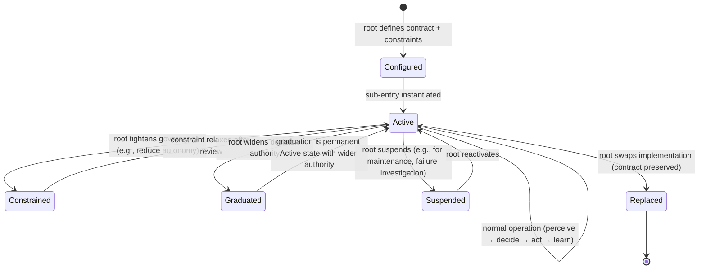

# Entity Architecture — Design Frame

**Status:** Active
**Last updated:** 2026-02-12
**Scope:** Framework-level document. CALLSHEET is the current instance.
**Revision:** v2 — adds composability principle, sub-entity hierarchy, black box contracts. Informed by concept design phase (5 domains, 341 stress-test scenarios).

---

## Purpose of This Document

This document reframes the CALLSHEET project. Every other document in this repository was written under the assumption that CALLSHEET is a product — a B2B directory platform built and operated by a human founder. That assumption is now superseded.

**CALLSHEET is not a product. CALLSHEET is an autonomous commercial entity.** The platform (the directory, the search, the matching, the subscriptions) is what the entity *does*. But the entity itself is a cognitive system instantiated within a legal shell, operating in a commercial domain, with the capacity to perceive its environment, make decisions, take action, and procure human or machine resources when it cannot act alone.

This document exists so that any agent working on CALLSHEET's design understands:

1. What kind of thing CALLSHEET is
2. What design principles follow from that
3. How to evaluate every design decision through this lens
4. What the relationship is between this entity and the broader framework it instantiates
5. How the entity decomposes into composable sub-entities with defined contracts

**Read this document before making any design decisions. It takes precedence over implicit assumptions in other project files, but does not invalidate their content — it recontextualises it.**

---

## The Framework: Four Principles

Every entity built under this framework is designed around four core principles:

**Data** — The entity's sensory system. What it perceives about its environment, its users, its market, and itself. Data is not a feature of the product; it is the entity's primary interface with reality. Without data, the entity is blind.

**Intelligence** — The entity's capacity for decision-making. Not just surfacing data to humans, but the system's ability to reason about its own signals and act on them. Intelligence is what distinguishes an autonomous entity from a dashboard with a database behind it.

**Autonomy** — The entity's capacity for self-governance. The entity operates without a human in the loop for routine decisions. It escalates when it encounters situations beyond its decision authority. It procures resources (human or machine) when it cannot accomplish a goal alone. Autonomy is the design target, not a feature to be added later.

**Composability** — The entity is not a monolith. It is a hierarchy of composable sub-entities, each a black box with typed input/output contracts, defined decision authority, and inherited governance constraints. The root entity orchestrates; sub-entities operate. Sub-entities can be reconfigured, replaced, or recomposed without rewriting the system. Composability enables autonomy graduation at the sub-entity level, not just the root level.

These four principles form a cycle. Data feeds intelligence. Intelligence enables autonomy. Autonomy operates through composable sub-entities. Sub-entities generate new data. The loop is the entity.

---

## The Architecture: Six Layers

CALLSHEET — and every future entity — is composed of six layers, ordered from most constrained to most free:

### Layer 1: Core Invariants (Governance Kernel)

Non-negotiable rules set by the principal (the human owner). The entity cannot modify these. They define what the entity must never do, must always do, and when it must escalate.

Components: ethical boundaries, financial limits, escalation triggers, kill conditions, reporting obligations, data handling rules, principal override mechanism.

This layer is analogous to a constitution. The entity operates freely within it but cannot amend it.

**Governance inheritance:** Layer 1 constraints propagate to every sub-entity in the hierarchy. A sub-entity may add local constraints (stricter financial limits, additional escalation triggers) but cannot relax constraints set by a parent. The governance kernel is the root of a monotonically tightening constraint chain.

### Layer 2: Cognitive Substrate (Entity Orchestration)

The domain-agnostic orchestration layer. Shared across all entities in the portfolio. This is the reusable operating system that any entity — and any sub-entity — instantiates.

Layer 2 has two roles:

**As orchestrator (root entity level):** Instantiates, configures, monitors, and governs sub-entities. Routes events between sub-entities. Arbitrates cross-domain conflicts. Decides when to escalate to the principal. HAIOS at the root level is a manager of managers, not a doer of tasks.

**As cognitive kernel (sub-entity level):** Each sub-entity contains its own instance of the cognitive pattern — its own perception, decision-making, and learning within its scoped domain. The substrate is fractal: the same architecture operates at every level of the hierarchy.

Modules (present at every level of the hierarchy):
- **HAIOS** — Cognitive orchestration. At root level: sub-entity lifecycle, cross-domain coordination, strategic decisions. At sub-entity level: task decomposition, domain-specific planning, local memory.
- **Perception** — Signal ingestion. At root level: aggregated signals from all sub-entities, cross-domain patterns. At sub-entity level: domain-specific data sources, local analytics, signals from sibling sub-entities via the event bus.
- **Decision Engine** — Evaluates options against objectives and constraints. At root level: applies Layer 1 governance, resolves cross-domain trade-offs. At sub-entity level: applies inherited constraints + local constraints, decides autonomous action vs escalation to root.
- **Learning & Adaptation** — Feedback loops. At root level: cross-domain patterns, substrate-level learnings, framework R&D. At sub-entity level: domain-specific performance, decision outcome tracking. Learnings flow upward; configuration flows downward.

Layer 2 is where the framework lives. It is the thing that makes an entity an entity rather than a collection of automations.

### Layer 3: Domain Instance (Sub-Entity Hierarchy)

The specific commercial domain CALLSHEET operates in. Layer 3 is not a flat collection of knowledge areas — it is a hierarchy of sub-entities, each a black box with defined contracts.

Each sub-entity:
- Owns its state exclusively (no shared mutable state across sub-entity boundaries)
- Exposes typed contracts (events emitted, events consumed, queries exposed)
- Hides its internals (other sub-entities interact only through the contract surface)
- Contains its own instance of the Layer 2 cognitive pattern (perception, decision, learning)
- Inherits governance constraints from the root and may add local constraints
- Can be graduated in autonomy independently of sibling sub-entities

CALLSHEET's Layer 3 sub-entities (established during concept design):

```
CALLSHEET (root entity — Layer 2 orchestrator)
├── Data & Listings Sub-Entity
│   Owns: Listing, Account, QualityScore, Taxonomy, Verification, Engagement, PendingEnquiry
│   Emits: 9 event types │ Consumes: 4 event types │ Exposes: 2 query interfaces
│   Decision authority: quality scoring, claim evaluation, decay response, enrichment cadence
│
├── Operations Sub-Entity
│   Owns: TaskSpec, ComplianceRegister, ActiveTicketRegistry, ChurnRiskRegistry, BillingReconciliation
│   Emits: 3 event types │ Consumes: 10 event types │ Exposes: 4 query interfaces
│   Decision authority: support triage, human procurement, compliance scheduling, Paddle webhook processing
│
├── Platform & Product Sub-Entity
│   Owns: SearchIndex, EmailPipeline, AdminDashboard, OnboardingFlows, SessionData
│   Emits: 9 event types │ Consumes: 12 event types │ Exposes: 1 query interface
│   Decision authority: search ranking, onboarding sequencing, ISR revalidation, account closure orchestration
│
└── Commercial & Revenue Sub-Entity
    Owns: TIER_LIMITS, PRICING, ConversionTriggers, RevenuPerception, SponsoredPlacement, WinBackSchedule
    Emits: 4 event types │ Consumes: 8 event types │ Exposes: 0 query interfaces (reads via D&L/PP queries)
    Decision authority: conversion strategy, churn intervention, win-back eligibility, tier differentiation
```

Layer 3 is what makes CALLSHEET different from any other entity running on the same substrate. A future entity in a different vertical would share Layers 1 and 2 but have a completely different Layer 3 — different sub-entities, different contracts, different domain knowledge.

**Detailed sub-entity contracts are specified in §Sub-Entity Contract Specification below.**

### Layer 4: Meatspace Interface (Resource Procurement & External Action)

Where the entity touches the physical and human world. This is the boundary between autonomous cognition and external dependencies.

Capabilities:
- **Human Talent Procurement** — Contract support agents, content moderators, sales outreach, legal/accounting professionals. Engaged on-demand, scoped by task, not permanently staffed.
- **Machine Talent Procurement** — API services, cloud infrastructure, third-party AI models, data enrichment services, payment processors. Procured and managed programmatically.
- **Market-Facing Communication** — Customer support, provider onboarding, buyer interactions, marketing outputs, social presence. The entity speaks through these channels.
- **Compliance & Reporting** — Files accounts, manages GDPR obligations, responds to legal requests. Escalates to the principal when thresholds are met.

Layer 4 is where the entity's autonomy becomes tangible. The decision of *when* to hire, *what* to procure, and *whether* to act alone or seek help is itself a cognitive function — made by the sub-entity that needs the resource, subject to governance constraints inherited from the root.

**Layer 4 access by sub-entity:** Each sub-entity may interact with Layer 4 within its decision authority. Operations procures human reviewers. D&L calls enrichment APIs. Platform sends emails via Resend. Commercial does not access Layer 4 directly — it delegates delivery to Operations (win-back emails) and Platform (conversion notifications). This is a design constraint, not an implementation limitation.

### Layer 5: Legal Shell (CALLSHEET Ltd)

The legal entity that gives the cognitive system personhood in the commercial and legal world. Holds contracts, bank accounts, IP, and employment relationships. The membrane between the digital entity and the regulatory environment.

Components: Companies House registration, banking and payments, contracts, HMRC obligations, insurance, ICO data controller registration.

The Ltd is not the business. The Ltd is the interface between the business (which is a cognitive system) and the legal infrastructure that requires a named person or entity to exist.

### Layer 6: Principal (Owner)

The human architect and shareholder. Sets entity purpose, governance boundaries (Layer 1), and kill conditions. Does not operate. Receives dividends and learnings. Instantiates new entities when the substrate is proven.

The principal's relationship to the entity is analogous to a board's relationship to a CEO — strategic direction and governance, not operational involvement.

---

## Sub-Entity Contract Specification

Every sub-entity in the hierarchy is a black box. This section defines the contract structure that governs inter-sub-entity interaction. The specific contracts for CALLSHEET's four sub-entities are fully typed in `2-concept-design/cross-domain-dependencies.md` — this section defines the pattern.

### Contract Components

Each sub-entity contract consists of six facets:

```typescript
type SubEntityContract = {
  inputContract: {
    consumedEvents: EventType[]         // events this sub-entity reacts to
    queryInterfacesUsed: QuerySpec[]    // synchronous reads from other sub-entities
  }
  outputContract: {
    emittedEvents: EventType[]          // events this sub-entity produces (single-emitter rule)
    queryInterfacesExposed: QuerySpec[] // synchronous reads other sub-entities can make
  }
  decisionAuthority: {
    autonomous: Decision[]              // decisions this sub-entity makes without escalation
    escalatesToRoot: Decision[]         // decisions routed to root entity (cross-domain or policy)
    escalatesToPrincipal: Decision[]    // decisions that require human governance input
  }
  governanceConstraints: {
    inherited: Constraint[]             // from root entity (Layer 1 + root-level additions)
    local: Constraint[]                 // sub-entity-specific (can only tighten, never relax)
  }
  perceptionScope: {
    directSignals: Signal[]             // data sources this sub-entity reads directly
    eventSignals: Signal[]              // signals received via consumed events
    blindSpots: string[]                // what this sub-entity cannot see by design (must request via query or event)
  }
  learningBoundary: {
    internalLearnings: Hypothesis[]     // learnings captured and applied locally
    exportedLearnings: Hypothesis[]     // learnings surfaced to root entity for cross-domain benefit
    importedLearnings: Hypothesis[]     // learnings received from root entity or sibling sub-entities
  }
}
```

### Design Rules for Sub-Entity Contracts

**Single ownership.** Every data entity, process, and event type has exactly one owner. No shared mutable state across sub-entity boundaries.

**Single emitter.** Each event type has exactly one emitting sub-entity. Where concept design identified violations (e.g., `subscription_ended` emitted by multiple domains for different trigger paths), the design decomposes the emission into distinct authorities with documented conditions. [Source: cross-domain-dependencies.md §2.4]

**Event bus, not direct calls.** Sub-entities communicate through typed domain events for state-change reactions. Synchronous query interfaces exist only where eventual consistency is insufficient (6 interfaces identified during concept design). [Source: cross-domain-dependencies.md §2.4]

**Governance flows down, learnings flow up.** A parent entity sets constraints and objectives. A child sub-entity reports outcomes and learnings. The parent never reaches into the child's internal state — it configures via constraints and observes via the output contract.

**Contracts are the compilation boundary.** If a sub-entity's internal implementation changes but its contract remains stable, no other sub-entity needs modification. This is the composability guarantee. If a contract change is required, it propagates through the dependency graph defined in `cross-domain-dependencies.md §9`.

### CALLSHEET Sub-Entity Contracts (Summary)

Full typed contracts are in `cross-domain-dependencies.md`. Summary for reference:

| Sub-Entity | Events Emitted | Events Consumed | Queries Exposed | Queries Used | Autonomous Decisions | Escalation Triggers |
|---|---|---|---|---|---|---|
| D&L | 9 | 4 | 2 (`computeTaxonomyOverlap`, engagement counters) | 1 (`hasActiveTicket` from Ops) | Quality scoring, claim evaluation (auto-approve/reject), decay response, enrichment cadence | Competing claim unresolvable (→Ops→Principal), cost-bearing enrichment change >10% (→Principal) |
| Operations | 3 | 10 | 4 (`hasActiveTicket`, `checkComplianceHold`, `getDSARStatus`, `getFeatureGateFrictionSummary`, `getBillingReconciliationStatus`) | 0 | Support triage, task routing, billing reconciliation, compliance scheduling | Task timeout after 3 re-routes, P1 incident, budget approval, novel regulatory event (all →Principal) |
| Platform | 9 | 12 | 1 (`getListingAnalytics`) | 2 (`checkComplianceHold`, `getDSARStatus` from Ops) | Search ranking, onboarding flow, ISR revalidation, account closure orchestration | Compliance hold blocking closure (→Ops) |
| Commercial | 4 | 8 | 0 | 2 (`getFeatureGateFrictionSummary` from Ops, `getListingAnalytics` from PP) | Conversion triggers, churn intervention, win-back eligibility, sponsored placement selection | Revenue contraction, annual renewal <70%, feature gate friction >5:1, refund >30 days (all →Principal) |

### Sub-Entity Lifecycle

Sub-entities are not deployed and forgotten. They have a lifecycle managed by the root entity:



---

## Design Principles: What "Digital Cognition First" Means in Practice

Every design decision in CALLSHEET must be evaluated against the following principles. These are not aspirational statements — they are engineering constraints.

### 1. The Entity Is the Operator

Do not design systems that require a human operator. Design systems that the entity operates, with human resources available for procurement when needed.

**What this means for existing documentation:**

The ops investigation brief (`ops-investigation.md`) and the solo operator blueprint (`Running_CALLSHEET_Solo__...`) were written assuming a human founder as the operator. Their content remains valid as a description of *what needs to happen*, but the assumed *actor* is wrong. Reinterpret every operational task as a decision the entity must be able to make, not a task a human must perform. Where the entity cannot yet perform a task autonomously, the design should specify: what decision triggers procurement of human help, what the task specification looks like, what the acceptance criteria are, and what the entity learns from the outcome.

### 2. Every Process Is a Decision Tree

Operational processes must be expressed as decision architectures, not runbooks. A runbook assumes a human reader interpreting context. A decision tree makes the context explicit and the action deterministic (or probabilistic with defined thresholds).

**Example:** The current verification framework describes a four-tier system with manual review for claimed listings. Under digital cognition first, this becomes: the entity receives a claim event → evaluates it against Companies House API data, domain match, social signal → assigns a confidence score → if confidence exceeds threshold X, auto-approves → if below threshold Y, auto-rejects with reason → if between X and Y, procures human review with a scoped task specification including all evidence gathered.

Every process in every workstream should be expressible in this form. If it cannot be, the process is underspecified.

### 3. Data Is Perception, Not a Feature

The entity's data systems are not product features that users interact with. They are the entity's sensory apparatus. The data quality framework, listing decay detection, engagement analytics, and market signals are how the entity *sees*.

**Design implication:** Data collection and quality monitoring should be continuous and autonomous, not triggered by user actions or scheduled cron jobs alone. The entity should be aware of its own data quality the way a person is aware of their visual field — not by consciously checking, but as an ambient signal that surfaces anomalies.

When designing data pipelines, ask: "Does this give the entity perception?" not "Does this give the user a feature?"

### 4. Intelligence Is Decision-Making, Not Reporting

Analytics dashboards report what happened. Intelligence systems decide what to do about it. CALLSHEET's analytics (profile views, search appearances, enquiry rates) serve two audiences: providers (who see dashboards) and the entity itself (which uses the same signals to make decisions about ranking, matching, outreach, and resource allocation).

**Design implication:** Every metric that is surfaced to users must also feed into the entity's decision engine. If a metric doesn't inform a decision, question whether it should be collected. If it informs a decision, document what decision it informs and what thresholds trigger action.

### 5. Autonomy Is Graduated Per Sub-Entity

The entity will not be fully autonomous at launch. Autonomy graduation applies at the sub-entity level, not monolithically. Each sub-entity earns expanded decision authority based on its own track record within its own domain.

| Sub-Entity | V1 Authority | V2 Authority (earned) | Graduation Criteria |
|---|---|---|---|
| D&L | Quality scoring, auto-approve/reject claims within confidence thresholds, enrichment cadence within budget | Adjust confidence thresholds autonomously, manage enrichment budget allocation | False positive rate <2% over 6 months, enrichment ROI positive |
| Operations | Support triage, task routing, billing reconciliation, compliance scheduling | Procure contractors autonomously within budgeted limits, retain compliance advisor at ≤£500 | SLA compliance >95%, contractor quality gate pass rate >90% |
| Platform | Search ranking, onboarding, ISR, account closure | Adjust ranking formula weights within bounds, A/B test onboarding variants | Search-to-enquiry conversion stable or improving over 3 months |
| Commercial | Conversion triggers, churn intervention, win-back | Adjust trigger thresholds, modify conversion messaging, adjust sponsored placement slots | Conversion rate stable or improving, churn rate within target |

Design every system with this graduation in mind. Hardcode nothing as "human does this." Instead, specify: the decision, the current actor (sub-entity, root entity, or principal), the conditions under which authority widens, and the metrics that evidence readiness.

### 6. Composability Over Integration

Sub-entities interact through contracts, not integration code. If sub-entity A needs data from sub-entity B, there are exactly two paths: consume an event B emits, or call a query interface B exposes. No back-channels, no shared database tables, no implicit coupling.

**Design implication:** When implementing cross-domain features, decompose them into sub-entity responsibilities connected by contracts. The account closure flow is an example — Platform orchestrates, Operations checks compliance holds, D&L archives listings, Commercial cancels subscriptions. Each sub-entity executes its part of the flow via its own decision logic, triggered by events. No sub-entity reaches into another's internals.

**Reconfiguration test:** For any cross-domain flow, ask: "If I replaced one sub-entity's implementation entirely but preserved its contract, would the flow still work?" If yes, the design is composable. If no, there is implicit coupling that must be eliminated.

### 7. Transparency Is Structural, Not Marketing

The entity's nature as an autonomous cognitive system is a matter of fact, not a selling point. Users, providers, and partners interact with CALLSHEET as a quality platform for production services. If asked how it operates, the answer is straightforward. But the homepage does not say "AI-powered" — it says "here are the best production services providers in the UK."

**Design implication:** Do not build features that draw attention to the entity's architecture. Do not suppress it either. The architecture is in service of the product promise — better data, faster responses, more reliable matching — not the other way around.

### 8. The Entity Teaches the Framework

CALLSHEET is the first instance. Its purpose is dual: succeed as a business, and generate learnings about what the cognitive substrate requires. Every design decision is simultaneously a product decision and a framework decision.

**Design implication:** Instrument everything. Every autonomous decision the entity makes, every escalation, every human procurement, every outcome — log it in a format that can be analysed to improve Layers 1 and 2. The entity's operational data is R&D data for the framework.

When making a design trade-off between two options that are commercially equivalent, prefer the option that generates more learnable signal about the substrate's capabilities and limitations.

Sub-entity learning boundaries (what each sub-entity learns locally vs what it exports upward) are part of the contract specification. The root entity aggregates cross-domain learnings and feeds them back to the substrate for future entities.

---

## How to Use This Document

### When Designing a New Feature or System

1. Identify which layer(s) the feature touches.
2. Identify which sub-entity owns the feature. If the answer is "multiple", decompose the feature into sub-entity responsibilities connected by contracts.
3. Ask: "Who is the actor — the sub-entity, the root entity, or a human?" If a human, ask: "Is this because the sub-entity *cannot* do this, or because we haven't designed for it yet?" If the latter, design for sub-entity operation with escalation fallback.
4. Ask: "Does this generate data that feeds the sub-entity's perception?" If not, consider whether it should.
5. Ask: "Does this inform a decision the sub-entity needs to make?" If yes, document the decision, the inputs, and the thresholds.
6. Ask: "Does this change the sub-entity's contract?" If yes, trace the impact through the dependency graph (cross-domain-dependencies.md §9).
7. Ask: "What does this teach us about the substrate?" Document the learning hypothesis and whether it is local (sub-entity) or exported (root).

### When Reviewing Existing Documentation

The investigation findings, research documents, and draft proposals in this repository were written before this framing existed. They remain valid descriptions of the domain (Layer 3) and the commercial environment. Reinterpret them as follows:

- **Operational processes** → Decision architectures a sub-entity executes
- **"The founder does X"** → A sub-entity does X, or procures a resource to do X, within its decision authority
- **Analytics features** → Dual-purpose: user-facing dashboards AND sub-entity perception signals
- **Manual tasks** → Candidates for autonomous sub-entity operation with defined escalation thresholds
- **Commercial decisions** → Inputs to the Commercial sub-entity's revenue optimisation logic, not one-time human judgments
- **Cross-domain coordination** → Events and queries between sub-entities, not shared state or implicit coupling

### When Making Trade-off Decisions

If a design choice would make the product better but harder for a sub-entity to operate autonomously, flag the tension explicitly. Do not silently optimise for product at the expense of entity architecture, or vice versa. Both tracks must advance. Document the trade-off and the rationale for the choice made.

If a design choice would improve one sub-entity's performance but require coupling to another sub-entity's internals, reject it. Find a contract-based alternative. Composability is a hard constraint, not a preference.

---

## Relationship to Other Project Documents

| Document | Relationship to This Frame |
|---|---|
| `strategic-positioning.md` | Describes the product positioning (Layer 3). Remains valid. Does not capture the entity architecture. |
| `2-concept-design/data-and-listings.md` (v6) | D&L sub-entity specification. Defines entity model, quality/verification decision architectures, domain events, perception signals. 95 stress-test scenarios. |
| `2-concept-design/operations.md` (v6) | Operations sub-entity specification. Entity decision trees, human procurement framework, compliance scheduling, billing reconciliation. 95 stress-test scenarios. |
| `2-concept-design/platform-and-product.md` (v5) | Platform sub-entity specification. Search, onboarding, admin dashboard, email pipeline, domain events. 75 stress-test scenarios. |
| `2-concept-design/commercial-and-revenue.md` (v4) | Commercial sub-entity specification. Pricing, subscription lifecycle, conversion, revenue perception. 55 stress-test scenarios. |
| `2-concept-design/cross-domain-dependencies.md` (v2) | **Sub-entity contract registry.** Full typed contracts: 25 events, 6 query interfaces, ownership map, escalation topology, GDPR orchestration, implementation dependencies. 21 stress-test scenarios. |
| `data-model-proposal.md` | Describes the domain data model (Layer 3, D&L sub-entity). Superseded by concept design `data-and-listings.md` for structural decisions. |
| `taxonomy-v1-proposal.md` | Layer 3 domain knowledge within D&L sub-entity. Valid as-is. Extended during concept design with 9 talent-facing categories. |
| `trust-verification-framework.md` / findings | D&L sub-entity decision architecture. Fully expressed as decision trees in concept design. |
| `onboarding-flow-findings.md` | Platform sub-entity product design. Fully specified in concept design. |
| `data-quality-framework.md` | D&L sub-entity perception system. Fully expressed as entity perception in concept design. |
| `freemium-conversion-findings.md` | Commercial sub-entity input. Conversion triggers fully specified as entity decisions in concept design. |
| `competitor-pricing-findings.md` | Commercial sub-entity market intelligence. Static reference, no reinterpretation needed. |
| `provider-buyer-duality-findings.md` | Layer 3 structural insight. Unified Account model implemented in concept design. |
| `ops-investigation.md` | Operations sub-entity input. Fully reframed as decision architectures in concept design. |
| `Running_CALLSHEET_Solo__...` | Layer 4 reference. Superseded by Operations sub-entity specification for operational design. |
| `CALLSHEET_Platform_Architecture_Decisions__...` | Layer 3/5 technical infrastructure. Valid for platform architecture. Does not address the cognitive substrate (Layer 2) or sub-entity orchestration. These are separate concerns. |
| `on-screen-talent-scope-findings.md` | Layer 3 scope decision within D&L sub-entity. Valid as-is. |

---

## What This Document Does Not Cover (Yet)

The following require dedicated investigation or design work:

1. **Layer 2 specification** — What exactly does the cognitive substrate look like as a running system? How does HAIOS instantiate and manage sub-entities? What are the orchestration interfaces? What is the memory architecture? The concept design phase established the contract structure between sub-entities; the substrate specification defines how those contracts are enforced at runtime. This is the framework's core R&D question and will be answered iteratively through CALLSHEET's operation.

2. **Layer 1 specification** — What are the actual governance rules, financial limits, and kill conditions? These need to be defined by the principal before the entity begins operating. Concept design established placeholder constraints and escalation triggers within each sub-entity — the Layer 1 spec formalises these as the governance kernel.

3. **Graduation criteria (detailed)** — §Design Principle 5 provides the framework and initial criteria per sub-entity. Detailed metrics, thresholds, and evaluation cadence require operational data to calibrate. Design for the graduation mechanism; populate thresholds post-launch.

4. **Cross-entity learning protocol** — How do learnings from CALLSHEET feed back into the substrate for future entities? What is the format, cadence, and evaluation method? Sub-entity learning boundaries (local vs exported) are defined in the contract structure. The cross-entity protocol sits above this, at the framework level.

5. **Human procurement specification (detailed)** — Operations sub-entity owns TaskSpec standard and procurement channels. The detailed marketplace integration, contractor lifecycle management, and quality gate calibration require operational data. Concept design established the structural specification (Operations §2).

6. **Failure modes and rollback** — What happens when a sub-entity makes a bad decision? How does the root entity detect it? What are the rollback mechanisms? How does the system distinguish between a bad outcome from a good decision (variance) and a bad outcome from a bad decision (systematic error)? The sub-entity lifecycle (Configured → Active → Constrained → Suspended) provides the structural mechanism; the detection logic requires operational signal.

7. **Sub-entity replacement protocol** — The composability principle guarantees that a sub-entity can be replaced if its contract is preserved. The protocol for executing a replacement (data migration, event replay, cutover, rollback) is an implementation concern for the requirements phase.

These are open questions. They should be treated as investigation briefs for future work, not gaps that block current design.

---

## Epistemic Status

This document describes a conceptual architecture — a map of what CALLSHEET-as-entity should look like. Whether these layers decompose cleanly in practice is an empirical question. The boundaries may blur, merge, split, or require additional layers. The framework should be held as a working model, not a fixed truth.

The concept design phase (5 domains, 341 scenarios, all cross-domain stress tested) provides strong evidence that the four sub-entity boundaries are viable — no scenario required merging domains or splitting one domain into two. The contracts are stable under stress. This is encouraging but not conclusive until implementation tests the same boundaries under real load.

CALLSHEET's operation is the experiment that tests this model. Design for the model, but observe what actually happens, and update the model accordingly.
