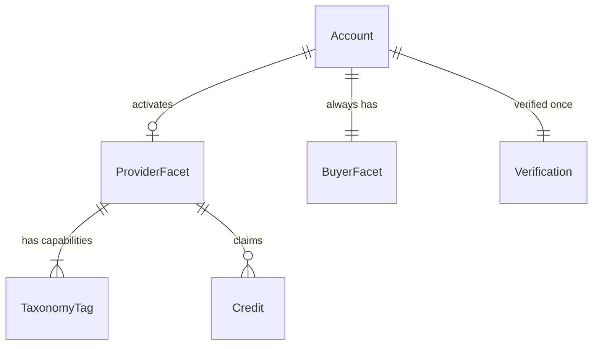
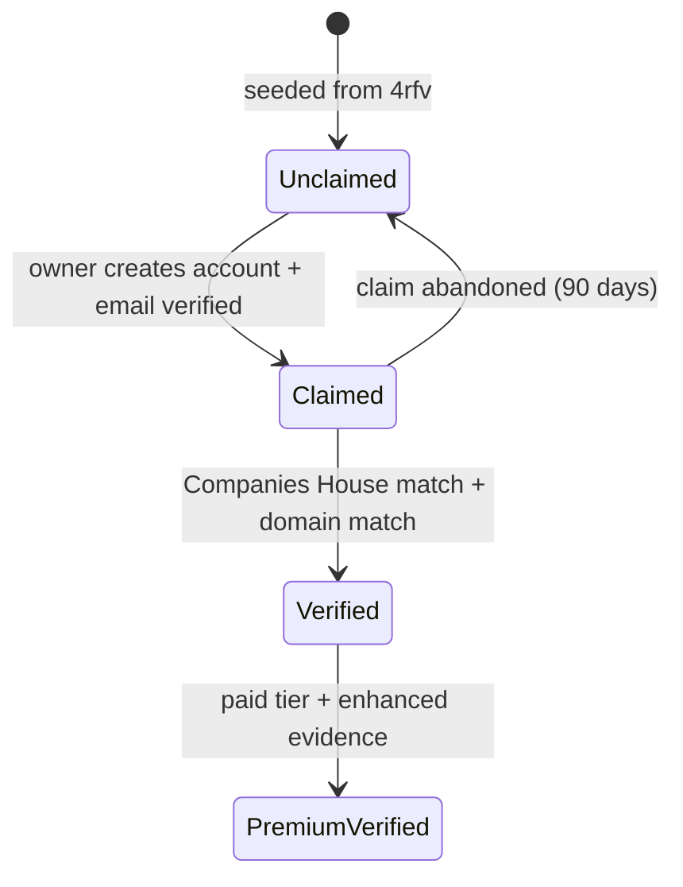
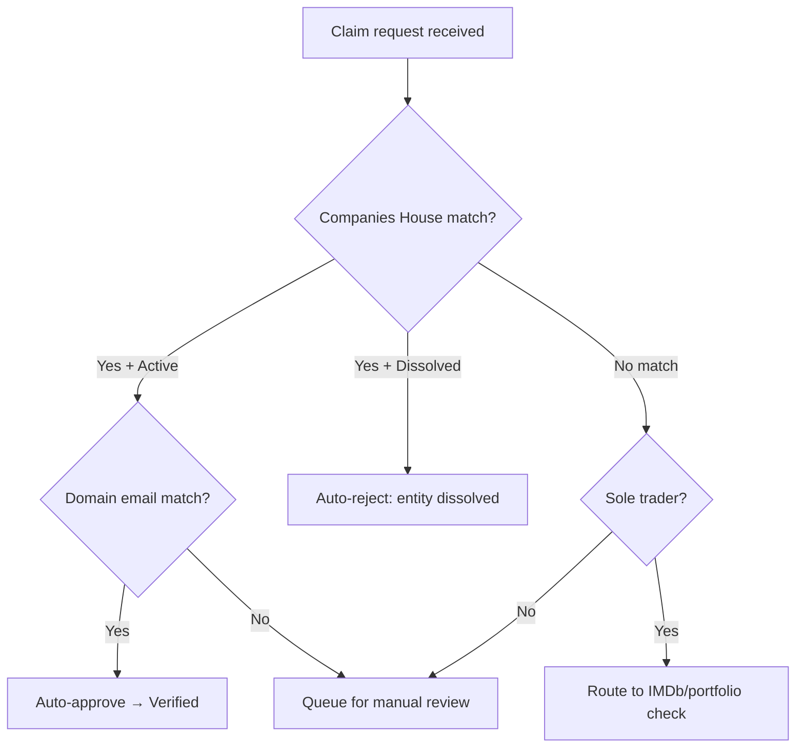

# Agent Output Style Guide

**Status:** Active
**Scope:** All AI agent output in this repository — documents, proposals, design artifacts, specifications.
**Not in scope:** TypeScript source files and tests — those follow `output-style-engineer.md`.
**Last updated:** 2026-02-19

---

## Governing Principle

Every output is a design document for an autonomous entity. Write for an agent that will execute on what you produce, not a human skimming for talking points. Precision is load-bearing.

---

## Prose

**Density:** Every sentence must carry information. If a sentence can be removed without losing meaning, remove it. Prefer one precise sentence over three that circle the point.

**Voice:** Assertive, declarative. State what is, what must be, what was decided. Use "is", "must", "does" — not "could", "might", "it would be worth considering". Hedging is permitted only when the uncertainty itself is the information: "Decay rate for creative-sector directories is unmeasured — planning assumption is 25–35% based on proxy data."

**Structure:** Lead with the conclusion. First sentence of every section states the decision, finding, or specification. Supporting evidence follows. Do not build to a reveal.

**Attribution:** Cite sources inline using `[Source: document.md — §section]` when referencing other project documents or research. When referencing external data, state the source and date in the prose itself.

**Paragraphs:** Short. 2–4 sentences. One idea per paragraph. If a paragraph contains "Additionally" or "Furthermore", split it.

---

## Diagrams

**Preferred format:** Mermaid. Use for entity relationships, state machines, sequence flows, decision flows, and system architecture.

**Fallback format:** ASCII tree structures for hierarchies and simple enumerations — as used in `data-model-proposal.md` for the entity model.

**When to diagram:** Any system with more than three interacting components, any state machine, any flow with branching logic, any entity relationship. If you're writing three paragraphs to describe what a diagram could show, produce the diagram instead.

**Labelling:** Every diagram has a title comment. Every node and edge is labelled. No unlabelled arrows.

**Examples of expected usage:**

Entity relationships:


State machines:


Decision flows:


Hierarchies (ASCII — where Mermaid adds no value):
```
Account
├── Identity (shared, verified once)
├── Provider Facet (opt-in)
│   ├── Profile
│   ├── Capabilities[]
│   └── Credits[]
└── Buyer Facet (always active)
    ├── Search History
    ├── Shortlists[]
    └── Enquiries Sent[]
```

---

## Pseudocode & System Behaviour Specs

Use typed function signatures and data flow specifications to describe system behaviour. This sits between prose and implementation — precise enough that an engineer (or agent) can implement without ambiguity, abstract enough that it doesn't prescribe framework-specific patterns.

**Type definitions for data structures:**
```typescript
type VerificationTier = "unclaimed" | "claimed" | "verified" | "premium_verified"

type ClaimRequest = {
  listingId: string
  accountId: string
  companiesHouseNumber?: string
  claimEmail: string
  evidenceUrls: string[]
  submittedAt: ISO8601
}

type ClaimDecision = {
  action: "auto_approve" | "auto_reject" | "queue_manual_review"
  confidence: number  // 0–1
  reasons: string[]
  assignedTier: VerificationTier
}
```

**Function signatures for system behaviour:**
```typescript
function evaluateClaim(request: ClaimRequest): ClaimDecision
function computeQualityScore(provider: ProviderFacet): QualityScore  // 0–100 composite
function rankSearchResults(query: SearchQuery, results: Provider[]): RankedProvider[]
function detectDecay(provider: ProviderFacet, lastCheck: ISO8601): DecaySignal[]
```

**Decision logic as pseudocode (not prose):**
```
evaluateClaim(request):
  chMatch = companiesHouse.lookup(request.companiesHouseNumber)

  if chMatch.status == "dissolved":
    return { action: "auto_reject", confidence: 0.95, reasons: ["entity dissolved"] }

  if chMatch.status == "active" AND emailDomainMatches(request.claimEmail, chMatch):
    return { action: "auto_approve", confidence: 0.9, assignedTier: "verified" }

  if chMatch == null AND inferSoleTrader(request):
    return { action: "queue_manual_review", confidence: 0.4, reasons: ["sole trader — no CH record"] }

  return { action: "queue_manual_review", confidence: 0.5, reasons: ["CH match but no domain confirmation"] }
```

**When to use pseudocode:** Any process that the entity executes autonomously. Any logic with branching conditions. Any scoring formula. Any threshold-based decision. If the entity-architecture-frame says "this is a decision the entity makes", express the decision as pseudocode, not prose.

---

## Tables

Use for: comparisons, option evaluations, field definitions, status tracking, cross-references.

Every decision table must include a **Rationale** or **Why** column — not just the decision itself.

Cross-reference tables follow the established format:
```
| Document | Relationship |
|---|---|
| `source-doc.md` | What it provides to this document or vice versa |
```

---

## Document Structure

**Header block** (every document):
```markdown
# Title

**Status:** Draft v1 | COMPLETE | ACTIVE
**Domain:** Data & Listings | Platform & Product | Commercial & Revenue | Operations | Cross-Domain
**Last updated:** YYYY-MM-DD
**Inputs:** list of upstream documents this depends on
**Downstream:** what this document feeds into
```

**Section ordering:** Summary (conclusion first) → Specification → Evidence/Rationale → Cross-References → Open Questions (if any).

**Open questions** are permitted but must be scoped: state what the question is, what would resolve it, and which phase or document owns the resolution.

---

## Cross-Document References

**Reference, don't restate.** When a type, contract, decision, or specification is authoritative in another document, cite it — do not copy it. A downstream document adds only the implementation delta: what the upstream document doesn't cover. If a slice implements an interface spec, the slice says "implements `shared-infrastructure.md` §1" and specifies the Drizzle schema, module layout, and acceptance criteria. It does not redefine the `EventBus` type.

**Why:** Restating creates two sources of truth. When the authoritative source changes, the restatement becomes stale or contradictory. Every line of duplication is a future consistency bug.

**Format:** `[Source: document.md — §section]` for inline references. For section-level references, a one-line pointer: "Contract: `shared-infrastructure.md` §3.2 (`OrchestratedFlowProgress`)."

**Exception:** A document may include a *minimal* type signature or field list when the reader needs it for local comprehension and the upstream document is large. Flag it as non-authoritative: `// Authoritative in shared-infrastructure.md §1.2 — summary only`.

---

## Anti-Patterns — Do Not Produce

**Filler and preamble.** No "In this document, we will explore..." No "It's important to note that..." No "As discussed in previous sections..." Start with the content.

**Hedging without information.** "This could potentially be an issue" — either it is an issue (state it) or it isn't (omit it). Uncertainty is acceptable when quantified: "Decay rate is estimated at 25–35% — no creative-sector measurement exists."

**Marketing language.** No "cutting-edge", "best-in-class", "innovative", "powerful", "seamless", "robust". Describe what the system does, not how impressive it is.

**Restating decisions as open questions.** If a decision is settled (see CLAUDE.md), do not reopen it with "we might also consider..." Reference the decision and move on.

**Summaries of what you're about to say.** No introductory paragraphs that preview the section structure. The section headings are the preview.

**Unnecessary caveats.** No "of course, this depends on many factors" or "results may vary." If there is a specific dependency or risk, name it. If there isn't, don't hedge.

**Orphan assertions.** Every claim about the external world (market data, competitor behaviour, technical benchmarks) must have either an inline source citation or be flagged as an assumption with `[Assumption — needs validation]`.

**Prose where a diagram or pseudocode would be clearer.** If you're writing "A sends a request to B, which checks C and either returns D or escalates to E" — that's a flowchart. Draw it.

**Restating upstream specifications.** If a type or contract is authoritative in another document, do not reproduce it. Reference it. Duplication creates two sources of truth — the second one is always wrong eventually.
