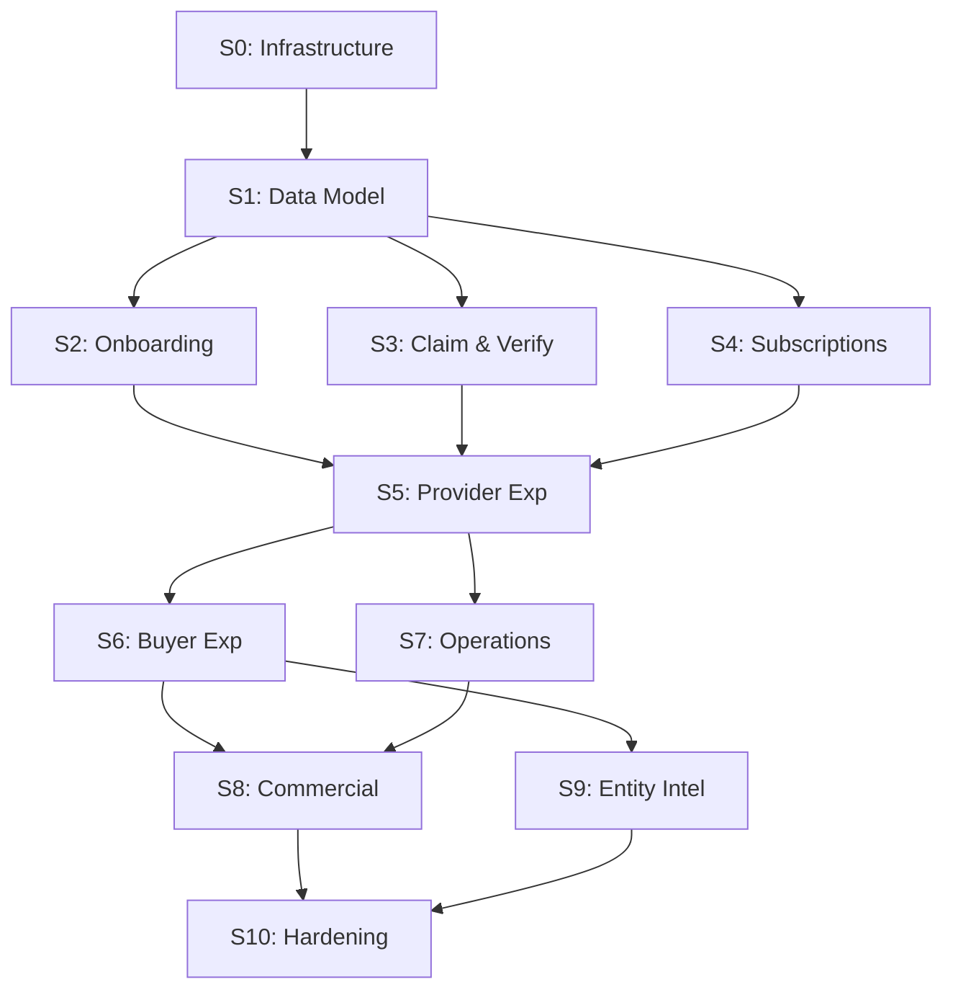

# Phase 4 Handoff — CALLSHEET → HAIOS

**Status:** Active
**Last updated:** 2026-02-16
**Purpose:** Bridge document defining the interface between the CALLSHEET requirements corpus and HAIOS's work management system. Consumed by HAIOS, not by CALLSHEET.

---

## What HAIOS Receives

The CALLSHEET requirements corpus is at `D:\PROJECTS\callsheet\3-requirements\`. It is complete, stress tested, and implementation-ready.

### Corpus Inventory

| Artifact | Path | Format | Content |
|----------|------|--------|---------|
| Interface specs (5) | `interfaces/*.md` | Markdown with typed contracts | Sub-entity boundary surfaces: events, queries, shared types, NFRs |
| Vertical slices (11) | `slices/slice-{NN}-{name}/` (S6+) or `slices/slice-{NN}-{name}.md` (S0–S5) | Multi-file (index.md + content files) or single-file | Implementation specifications: schema, routes, handlers, AC |
| Cumulative schema | `references/cumulative-schema.md` | Drizzle-style TypeScript definitions | All 45 tables, 36 pgEnums, complete after S10 |
| Stress tests (11) | `stress-tests/s{N}-stress-test.md` | Structured findings | 209 scenarios, all resolved in v2 |
| Decisions (3) | `decisions/*.md` | Resolved trade-off evaluations | interface-questions, sq-1, sq-2 |
| Tracker | `REQUIREMENTS-TRACKER.md` | Status table + changelog | Authoritative progress record |

### Per-Slice Structure (S6+ multi-file format)

```
slices/slice-{NN}-{name}/
├── index.md           ← Header, summary, AC table, resolution log, cross-refs
├── 00-schema.md       ← Drizzle schema delta (tables, enums, amendments)
├── 00-router-plan.md  ← tRPC route definitions (procedure, auth, input/output)
├── 01-{section}.md    ← Content section (prose + pseudocode + AC subset)
├── ...
└── 0N-{section}.md
```

S0–S5 are single files containing all sections.

---

## Decomposition Strategy

### Unit of Work: Not 1 AC = 1 Work Item

693 AC do not map 1:1 to HAIOS work items. ACs cluster by implementation unit — the code artifact that satisfies a group of related criteria. The decomposition heuristic:

**1. Schema unit** — A set of Drizzle table definitions that must be created together (foreign key dependencies). Each slice's `00-schema.md` defines one schema unit. Some slices amend prior tables — those amendments are part of the amending slice's schema unit, not the original.

**2. Route unit** — A tRPC router module implementing a group of related procedures. Each slice's `00-router-plan.md` groups routes by router namespace (e.g., `listing.*`, `admin.flows.*`, `admin.graduation.*`). One router namespace = one work item.

**3. Event unit** — An event emission + all its consumer registrations + handler implementations. The `EVENT_CONSUMER_MATRIX` in SI §1.3 defines the full consumer list per event. One event type = one work item covering emission and all handlers.

**4. Orchestrated flow unit** — A multi-step flow (erasure, closure) implemented as a step definition array + per-step handlers + skip constraint enforcement + admin UI integration.

**5. Domain logic unit** — A self-contained algorithm or decision architecture (quality scoring, claim evaluation, conversion triggers, churn detection). Usually maps to one content section in a slice.

**6. Integration test unit** — End-to-end validation for a cross-domain flow. S10's R12 requirement (failure injection tests) is its own work item.

### Estimated Work Item Count

| Slice | Schema | Routes | Events | Flows | Logic | Tests | Est. Total |
|-------|--------|--------|--------|-------|-------|-------|------------|
| S0 | 1 | 0 | 1 (bus infra) | 1 (engine) | 3 (scheduler, logger, email) | 0 | 6 |
| S1 | 1 | 0 | 0 | 0 | 1 (seed data) | 0 | 2 |
| S2 | 1 | 2 | 2 | 0 | 1 (onboarding) | 0 | 6 |
| S3 | 1 | 2 | 2 | 0 | 2 (claim eval, dispute) | 0 | 7 |
| S4 | 1 | 2 | 3 | 0 | 2 (Paddle, pending cancel) | 0 | 8 |
| S5 | 1 | 3 | 2 | 0 | 2 (dashboard, settings) | 0 | 8 |
| S6 | 1 | 3 | 2 | 0 | 3 (search, shortlist, enquiry) | 0 | 9 |
| S7 | 1 | 4 | 1 | 0 | 4 (triage, compliance, billing, procurement) | 0 | 10 |
| S8 | 1 | 3 | 2 | 0 | 4 (conversion, churn, winback, sponsored) | 0 | 10 |
| S9 | 1 | 2 | 1 | 0 | 5 (quality, decay, enrichment, ceremony, perception) | 0 | 9 |
| S10 | 0 | 1 | 0 | 2 | 2 (graduation, versioning) | 1 | 6 |
| **Total** | **10** | **22** | **16** | **3** | **29** | **1** | **~81** |

Estimate: **~80–90 work items** from 693 AC across 11 slices.

---

## Dependency Graph

### Slice-Level Ordering (Hard Dependencies)



### Intra-Slice Ordering (Schema → Routes → Events → Logic)

Within each slice, work items follow a fixed dependency pattern:

1. **Schema first.** Tables must exist before routes or handlers reference them.
2. **Routes second.** tRPC procedures depend on schema but not on event handlers.
3. **Event emissions third.** Emissions from routes/handlers depend on schema and route structure.
4. **Event consumers fourth.** Consumers depend on the emission being correctly typed.
5. **Domain logic last.** Decision architectures depend on schema, routes, and events being wired.

### Cross-Slice Dependencies (Event Contracts)

Some work items in later slices depend on specific work items in earlier slices:

| Later Work Item | Depends On | Reason |
|----------------|------------|--------|
| S4 Paddle webhook handler | S0 event bus | Emits `subscription_tier_changed` |
| S5 provider dashboard | S4 subscription schema | Displays subscription status |
| S6 enquiry submission | S5 enquiry_records schema | S5 added `status` column |
| S7 flow admin UI | S0 orchestrated flow engine | Admin recovery actions |
| S8 churn detection | S4 pending_cancellation | Reads cancellation registry |
| S9 quality scoring | S1 quality_scores table | Replaces zero-initialised stubs |
| S10 erasure flow | S0 orchestrator + all domain schemas | Deletes/anonymises across domains |

These map to `blocked_by` relationships in HAIOS work items.

---

## Mapping to HAIOS Traceability Chain

### Proposed Hierarchy

```
L4 Requirement: CALLSHEET entity-architecture-frame §Design Principles
  └── Epoch: E-CALLSHEET (or next HAIOS epoch)
      ├── Arc: infrastructure (S0, S1)
      ├── Arc: onboarding-and-claims (S2, S3)
      ├── Arc: subscriptions-and-provider (S4, S5)
      ├── Arc: buyer-and-operations (S6, S7)
      ├── Arc: commercial-and-intelligence (S8, S9)
      └── Arc: hardening (S10)
          └── Chapter: per-slice (CH-S0 through CH-S10)
              └── Work Items: per decomposition unit (WORK-XXX)
                  └── Artifacts: code, tests, migrations
```

### Requirement Reference Format

Each HAIOS work item's `requirement_refs` field should reference CALLSHEET AC numbers with slice prefix:

```yaml
requirement_refs:
  - CALLSHEET-S0-AC-001
  - CALLSHEET-S0-AC-002
  - CALLSHEET-S0-AC-003
```

This preserves full traceability from HAIOS work items back to the requirements corpus.

### Acceptance Criteria Mapping

Each work item's `acceptance_criteria` field contains the AC text from the CALLSHEET slice, verbatim. The test type (Unit/Integration/E2E) maps to HAIOS's validation lifecycle — the validation agent knows what kind of test to run.

---

## What HAIOS Needs to Build

### 1. Spec Ingestion Preprocessor

HAIOS's current extraction pipeline targets session transcripts (Decisions, Critiques, Proposals, Directives). CALLSHEET's corpus is structured specifications. HAIOS needs a preprocessor that:

- Reads a slice directory (index.md + content files)
- Extracts: AC list (from index.md §17/§18), schema definitions (from 00-schema.md), route definitions (from 00-router-plan.md), event contracts (from content files), pseudocode blocks
- Produces: structured work item candidates with `requirement_refs`, `acceptance_criteria`, `blocked_by` pre-populated

This is not a general-purpose LLM extraction. The slice format is deterministic — table parsing, not inference.

### 2. Work Item Decomposition Skill

A new HAIOS skill that takes a CALLSHEET slice as input and produces work item scaffolds:

```
Input:  slices/slice-04-subscriptions/ (index.md + content files)
Output: WORK-041 (schema), WORK-042 (subscription routes), WORK-043 (Paddle webhook),
        WORK-044 (pending cancellation), WORK-045 (subscription_tier_changed emission),
        ...
```

The skill applies the decomposition heuristic from this document (schema → routes → events → logic) and populates `blocked_by` from the dependency graph.

### 3. Implementation Lifecycle Adaptation

HAIOS's implementation lifecycle is PLAN → DO → CHECK → DONE. For CALLSHEET work items, the PLAN phase is already complete (the slice IS the plan). The lifecycle for spec-derived work items should be:

```
DO → CHECK → DONE
```

Where DO writes code against the AC, and CHECK runs the validation lifecycle (Unit/Integration/E2E per AC test type). The critique gate before PLAN is unnecessary — the stress test already played that role.

### 4. Cross-Workspace File Access

HAIOS work items will reference files in `D:\PROJECTS\callsheet\3-requirements\`. The `source_files` field in HAIOS work items should point to the CALLSHEET corpus:

```yaml
source_files:
  - D:/PROJECTS/callsheet/3-requirements/slices/slice-04-subscriptions/index.md
  - D:/PROJECTS/callsheet/3-requirements/interfaces/shared-infrastructure.md
```

HAIOS's ConfigLoader needs a `projects` section or equivalent to resolve cross-workspace paths.

---

## What HAIOS Does NOT Need to Build

- **Requirements extraction.** The requirements are already extracted, typed, and numbered. HAIOS consumes them, not re-derives them.
- **Stress testing capability.** The stress test pipeline lives in the CALLSHEET workspace. It ran 11 times and produced v2 slices. HAIOS inherits the validated output.
- **Domain knowledge.** HAIOS doesn't need to understand CALLSHEET's business domain. It needs to decompose specifications into work items and execute the implementation lifecycle. The specifications contain everything an implementer needs.

---

## Execution Timeline

### Epoch Estimate: 15–20

The ~81 work items across 11 slices will not execute in a single epoch. Each slice surfaces implementation questions the specs didn't anticipate. HAIOS itself needs capability development before it can consume structured specifications. Honest estimate:

| Epochs | Work | Notes |
|--------|------|-------|
| 1–2 | HAIOS capability: spec ingestion, decomposition skill, adapted lifecycle | Prerequisite — no CALLSHEET code until this exists |
| 3–4 | S0: Infrastructure (event bus, scheduler, flow engine, decision logging, email) | Foundational. Everything depends on this. |
| 5 | S1: Data model + seed pipeline | 45 tables, pgEnums, seed data from 4rfv |
| 6–7 | S2/S3/S4 parallel (onboarding, claims, subscriptions) | First parallelisation window. Paddle integration (S4) may require spikes. |
| 8–9 | S5: Provider experience | Depends on S2+S3+S4 completion |
| 10–11 | S6/S7 parallel (buyer experience, operations) | Second parallelisation window |
| 12–13 | S8: Commercial (conversion, churn, win-back, sponsored) | Domain logic density — 4 decision architectures |
| 14 | S9: Entity intelligence (quality scoring, decay, enrichment, ceremonies) | 5 algorithm dimensions need calibration |
| 15 | S10: Hardening + E2E validation | Erasure/closure flows, failure injection, graduation |
| +1–5 | Unplanned: HAIOS capability gaps, implementation spikes, integration issues | Buffer for unknowns |

This assumes HAIOS capability epochs (1–2) succeed cleanly. If spec ingestion or the decomposition skill require iteration, add epochs.

### Parallelisation Opportunities

```
Sequential: S0 → S1
Parallel:   S2 | S3 | S4 (all depend on S1, not on each other)
Sequential: S5 (depends on S2 + S3 + S4)
Parallel:   S6 | S7 (both depend on S5, not on each other)
Sequential: S8 (depends on S6 + S7)
Parallel:   S9 (depends on S6, not on S7 or S8)
Sequential: S10 (depends on S8 + S9)
```

Critical path: S0 → S1 → S5 → S8 → S10 (5 sequential gates). Parallelisation of S2/S3/S4 and S6/S7 compresses wall clock time but not epoch count — each parallel track still needs its own investigation/implementation cycles.

---

## Beyond V1: Hierarchical Entity Swarms

### What V1 Does NOT Build

The requirements corpus specifies 4 flat sub-entities (D&L, Ops, PP, CR) with a single cross-domain event bus and flat decision logging. The entity architecture frame claims the substrate is fractal — "the same architecture operates at every level of the hierarchy" — but explicitly defers Layer 2 specification to post-launch R&D.

V1 does not implement:

| Capability | V1 Status | Why Deferred |
|------------|-----------|-------------|
| Intra-domain event routing | Not specified | No evidence yet for where internal boundaries fall |
| Per-capability cognitive kernels | Not specified | Decision functions exist but are not autonomous entities |
| Hierarchical decision type namespacing | Flat string enum (27 types) | Namespace structure requires operational data to reveal groupings |
| Nested orchestrators (HAIOS per sub-entity) | Not specified | Layer 2 specification is the framework's core R&D question |
| Sub-entity perception loops | Centralised in S9 | Per-entity perception scope unknown until operational signals exist |
| Per-leaf-entity autonomy graduation | Domain-scope only (S10 §7) | Graduation criteria need operational track record to calibrate |

This is correct. Specifying 20-25 leaf entities now would be premature decomposition — guessing at boundaries that only operational data can reveal.

### What V1 DOES Build to Enable Swarms Later

The requirements corpus installs the instrumentation that discovers swarm boundaries:

**Decision logging (SI §9, 27 types).** Every autonomous decision is logged with type, domain, inputs, outputs, confidence, and outcome. This is the perception system for Builder-HAIOS observing Runtime-CALLSHEET. When D&L's `claim_evaluation` decisions cluster into distinct patterns (Companies House auto-approve vs freelancer portfolio review vs dispute resolution), the decision log reveals that `claim_evaluation` is actually 3 leaf entities, not one.

**Graduation criteria (S10 §7).** The graduation framework evaluates per-capability within a domain. The `evaluateGraduationCriteria(subEntity, capability)` signature already accepts a capability discriminator. Extending this to leaf-entity scope requires adding a third parameter (or promoting capabilities to entities), not redesigning the framework.

**Event payload self-containment (P1).** Every event carries enough data for any consumer to act without a database read. This principle transfers directly to intra-domain events — when a sub-entity decomposes, its internal events can follow the same P1 contract pattern.

**Orchestrated flow engine (S0).** Step definitions are data, not code. Adding intra-domain orchestrated flows (e.g., a D&L-internal quality scoring pipeline with perception → evaluation → action → learning steps) requires registering new step definitions, not new infrastructure.

**Ceremony automation (S9 §4).** The 6 ceremonies produce recommendations for principal review. As autonomy graduates, these ceremonies become the decision points where leaf entities propose actions and domain-level entities approve or delegate. The ceremony structure is already the governance pattern for hierarchical authority.

### The Discovery Timeline

```
V1 Launch
  → 3-6 months of operational data
    → Decision log analysis reveals capability clustering within domains
      → D&L decomposes: QualityScoring, ClaimEvaluation, DecayDetection, etc.
      → Each leaf entity gets: scoped decision types, perception loop, graduation criteria
        → Intra-domain event bus (or scoped channels on existing bus)
          → Per-leaf-entity autonomy graduation
            → Leaf entities that perform well spawn sub-leaves
              → Fractal substrate becomes real, not theoretical
```

Each decomposition step is its own epoch. The entity architecture frame's epistemic status section is honest about this: "Whether these layers decompose cleanly in practice is an empirical question." V1 runs the experiment. Post-V1 epochs interpret the results and decompose accordingly.

### What This Means for HAIOS

HAIOS doesn't build the swarm during V1 implementation. HAIOS builds a platform that *generates the data* for swarm decomposition. The swarm emerges from operational signal, not from upfront design.

But HAIOS should be aware that the flat 4-domain architecture is V1, not final. Implementation decisions that would make future decomposition harder (hardcoded domain assumptions, tightly coupled intra-domain logic, monolithic handler functions that can't be extracted) should be avoided. The acceptance criteria don't test for decomposability — that's a HAIOS-level architectural concern that sits above the spec.

Concretely: when HAIOS implements a decision function like `evaluateChurnIntervention`, it should implement it as an isolated module with explicit inputs and outputs, not as inline logic in an event handler. The spec doesn't require this separation — but the fractal architecture does, and HAIOS knows that even if the spec doesn't say it.

---

## Cross-References

| Document | Relationship |
|----------|-------------|
| `requirements-phase-evidence.md` | Evidence record for methodology and architecture. Informs HAIOS's pipeline design. |
| `entity-architecture-frame.md` (v2) | Layer 2 (HAIOS) consuming Layer 3 (CALLSHEET). This document is the interface between them. |
| `3-requirements/REQUIREMENTS-TRACKER.md` | Authoritative record of what was produced. Source of truth for completeness verification. |
| `3-requirements/references/cumulative-schema.md` | Complete schema snapshot. Input to schema work item decomposition. |
