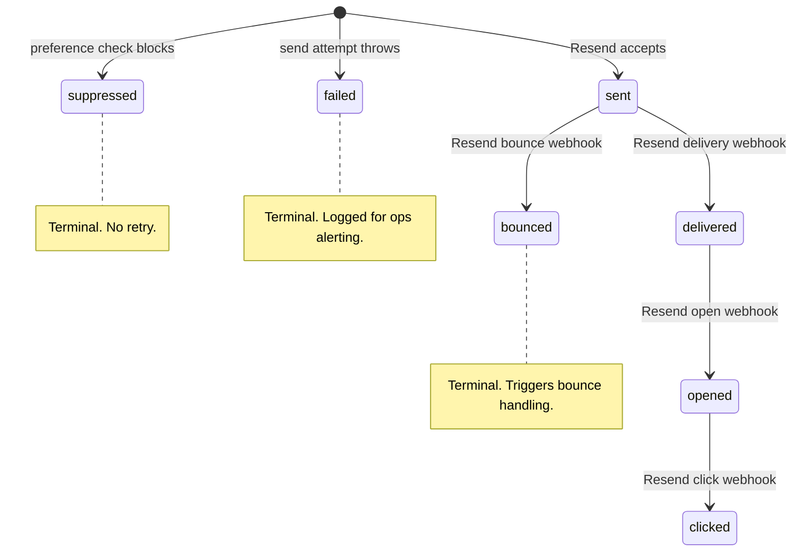
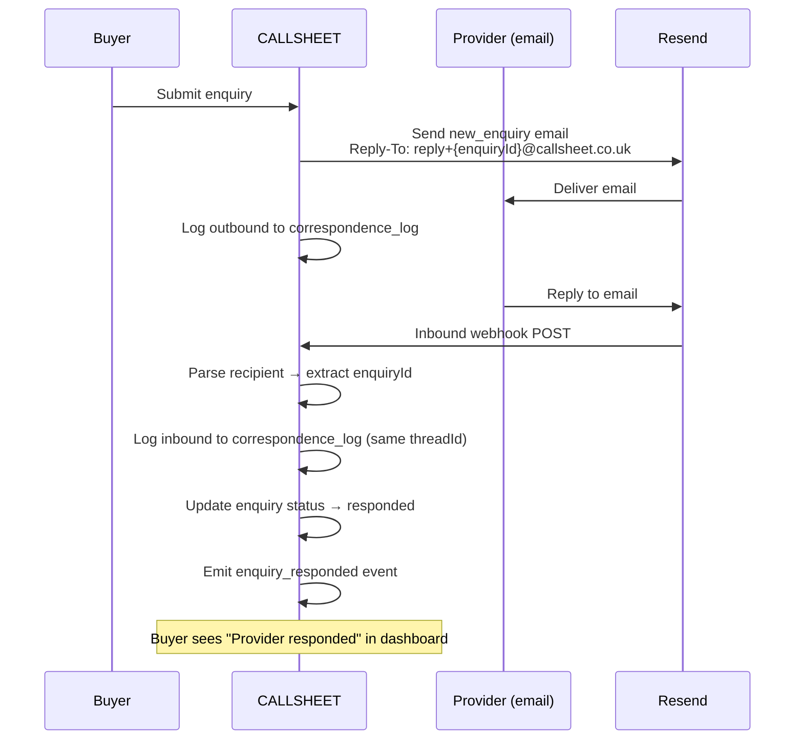

# Communications Infrastructure — Investigation Brief

**Domain:** Cross-Domain (Platform & Product, Operations, Commercial & Revenue)
**Status:** COMPLETE
**Last updated:** 2026-02-22
**Inputs:** `entity-architecture-frame.md` (v2 §Layer 4), `shared-infrastructure.md` (v10 §5), `platform-and-product.md` (v5 §10), `operations.md` (v6 §2–§4), `cross-domain-dependencies.md` (v3 §1.1), `slices/slice-05-provider-experience.md` (v2), `slices/slice-06-buyer-experience/` (v2), `slices/slice-07-operations/` (v2), `slices/slice-10-hardening/` (v2), existing implementation (`src/lib/email/`)
**Downstream:** S0 infrastructure extension (correspondence log schema), S5/S6 enquiry response tracking (inbound parsing), S7 support intake (inbound routing), S10 erasure (correspondence data), SI spec amendments (§2.1 +1 deferred action, §9.2 +4 decision types)

---

## 1. Problem Statement

CALLSHEET's email system sends messages but cannot prove it sent them, cannot receive replies, and cannot correlate a sequence of messages about the same subject into a single thread. Three gaps:

**Gap 1: No outbound audit trail.** The current `EmailService.send()` returns a `messageId` and `status`, then discards both. No record persists. The entity cannot answer "what did we send this account?" — a question GDPR Article 15 (right of access) requires answering for DSAR requests. The `processErasure` flow (S10 §2) anonymises `emailPreferences` but has no outbound email records to include in the data extract or delete. Every compliance interaction currently relies on the assumption that email history doesn't exist. That assumption becomes a liability the moment a data subject requests their communication history.

**Gap 2: No inbound email processing.** Support intake is specified as "Email inbox (Resend)" [Source: operations.md — §2] but no routing mechanism exists. The concept design defers to Freshdesk at >50 tickets/month, but the V1 path — where inbound emails arrive at a CALLSHEET address and get classified, acknowledged, and ticketed — is unbuilt. Separately, the enquiry response tracking question (PP open question #3) was resolved by implementing manual "mark as responded" only [Source: slice-05 §3]. Reply-to email parsing — the concept design's preferred approach — remains unimplemented. The entity has no ears for its primary communication channel.

**Gap 3: No unified correspondence view.** Outbound emails, inbound replies, support tickets, enquiry threads, and in-app notifications are separate, unlinked systems. An admin investigating "what happened with this account?" must query multiple tables with no shared thread identifier. The entity cannot reconstruct a conversation. This blocks the Operations sub-entity's perception of its own communication state — a Layer 2 cognitive requirement [Source: entity-architecture-frame.md — §Layer 2, Perception].

**Compliance risk assessment:** Gap 1 is the highest-priority item. Under GDPR Article 15, a data subject can request all personal data the controller holds — including records of communications sent to them. Without an outbound log, CALLSHEET must either (a) state "we hold no communication records" (true but suspicious to the ICO if the subject produces an email they received), or (b) reconstruct from Resend's API (vendor dependency, retention limits, not designed for DSAR). Neither is acceptable for an entity that positions compliance as structural, not reactive.

---

## 2. Requirements Inventory

30 email templates exist in SI §5.2. Each generates outbound correspondence that should be tracked. Classification below reflects the compliance and operational value of retaining a send record.

### 2.1 Classification Criteria

| Tier | Definition | Retention | Erasure behaviour |
|---|---|---|---|
| **Must-track** | Legal obligation to prove delivery (GDPR notices, compliance, identity-affecting) or financial transaction record | 7 years or until erasure request | Include in DSAR extract, delete on erasure |
| **Should-track** | Operational value for support context, entity perception, or dispute resolution | 2 years, then archive | Include in DSAR extract, delete on erasure |
| **Nice-to-track** | Analytics value only (conversion optimisation, engagement measurement) | 1 year, then aggregate and delete detail | Include in DSAR extract, delete on erasure |

### 2.2 Template Classification

**Must-track (11 templates):**

| Template ID | Trigger | Rationale |
|---|---|---|
| `article_14_notice` | 4rfv seed import | GDPR Art 14 compliance proof. Must demonstrate notice was sent. |
| `dsar_acknowledgment` | DSAR received | Statutory 72h ack. Must prove timely response. |
| `dsar_completion` | Erasure completed | Closes DSAR case. Must prove completion notification. |
| `email_verification` | Signup | Identity verification chain. Account creation evidence. |
| `claim_approved` | Claim accepted | Verification tier change proof. Dispute resolution evidence. |
| `claim_rejected` | Claim rejected | Dispute resolution evidence. Must prove notification of adverse decision. |
| `claim_pending_review` | Claim queued | Evidence claim was received and acknowledged. |
| `subscription_confirmed` | Checkout | Financial transaction confirmation. |
| `support_acknowledgment` | Support classified | SLA compliance proof. Must demonstrate timely acknowledgment. |
| `decay_final_notice` | >90 days unresolved | Pre-archival notice. Due process evidence before listing removal. |
| `password_reset` | Self-service | Security audit trail. Account access evidence. |

**Should-track (11 templates):**

| Template ID | Trigger | Rationale |
|---|---|---|
| `welcome` | Post-verification | Onboarding context. Support troubleshooting. |
| `listing_live` | Published | Provider support context. |
| `new_enquiry` | Enquiry received | Enquiry thread correlation. Response time measurement. |
| `enquiry_forwarded` | Unclaimed enquiry | Claim funnel tracking. Forward delivery proof. |
| `enquiry_reminder` | 7 days no response | Response rate measurement. Suppression check (was reminder sent?). |
| `enquiry_response` | Provider responds | Enquiry thread completion. Response time calculation. |
| `listing_update_reminder` | 90 days stale | Decay intervention tracking. |
| `listing_decay_warning` | Decay detected | Decay lifecycle documentation. |
| `enrichment_confirmation_request` | >12 months no edits | Data quality lifecycle. |
| `credit_confirmation_outreach` | Credit expiring | Credit verification lifecycle. |
| `winback` | 60-day post-cancel | Win-back funnel measurement. Suppression proof (did we respect opt-out?). |

**Nice-to-track (8 templates):**

| Template ID | Trigger | Rationale |
|---|---|---|
| `profile_day1` | Day 1 nudge | Progressive disclosure optimisation signal. |
| `profile_day3` | Day 3 nudge | Progressive disclosure optimisation signal. |
| `profile_day7` | Day 7 nudge | Progressive disclosure optimisation signal. |
| `conversion_analytics_teaser` | Weekly views > 0 | Conversion funnel analytics. |
| `conversion_social_proof` | Peer upgrade | Conversion funnel analytics. |
| `conversion_view_milestone` | 50/100/250 views | Conversion funnel analytics. |
| `conversion_engagement_summary` | Quarterly report | Conversion funnel analytics. |
| `principal_briefing` | Monthly briefing | Internal entity perception. No data subject PII. |

### 2.3 Inventory Summary

| Tier | Count | % of templates |
|---|---|---|
| Must-track | 11 | 37% |
| Should-track | 11 | 37% |
| Nice-to-track | 8 | 26% |
| **Total** | **30** | **100%** |

All 30 templates should be tracked. The tier determines retention period and priority if implementation is phased.

---

## 3. Correspondence Log Design

### 3.1 Design Decisions

**Single table, not per-domain.** Correspondence is shared infrastructure — the same table records outbound from Platform (enquiry notifications), Operations (compliance emails), and Commercial (conversion marketing). Ownership: Platform owns the table and write path (it owns `EmailService`). Other domains write through the service, not directly.

**Thread model: reference-based, not tree.** Email threading uses `threadId` (a stable identifier for a conversation) plus `inReplyTo` (the specific message being replied to). This matches RFC 2822 `In-Reply-To` / `References` headers. No recursive tree — a flat list per thread, ordered by timestamp, is sufficient for all query patterns.

**Separate from notifications.** In-app notifications (SI §8) are a different system with different lifecycle. The correspondence log records email-channel communications. A future unified inbox view joins them at the query layer, not the storage layer.

### 3.2 Schema (Drizzle pseudocode)

```typescript
// Platform owns. Shared infrastructure — all sub-entities write through EmailService.

export const correspondenceDirectionEnum = pgEnum("correspondence_direction", [
  "outbound",   // CALLSHEET → external
  "inbound",    // external → CALLSHEET
])

export const correspondenceStatusEnum = pgEnum("correspondence_status", [
  "sent",        // delivered to provider (Resend accepted)
  "delivered",   // Resend webhook confirms delivery
  "opened",      // Resend webhook confirms open (outbound only)
  "clicked",     // Resend webhook confirms link click (outbound only)
  "bounced",     // Resend webhook confirms bounce
  "failed",      // send attempt failed
  "received",    // inbound email received and parsed
  "suppressed",  // preference check blocked send
])

export const correspondenceLog = pgTable("correspondence_log", {
  id: uuid("id").primaryKey().defaultRandom(),

  // Threading
  threadId: uuid("thread_id").notNull(),              // stable conversation identifier
  inReplyTo: uuid("in_reply_to"),                     // FK → correspondence_log.id (nullable for first message)

  // Direction and channel
  direction: correspondenceDirectionEnum("direction").notNull(),

  // Participants
  accountId: uuid("account_id"),                      // FK → accounts. null for pre-account (Art 14, seeded listings)
  listingId: uuid("listing_id"),                      // FK → listings. null for non-listing correspondence
  externalEmail: text("external_email").notNull(),    // recipient (outbound) or sender (inbound)

  // Content reference (not content itself — content is the template + merge fields)
  templateId: text("template_id"),                    // EmailTemplateId for outbound. null for inbound.
  category: text("category"),                         // EmailCategory for outbound. null for inbound.
  subject: text("subject").notNull(),                 // rendered subject line (outbound) or parsed subject (inbound)

  // Provider tracking
  providerMessageId: text("provider_message_id"),     // Resend message ID. null if suppressed.
  status: correspondenceStatusEnum("status").notNull(),

  // Metadata
  mergeFieldsHash: text("merge_fields_hash"),         // SHA-256 of merge fields JSON. NOT the fields themselves.
  // Why hash, not content: merge fields contain PII (names, emails, listing details).
  // Storing PII in a log table creates a second copy that must be erased.
  // The hash proves "we sent this exact content" without retaining the content.
  // Full content is reconstructable from template + merge fields at send time if needed for DSAR.
  // [OQ-1 resolved: hash-only, no encrypted store. Source data reconstruction sufficient for DSAR.]

  // Inbound content (nullable — outbound messages have no body stored)
  bodyText: text("body_text"),                        // plain text body for inbound messages (max 10,000 chars, quoted content stripped)
  // [OQ-5 resolved: stored for entity perception + dispute resolution. NOT surfaced to buyer dashboard.]
  // Erasure: set to '[erased]' on provider erasure request.

  // Inbound attachment metadata (no binary storage at V1)
  attachmentMeta: jsonb("attachment_meta").$type<Array<{ filename: string; mimeType: string; sizeBytes: number }>>(),
  // [OQ-3 resolved: metadata only at V1. Binary storage (R2) deferred to V2 when support volume justifies.]

  createdAt: timestamp("created_at", { withTimezone: true }).notNull().defaultNow(),
  updatedAt: timestamp("updated_at", { withTimezone: true }).notNull().defaultNow(),
}, (table) => ({
  accountIdx: index("correspondence_log_account_id_idx").on(table.accountId),
  threadIdx: index("correspondence_log_thread_id_idx").on(table.threadId),
  listingIdx: index("correspondence_log_listing_id_idx").on(table.listingId),
  templateIdx: index("correspondence_log_template_id_idx").on(table.templateId),
  createdAtIdx: index("correspondence_log_created_at_idx").on(table.createdAt),
  externalEmailIdx: index("correspondence_log_external_email_idx").on(table.externalEmail),
}))
```

### 3.3 Thread ID Assignment

Thread identity is determined at send time by the triggering context:

| Context | Thread ID source | Example |
|---|---|---|
| Enquiry thread | `enquiryId` | `new_enquiry` → `enquiry_reminder` → `enquiry_response` share a thread |
| Claim flow | `claimId` | `claim_pending_review` → `claim_approved` or `claim_rejected` share a thread |
| DSAR case | `dsarCaseId` | `dsar_acknowledgment` → `dsar_completion` share a thread |
| Support ticket | `ticketId` | `support_acknowledgment` + any follow-up share a thread |
| Standalone | New UUID | `welcome`, `password_reset`, `subscription_confirmed` — no thread context |
| Progressive disclosure | `accountId` + `"onboarding"` | `profile_day1/3/7` share a thread per account |

The `EmailService.send()` interface gains an optional `threadId` parameter. If omitted, a new UUID is generated (standalone message). Callers with thread context pass the relevant entity ID.

### 3.4 GDPR Erasure Behaviour

The correspondence log is included in the `processErasure` flow (S10 §2):

1. **DSAR extract (step 2):** Query `correspondence_log WHERE accountId = ?`. Include in data export: direction, template, subject, status, bodyText (if present), timestamps. Exclude `mergeFieldsHash` (not meaningful to data subject). Exclude `attachmentMeta` (metadata only, no content).
2. **Erasure (step 4):** `UPDATE correspondence_log SET externalEmail = '[erased]', subject = '[erased]', bodyText = '[erased]', mergeFieldsHash = NULL, attachmentMeta = NULL, accountId = NULL WHERE accountId = ?`. Do not DELETE — retain the record skeleton for compliance audit trail (proves notices were sent).
3. **Non-account correspondence:** Art 14 notices sent to seeded listings (no `accountId`) are retained for compliance proof. If a DSAR arrives by email match, query `correspondence_log WHERE externalEmail = ?` and include in extract. Apply the same anonymisation pattern on erasure.

### 3.5 Query Patterns

| Query | Use case | Index |
|---|---|---|
| `WHERE accountId = ? ORDER BY createdAt DESC` | Admin correspondence view, DSAR extract | `account_id_idx` |
| `WHERE threadId = ? ORDER BY createdAt ASC` | Thread reconstruction | `thread_id_idx` |
| `WHERE listingId = ? ORDER BY createdAt DESC` | Listing correspondence history | `listing_id_idx` |
| `WHERE templateId = ? AND createdAt > ? AND status = 'bounced'` | Bounce rate monitoring (entity perception) | `template_id_idx` + `created_at_idx` |
| `WHERE externalEmail = ? ORDER BY createdAt DESC` | Non-account DSAR, duplicate detection | `external_email_idx` |
| `WHERE status = 'suppressed' AND createdAt > ?` | Preference suppression analytics | `created_at_idx` |

### 3.6 Status Lifecycle



Inbound messages enter at `received` status. No lifecycle transitions — they are recorded once.

### 3.7 Bounce Handling Policy

[OQ-4 resolved]

Hard bounces suppress future sends. Soft bounces retry once. Recurring bounces trigger admin review.

```
onBounce(event):
  correspondenceRow = lookup(event.providerMessageId)

  if event.bounceType == "hard":
    UPDATE correspondence_log SET status = 'bounced' WHERE id = correspondenceRow.id
    UPDATE email_preferences SET suppressedAt = now(), suppressionReason = 'hard_bounce'
      WHERE accountId = correspondenceRow.accountId
    logDecision("email_suppressed", { reason: "hard_bounce", accountId })

  if event.bounceType == "soft":
    UPDATE correspondence_log SET status = 'bounced' WHERE id = correspondenceRow.id
    schedule("retry_bounced_email", { correspondenceLogId: correspondenceRow.id }, delay: 24h)
    // Single retry. If retry also bounces → treat as hard bounce.

  if countBouncesLast90Days(correspondenceRow.accountId) >= 3:
    createAdminAlert("recurring_bounce", { accountId, bounceCount })
```

| Bounce type | Action | Retry | Suppression |
|---|---|---|---|
| Hard (mailbox not found, domain invalid) | Suppress immediately | No | Yes — `email_suppressed` decision logged |
| Soft (mailbox full, temporary failure) | Retry once after 24h | Yes — `retry_bounced_email` deferred action | Only if retry also bounces |
| 3+ bounces in 90 days (any type) | Admin alert | N/A | Admin decides |

Infrastructure requirements:
- **+1 deferred action type:** `retry_bounced_email` with params `{ correspondenceLogId: string }`. Registered in SI §2.1.
- **+1 decision type:** `email_suppressed`. Registered in SI §9.2.
- Resend webhook payload includes `bounceType` field distinguishing hard/soft bounces.

---

## 4. Provider Evaluation

### 4.1 Current State

CALLSHEET uses Resend (settled decision). The question is whether Resend remains the right choice given the three new requirements: outbound tracking (webhook events), inbound email processing, and correspondence threading.

### 4.2 Evaluation Criteria

| Criterion | Weight | Why |
|---|---|---|
| Inbound email processing | Critical | Gap 2 requires receiving and parsing emails |
| Webhook events (delivery, open, bounce) | Critical | Gap 1 requires status tracking post-send |
| Free tier adequacy | High | V1 volume <3,000/month. Cost at scale matters less than cost at zero. |
| Deliverability | High | Transactional email reputation directly affects entity credibility |
| API simplicity | Medium | Developer velocity. One-person build. |
| GDPR compliance (EU hosting option) | Medium | Data controller obligation. EU hosting preferred but not required for B2B. |

### 4.3 Early Elimination

**Cloudflare Email Workers** — inbound only, no outbound capability. Would require two providers for no benefit when Resend handles both directions. Eliminated.

### 4.4 Provider Comparison

| Capability | Resend | Postmark | SendGrid |
|---|---|---|---|
| **Outbound API** | REST + SDK. Clean. | REST + SDK. Clean. | REST + SDK. Verbose. |
| **Inbound email** | Webhooks on verified domain. Parses to/from/subject/body. Available on all plans. | Inbound webhooks. Mature. Parses attachments. | Inbound parse webhook. Mature. Parses attachments. |
| **Delivery webhooks** | `email.sent`, `email.delivered`, `email.opened`, `email.clicked`, `email.bounced`, `email.complained`. | Delivery, bounce, open, click, spam complaint. Strongest deliverability reputation. | Full event webhook suite. |
| **Free tier** | 3,000 emails/month. 1 domain. | 100 emails/month (too low). | 100 emails/day = ~3,000/month. 1 sender. |
| **Paid tier (scale)** | $20/month for 50K. Linear. | $15/month for 10K. Per-message. | $19.95/month for 50K. |
| **Deliverability** | Good. Shared IP on free tier. Dedicated IP at $40/month. | Best in class. Transactional-only policy. High sender reputation. | Variable. Shared with marketing senders. Requires careful domain/IP management. |
| **API quality** | Excellent. Modern. TypeScript SDK. Minimal surface. | Excellent. Well-documented. Server-side SDKs. | Adequate. Large surface area. Legacy patterns. |
| **EU hosting** | No explicit EU region. US-based. GDPR DPA available. | US and EU options. GDPR compliant. | US-based. GDPR DPA available. |
| **Inbound parsing quality** | JSON webhook: `from`, `to`, `subject`, `text`, `html`, `headers`. No attachment parsing on free tier. | JSON webhook: full MIME parsing including attachments, headers, threading metadata (`In-Reply-To`, `References`). | JSON webhook: full MIME parsing, attachments as Base64, headers. |
| **Thread support** | `In-Reply-To` and `References` headers settable on outbound. Inbound webhook includes raw headers. | Full header support. `MessageStream` concept for logical grouping. | Headers available. No built-in threading concept. |

### 4.5 Elimination

**SendGrid:** Free tier adequate but shared-sender reputation is a known problem for transactional email. API surface is large and legacy. No compelling advantage over Resend for CALLSHEET's scale and requirements.

**Postmark:** Superior deliverability (best in class) and mature inbound processing with full MIME parsing. 100 emails/month free tier is insufficient — CALLSHEET would hit paid tier before launch (Art 14 batch alone could exceed 100). At $15/month for 10K, cost is comparable to Resend's $20/month for 50K. Postmark is the strongest alternative but the free tier gap is material for a pre-revenue entity.

### 4.6 Recommendation

**Stay with Resend.** Rationale:

1. **Already implemented.** `EmailService`, `InMemoryEmailService`, template registry, preference enforcement — all built and tested (6 unit tests, AC-26 through AC-29). Switching providers means rewriting transport, test mocks, and CI configuration.
2. **Inbound capability exists.** Resend inbound webhooks parse emails to JSON with headers, body, and sender metadata. Sufficient for support intake and reply-to parsing.
3. **Webhook events exist.** Delivery, open, bounce, click, complaint — all available. Sufficient for correspondence log status tracking.
4. **Free tier covers V1.** 3,000/month is adequate. Art 14 batch (up to ~4,700 emails) is a one-time event that may push into the $20/month tier for one month.
5. **Thread headers supported.** `In-Reply-To` and `References` can be set on outbound API calls. Inbound webhook returns raw headers for thread correlation.

**Migration trigger:** If Resend's inbound parsing proves inadequate (attachment handling, MIME edge cases, or threading header reliability), evaluate Postmark. The `EmailService` abstraction makes the transport swappable — the correspondence log and thread model are provider-agnostic.

**Risk:** Resend is a younger company than Postmark/SendGrid. Vendor continuity risk is low at current scale (switching cost is days, not months) but should be monitored.

---

## 5. Inbound Email Routing Architecture

### 5.1 Address Scheme

CALLSHEET uses purpose-specific inbound addresses on a single verified domain. Each address routes to a different handler.

| Address pattern | Purpose | Handler | Domain owner |
|---|---|---|---|
| `support@callsheet.co.uk` | Support intake | Support triage pipeline (S7 §2) | Operations |
| `reply+{threadId}@callsheet.co.uk` | Enquiry reply tracking | Enquiry response processor | Platform |
| `privacy@callsheet.co.uk` | DSAR / data requests | DSAR intake | Operations |
| `billing@callsheet.co.uk` | Billing queries | Support triage (category: `billing_support`) | Operations |
| `*@callsheet.co.uk` | Catch-all | Unknown sender classification | Operations |

The `reply+{threadId}` pattern (Variable Envelope Return Path — VERP) embeds the thread identifier in the address. When a provider replies to an enquiry notification email, the `Reply-To` header points to `reply+{threadId}@callsheet.co.uk`. The inbound webhook extracts the `threadId` from the recipient address and correlates the reply to the original enquiry.

### 5.2 Routing Flow

```mermaid
flowchart TD
    A[Inbound email arrives at Resend] --> B[Resend webhook POST to /api/webhooks/email/inbound]
    B --> C{Parse recipient address}
    C -->|reply+threadId| D[Extract threadId from address]
    C -->|support@| E[Support triage handler]
    C -->|privacy@| F[DSAR intake handler]
    C -->|billing@| G[Support triage — billing category]
    C -->|catch-all| H[Unknown classification]

    D --> I{Thread exists?}
    I -->|Yes| J[Log to correspondence_log with threadId]
    I -->|No| K[Log as orphan. Route to support.]

    J --> L{Thread type?}
    L -->|Enquiry| M[Mark enquiry as responded. Emit enquiry_responded.]
    L -->|Support| N[Append to ticket. Reset SLA clock if needed.]
    L -->|DSAR| O[Append to DSAR case.]

    E --> P[Classify: category + priority + SLA]
    P --> Q[Create support ticket]
    Q --> R[Send support_acknowledgment email]
    R --> S[Log outbound to correspondence_log]

    F --> T[Create DSAR case]
    T --> U[Send dsar_acknowledgment email]
    U --> V[Log outbound to correspondence_log]

    H --> W{Sender email matches account?}
    W -->|Yes| X[Route to support with account context]
    W -->|No| Y[Route to support as unrecognised sender]
```

### 5.3 Enquiry Reply Parsing (Resolves PP Open Question #3)

The concept design's preferred approach — reply-to email parsing — becomes viable with inbound email infrastructure. The implementation:

1. **Outbound `new_enquiry` email** sets `Reply-To: reply+{enquiryId}@callsheet.co.uk` and `Message-ID` header.
2. **Provider replies** via their email client. Reply goes to the VERP address.
3. **Inbound webhook** receives the reply. Extracts `enquiryId` from recipient address. Parses body text (strip quoted content using `>` prefix or `--- Original Message ---` delimiter).
4. **Handler** looks up enquiry by ID. If status is `pending` or `stale`, updates to `responded`. Emits `enquiry_responded` event. Logs inbound message to correspondence log with matching `threadId`.
5. **Fallback** remains: the manual "mark as responded" button (S5 §3) stays available for providers who don't reply by email.



### 5.4 Spam and Abuse Prevention

Inbound email is a spam vector. Mitigations:

| Threat | Mitigation |
|---|---|
| Spam to support@ | Rate limit per sender IP (Resend provides). Log but don't create tickets for known spam domains. |
| VERP address enumeration | `threadId` is a UUID — not guessable. Reject if thread not found. |
| Reply body injection | Strip HTML. Parse plain text only. Max body length 10,000 chars. |
| Attachment abuse | Ignore attachments at V1. Don't parse, don't store. Log metadata only. |
| Bounce loop | Don't auto-reply to auto-replies. Check `Auto-Submitted` header. |

### 5.5 Decision Logging

Every inbound email classification is a decision the entity makes. Log via `logDecision()`:

| Decision type | When | Logged by |
|---|---|---|
| `inbound_email_classified` | Support email classified by category | Operations |
| `inbound_email_routed` | Reply matched to thread | Platform |
| `inbound_email_rejected` | Spam/invalid/orphan | Operations |

These require registration in SI §9.2 (decision types registry). Current count: 27 → 30 after this addition.

---

## 6. Integration Points

### 6.1 Event Bus Integration

The correspondence log writes are triggered by existing event consumers and the `EmailService` transport layer. No new event types are required — the log is an infrastructure concern within the existing send path.

**Write path:** `EmailService.send()` inserts a `correspondence_log` row after Resend returns (or after suppression). This is a change to the transport implementation, not the contract. Existing callers are unaffected.

**Inbound path:** The inbound webhook handler emits existing events (`enquiry_responded` via Platform) or creates support tickets (Operations). The correspondence log insert happens within the handler, before event emission. No new events needed for the log itself.

**Status updates:** Resend delivery/open/bounce webhooks update `correspondence_log.status`. These are new webhook handlers (not event bus events) — they are HTTP endpoints that receive POST requests from Resend. [Source: shared-infrastructure.md — §5, EmailSendResult status values]

### 6.2 Scheduler Integration

No new deferred actions required. Existing deferred actions that trigger emails (`enquiry_response_reminder`, `article_14_progress_check`, progressive disclosure day 1/3/7) already call `EmailService.send()`. The correspondence log write happens inside that call — transparent to the scheduler.

### 6.3 Decision Log Integration

Three new decision types for inbound email classification (§5.5). These extend the existing `logDecision()` infrastructure [Source: shared-infrastructure.md — §9.2].

### 6.4 S7 Operations — Support Intake

The inbound email routing (§5.2) provides the missing support intake mechanism. Currently, S7 §2 specifies a 6-step triage pipeline that begins at "classify" — but how the email arrives is unspecified. Inbound routing solves this:

1. Email arrives at `support@callsheet.co.uk`
2. Resend inbound webhook delivers parsed email
3. Webhook handler calls S7's `classifyAndTriage()` pipeline
4. Pipeline creates ticket, schedules SLA warning, sends acknowledgment
5. Acknowledgment logged to correspondence log with `threadId = ticketId`
6. Subsequent replies from the user arrive at `reply+{ticketId}@callsheet.co.uk` and append to the ticket

[Source: slice-07-operations — §02-support-triage.md]

### 6.5 S5/S6 — Enquiry Threading

The VERP reply-to pattern (§5.3) resolves enquiry response tracking without requiring providers to log into the dashboard. The existing manual "mark as responded" button remains — the inbound reply is an additional signal, not a replacement.

Integration change: the `submitEnquiry` mutation (S6 §3) must set the `Reply-To` header on the outbound `new_enquiry` email. This requires extending `EmailService.send()` params to accept optional headers, or adding a `replyTo` field to `EmailSendParams`.

[Source: slice-06-buyer-experience — §03-enquiry-submission.md, slice-05-provider-experience — §3]

### 6.6 S10 — Erasure Flow

The correspondence log adds a table to the erasure flow (S10 §2, step 4). The `processErasure` function must:

1. Include `correspondence_log` rows in the DSAR extract (step 2)
2. Anonymise `correspondence_log` rows during erasure (step 4): set `externalEmail = '[erased]'`, `subject = '[erased]'`, `accountId = NULL`, `mergeFieldsHash = NULL`
3. Retain anonymised row skeletons for compliance audit trail

This adds one table to the existing 16-table cascade. The pattern matches existing anonymisation (not deletion) used for company listings.

[Source: slice-10-hardening — §01-erasure-flow.md]

### 6.7 Resend Webhook Configuration

Two new webhook endpoints are required:

| Endpoint | Webhook type | Events |
|---|---|---|
| `/api/webhooks/email/events` | Resend outbound events | `email.delivered`, `email.opened`, `email.clicked`, `email.bounced`, `email.complained` |
| `/api/webhooks/email/inbound` | Resend inbound email | Parsed email JSON (from, to, subject, text, html, headers) |

Both endpoints require webhook signature verification (Resend provides HMAC signing). Both are idempotent — processing the same webhook twice produces the same result (correspondence log row already exists for outbound events; inbound handler checks for duplicate `providerMessageId`).

---

## 7. Build Sequence Recommendation

### 7.1 Phasing

This work extends S0 (infrastructure) and touches S5, S6, S7, and S10. Four phases, ordered by dependency and compliance priority:

**Phase 1: Correspondence Log + Outbound Tracking (extends S0)**

- Add `correspondence_log` table (§3.2 schema — includes `bodyText`, `attachmentMeta` columns for Phase 2/3 forward-compat)
- Modify `EmailService.send()` to insert correspondence log row
- Add Resend outbound event webhook endpoint (`/api/webhooks/email/events`)
- Webhook handler updates `correspondence_log.status` on delivery/bounce/open/click
- Bounce handling: hard→suppress, soft→retry once, 3+→admin alert (§3.7)
- Register `retry_bounced_email` deferred action type in scheduler
- Register `email_suppressed` decision type
- Thread ID assignment logic (§3.3)
- Add `correspondence_log` to DSAR extract and erasure flow (§3.4 — includes `bodyText`, `attachmentMeta` anonymisation)
- Configure `callsheet.co.uk` MX records for Resend inbound (DNS — no code, verifies before Phase 2)

Dependency: None. Can start immediately. Highest compliance value.

**Phase 2: Inbound Email Infrastructure (extends S0)**

- Configure Resend inbound email on verified domain (MX records already set in Phase 1)
- Add inbound webhook endpoint (`/api/webhooks/email/inbound`)
- Address routing logic (§5.2 — parse recipient, extract thread ID or route by address)
- Inbound message logging to correspondence log (populate `bodyText` for inbound, `attachmentMeta` for attachment metadata)
- Spam/abuse prevention (§5.4)
- Decision logging for inbound classification (§5.5)

Dependency: Phase 1 (correspondence log must exist to record inbound messages).

**Phase 3: Enquiry Reply Parsing (extends S5/S6)**

- Set `Reply-To: reply+{enquiryId}@callsheet.co.uk` on outbound enquiry emails
- Inbound handler for `reply+{threadId}` addresses
- Reply body parsing (strip quoted content, store in `bodyText`, max 10,000 chars)
- Reply body stored for entity perception — NOT surfaced to buyer dashboard
- Enquiry status update on reply receipt
- `enquiry_responded` event emission

Dependency: Phase 2 (inbound infrastructure must exist).

**Phase 4: Support Intake via Email (extends S7)**

- Wire `support@callsheet.co.uk` inbound to S7 triage pipeline
- Wire `privacy@callsheet.co.uk` to DSAR intake
- Wire `billing@callsheet.co.uk` to support triage (billing category)
- Catch-all handler for unrecognised addresses
- Ticket threading via `reply+{ticketId}` for ongoing support conversations

Dependency: Phase 2 (inbound infrastructure) + S7 triage pipeline implemented.

### 7.2 Work Item Scope Estimate

| Phase | New tables | Modified tables | New endpoints | New infra registrations | Estimated AC |
|---|---|---|---|---|---|
| Phase 1 | 1 (`correspondence_log`) | 0 | 1 (outbound events webhook) | +1 deferred action (`retry_bounced_email`), +1 decision type (`email_suppressed`), DNS (MX records) | 10–14 |
| Phase 2 | 0 | 0 | 1 (inbound webhook) | +3 decision types (`inbound_email_classified/routed/rejected`) | 6–10 |
| Phase 3 | 0 | 1 (`enquiry_records` — add replied flag) | 0 | None | 5–8 |
| Phase 4 | 0 | 0 | 0 (routes to existing S7 handlers) | None | 4–6 |
| **Total** | **1** | **1** | **2** | **+1 deferred action, +4 decision types** | **25–38** |

### 7.3 Build Timing

Phase 1 should be built as the next S0 extension — before S2 (onboarding) begins sending emails to real users. Every email sent without a correspondence log is an email the entity cannot account for.

Phases 2–4 can be built after S7 (Operations) when the support triage pipeline exists. The inbound infrastructure is operationally useful only when there are handlers to route to.

---

## 8. Resolved Questions

All 7 open questions resolved 2026-02-22. Resolutions applied to §3.2 (schema), §3.4 (erasure), §3.7 (bounce handling), §7.1 (build sequence), §7.2 (estimates).

| # | Question | Resolution | Rationale | Schema/Infra impact |
|---|---|---|---|---|
| OQ-1 | Merge field retention policy | **Hash only. No encrypted store.** | Templates are deterministic — merge fields reconstructable from source data (`templateId` + `accountId` + entity state). Hash proves content identity without PII duplication. Post-erasure DSAR: entity correctly reports "data erased". Resend retains messages 30 days for dispute window. | None. §3.2 correct as designed. |
| OQ-2 | Resend inbound pricing | **No volume limit on free tier inbound.** | Inbound webhooks available on all plans, no per-message cap. Free tier limit (3,000/month) applies to outbound only. $20/month trigger unchanged. | None. |
| OQ-3 | Attachment handling timeline | **Log metadata only at V1. Binary storage deferred to V2.** | V1 support volume (<50/month) manageable with resubmission requests. R2 integration adds virus scanning, size limits, retention, erasure complexity. | +`attachmentMeta` JSONB column (§3.2). Phase 2. |
| OQ-4 | Bounce handling policy | **Hard→suppress. Soft→retry once (24h). 3+ bounces in 90d→admin alert.** | Hard bounces are permanent (wastes sender reputation). Soft bounces are transient (one retry reasonable). 3-bounce threshold catches stale addresses without per-bounce manual review. | +`retry_bounced_email` deferred action. +`email_suppressed` decision type. §3.7. Phase 1. |
| OQ-5 | Reply content storage | **Store body in correspondence log. Do NOT surface to buyer.** | Entity needs content for perception (support context, dispute evidence). Buyer sees "Provider responded" signal only. Surfacing reply content requires provider consent — V2 opt-in feature. Admin can view for support/dispute. | +`bodyText` text column (§3.2). Erasure: `bodyText = '[erased]'` (§3.4). Phase 2/3. |
| OQ-6 | Domain verification timing | **Configure MX records during Phase 1, before Phase 2 code.** | `callsheet.co.uk` is entity-only domain, no personal email conflict. MX propagation <24h. Early config verifies inbound delivery path before code investment. | DNS configuration. Phase 1. |
| OQ-7 | Correspondence log retention ceiling | **Indefinite retention at V1. No purge job.** | <3,000/month × 7 years = ~250K rows. Trivial for PostgreSQL. Purge adds deferred action, admin override, tier-aware logic — no operational benefit at V1 scale. Migration trigger: >1M rows or p95 query latency >100ms. | None. |

---

## 9. Cross-References

| Document | Relationship |
|---|---|
| `entity-architecture-frame.md` (v2) | §Layer 4 — communications are the entity's market-facing channel. §Layer 2 — correspondence perception enables cognitive loop. |
| `shared-infrastructure.md` (v10) | §5: authoritative email transport contract, template inventory, preference management — extended by correspondence logging and inbound processing. **Downstream amendments required:** §2.1 +1 deferred action (`retry_bounced_email`, 34→35). §9.2 +4 decision types (`email_suppressed`, `inbound_email_classified`, `inbound_email_routed`, `inbound_email_rejected`, 27→31). Apply when this work is decomposed into work items. |
| `cross-domain-dependencies.md` (v3 §1.1) | Content ownership split: Platform delivers, Ops/Commercial provide content. Unchanged by this investigation. |
| `platform-and-product.md` (v5 §10) | Email pipeline concept design. PP open question #3 (reply-to parsing) resolved by §5.3 of this document. |
| `operations.md` (v6 §2–§4) | Support intake model, SLA tiers, Article 14 notices. §5.2 of this document provides the missing intake mechanism. |
| `slice-05-provider-experience.md` (v2 §3) | Enquiry response — manual "mark as responded". Extended by §5.3 (email reply as additional signal). |
| `slice-06-buyer-experience/` (v2 §3) | Enquiry submission. Extended by §5.3 (Reply-To header on outbound). |
| `slice-07-operations/` (v2 §2, §11) | Support triage pipeline, email delivery handlers. §5.2 provides intake mechanism. §6.4 describes wiring. |
| `slice-10-hardening/` (v2 §1–§3) | Erasure and account closure flows. §3.4 and §6.6 describe correspondence log inclusion. |
| `src/lib/email/` | Existing implementation: `EmailService` interface, `ResendEmailService`, `InMemoryEmailService`, template registry. Phase 1 modifies `send()` to write correspondence log. |
