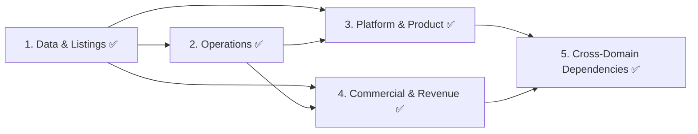

# Concept Design — Phase Tracker

**Status:** COMPLETE
**Started:** 2026-02-11
**Completed:** 2026-02-12
**Sequence rationale:** Data & Listings first (highest input confidence, unblocks data model for all domains) → Operations (highest reframing value, forces entity-frame application) → Platform & Product and Commercial in parallel (dependent on patterns established by first two)

---

## Sequencing & Dependencies

**Why this order:**
- Data & Listings owns the Listing/Account data model that every other domain references.
- Operations must be reframed from human runbook to entity decision architecture — doing this second establishes the pattern for how all processes are expressed.
- Platform & Product and Commercial share a downstream coupling (subscription UX lives in both) but have no dependency on each other. Parallel execution after the first two domains set the structural conventions.

---

## Domain Status

| # | Domain | Document | Status | Confidence | Key Inputs | Flagged Revisions |
|---|---|---|---|---|---|---|
| 1 | Data & Listings | `data-and-listings.md` | **DRAFT v6 — 5 ROUNDS STRESS TESTED (incl. 3 cross-domain)** | 0.97 | taxonomy-v1-proposal, data-model-proposal, data-quality-framework, trust-verification-findings, on-screen-talent-scope-findings, provider-buyer-duality-findings | All resolved ✅. Cross stress tests: Ops (20 scenarios), PP (20 scenarios), CR (2 D&L fixes: taxonomy comparison utilities, claim_approved win-back cancellation). |
| 2 | Operations | `operations.md` | **DRAFT v6 — 5 ROUNDS STRESS TESTED (incl. 3 cross-domain)** | 0.96 | ops-model, entity-architecture-frame, **data-and-listings.md** (v6) | Reframe complete. 95 scenarios total (35 intra + 20 D&L cross + 20 PP cross + 20 CR cross), 51 total fixes across 6 drafts. CR cross: Paddle webhook routing [CR-X-14], sole emitter confirmation [CR-X-2], churn_risk_detected consumption [CR-X-20], winback delivery result [CR-X-7], feature gate friction interface [CR-X-6]. |
| 3 | Platform & Product | `platform-and-product.md` | **DRAFT v5 — 4 ROUNDS STRESS TESTED (incl. 2 cross-domain)** | 0.95 | platform-architecture-decisions, onboarding-flow-findings, **data-and-listings.md** (v6), **operations.md** (v6) | 75 scenarios total (35 intra + 20 D&L×Ops cross + 20 CR cross), 56 fixes. CR cross: checkout CTA guard [CR-X-1], computeFeatureAccess import [CR-X-8], analytics query interface [CR-X-16], conversion email templates [CR-X-19], optimistic checkout update [CR-X-13]. |
| 4 | Commercial & Revenue | `commercial-and-revenue.md` | **DRAFT v4 — 3 ROUNDS STRESS TESTED (incl. cross-domain)** | 0.95 | competitor-pricing-findings, analogous-pricing-findings, freemium-conversion-findings, provider-buyer-duality-findings, **data-and-listings.md** (v6), **operations.md** (v6), **platform-and-product.md** (v5) | Cross stress tested with all three domains. 55 scenarios total (20 round 1 + 15 round 2 + 20 cross-domain), 55 fixes. 5 High (checkout before claim, duplicate emitter, duplicate computeFeatureAccess, double webhook processing, refund downgrade event). 10 Medium. 5 Low. |
| 5 | Cross-Domain | `cross-domain-dependencies.md` | **DRAFT v3 — STRESS TESTED + REQUIREMENTS AMENDMENTS** | 0.96 | All four domain documents | v2: 21 scenarios, 19 fixes. v3: 2 event schema amendments (`SubscriptionEndedEvent.origin`, `AccountClosedEvent.paddleCancellationsPending`), §10 interface questions resolved (see `3-requirements/decisions/interface-questions-trade-off-evaluation.md`). |

---

## Deliverable Checklist

### 1. Data & Listings ✅
- [x] Listing/Account data model (independent entities, converge on claim)
- [x] Multi-listing support (Account owns 0..N Listings)
- [x] Taxonomy revision (9 new categories under Talent Services)
- [x] Data quality framework as entity perception system
- [x] Trust/verification as entity decision architecture
- [x] Claim evaluation with atomic locking, competing claims, pre-claim snapshots
- [x] Listing integrity rules (duplicate detection, identity verification, CH uniqueness, batch import mode)
- [x] Enquiry handling for unclaimed listings
- [x] Voluntary listing archival process
- [x] GDPR erasure specification (field-level data map, dispute interaction, cross-domain orchestration)
- [x] Domain event schema (8 event types, consumer mapping)
- [x] Quality score explanation object for support agents
- [x] Search terms privacy (aggregated frequencies, not raw queries)
- [x] Deferred action scheduler (distinct from TaskSpec)
- [x] Layer 1 financial governance placeholder
- [x] 5-layer population: Principles (8) → Ways of Working (8) → Ceremonies (4) → Activities (7) → Assets (12)
- [x] Consumed events specification (listing_created, profile_edited, subscription_tier_changed, account_closed)
- [x] Retroactive anonymous enquiry linking on account creation
- [x] Consumer mapping updated for all Platform cross-domain events
- [x] Stress tested: 95 scenarios (35 intra + 20 D&L×Ops cross + 20 PP cross + 20 CR cross), 32 fixes across 6 drafts
- [x] Taxonomy comparison utilities as shared data contract [CR-X-12]
- [x] claim_approved consumer mapping: Commercial win-back schedule cancellation [CR-X-17]

### 2. Operations ✅
- [x] Reframe ops model from human runbook to entity decision trees
- [x] Verification throughput as autonomous process with escalation thresholds
- [x] Human procurement specifications (TaskSpec standard, procurement channels, quality gate, budget limits)
- [x] TaskSpec field mapping templates versioned against D&L schema
- [x] Task lifecycle management (timeout, dead-letter, re-routing, contractor reliability tracking)
- [x] Support/moderation as entity-operated with human procurement specs
- [x] Support triage decision tree (14 categories: +unreachable unclaimed listing, +decay/support dedup)
- [x] Support volume model for all user types (paid, free, unclaimed, public)
- [x] Knowledge base maintenance as entity perception
- [x] Active ticket registry for D&L decay/support coordination
- [x] Compliance cadence as entity-scheduled with principal escalation
- [x] Compliance self-audit (Article 14 reconciliation, DSAR deadline monitoring, DPA coverage)
- [x] Pre-launch Article 14 batch for 4rfv seeded data (with template ownership)
- [x] DSAR handling for non-Account holders with identity verification
- [x] Cross-domain DSAR data inventory
- [x] GDPR erasure orchestration protocol (extract-before-erasure sequencing)
- [x] Search history retention policy (resolves D&L open question #3)
- [x] Pre-launch 4rfv data import specification (5-phase)
- [x] Scaling triggers as entity self-assessment (including scale-down detection)
- [x] Dynamic auto-approval rate monitoring for capacity planning
- [x] Principal unavailability fallback chain
- [x] Principal Operations Briefing template (8 sections)
- [x] Billing reconciliation with anomaly detection, grace period, and `subscription_tier_changed` event
- [x] Cadence ownership boundary with Data & Listings (unified scheduler merge function)
- [x] API cost ledger for enrichment budget tracking
- [x] Platform health monitoring (infrastructure + functional health)
- [x] Entity learning framework (7 hypotheses, confound warning)
- [x] 5-layer population: Principles (9) → Ways of Working (8) → Ceremonies (5) → Activities (10) → Assets (15)
- [x] Compliance query interface for admin dashboard (DSAR status, compliance hold check)
- [x] Account closure event consumption (close tickets, compliance register, hold monitoring)
- [x] Billing reconciliation queryable status for admin dashboard
- [x] Billing reconciliation emits subscription_tier_changed for new subscription creation
- [x] Stress tested: 95 scenarios (35 intra + 20 D&L×Ops cross + 20 PP cross + 20 CR cross), 51 fixes across 6 drafts
- [x] Paddle webhook routing: Operations sole entry point [CR-X-14]
- [x] Operations confirmed sole emitter of subscription_tier_changed [CR-X-2]
- [x] churn_risk_detected consumption + churn_risk_registry [CR-X-20]
- [x] winback_delivery_result event emission [CR-X-7]
- [x] Feature gate friction query interface [CR-X-6]

### 3. Platform & Product ✅
- [x] Page inventory and information architecture (§1: 30+ pages, URL schema, navigation model)
- [x] Search UX specification (§2: query → results → profile, service layer, synonym expansion, zero-result handling)
- [x] Onboarding flows (§4: 3 paths with Mermaid flows against Listing/Account model, intelligent suggestions, profile strength meter)
- [x] Provider dashboard specification (§6: multi-listing switcher [ST-34], quality score transparency [X-13], feature access by tier)
- [x] Buyer experience specification (§7: shortlists, saved searches, cross-role nudges, no login wall)
- [x] Ranking algorithm as entity decision with transparency layer (§2.3: composite formula, paid boost constraints, cold-start mitigation)
- [x] Enquiry system (§5: claimed vs unclaimed handling [ST-22], three-tier routing, spam prevention, entity perception signals)
- [x] Admin dashboard minimum spec (§8: [OPS-ST-8] verification queue, audit trail, quality breakdown, decay log, archival reversal)
- [x] Domain event consumption and emission (§9: 8 consumed events, 7 emitted events, consumer mapping)
- [x] Authentication and authorisation (§13: tRPC middleware chain, route protection matrix)
- [x] Transactional email specification (§10: 18 templates)
- [x] Performance budgets (§12: page load and API response targets)
- [x] Platform as entity perception system (§11: signal map, decision feedback loops)
- [x] SEO specification: SSG/ISR strategy, JSON-LD structured data, meta tags, sitemap
- [x] Image processing pipeline (3 variants, WebP, R2 caching)
- [x] Dashboard notification system (typed, read/dismiss state)
- [x] Account closure flow (distinct from GDPR erasure)
- [x] Claim-path progressive disclosure variant
- [x] Listing reactivation UX (provider-side)
- [x] Pricing page specification stub (co-owned with Commercial)
- [x] Decay signal consumption (buyer-facing "may be outdated" indicator, with removal on score improvement)
- [x] Event-driven ISR revalidation for time-sensitive state changes (claim, suspend, archive, erasure)
- [x] Account closure cross-domain coordination (compliance hold, enquiry anonymisation, event emission)
- [x] Shortlist lifecycle management (archived/suspended indicators, erasure removal, buyer notification)
- [x] Admin claim queue hydrated with listing context, evidence summary, confidence score
- [x] Admin ranking debug for support agent visibility investigations
- [x] Admin DSAR tracker with full lifecycle (queries Operations compliance register)
- [x] Claim CTA generator (single source of truth for D&L and Ops email templates)
- [x] CreditFormat display label mapping, field display mapping for profile strength
- [x] Endowment CTA threshold (view count >= 5, category fallback)
- [x] Stress tested: 75 scenarios (20 round 1 + 15 round 2 + 20 D&L×Ops cross + 20 CR cross), 56 fixes across 5 drafts
- [x] 5-layer population: Principles (7) → Ways of Working (8) → Ceremonies (3) → Activities (9) → Assets (16)
- [x] Checkout CTA guard on unclaimed/pending_review listings [CR-X-1]
- [x] computeFeatureAccess imported from Commercial — mapFeatureAccessToUI for UI concerns [CR-X-8]
- [x] Optimistic subscription update after Paddle checkout [CR-X-13]
- [x] Analytics query interface: getListingAnalytics(listingId, period) [CR-X-16]
- [x] 4 conversion email templates (analytics teaser, social proof, view milestone, engagement summary) [CR-X-19]

### 4. Commercial & Revenue
- [x] Pricing architecture (£199/£399/£699 annual, monthly at premium, VAT treatment, launch discount)
- [x] Subscription lifecycle state machine (free → checkout pending → active → past due → cancelled → win-back) [CR-1: trial→checkout pending]
- [x] Cancellation and churn intervention as entity decision (one transparent prompt, then accept)
- [x] Win-back as entity decision (60-day window, engagement-data-driven, single email max, listing status guard) [CR-6]
- [x] Multi-listing subscription pricing (per-listing V1, entity learning for V2 bundle — ST-23, Paddle customer mapping) [CR-18]
- [x] Tier differentiation (feature matrix, free/paid boundary as hard constraint, `TIER_LIMITS` typed config, `computeFeatureAccess` spec) [CR-4]
- [x] Premium subscriber at low quality score (proactive intervention — ST-10)
- [x] Conversion optimisation as entity decision architecture (5 triggers, cold start mitigation, funnel monitoring, channel spec, email preference interaction) [CR-11, CR-12, CR-19]
- [x] Revenue perception system (MRR, churn, conversion, feature gate friction, health thresholds, totalPaid field) [CR-17]
- [x] Feature gate friction evaluation (OPS-ST-16 consumption, friction ratio analysis)
- [x] Domain event consumption (9 events from D&L/Ops/Platform, source clarification for analytics signals) and emission (3 event types) [CR-15, CR-20]
- [x] Commercial evolution path V1→V2→V3 with 7 data-driven transition criteria
- [x] Revenue projection model (4 scenarios, net margin after Paddle fees and operating costs, launch discount year 1 impact) [CR-7]
- [x] Tier downgrade handling (media/credits hidden not deleted, analytics retained, re-upgrade restores all) [CR-8]
- [x] Refund policy (14-day cooling-off, 30-day pro-rata, principal escalation beyond, launch discount refund) [CR-13]
- [x] Launch discount upgrade interaction (no discount carry, Paddle proration, year 2 full price) [CR-14]
- [x] Sponsored placement specification (3 slots, quality-ranked selection, daily rotation, ASA labelling) [CR-9]
- [x] Webhook processing safeguards (signature verification, idempotency, out-of-order handling) [CR-10]
- [x] External cancellation handling (account_closed, listing_archived → Paddle API cancel) [CR-5]
- [x] Subscription_ended terminal event via grace_period_expired handler [CR-2]
- [x] Monthly pricing rule documented (round up to clean number in 15–20% band) [CR-3]
- [x] Free tier analytics intent documented (all-time totals as intentional scarcity) [CR-16]
- [x] Paddle webhook → internal event mapping function (`mapPaddleWebhook`) with billing_cadence_changed event type [CR-21]
- [x] Grace period / refund conflict resolution (grace period cancelled on refund, guard in grace_period_expired handler) [CR-22]
- [x] Sponsored placement cache invalidation on tier downgrade [CR-23]
- [x] Win-back ownership verification (cancelledAccountId stored, schedule cancelled on ownership change) [CR-24]
- [x] Revenue projection model updated with monthlyBillingRatio parameter [CR-25]
- [x] taxonomyOverlap defined as Jaccard similarity on Service Area tags [CR-26]
- [x] Launch discount cohort separation in revenue perception (discounted vs full-price conversion rates, divergence detection) [CR-27]
- [x] Upgrade suggestion quality guard (quality < 40 → suggest improvement instead of upgrade) [CR-28]
- [x] Conversion trigger state reset on listing reclaim by new owner [CR-29]
- [x] dailyRotationOffset defined (hash-based, fairness monitoring) [CR-30]
- [x] enquiryResponseInsights typed definition (response time, rate vs category, peak times) [CR-31]
- [x] Downgrade notification includes credit excess count alongside media [CR-32]
- [x] basicAnalytics typed exhaustively (3 metrics: views, search appearances, enquiries — all-time) [CR-33]
- [x] Pricing change protocol (grandfathering, plan versioning, effectivePriceAtSubscription) [CR-34]
- [x] Win-back email ownership clarified (Commercial evaluates + provides content, Operations delivers) [CR-35]
- [x] 5-layer population: Principles (7) → Ways of Working (7) → Ceremonies (3) → Activities (14) → Assets (18)
- [x] Stress tested: 55 scenarios (20 round 1 + 15 round 2 + 20 cross-domain), 55 fixes
- [x] Cross-domain stress test: 20 scenarios against D&L v5, Operations v5, Platform & Product v4
- [x] Checkout CTA guard on unclaimed/pending_review listings [CR-X-1]
- [x] Operations confirmed as sole emitter of subscription_tier_changed — Commercial does not re-emit [CR-X-2]
- [x] Launch discount coupon restricted to new subscriptions only [CR-X-3]
- [x] Pending cancellation registry for entity-initiated Paddle cancellations [CR-X-4]
- [x] Low-quality intervention 14-day grace period [CR-X-5]
- [x] Feature gate friction query interface from Operations [CR-X-6]
- [x] Win-back delivery confirmation loop from Operations [CR-X-7]
- [x] computeFeatureAccess single ownership — Commercial canonical, Platform imports [CR-X-8]
- [x] Sponsored placement lifecycle status filter [CR-X-9]
- [x] Removed duplicate enquiryCount — reads D&L engagement counters [CR-X-10]
- [x] Revenue projection operating costs cross-referenced to Operations [CR-X-11]
- [x] Paddle webhooks routed through Operations — single entry point [CR-X-14]
- [x] applyDowngrade always emits subscription_tier_changed [CR-X-15]
- [x] Analytics query interface from Platform for time-series engagement data [CR-X-16]
- [x] Conversion email templates added to Platform (4 templates) [CR-X-19]
- [x] churn_risk_detected consumption added to Operations [CR-X-20]

### 5. Cross-Domain Dependencies ✅
- [x] Interface map: which domain owns which entity/process (§1: 17 data entities, 16 processes with ownership + collaborator + boundary)
- [x] Shared data contracts (§3: type definitions, deferred action scheduler, Paddle integration boundary with 8 touchpoints)
- [x] Entity perception signals: which domain generates, which consumes (§7: signal topology diagram, 7 cross-domain perception feeds, 12 ceremony cross-references)
- [x] Escalation topology: what escalates where (§4: domain-level + principal escalation, 12 trigger/target pairs, unavailability chain)
- [x] GDPR data map: cross-domain erasure responsibilities (§5: erasure orchestration protocol with 4 domains, data location by domain, account closure vs erasure comparison)
- [x] Event payload schemas: all 25 events typed (§2.3)
- [x] Stress tested: 21 scenarios (4 High, 10 Medium, 5 Low, 2 Pass), 19 fixes applied (v1→v2)

---

## Cross-Domain Issues Surfaced by Data & Listings Stress Tests

Issues identified during Data & Listings stress testing that belong to other domains:

| # | Issue | Owner Domain | Source | Status |
|---|---|---|---|---|
| ST-10 | Premium subscriber at low quality score — commercial tension with buyer perception | Commercial & Revenue | Stress test #10 | **Resolved** — commercial-and-revenue.md §4.4 (proactive quality improvement intervention, messaging strategy, churn risk logging) |
| ST-17 | Human procurement mechanism — how entity finds, engages, manages human resources | Operations | Stress test #17 | **Resolved** — operations.md §2 (TaskSpec standard, procurement channels, resource roster) |
| ST-22 | Enquiry UX for unclaimed listings — buyer experience when contacting unclaimed providers | Platform & Product | Stress test #22 | **Resolved** — platform-and-product.md §5.3 (three-tier handling, alternative provider suggestions) |
| ST-23 | Multi-listing subscription pricing — per-listing, bundle, or account-level? | Commercial & Revenue | Stress test #23 | **Resolved** — commercial-and-revenue.md §3 (per-listing at V1, entity learning for V2 bundle discount, no account-level subscription) |
| ST-34 | Multi-listing dashboard — listing switcher, overview, analytics aggregation | Platform & Product | Stress test #34 | **Resolved** — platform-and-product.md §6.2 (listing switcher, per-listing detail, aggregate deferred to V2) |

## Cross-Domain Issues Surfaced by Operations Stress Tests

| # | Issue | Owner Domain | Source | Status |
|---|---|---|---|---|
| OPS-ST-8 | Admin dashboard must include: listing status/audit trail, quality score breakdown, decay log, archival reversal | Platform & Product | Ops stress test #8 | **Resolved** — platform-and-product.md §8 (full admin spec: verification queue, audit trail, quality breakdown, decay log, archival reversal, DSAR tracker) |
| OPS-ST-16 | Feature gate friction signals — high-volume complaints about specific gates should feed Commercial | Commercial & Revenue | Ops stress test #16 | **Resolved** — commercial-and-revenue.md §6.3 (friction ratio evaluation: complaints:conversions >5:1 → principal review, <1:1 → gate working) |
| OPS-ST-34 | Billing reconciliation emits `subscription_ended` domain event — Commercial must consume for churn analysis and win-back; Platform must consume for feature access | Commercial & Revenue + Platform & Product | Ops stress test #34 | **Resolved** — Platform handler in platform-and-product.md §9.1 (`handleSubscriptionChange`). Commercial handler in commercial-and-revenue.md §7.1 (churn analysis, win-back scheduling, revenue metric update). |

## Cross-Domain Issues Resolved by D&L × Operations Cross Stress Test

| # | Issue | Resolution | Both Domains Updated |
|---|---|---|---|
| X-2 | Claim lock held during 24-hour manual review — race condition | D&L: lock released on routing, `pending_review` status blocks concurrent claims | D&L v4, Ops v4 |
| X-9 | GDPR erasure execution order — Ops must extract before D&L anonymises | Orchestration protocol: Ops extracts → D&L erases → event → audit | D&L v4, Ops v4 |
| X-12 | Voluntary listing removal — no D&L process existed | D&L: `archiveListing` function with reactivation | D&L v4 |
| X-6 | Parallel decay notification + support ticket — no deduplication | D&L emits annotated decay events; Ops suppresses duplicates via active ticket registry | D&L v4, Ops v4 |
| X-19 | Claim approval emitted no domain event — Ops couldn't track volume | D&L: 8-event domain event schema with consumer mapping | D&L v4, Ops v4 |
| X-18 | `subscription_ended` didn't reach D&L enrichment cadence | Ops: `subscription_tier_changed` event; D&L consumes for cadence recalculation | D&L v4, Ops v4 |
| X-7 | Unified scheduler merge unspecified | Ops: `mergeSchedules` function with per-check authority mapping | Ops v4 |

## Cross-Domain Issues Resolved by PP × D&L × Operations Cross Stress Test

| # | Issue | Resolution | Domains Updated |
|---|---|---|---|
| XP-1 | Account closure: enquiry records in provider inboxes contain departed buyer's personal data | PP `anonymiseSentEnquiriesInProviderInboxes()`: replaces sender identity with "Deleted user". `deleteBuyerFacet` does not modify Listing-side engagement data. | PP v4 |
| XP-2 | Account closure emits no domain event — Ops/D&L blind to closures | PP emits `account_closed` event. Ops consumes (close tickets, compliance register). D&L consumes (suspend enrichment). | PP v4, D&L v5, Ops v5 |
| XP-3 | `listing_reactivated` has no Operations consumer in D&L mapping | D&L consumer mapping updated: Ops resumes suppressed outreach, re-enables enrichment cadence. | D&L v5 |
| XP-5 / XP-11 | ISR-cached pages stale for 15 min on time-sensitive events (suspension, claim, erasure) | PP `revalidateListingProfile()` for urgent events. 5 events trigger immediate ISR revalidation. | PP v4 |
| XP-6 | Admin verification queue shows raw UUIDs, no listing context | `AdminClaimView` type hydrates claims with listing summary, TaskSpec, evidence. | PP v4 |
| XP-7 | "May be outdated" indicator has no removal mechanism | PP clears indicator on `quality_score_changed` when score improves. | PP v4 |
| XP-8 | Admin dashboard lacks ranking position debug for visibility complaints | `rankingDebug` on `AdminListingView`: 3 sample queries with full score breakdown. | PP v4 |
| XP-10 | Anonymous enquiry retroactive linking unspecified in D&L | D&L scans `PendingEnquiry[]` on account creation, links by matching email. | D&L v5 |
| XP-12 | Admin DSAR tracker shows only completed erasures | PP queries Operations `getDSARStatus()` for full lifecycle. Ops exposes read-only interface. | PP v4, Ops v5 |
| XP-13 | `verification_tier_changed` doesn't update search index facets | PP adds `updateSearchIndex()` to handler. | PP v4 |
| XP-14 | New subscription creation by billing reconciliation emits no event | Ops emits `subscription_tier_changed` with `previousTier: "free"` for new subs. | Ops v5 |
| XP-15 | Shortlisted listings become broken references on archive/suspend/erasure | PP shortlist lifecycle: archived/suspended indicators, erasure removal, buyer notification with alternatives. | PP v4 |
| XP-19 | D&L has no explicit handler for `listing_created` from PP | D&L consumed events table: compute initial quality score, emit `quality_score_changed`. | D&L v5 |
| XP-20 | Account closure deletes buyer data before Ops compliance extraction | PP checks `complianceHold` before deletion. If hold exists, data deferred. Extract created for 30-day window. | PP v4, Ops v5 |

## Cross-Domain Issues Resolved by CR × D&L × Ops × PP Cross Stress Test

| # | Issue | Resolution | Domains Updated |
|---|---|---|---|
| CR-X-1 | Paddle checkout before claim resolved — subscription on unclaimed listing | Guard in Commercial `handleSubscriptionEvent` (require `accountId != null`). Platform blocks checkout CTA on unclaimed/pending_review. | CR v4, PP v5 |
| CR-X-2 | `subscription_tier_changed` emitted by both Operations and Commercial | Operations confirmed as sole emitter. Commercial removed from emitted events. | CR v4, Ops v6 |
| CR-X-3 | Launch discount coupon applicable to existing subscriptions | Paddle coupon restriction: `applies_to: "new_subscriptions_only"`. | CR v4 |
| CR-X-4 | Entity-initiated cancellation returns as Paddle webhook — churn intervention fired | Pending cancellation registry. `inferCancellationReason` checks registry first. | CR v4 |
| CR-X-5 | Low-quality intervention fires on brand-new listings | 14-day grace period after `subscriptionStartDate`. | CR v4 |
| CR-X-6 | Feature gate friction signals — no integration path from Operations to Commercial | Operations exposes `getFeatureGateFrictionSummary` query interface. | CR v4, Ops v6 |
| CR-X-7 | Win-back email — no delivery confirmation loop | Operations emits `winback_delivery_result`. Commercial updates churn analysis log. | CR v4, Ops v6 |
| CR-X-8 | `computeFeatureAccess` defined in both Commercial and Platform | Commercial canonical owner. Platform imports via `mapFeatureAccessToUI`. | CR v4, PP v5 |
| CR-X-9 | Sponsored placement doesn't check listing lifecycle status | `lifecycle.status == "active"` filter added. | CR v4 |
| CR-X-10 | Duplicate enquiry counter in Commercial | Removed `listing.commercial.enquiryCount`. Commercial reads D&L engagement counters. | CR v4 |
| CR-X-11 | Revenue projection operating costs hard-coded | Cross-referenced to Operations cost components. | CR v4 |
| CR-X-12 | `computeTaxonomyOverlap` — D&L doesn't acknowledge cross-domain query | Taxonomy comparison utilities added as D&L Layer 5 shared data contract. | D&L v6 |
| CR-X-13 | Pricing page shows stale tier during checkout | Optimistic UI update after Paddle JS `checkout.closed`. | PP v5 |
| CR-X-14 | Paddle webhooks double-processed by Commercial and Operations | Operations is single entry point. Commercial's `mapPaddleWebhook` executes within Ops handler. | CR v4, Ops v6 |
| CR-X-15 | Refund `applyDowngrade` doesn't emit `subscription_tier_changed` | `applyDowngrade` always emits event regardless of call path. | CR v4 |
| CR-X-16 | Time-series analytics queries undefined | Platform exposes `getListingAnalytics(listingId, period)` query interface. | PP v5 |
| CR-X-17 | Win-back schedule not cancelled on listing re-claim | `claim_approved` handler cancels pending win-back. Consumer mapping updated. | CR v4, D&L v6 |
| CR-X-18 | `basicAnalytics` data source implicit | Explicit annotation: maps 1:1 to `listing.engagement.*` from D&L. | CR v4 |
| CR-X-19 | Conversion emails not in Platform template inventory | 4 conversion templates added to Platform §10.1. Commercial owns triggers. | CR v4, PP v5 |
| CR-X-20 | `churn_risk_detected` — Operations has no handler | Operations consumes event, maintains `churn_risk_registry`, elevates ticket priority. | CR v4, Ops v6 |

---

## Completion Log

| Date | Domain | Deliverable | Notes |
|---|---|---|---|
| 2026-02-11 | Data & Listings | Draft v1 | Listing/Account model, taxonomy (+9 categories), quality/verification as entity decisions, 5-layer framework |
| 2026-02-11 | Data & Listings | Draft v2 — round 1 stress test | 20 scenarios. Listing/Account separation, GDPR erasure, competing claims, manual review checklist, Layer 1 placeholder, score variants |
| 2026-02-11 | Data & Listings | Draft v3 — round 2 stress test | 15 scenarios. Integrity rules, atomic claims, pre-claim snapshots, enquiry handling, CH uniqueness, dispute+erasure interaction |
| 2026-02-11 | Operations | Draft v1 | Full reframe: entity decision architectures. Human procurement framework (ST-17). Verification throughput model. Support triage decision tree. Compliance calendar. Scaling self-assessment. Search history retention (OQ#3). 5-layer framework. |
| 2026-02-11 | Operations | Draft v2 — round 1 stress test | 20 scenarios. Task lifecycle/dead-letter, DSAR for non-Account holders, expanded support volume model, principal fallback chain, marketplace quality gate, budget aggregate tracking, KB maintenance, functional health monitoring, billing reconciliation, cadence ownership boundary, contractor DPA principle, compliance self-audit. |
| 2026-02-11 | Operations | Draft v3 — round 2 stress test | 15 scenarios. Billing reconciliation safeguards (API health, anomaly detection, grace period). Pre-launch Article 14 batch for 4rfv data. 4rfv data import specification. Principal briefing template. Legal threat + sensitive circumstances triage. Quality gate fallback. Scale-down thresholds. Business hours definition. Domain event emission for billing. |
| 2026-02-11 | D&L × Operations | Draft v4 — cross stress test | 20 cross-domain scenarios. 3 High (claim lock race, GDPR erasure ordering, voluntary archival), 11 Medium, 6 Low. Domain event contract (8 events). Erasure orchestration protocol. Unified scheduler merge. Active ticket registry. API cost ledger. Deferred action scheduler. Quality score explanation. Batch import integrity mode. |
| 2026-02-11 | Platform & Product | Draft v1 | 16 sections. Information architecture (30+ pages, URL schema). Search (service layer, ranking algorithm, synonym expansion, zero-results). 3 onboarding paths with Mermaid flows. Provider dashboard (multi-listing [ST-34], quality transparency [X-13], feature gating by tier). Buyer experience (shortlists, cross-role nudges). Enquiry system (3-tier unclaimed handling [ST-22]). Admin dashboard (OPS-ST-8). Domain events (8 consumed, 7 emitted). Auth middleware chain. 18 email templates. Performance budgets. Entity perception signal map. 5-layer framework. |
| 2026-02-11 | Platform & Product | Draft v2 — round 1 stress test | 20 scenarios, 17 fixes. 3 High: lifecycle status search filter (PP-1), pending_review enquiry handling (PP-3), contact visibility parity on claim (PP-5). 8 Medium: ranking clarification, slug collision, email unsubscribe, anonymous GDPR, dashboard lazy loading, claim integrity feedback, field validation, Paddle mapping, metric confusion, bulk admin ops. 6 Low: sort label, dual sponsorship, own listing badge, targeted claim CTA, anonymous perception, empty states. |
| 2026-02-11 | Platform & Product | Draft v3 — round 2 stress test | 15 scenarios, 14 fixes. 1 High: SEO/SSR/structured data (PP-21). 10 Medium: pricing page (PP-22), image pipeline (PP-23), notifications (PP-24), claim-path disclosure (PP-25), listing reactivation UX (PP-26), unreachable listing feedback (PP-28), account closure (PP-30), decay indicator (PP-32), subscription tier leak (PP-33), recently-added logic (PP-35). 4 Low: equipment autocomplete, tier ranking, enquiry status transitions, concurrent edit handling. |
| 2026-02-11 | PP × D&L × Operations | Draft v4/v5 — cross stress test | 20 cross-domain scenarios. 3 High (account closure enquiry data XP-1, ISR revalidation for suspended listings XP-11, account closure bypasses compliance extraction XP-20). 8 Medium (account_closed event, listing_reactivated consumers, admin claim queue, decay indicator removal, ranking debug, DSAR tracker, new subscription event, shortlist lifecycle). 9 Low (identifyMissingFields ownership, ISR on claim, claim CTA generator, retroactive linking, search index on tier change, CreditFormat labels, endowment threshold, billing status, listing_created consumption). All 3 domains updated: PP v3→v4 (20 fixes), D&L v4→v5 (3 fixes), Ops v4→v5 (5 fixes). |
| 2026-02-11 | Commercial & Revenue | Draft v1 | Pricing architecture (£199/£399/£699 annual, VAT ex-VAT, launch discount £99). Subscription lifecycle state machine with Paddle integration. Churn intervention + win-back as entity decisions. Multi-listing pricing (per-listing V1, entity learning for V2 bundle — ST-23). Tier differentiation matrix with free/paid boundary as hard constraint. Premium at low quality intervention (ST-10). Conversion optimisation: 5 triggers, cold start mitigation, funnel monitoring. Revenue perception system with health thresholds. Feature gate friction evaluation (OPS-ST-16). Domain events: 7 consumed, 3 emitted. V1→V2→V3 evolution with 7 data-driven transition criteria. Revenue projections (4 scenarios). 5-layer framework. Resolves: ST-10, ST-23, OPS-ST-16, OPS-ST-34 (Commercial handler). |
| 2026-02-11 | Commercial & Revenue | Draft v2 — round 1 stress test | 20 scenarios. 3 High: trial state undefined → checkout pending (CR-1), downgrade path unspecified → full spec with data preservation (CR-8), refund policy missing → 14-day/30-day/principal tiers (CR-13). 11 Medium: subscription_ended terminal event (CR-2), computeFeatureAccess typed spec + TIER_LIMITS (CR-4), external cancellation paths (CR-5), launch discount revenue impact (CR-7), sponsored placement spec (CR-9), webhook safeguards (CR-10), view_threshold milestone tracking (CR-11), competitor_upgraded anonymity threshold (CR-12), launch discount upgrade interaction (CR-14), analytics signal source clarification (CR-15), Paddle customer mapping (CR-18). 6 Low: monthly pricing rule (CR-3), win-back status guard (CR-6), free tier analytics intent (CR-16), totalPaid field (CR-17), conversion channel spec + email prefs (CR-19), enquiry_submitted handler clarification (CR-20). |
| 2026-02-11 | Commercial & Revenue | Draft v3 — round 2 stress test | 15 scenarios. 3 High: Paddle webhook mapping function missing (CR-21), grace period/refund conflict (CR-22), sponsored placement cache on downgrade (CR-23). 9 Medium: win-back ownership check (CR-24), revenue projections assume 100% annual (CR-25), taxonomyOverlap undefined (CR-26), launch discount cohort conflation (CR-27), upgrade suggestion contradicts low-quality intervention (CR-28), conversion trigger state on reclaim (CR-29), dailyRotationOffset undefined (CR-30), enquiryResponseInsights undefined (CR-31), downgrade notification omits credits (CR-32). 3 Low: basicAnalytics type unspecified (CR-33), no pricing change protocol (CR-34), win-back email ownership split (CR-35). |
| 2026-02-11 | CR × D&L × Ops × PP | Draft v4/v5/v6 — cross stress test | 20 cross-domain scenarios targeting interfaces between Commercial v3 and D&L v5, Operations v5, Platform & Product v4. 5 High (checkout before claim CR-X-1, duplicate subscription_tier_changed emitter CR-X-2, duplicate computeFeatureAccess CR-X-8, Paddle webhook double processing CR-X-14, refund downgrade missing event CR-X-15). 10 Medium (coupon restriction, cancellation attribution, grace period, friction interface, win-back confirmation, sponsored lifecycle, analytics query, conversion emails, churn risk). 5 Low (cost cross-ref, taxonomy utilities, optimistic checkout, win-back cleanup, analytics annotation). All 4 domains updated: CR v3→v4 (20 fixes), D&L v5→v6 (2 fixes), Ops v5→v6 (5 fixes), PP v4→v5 (5 fixes). |
| 2026-02-11 | Cross-Domain Dependencies | Draft v1 — synthesis | 10 sections. Entity ownership map (15 data entities, 14 processes). Complete event topology (25 events, full consumer matrix, 4 single-emitter rules, 5 query interfaces). Shared data contracts (7 type definitions, deferred action scheduler, Paddle integration boundary with 7 touchpoints). Escalation topology (10 trigger/target pairs, principal unavailability chain). GDPR data map (erasure orchestration protocol, data location, closure vs erasure comparison). 3 cross-domain lifecycle sequence diagrams (new subscription, claim→churn→winback, account closure with compliance hold). Entity perception signal map (4 signal sources → 7 entity decisions). 12 ceremony cross-references. Implementation dependency graph (6 ordering constraints). 4 scoped open questions deferred to requirements. |
| 2026-02-12 | Cross-Domain Dependencies | Draft v2 — stress test | 21 scenarios, 19 fixes. 4 High: SubscriptionTier triple-ownership decomposed into 4 single-owner concerns (CD-7), Paddle cancellation authority resolved — Platform has direct API for closure path only (CD-10), event payload schemas added for all 25 events (CD-13), `subscription_ended` multi-emitter violation — D&L and Platform both emit for archival/closure paths, Operations is primary for Paddle-originated (CD-21). 10 Medium: email template ownership split (CD-1), listing_suspended consumer corrected (CD-3), domain-internal events note (CD-4), search/profile consumer matrix corrected (CD-6), billing reconciliation query interface added (CD-8), email pipeline implementation dependency (CD-9), sponsored placement process added (CD-12), DeferredAction ownership clarified (CD-14), OPS→CONV perception edge added (CD-16), Commercial added to GDPR erasure protocol (CD-18). 5 Low: refund escalation (CD-5), Ops Health Review MRR input (CD-11), PendingEnquiry entity (CD-15), shared infrastructure as first implementation constraint (CD-19). |

---

## Deferred (Not In Scope for Concept Design)

| Item | Reason | When |
|---|---|---|
| Layer 1 specification (governance kernel) | Requires principal input, not agent design. Placeholder constraint in data-and-listings.md. | Pre-launch governance definition |
| Layer 2 specification (cognitive substrate) | Premature without running system — emerges from concrete decision architectures | Iterative through V1 operation |
| Wireframes / visual design | Concept design produces structural specs; visual design is a downstream phase | Requirements → Implementation |
| Account-Account relationships (partnerships, team members) | V2 feature. Works with separate Accounts at V1. | V2 design phase |
| Cross-role reputation scoring specifics | Requires usage data to calibrate | Post-V1 launch |
