# CALLSHEET — System Architecture (Mermaid Diagrams)

**Source:** `SYSTEM-ARCHITECTURE-ASCII.md`
**Format:** Mermaid diagrams (renderable in GitHub, VS Code, Obsidian, etc.)
**Last synced:** 2026-03-06

---

## 1. Macro Topology & Cross-Domain Dependencies

The entity operates across four distinct domains. Coordination happens via the Event Bus (25 typed events) and 6 explicit query interfaces. Infrastructure services are shared across all domains.

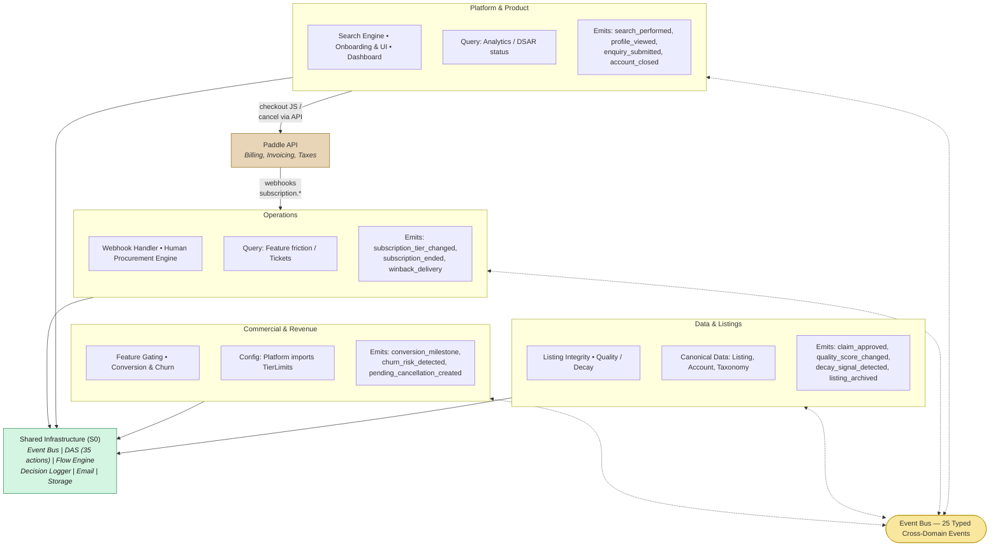
```mermaid
graph TB
    classDef external fill:#e8d5b7,stroke:#8b6914,color:#333
    classDef domain fill:#d4e6f1,stroke:#2471a3,color:#1a1a1a
    classDef bus fill:#f9e79f,stroke:#b7950b,color:#333
    classDef infra fill:#d5f5e3,stroke:#1e8449,color:#1a1a1a

    PADDLE["Paddle API<br/><i>Billing, Invoicing, Taxes</i>"]:::external

    subgraph PP ["Platform & Product"]
        direction TB
        PP_TOP["Search Engine &bull; Onboarding & UI &bull; Dashboard"]
        PP_Q["Query: Analytics / DSAR status"]
        PP_E["Emits: search_performed, profile_viewed,<br/>enquiry_submitted, account_closed"]
    end
    class PP domain

    subgraph OPS ["Operations"]
        direction TB
        OPS_TOP["Webhook Handler &bull; Human Procurement Engine"]
        OPS_Q["Query: Feature friction / Tickets"]
        OPS_E["Emits: subscription_tier_changed,<br/>subscription_ended, winback_delivery"]
    end
    class OPS domain

    subgraph DL ["Data & Listings"]
        direction TB
        DL_TOP["Listing Integrity &bull; Quality / Decay"]
        DL_Q["Canonical Data: Listing, Account, Taxonomy"]
        DL_E["Emits: claim_approved, quality_score_changed,<br/>decay_signal_detected, listing_archived"]
    end
    class DL domain

    subgraph CR ["Commercial & Revenue"]
        direction TB
        CR_TOP["Feature Gating &bull; Conversion & Churn"]
        CR_Q["Config: Platform imports TierLimits"]
        CR_E["Emits: conversion_milestone,<br/>churn_risk_detected, pending_cancellation_created"]
    end
    class CR domain

    EB(["Event Bus &mdash; 25 Typed Cross-Domain Events"]):::bus
    INFRA["Shared Infrastructure (S0)<br/><i>Event Bus | DAS (35 actions) | Flow Engine<br/>Decision Logger | Email | Storage</i>"]:::infra

    PP -- "checkout JS /<br/>cancel via API" --> PADDLE
    PADDLE -- "webhooks<br/>subscription.*" --> OPS

    PP <-..-> EB
    OPS <-..-> EB
    DL <-..-> EB
    CR <-..-> EB

    PP ~~~ DL
    OPS ~~~ CR

    DL & CR & PP & OPS --> INFRA
```

---

## 2. Data & Listings: Entity Relationship Model

`Account` (user) and `Listing` (directory record) are independent entities that converge on claim. An Account can manage many Listings (0..N). A Listing has 0..1 Account.

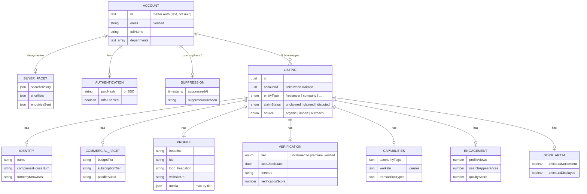
```mermaid
erDiagram
    ACCOUNT {
        text id "Better Auth (text, not uuid)"
        string email "verified"
        string fullName
        text_array departments
    }

    ACCOUNT ||--o| BUYER_FACET : "always active"
    BUYER_FACET {
        json searchHistory
        json shortlists
        json enquiriesSent
    }

    ACCOUNT ||--o| AUTHENTICATION : has
    AUTHENTICATION {
        string pwdHash "or SSO"
        boolean mfaEnabled
    }

    ACCOUNT ||--o| SUPPRESSION : "comms phase 1"
    SUPPRESSION {
        timestamp suppressedAt
        string suppressionReason
    }

    ACCOUNT ||--o{ LISTING : "0..N manages"

    LISTING {
        uuid id
        uuid accountId "links when claimed"
        enum entityType "freelancer | company | ..."
        enum claimStatus "unclaimed | claimed | disputed"
        enum source "organic | import | outreach"
    }

    LISTING ||--o| IDENTITY : has
    IDENTITY {
        string name
        string companiesHouseNum
        string formerlyKnownAs
    }

    LISTING ||--o| COMMERCIAL_FACET : has
    COMMERCIAL_FACET {
        string budgetTier
        string subscriptionTier
        string paddleSubId
    }

    LISTING ||--o| PROFILE : has
    PROFILE {
        string headline
        string bio
        string logo_headshot
        string websiteUrl
        json media "max by tier"
    }

    LISTING ||--o| VERIFICATION : has
    VERIFICATION {
        enum tier "unclaimed to premium_verified"
        date lastCheckDate
        string method
        number verificationScore
    }

    LISTING ||--o| CAPABILITIES : has
    CAPABILITIES {
        json taxonomyTags
        json worksIn "genres"
        json transactionTypes
    }

    LISTING ||--o| ENGAGEMENT : has
    ENGAGEMENT {
        number profileViews
        number searchAppearances
        number qualityScore
    }

    LISTING ||--o| GDPR_ART14 : has
    GDPR_ART14 {
        boolean article14NoticeSent
        boolean article14Displayed
    }
```

---

## 3. Operations: Task Specification & Procurement Engine

When the entity encounters a boundary requiring subjective judgment, it procures a human via a scoped `TaskSpec`.

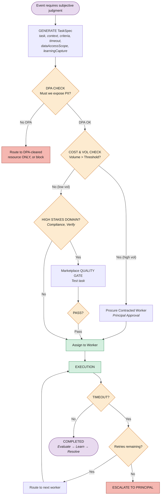
```mermaid
flowchart TD
    classDef startEnd fill:#e8daef,stroke:#6c3483,color:#1a1a1a
    classDef decision fill:#fdebd0,stroke:#ca6f1e,color:#1a1a1a
    classDef escalate fill:#f5b7b1,stroke:#922b21,color:#1a1a1a
    classDef action fill:#d4efdf,stroke:#1e8449,color:#1a1a1a

    A(["Event requires subjective judgment"]):::startEnd
    B["GENERATE TaskSpec<br/><i>task, context, criteria, timeout,<br/>dataAccessScope, learningCapture</i>"]

    C{"DPA CHECK<br/>Must we expose PII?"}:::decision
    D["Route to DPA-cleared<br/>resource ONLY, or block"]:::escalate

    E{"COST & VOL CHECK<br/>Volume > Threshold?"}:::decision
    F["Procure Contracted Worker<br/><i>Principal Approval</i>"]

    G{"HIGH STAKES DOMAIN?<br/><i>Compliance, Verify</i>"}:::decision
    H["Marketplace QUALITY GATE<br/><i>Test task</i>"]
    I{"PASS?"}:::decision
    J["Assign to Worker"]:::action

    K["EXECUTION"]:::action
    L{"TIMEOUT?"}:::decision
    M{"Retries remaining?"}:::decision
    N["Route to next worker"]
    O["ESCALATE TO PRINCIPAL"]:::escalate
    P(["COMPLETED<br/><i>Evaluate &rarr; Learn &rarr; Resolve</i>"]):::startEnd

    A --> B --> C
    C -- "No DPA" --> D
    C -- "DPA OK" --> E
    E -- "Yes (high vol)" --> F --> J
    E -- "No (low vol)" --> G
    G -- "Yes" --> H --> I
    I -- "Pass" --> J
    G -- "No" --> J
    J --> K --> L
    L -- "No" --> P
    L -- "Yes" --> M
    M -- "Yes" --> N --> K
    M -- "No" --> O
```

---

## 4. Commercial: Subscription Lifecycle & Paddle Webhook Routing

Paddle is the source of truth for billing. Operations receives webhooks, ensures idempotency and signature verification, then maps them into domain events.

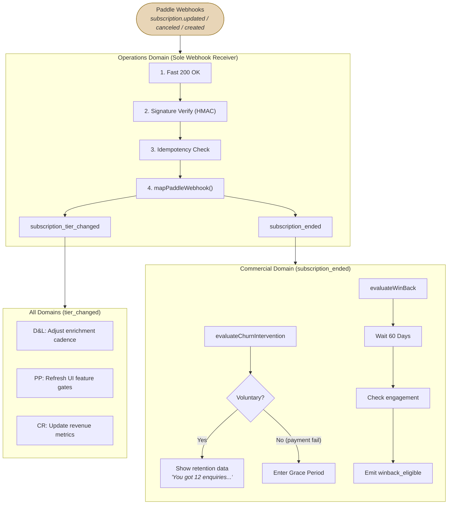
```mermaid
flowchart TD
    classDef external fill:#e8d5b7,stroke:#8b6914,color:#333
    classDef ops fill:#d6eaf8,stroke:#2e86c1,color:#1a1a1a
    classDef commercial fill:#fce4ec,stroke:#c0392b,color:#1a1a1a

    PADDLE(["Paddle Webhooks<br/><i>subscription.updated / canceled / created</i>"]):::external

    subgraph OPS ["Operations Domain (Sole Webhook Receiver)"]
        direction TB
        O1["1. Fast 200 OK"] --> O2["2. Signature Verify (HMAC)"] --> O3["3. Idempotency Check"] --> O4["4. mapPaddleWebhook()"]
        O4 --> STC["subscription_tier_changed"]
        O4 --> SE["subscription_ended"]
    end

    subgraph CONSUMERS ["All Domains (tier_changed)"]
        direction LR
        C1["D&L: Adjust enrichment cadence"]
        C2["PP: Refresh UI feature gates"]
        C3["CR: Update revenue metrics"]
    end

    subgraph COMMERCIAL ["Commercial Domain (subscription_ended)"]
        direction TB
        ECI["evaluateChurnIntervention"]
        VOL{"Voluntary?"}
        SHOW["Show retention data<br/><i>'You got 12 enquiries...'</i>"]
        GRACE["Enter Grace Period"]

        ECI --> VOL
        VOL -- "Yes" --> SHOW
        VOL -- "No (payment fail)" --> GRACE

        EWB["evaluateWinBack"] --> WAIT["Wait 60 Days"] --> CHECK["Check engagement"] --> EMIT["Emit winback_eligible"]
    end

    PADDLE --> OPS
    STC --> CONSUMERS
    SE --> COMMERCIAL
```

---

## 5. Platform: Search & Ranking Equation

PostgreSQL full-text search with synonym expansion, trigram fallback, and a multiplicative ranking formula where quality amplifies relevance.

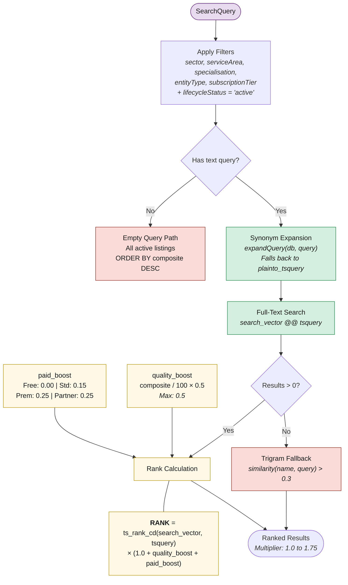
```mermaid
flowchart TD
    classDef input fill:#e8daef,stroke:#6c3483,color:#1a1a1a
    classDef process fill:#d4efdf,stroke:#1e8449,color:#1a1a1a
    classDef formula fill:#fef9e7,stroke:#b7950b,color:#1a1a1a
    classDef fallback fill:#fadbd8,stroke:#922b21,color:#1a1a1a

    Q(["SearchQuery"]):::input
    FILTERS["Apply Filters<br/><i>sector, serviceArea, specialisation,<br/>entityType, subscriptionTier<br/>+ lifecycleStatus = 'active'</i>"]

    EMPTY_Q{"Has text query?"}

    EMPTY["Empty Query Path<br/>All active listings<br/>ORDER BY composite DESC"]:::fallback

    SYN["Synonym Expansion<br/><i>expandQuery(db, query)<br/>Falls back to plainto_tsquery</i>"]:::process

    FTS["Full-Text Search<br/><i>search_vector @@ tsquery</i>"]:::process

    HAS_RESULTS{"Results > 0?"}

    RANK["Rank Calculation"]:::formula
    FORMULA["<b>RANK</b> = ts_rank_cd(search_vector, tsquery)<br/>&times; (1.0 + quality_boost + paid_boost)"]:::formula

    QB["quality_boost<br/>composite / 100 &times; 0.5<br/><i>Max: 0.5</i>"]:::formula
    PB["paid_boost<br/>Free: 0.00 | Std: 0.15<br/>Prem: 0.25 | Partner: 0.25"]:::formula

    TRI["Trigram Fallback<br/><i>similarity(name, query) > 0.3</i>"]:::fallback

    RESULT(["Ranked Results<br/><i>Multiplier: 1.0 to 1.75</i>"])

    Q --> FILTERS --> EMPTY_Q
    EMPTY_Q -- "No" --> EMPTY
    EMPTY_Q -- "Yes" --> SYN --> FTS --> HAS_RESULTS
    HAS_RESULTS -- "Yes" --> RANK
    HAS_RESULTS -- "No" --> TRI --> RESULT
    QB & PB --> RANK
    RANK --- FORMULA
    RANK --> RESULT
```

> **Example:** Listing A (ts_rank=0.30, quality=85, free) = 0.428 beats Listing B (ts_rank=0.30, quality=30, premium) = 0.420. High-quality free listing beats low-quality premium.

---

## 6. GDPR Erasure Orchestration Protocol

The most complex cross-domain transaction. Implemented as an Orchestrated Flow with step-level retry, skip, and auto-escalation after 3 consecutive failures.

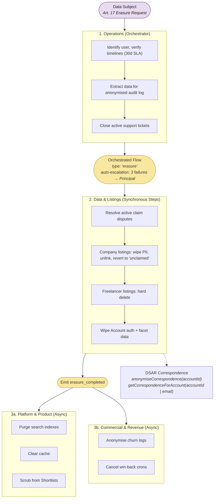
```mermaid
flowchart TD
    classDef startEnd fill:#e8daef,stroke:#6c3483,color:#1a1a1a
    classDef ops fill:#d6eaf8,stroke:#2e86c1,color:#1a1a1a
    classDef dl fill:#d4efdf,stroke:#1e8449,color:#1a1a1a
    classDef bus fill:#f9e79f,stroke:#b7950b,color:#333
    classDef async fill:#fadbd8,stroke:#922b21,color:#1a1a1a

    DS(["Data Subject<br/><i>Art. 17 Erasure Request</i>"]):::startEnd

    subgraph OPS ["1. Operations (Orchestrator)"]
        direction TB
        O1["Identify user, verify timelines (30d SLA)"]
        O2["Extract data for anonymised audit log"]
        O3["Close active support tickets"]
        O1 --> O2 --> O3
    end
    class OPS ops

    FLOW(["Orchestrated Flow<br/><i>type: 'erasure'<br/>auto-escalation: 3 failures &rarr; Principal</i>"]):::bus

    subgraph DL_STEPS ["2. Data & Listings (Synchronous Steps)"]
        direction TB
        D4["Resolve active claim disputes"]
        D5["Company listings: wipe PII, unlink, revert to 'unclaimed'"]
        D6["Freelancer listings: hard delete"]
        D7["Wipe Account auth + facet data"]
        D4 --> D5 --> D6 --> D7
    end
    class DL_STEPS dl

    EVT(["Emit erasure_completed"]):::bus

    subgraph PP_STEPS ["3a. Platform & Product (Async)"]
        P8["Purge search indexes"]
        P9["Clear cache"]
        P10["Scrub from Shortlists"]
    end
    class PP_STEPS async

    subgraph CR_STEPS ["3b. Commercial & Revenue (Async)"]
        C11["Anonymise churn logs"]
        C12["Cancel win-back crons"]
    end
    class CR_STEPS async

    DSAR["DSAR Correspondence<br/><i>anonymiseCorrespondence(accountId)<br/>getCorrespondenceForAccount(accountId | email)</i>"]

    DS --> OPS --> FLOW --> DL_STEPS --> EVT
    EVT --> PP_STEPS
    EVT --> CR_STEPS
    DL_STEPS -.-> DSAR
```

---

## 7. Domain Event Consumer Matrix

25 typed cross-domain events across 4 emitter domains. The matrix below shows which consumer domains subscribe to each event.

### 7a. Data & Listings Events (9 events)

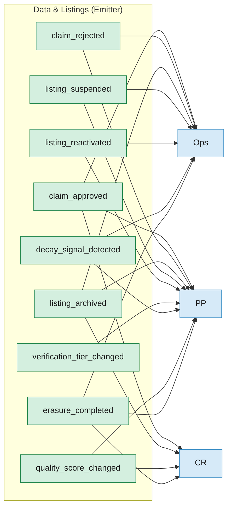
```mermaid
flowchart LR
    classDef dl fill:#d4efdf,stroke:#1e8449,color:#1a1a1a
    classDef consumer fill:#d6eaf8,stroke:#2e86c1,color:#1a1a1a

    subgraph DL ["Data & Listings (Emitter)"]
        CA["claim_approved"]:::dl
        CRJ["claim_rejected"]:::dl
        LA["listing_archived"]:::dl
        LS["listing_suspended"]:::dl
        LR["listing_reactivated"]:::dl
        VTC["verification_tier_changed"]:::dl
        DSD["decay_signal_detected"]:::dl
        QSC["quality_score_changed"]:::dl
        EC["erasure_completed"]:::dl
    end

    OPS_C["Ops"]:::consumer
    PP_C["PP"]:::consumer
    CR_C["CR"]:::consumer

    CA & CRJ & LA & LS & LR --> OPS_C
    CA & CRJ & LA & LS & LR & VTC & DSD & QSC & EC --> PP_C
    CA & LA & QSC & EC --> CR_C
    DSD & EC --> OPS_C
```

### 7b. Operations Events (3 events)

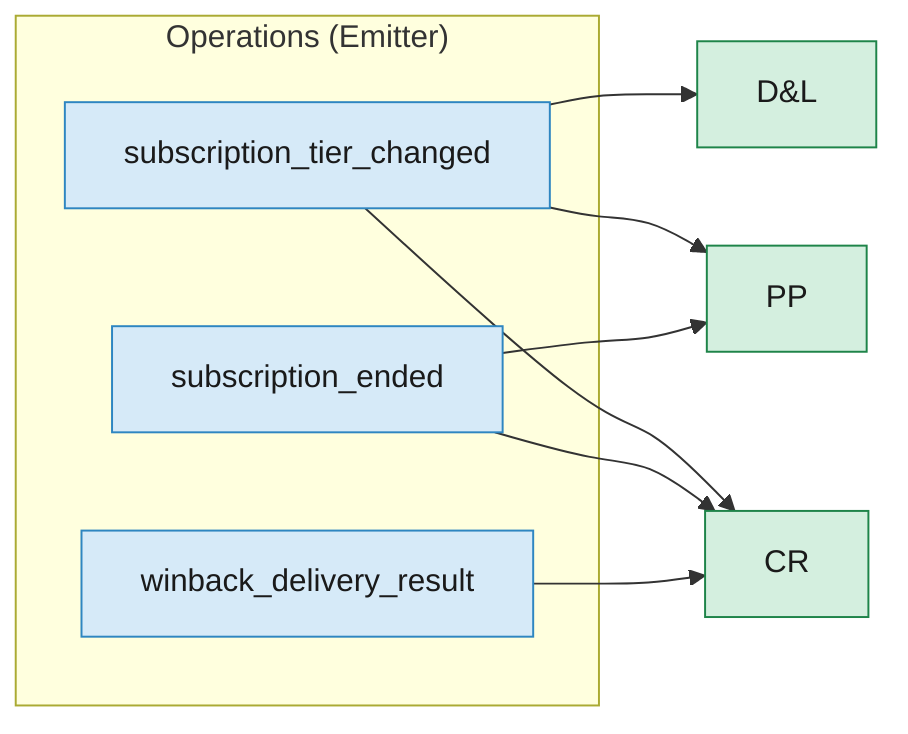
```mermaid
flowchart LR
    classDef ops fill:#d6eaf8,stroke:#2e86c1,color:#1a1a1a
    classDef consumer fill:#d4efdf,stroke:#1e8449,color:#1a1a1a

    subgraph OPS ["Operations (Emitter)"]
        STC["subscription_tier_changed"]:::ops
        SE["subscription_ended"]:::ops
        WDR["winback_delivery_result"]:::ops
    end

    DL_C["D&L"]:::consumer
    PP_C["PP"]:::consumer
    CR_C["CR"]:::consumer

    STC --> DL_C & PP_C & CR_C
    SE --> PP_C & CR_C
    WDR --> CR_C
```

### 7c. Platform & Product Events (9 events)

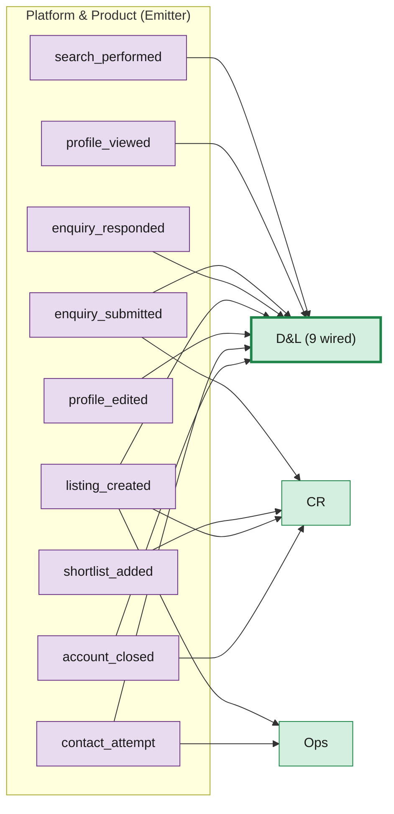
```mermaid
flowchart LR
    classDef pp fill:#e8daef,stroke:#6c3483,color:#1a1a1a
    classDef consumer fill:#d4efdf,stroke:#1e8449,color:#1a1a1a
    classDef wired fill:#d4efdf,stroke:#1e8449,stroke-width:3px,color:#1a1a1a

    subgraph PP ["Platform & Product (Emitter)"]
        SP["search_performed"]:::pp
        PV["profile_viewed"]:::pp
        ES["enquiry_submitted"]:::pp
        ER["enquiry_responded"]:::pp
        SA["shortlist_added"]:::pp
        LC["listing_created"]:::pp
        PE["profile_edited"]:::pp
        CAT["contact_attempt"]:::pp
        AC["account_closed"]:::pp
    end

    DL_C["D&L (9 wired)"]:::wired
    OPS_C["Ops"]:::consumer
    CR_C["CR"]:::consumer

    SP & PV & ES & ER & LC & PE & CAT & AC --> DL_C
    LC & CAT --> OPS_C
    ES & SA & LC & AC --> CR_C
```

### 7d. Commercial & Revenue Events (4 events)

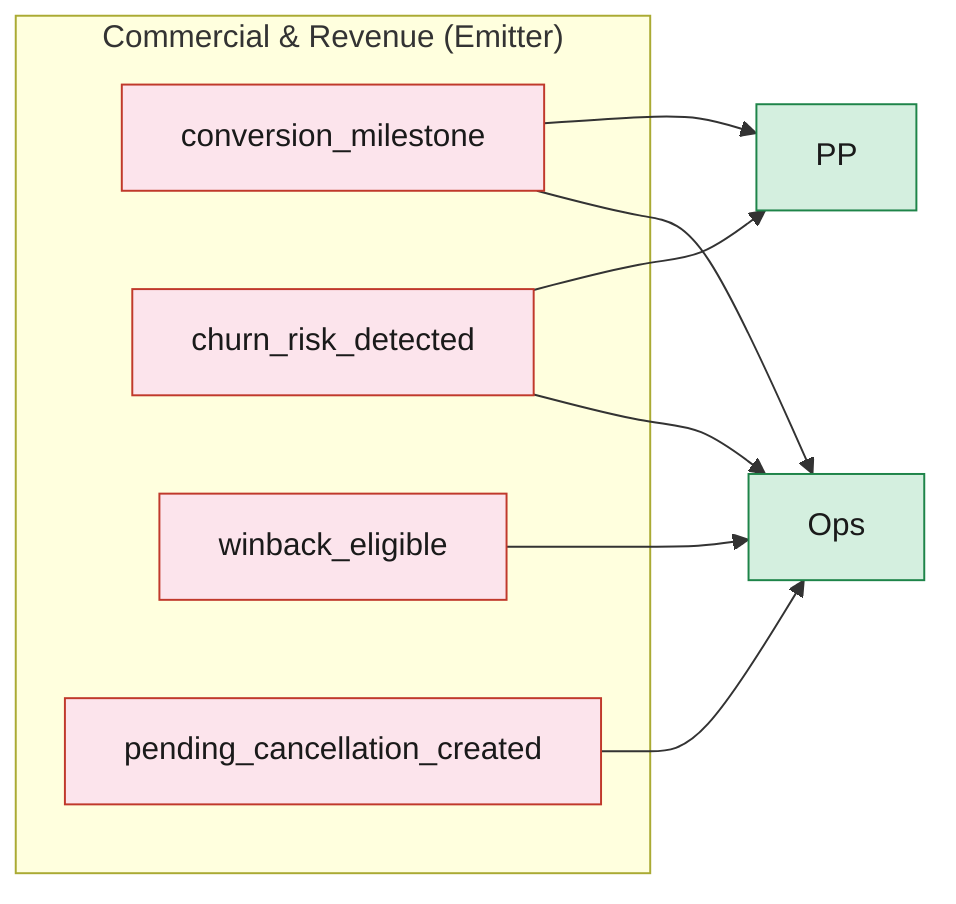
```mermaid
flowchart LR
    classDef cr fill:#fce4ec,stroke:#c0392b,color:#1a1a1a
    classDef consumer fill:#d4efdf,stroke:#1e8449,color:#1a1a1a

    subgraph CR ["Commercial & Revenue (Emitter)"]
        CM["conversion_milestone"]:::cr
        CRD["churn_risk_detected"]:::cr
        WE["winback_eligible"]:::cr
        PCC["pending_cancellation_created"]:::cr
    end

    OPS_C["Ops"]:::consumer
    PP_C["PP"]:::consumer

    CM & CRD --> OPS_C & PP_C
    WE & PCC --> OPS_C
```

---

## 8. Trust & Verification Tier Escalation

Verification is an entity decision driven by automated checks, API interactions, and asynchronous human procurement.

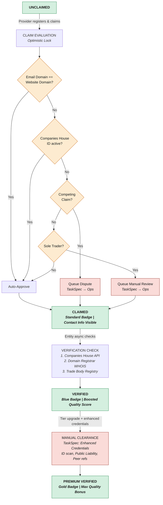
```mermaid
flowchart TD
    classDef tier fill:#d4efdf,stroke:#1e8449,color:#1a1a1a,font-weight:bold
    classDef decision fill:#fdebd0,stroke:#ca6f1e,color:#1a1a1a
    classDef route fill:#fadbd8,stroke:#922b21,color:#1a1a1a

    U["UNCLAIMED"]:::tier

    CE["CLAIM EVALUATION<br/><i>Optimistic Lock</i>"]

    R1{"Email Domain ==<br/>Website Domain?"}:::decision
    R2{"Companies House<br/>ID active?"}:::decision
    R3{"Competing<br/>Claim?"}:::decision
    R4{"Sole Trader?"}:::decision

    AUTO["Auto-Approve"]
    DISPUTE["Queue Dispute<br/><i>TaskSpec &rarr; Ops</i>"]:::route
    MANUAL["Queue Manual Review<br/><i>TaskSpec &rarr; Ops</i>"]:::route

    CLAIMED["CLAIMED<br/><i>Standard Badge | Contact Info Visible</i>"]:::tier

    VC["VERIFICATION CHECK<br/><i>1. Companies House API<br/>2. Domain Registrar WHOIS<br/>3. Trade Body Registry</i>"]

    VERIFIED["VERIFIED<br/><i>Blue Badge | Boosted Quality Score</i>"]:::tier

    MC["MANUAL CLEARANCE<br/><i>TaskSpec: Enhanced Credentials<br/>ID scan, Public Liability, Peer refs</i>"]:::route

    PV["PREMIUM VERIFIED<br/><i>Gold Badge | Max Quality Bonus</i>"]:::tier

    U -- "Provider registers & claims" --> CE
    CE --> R1
    R1 -- "Yes" --> AUTO
    R1 -- "No" --> R2
    R2 -- "Yes" --> AUTO
    R2 -- "No" --> R3
    R3 -- "Yes" --> DISPUTE
    R3 -- "No" --> R4
    R4 -- "Yes" --> MANUAL
    R4 -- "No" --> AUTO
    AUTO --> CLAIMED
    DISPUTE --> CLAIMED
    MANUAL --> CLAIMED
    CLAIMED -- "Entity async checks" --> VC --> VERIFIED
    VERIFIED -- "Tier upgrade + enhanced credentials" --> MC --> PV
```

---

## 9. Data Quality & Decay Loop

Data quality decays. The entity perceives data rot as a score drop and orchestrates self-healing.

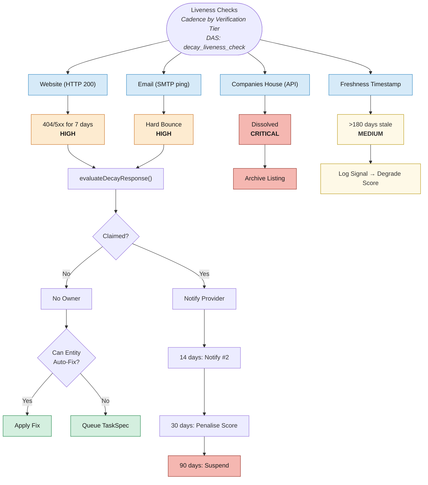
```mermaid
flowchart TD
    classDef check fill:#d6eaf8,stroke:#2e86c1,color:#1a1a1a
    classDef critical fill:#f5b7b1,stroke:#922b21,color:#1a1a1a
    classDef high fill:#fdebd0,stroke:#ca6f1e,color:#1a1a1a
    classDef medium fill:#fef9e7,stroke:#b7950b,color:#333
    classDef action fill:#d4efdf,stroke:#1e8449,color:#1a1a1a

    LC(["Liveness Checks<br/><i>Cadence by Verification Tier<br/>DAS: decay_liveness_check</i>"])

    WEB["Website (HTTP 200)"]:::check
    EMAIL["Email (SMTP ping)"]:::check
    CH["Companies House (API)"]:::check
    FRESH["Freshness Timestamp"]:::check

    W404["404/5xx for 7 days<br/><b>HIGH</b>"]:::high
    BOUNCE["Hard Bounce<br/><b>HIGH</b>"]:::high
    DISSOLVED["Dissolved<br/><b>CRITICAL</b>"]:::critical
    STALE[">180 days stale<br/><b>MEDIUM</b>"]:::medium

    EVAL["evaluateDecayResponse()"]

    ARCHIVE["Archive Listing"]:::critical
    CLAIMED_Q{"Claimed?"}
    DEGRADE["Log Signal &rarr; Degrade Score"]:::medium

    NO_OWNER["No Owner"]
    YES_OWNER["Notify Provider"]

    AUTOFIX{"Can Entity<br/>Auto-Fix?"}
    APPLY["Apply Fix"]:::action
    TASK["Queue TaskSpec"]:::action

    N14["14 days: Notify #2"]
    N30["30 days: Penalise Score"]
    N90["90 days: Suspend"]:::critical

    LC --> WEB & EMAIL & CH & FRESH
    WEB --> W404
    EMAIL --> BOUNCE
    CH --> DISSOLVED
    FRESH --> STALE

    W404 & BOUNCE --> EVAL
    DISSOLVED --> ARCHIVE
    STALE --> DEGRADE

    EVAL --> CLAIMED_Q
    CLAIMED_Q -- "No" --> NO_OWNER --> AUTOFIX
    CLAIMED_Q -- "Yes" --> YES_OWNER --> N14 --> N30 --> N90
    AUTOFIX -- "Yes" --> APPLY
    AUTOFIX -- "No" --> TASK
```

---

## 10. Shared Infrastructure: Deferred Action Scheduler

The DAS merges operations from all 4 domains into a single timeline execution engine. 35 action types registered.

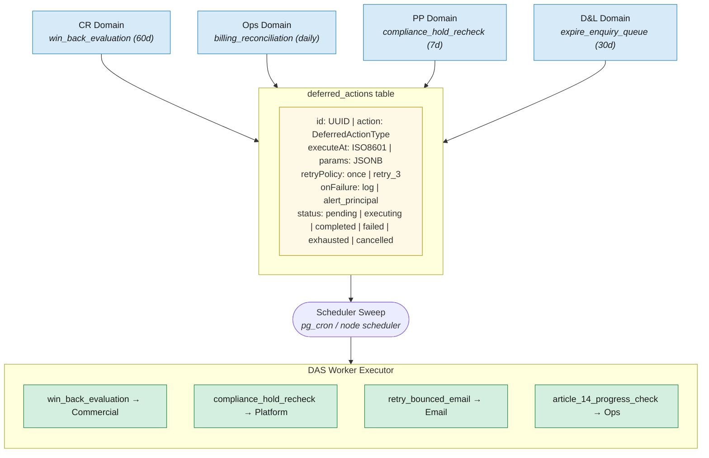
```mermaid
flowchart TD
    classDef domain fill:#d6eaf8,stroke:#2e86c1,color:#1a1a1a
    classDef db fill:#fef9e7,stroke:#b7950b,color:#333
    classDef worker fill:#d4efdf,stroke:#1e8449,color:#1a1a1a

    CR_D["CR Domain<br/><i>win_back_evaluation (60d)</i>"]:::domain
    OPS_D["Ops Domain<br/><i>billing_reconciliation (daily)</i>"]:::domain
    PP_D["PP Domain<br/><i>compliance_hold_recheck (7d)</i>"]:::domain
    DL_D["D&L Domain<br/><i>expire_enquiry_queue (30d)</i>"]:::domain

    subgraph DAS_DB ["deferred_actions table"]
        direction LR
        SCHEMA["id: UUID | action: DeferredActionType<br/>executeAt: ISO8601 | params: JSONB<br/>retryPolicy: once | retry_3<br/>onFailure: log | alert_principal<br/>status: pending | executing | completed | failed | exhausted | cancelled"]:::db
    end

    SWEEP(["Scheduler Sweep<br/><i>pg_cron / node scheduler</i>"])

    subgraph WORKER ["DAS Worker Executor"]
        direction TB
        W1["win_back_evaluation &rarr; Commercial"]:::worker
        W2["compliance_hold_recheck &rarr; Platform"]:::worker
        W3["retry_bounced_email &rarr; Email"]:::worker
        W4["article_14_progress_check &rarr; Ops"]:::worker
    end

    CR_D & OPS_D & PP_D & DL_D --> DAS_DB
    DAS_DB --> SWEEP --> WORKER
```

**Full Action Registry (35 actions):**

| Cross-Domain / Infrastructure | Domain-Specific |
|-------------------------------|-----------------|
| expire_enquiry_queue | decay_liveness_check |
| compliance_schedule_check | enrichment_full_cycle |
| billing_reconciliation | claim_abandonment_check |
| compliance_hold_recheck | taxonomy_review_preparation |
| win_back_evaluation | data_health_review |
| auto_escalation_check | verification_calibration_review |
| notification_cleanup | provider_outreach_ranking |
| grace_period_expiry | conversion_funnel_analysis |
| checkout_precondition_retry | revenue_health_extended |
| listing_update_reminder | multi_listing_pricing_evaluation |
| enquiry_response_reminder | sponsored_placement_learning |
| search_history_cleanup | operational_health_review |
| sla_breach_warning | contractor_performance_review |
| task_timeout_check | principal_briefing_generation |
| billing_hold_expiry | proactive_churn_detection |
| compliance_self_audit | learning_hypothesis_analysis |
| check_quality_improvement | article_14_progress_check |
| quality_score_recalculation | retry_bounced_email |

---

## 11. Support Triage Decision Tree

Operations reframes support as an entity decision architecture. Most tickets are deflected or auto-resolved; humans are procured only for judgment tasks.

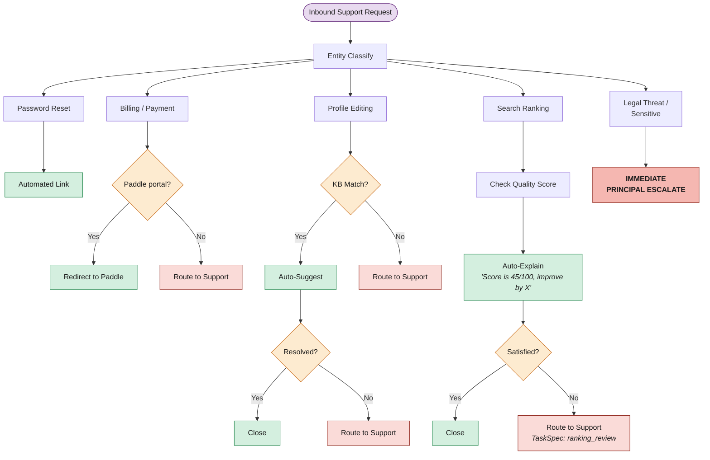
```mermaid
flowchart TD
    classDef startEnd fill:#e8daef,stroke:#6c3483,color:#1a1a1a
    classDef decision fill:#fdebd0,stroke:#ca6f1e,color:#1a1a1a
    classDef auto fill:#d4efdf,stroke:#1e8449,color:#1a1a1a
    classDef human fill:#fadbd8,stroke:#922b21,color:#1a1a1a
    classDef escalate fill:#f5b7b1,stroke:#922b21,color:#1a1a1a,font-weight:bold

    IN(["Inbound Support Request"]):::startEnd
    CLASSIFY["Entity Classify"]

    PWD["Password Reset"]
    BILL["Billing / Payment"]
    PROF["Profile Editing"]
    RANK["Search Ranking"]
    LEGAL["Legal Threat /<br/>Sensitive"]

    AUTO_LINK["Automated Link"]:::auto

    PADDLE_Q{"Paddle portal?"}:::decision
    PADDLE_YES["Redirect to Paddle"]:::auto
    PADDLE_NO["Route to Support"]:::human

    KB_Q{"KB Match?"}:::decision
    KB_YES["Auto-Suggest"]:::auto
    KB_NO["Route to Support"]:::human
    KB_RES{"Resolved?"}:::decision
    KB_CLOSE["Close"]:::auto
    KB_ROUTE["Route to Support"]:::human

    SCORE["Check Quality Score"]
    EXPLAIN["Auto-Explain<br/><i>'Score is 45/100, improve by X'</i>"]:::auto
    SAT{"Satisfied?"}:::decision
    SAT_CLOSE["Close"]:::auto
    SAT_ROUTE["Route to Support<br/><i>TaskSpec: ranking_review</i>"]:::human

    ESCALATE["IMMEDIATE<br/>PRINCIPAL ESCALATE"]:::escalate

    IN --> CLASSIFY
    CLASSIFY --> PWD & BILL & PROF & RANK & LEGAL

    PWD --> AUTO_LINK
    BILL --> PADDLE_Q
    PADDLE_Q -- "Yes" --> PADDLE_YES
    PADDLE_Q -- "No" --> PADDLE_NO

    PROF --> KB_Q
    KB_Q -- "Yes" --> KB_YES --> KB_RES
    KB_Q -- "No" --> KB_NO
    KB_RES -- "Yes" --> KB_CLOSE
    KB_RES -- "No" --> KB_ROUTE

    RANK --> SCORE --> EXPLAIN --> SAT
    SAT -- "Yes" --> SAT_CLOSE
    SAT -- "No" --> SAT_ROUTE

    LEGAL --> ESCALATE
```

*High Churn Risk subscribers get elevated priority. Unreachable Claimed Profile: Entity auto-responds with alternative active providers.*

---

## 12. Claim Volume Projection & Capacity

How organic and outreach volume translates into human verification load.

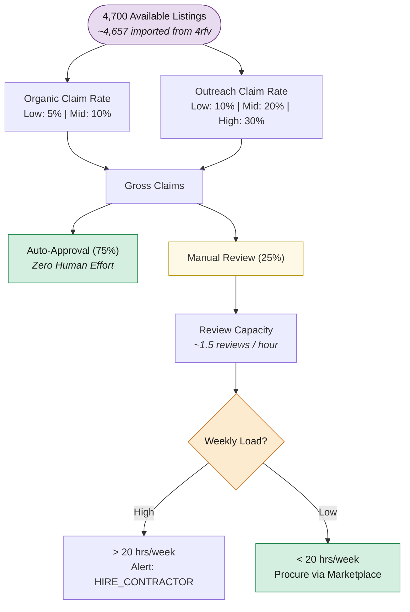
```mermaid
flowchart TD
    classDef input fill:#e8daef,stroke:#6c3483,color:#1a1a1a
    classDef split fill:#fef9e7,stroke:#b7950b,color:#333
    classDef decision fill:#fdebd0,stroke:#ca6f1e,color:#1a1a1a
    classDef action fill:#d4efdf,stroke:#1e8449,color:#1a1a1a

    TOTAL(["4,700 Available Listings<br/><i>~4,657 imported from 4rfv</i>"]):::input

    ORG["Organic Claim Rate<br/>Low: 5% | Mid: 10%"]
    OUT["Outreach Claim Rate<br/>Low: 10% | Mid: 20% | High: 30%"]

    GROSS["Gross Claims"]

    AUTO["Auto-Approval (75%)<br/><i>Zero Human Effort</i>"]:::action
    MANUAL["Manual Review (25%)"]:::split

    CAP["Review Capacity<br/><i>~1.5 reviews / hour</i>"]

    DECISION{"Weekly Load?"}:::decision
    HIRE["> 20 hrs/week<br/>Alert: HIRE_CONTRACTOR"]
    MARKET["< 20 hrs/week<br/>Procure via Marketplace"]:::action

    TOTAL --> ORG & OUT
    ORG & OUT --> GROSS
    GROSS --> AUTO & MANUAL
    MANUAL --> CAP --> DECISION
    DECISION -- "High" --> HIRE
    DECISION -- "Low" --> MARKET
```

---

## 13. Onboarding & Listing Activation Paths (A, B, C)

Three distinct funnels converge on a unified Account+Listing model. Path C (Claiming) is the supply-side growth engine.

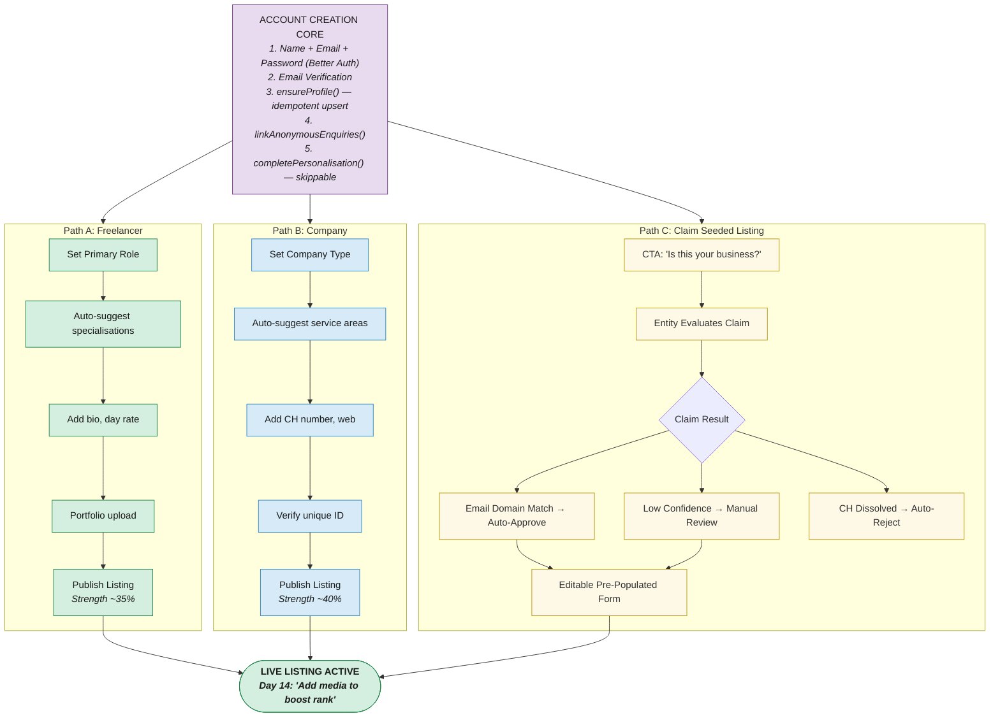
```mermaid
flowchart TD
    classDef core fill:#e8daef,stroke:#6c3483,color:#1a1a1a
    classDef pathA fill:#d4efdf,stroke:#1e8449,color:#1a1a1a
    classDef pathB fill:#d6eaf8,stroke:#2e86c1,color:#1a1a1a
    classDef pathC fill:#fef9e7,stroke:#b7950b,color:#333
    classDef live fill:#d4efdf,stroke:#1e8449,color:#1a1a1a,font-weight:bold

    CORE["ACCOUNT CREATION CORE<br/><i>1. Name + Email + Password (Better Auth)<br/>2. Email Verification<br/>3. ensureProfile() &mdash; idempotent upsert<br/>4. linkAnonymousEnquiries()<br/>5. completePersonalisation() &mdash; skippable</i>"]:::core

    subgraph A ["Path A: Freelancer"]
        direction TB
        A1["Set Primary Role"]:::pathA
        A2["Auto-suggest specialisations"]:::pathA
        A3["Add bio, day rate"]:::pathA
        A4["Portfolio upload"]:::pathA
        A5["Publish Listing<br/><i>Strength ~35%</i>"]:::pathA
        A1 --> A2 --> A3 --> A4 --> A5
    end

    subgraph B ["Path B: Company"]
        direction TB
        B1["Set Company Type"]:::pathB
        B2["Auto-suggest service areas"]:::pathB
        B3["Add CH number, web"]:::pathB
        B4["Verify unique ID"]:::pathB
        B5["Publish Listing<br/><i>Strength ~40%</i>"]:::pathB
        B1 --> B2 --> B3 --> B4 --> B5
    end

    subgraph C ["Path C: Claim Seeded Listing"]
        direction TB
        C1["CTA: 'Is this your business?'"]:::pathC
        C2["Entity Evaluates Claim"]:::pathC
        C3{"Claim Result"}
        C4["Email Domain Match &rarr; Auto-Approve"]:::pathC
        C5["Low Confidence &rarr; Manual Review"]:::pathC
        C6["CH Dissolved &rarr; Auto-Reject"]:::pathC
        C7["Editable Pre-Populated Form"]:::pathC
        C1 --> C2 --> C3
        C3 --> C4 & C5 & C6
        C4 & C5 --> C7
    end

    LIVE(["LIVE LISTING ACTIVE<br/><i>Day 14: 'Add media to boost rank'</i>"]):::live

    CORE --> A & B & C
    A5 & B5 & C7 --> LIVE
```

---

## 14. Conversion Optimisation Funnel

Conversion is an entity decision architecture based on engagement signals, milestone triggers, and cold-start mitigations.

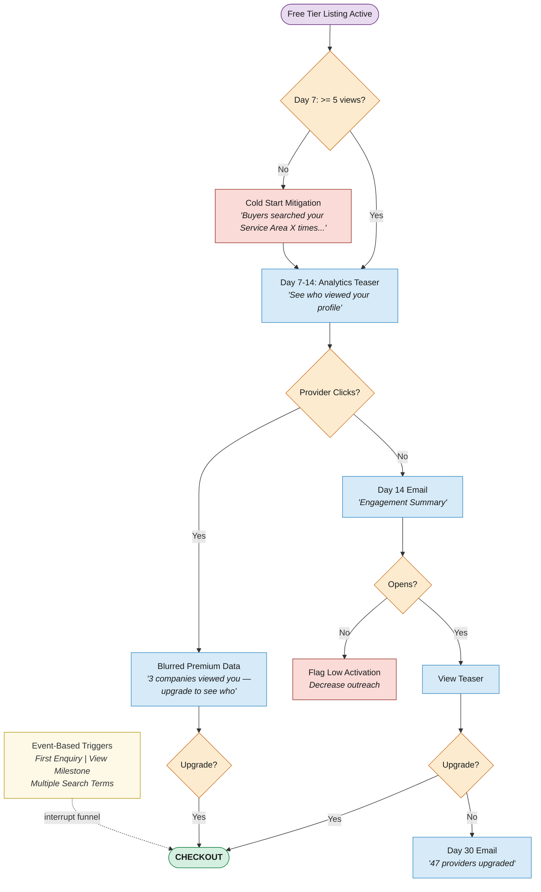
```mermaid
flowchart TD
    classDef start fill:#e8daef,stroke:#6c3483,color:#1a1a1a
    classDef decision fill:#fdebd0,stroke:#ca6f1e,color:#1a1a1a
    classDef action fill:#d6eaf8,stroke:#2e86c1,color:#1a1a1a
    classDef checkout fill:#d4efdf,stroke:#1e8449,color:#1a1a1a,font-weight:bold
    classDef cold fill:#fadbd8,stroke:#922b21,color:#1a1a1a
    classDef event fill:#fef9e7,stroke:#b7950b,color:#333

    FREE(["Free Tier Listing Active"]):::start
    D7Q{"Day 7: >= 5 views?"}:::decision

    COLD["Cold Start Mitigation<br/><i>'Buyers searched your Service Area X times...'</i>"]:::cold

    TEASER["Day 7-14: Analytics Teaser<br/><i>'See who viewed your profile'</i>"]:::action

    CLICK1{"Provider Clicks?"}:::decision
    BLUR["Blurred Premium Data<br/><i>'3 companies viewed you &mdash;<br/>upgrade to see who'</i>"]:::action

    EMAIL14["Day 14 Email<br/><i>'Engagement Summary'</i>"]:::action
    OPEN{"Opens?"}:::decision
    LOW["Flag Low Activation<br/><i>Decrease outreach</i>"]:::cold
    VIEW_T["View Teaser"]:::action

    CLICK2{"Upgrade?"}:::decision
    D30["Day 30 Email<br/><i>'47 providers upgraded'</i>"]:::action
    CLICK3{"Upgrade?"}:::decision

    CHECKOUT(["CHECKOUT"]):::checkout

    EVENTS["Event-Based Triggers<br/><i>First Enquiry | View Milestone<br/>Multiple Search Terms</i>"]:::event

    FREE --> D7Q
    D7Q -- "Yes" --> TEASER
    D7Q -- "No" --> COLD --> TEASER

    TEASER --> CLICK1
    CLICK1 -- "Yes" --> BLUR --> CLICK3
    CLICK1 -- "No" --> EMAIL14 --> OPEN

    OPEN -- "Yes" --> VIEW_T --> CLICK2
    OPEN -- "No" --> LOW

    CLICK2 -- "Yes" --> CHECKOUT
    CLICK2 -- "No" --> D30

    CLICK3 -- "Yes" --> CHECKOUT

    EVENTS -. "interrupt funnel" .-> CHECKOUT
```

---

## 15. Cancellation & Churn Intervention

The entity executes a restrained, data-driven churn intervention. Win-back eligibility evaluated at Day 60.

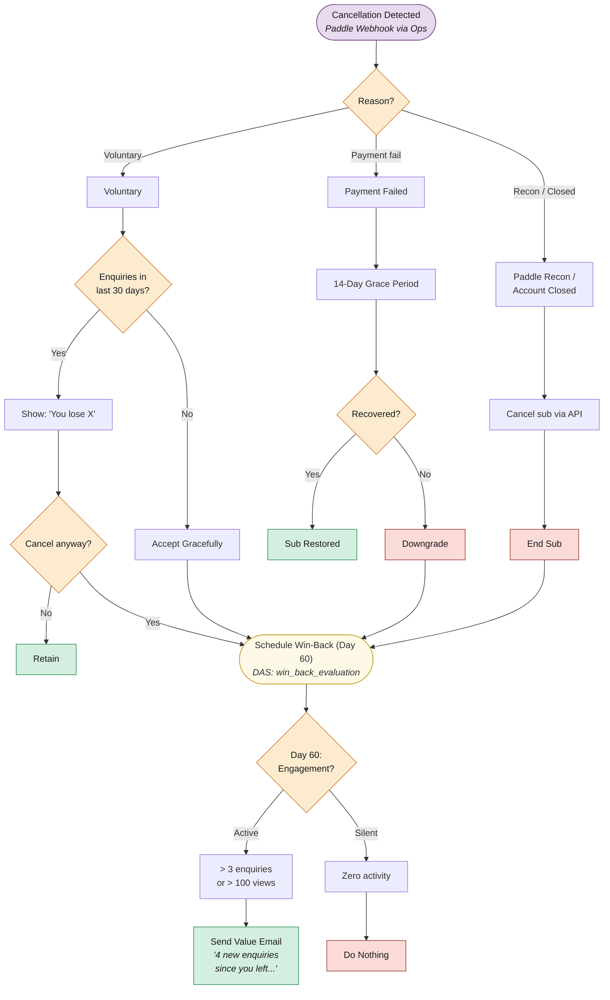
```mermaid
flowchart TD
    classDef start fill:#e8daef,stroke:#6c3483,color:#1a1a1a
    classDef decision fill:#fdebd0,stroke:#ca6f1e,color:#1a1a1a
    classDef retain fill:#d4efdf,stroke:#1e8449,color:#1a1a1a
    classDef lose fill:#fadbd8,stroke:#922b21,color:#1a1a1a
    classDef winback fill:#fef9e7,stroke:#b7950b,color:#333

    CANCEL(["Cancellation Detected<br/><i>Paddle Webhook via Ops</i>"]):::start
    REASON{"Reason?"}:::decision

    VOL["Voluntary"]
    PAY["Payment Failed"]
    RECON["Paddle Recon /<br/>Account Closed"]

    ENQ{"Enquiries in<br/>last 30 days?"}:::decision
    SHOW["Show: 'You lose X'"]
    ACCEPT1["Accept Gracefully"]

    ANYWAY{"Cancel anyway?"}:::decision
    RETAIN["Retain"]:::retain

    GRACE["14-Day Grace Period"]
    RECOVERED{"Recovered?"}:::decision
    RESTORED["Sub Restored"]:::retain
    DOWNGRADE["Downgrade"]:::lose

    ACCEPT2["Cancel sub via API"]
    END_SUB["End Sub"]:::lose

    WINBACK(["Schedule Win-Back (Day 60)<br/><i>DAS: win_back_evaluation</i>"]):::winback

    D60{"Day 60:<br/>Engagement?"}:::decision
    ENGAGED["> 3 enquiries<br/>or > 100 views"]
    ZERO["Zero activity"]

    SEND["Send Value Email<br/><i>'4 new enquiries<br/>since you left...'</i>"]:::retain
    NOTHING["Do Nothing"]:::lose

    CANCEL --> REASON
    REASON -- "Voluntary" --> VOL --> ENQ
    REASON -- "Payment fail" --> PAY --> GRACE
    REASON -- "Recon / Closed" --> RECON --> ACCEPT2

    ENQ -- "Yes" --> SHOW --> ANYWAY
    ENQ -- "No" --> ACCEPT1

    ANYWAY -- "No" --> RETAIN
    ANYWAY -- "Yes" --> WINBACK
    ACCEPT1 --> WINBACK

    GRACE --> RECOVERED
    RECOVERED -- "Yes" --> RESTORED
    RECOVERED -- "No" --> DOWNGRADE --> WINBACK

    ACCEPT2 --> END_SUB --> WINBACK

    WINBACK --> D60
    D60 -- "Active" --> ENGAGED --> SEND
    D60 -- "Silent" --> ZERO --> NOTHING
```

---

## 16. Shared Infrastructure: S0 Layer

6 shared services consumed by all 4 domains. All built, all tested, zero type errors.

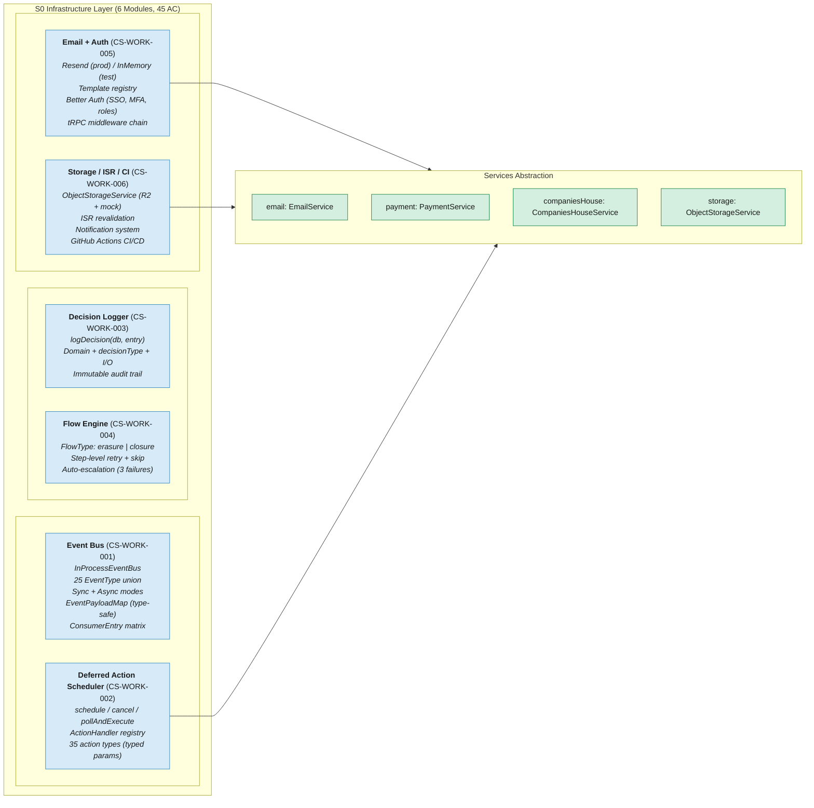
```mermaid
graph LR
    classDef mod fill:#d6eaf8,stroke:#2e86c1,color:#1a1a1a
    classDef svc fill:#d4efdf,stroke:#1e8449,color:#1a1a1a

    subgraph S0 ["S0 Infrastructure Layer (6 Modules, 45 AC)"]
        direction TB

        subgraph ROW1 [" "]
            direction LR
            EB["<b>Event Bus</b> (CS-WORK-001)<br/><i>InProcessEventBus<br/>25 EventType union<br/>Sync + Async modes<br/>EventPayloadMap (type-safe)<br/>ConsumerEntry matrix</i>"]:::mod

            DAS["<b>Deferred Action Scheduler</b> (CS-WORK-002)<br/><i>schedule / cancel / pollAndExecute<br/>ActionHandler registry<br/>35 action types (typed params)</i>"]:::mod
        end

        subgraph ROW2 [" "]
            direction LR
            DEC["<b>Decision Logger</b> (CS-WORK-003)<br/><i>logDecision(db, entry)<br/>Domain + decisionType + I/O<br/>Immutable audit trail</i>"]:::mod

            FE["<b>Flow Engine</b> (CS-WORK-004)<br/><i>FlowType: erasure | closure<br/>Step-level retry + skip<br/>Auto-escalation (3 failures)</i>"]:::mod
        end

        subgraph ROW3 [" "]
            direction LR
            EA["<b>Email + Auth</b> (CS-WORK-005)<br/><i>Resend (prod) / InMemory (test)<br/>Template registry<br/>Better Auth (SSO, MFA, roles)<br/>tRPC middleware chain</i>"]:::mod

            ST["<b>Storage / ISR / CI</b> (CS-WORK-006)<br/><i>ObjectStorageService (R2 + mock)<br/>ISR revalidation<br/>Notification system<br/>GitHub Actions CI/CD</i>"]:::mod
        end
    end

    subgraph SVC ["Services Abstraction"]
        direction TB
        S1["email: EmailService"]:::svc
        S2["payment: PaymentService"]:::svc
        S3["companiesHouse: CompaniesHouseService"]:::svc
        S4["storage: ObjectStorageService"]:::svc
    end

    EA --> SVC
    ST --> SVC
    DAS --> SVC
```

---

## 17. Communications Pipeline (Phase 1)

End-to-end email lifecycle: send, log, deliver, track, bounce, suppress. Implemented as a decorator chain around the core EmailService.

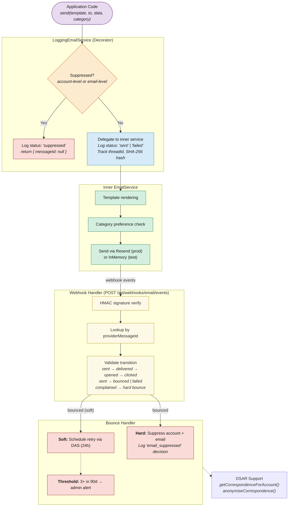
```mermaid
flowchart TD
    classDef app fill:#e8daef,stroke:#6c3483,color:#1a1a1a
    classDef decorator fill:#d6eaf8,stroke:#2e86c1,color:#1a1a1a
    classDef inner fill:#d4efdf,stroke:#1e8449,color:#1a1a1a
    classDef webhook fill:#fef9e7,stroke:#b7950b,color:#333
    classDef bounce fill:#fadbd8,stroke:#922b21,color:#1a1a1a
    classDef decision fill:#fdebd0,stroke:#ca6f1e,color:#1a1a1a

    APP(["Application Code<br/><i>send(template, to, data, category)</i>"]):::app

    subgraph LOGGING ["LoggingEmailService (Decorator)"]
        direction TB
        SUP_CHECK{"Suppressed?<br/><i>account-level or email-level</i>"}:::decision
        SUP_YES["Log status: 'suppressed'<br/><i>return { messageId: null }</i>"]:::bounce
        DELEGATE["Delegate to inner service<br/><i>Log status: 'sent' | 'failed'<br/>Track threadId, SHA-256 hash</i>"]:::decorator
    end

    subgraph INNER ["Inner EmailService"]
        direction TB
        RENDER["Template rendering"]:::inner
        PREF["Category preference check"]:::inner
        SEND["Send via Resend (prod)<br/>or InMemory (test)"]:::inner
        RENDER --> PREF --> SEND
    end

    subgraph WEBHOOK ["Webhook Handler (POST /api/webhooks/email/events)"]
        direction TB
        HMAC["HMAC signature verify"]:::webhook
        LOOKUP["Lookup by providerMessageId"]:::webhook
        VALIDATE["Validate transition<br/><i>sent &rarr; delivered &rarr; opened &rarr; clicked<br/>sent &rarr; bounced | failed<br/>complained &rarr; hard bounce</i>"]:::webhook
        HMAC --> LOOKUP --> VALIDATE
    end

    subgraph BOUNCE_H ["Bounce Handler"]
        direction TB
        HARD["<b>Hard:</b> Suppress account + email<br/><i>Log 'email_suppressed' decision</i>"]:::bounce
        SOFT["<b>Soft:</b> Schedule retry via DAS (24h)"]:::bounce
        THRESH["<b>Threshold:</b> 3+ in 90d &rarr; admin alert"]:::bounce
    end

    DSAR["DSAR Support<br/><i>getCorrespondenceForAccount()<br/>anonymiseCorrespondence()</i>"]

    APP --> SUP_CHECK
    SUP_CHECK -- "Yes" --> SUP_YES
    SUP_CHECK -- "No" --> DELEGATE
    DELEGATE --> RENDER
    SEND -- "webhook events" --> HMAC
    VALIDATE -- "bounced" --> HARD
    VALIDATE -- "bounced (soft)" --> SOFT
    SOFT -.-> THRESH
    BOUNCE_H -.-> DSAR
```

---

## 18. Data & Listings: Integrity Pipeline & Taxonomy

Listing integrity enforced by a sequential rule pipeline with short-circuit evaluation. Taxonomy overlap uses Jaccard similarity at service-area level.

```mermaid
flowchart TD
    classDef input fill:#e8daef,stroke:#6c3483,color:#1a1a1a
    classDef rule fill:#d6eaf8,stroke:#2e86c1,color:#1a1a1a
    classDef taxonomy fill:#d4efdf,stroke:#1e8449,color:#1a1a1a
    classDef import fill:#fef9e7,stroke:#b7950b,color:#333

    INPUT(["Listing Create / Update"]):::input

    subgraph PIPELINE ["Sequential Integrity Pipeline (short-circuits on first fail)"]
        direction LR
        R1["<b>Rule 1: Duplicate Detection</b><br/><i>Sorted-neighbour (window 10)<br/>pg_trgm similarity > 0.9<br/>CH number clustering<br/>Union-find merge</i>"]:::rule
        R2["<b>Rule 2: Identity Verification</b><br/><i>Name vs Companies House<br/>Entity type match</i>"]:::rule
        R3["<b>Rule 3: CH Uniqueness</b><br/><i>No shared CH numbers<br/>Pipeline-level (not DB)</i>"]:::rule
        R1 -- "pass" --> R2 -- "pass" --> R3
    end

    TAX["<b>Taxonomy Overlap</b><br/><i>computeTaxonomyOverlap(tagsA, tagsB)<br/>Jaccard similarity at service-area level<br/>7 sectors &rarr; 64 service areas &rarr; 269 specialisations</i>"]:::taxonomy

    subgraph IMPORT ["4RFV Import Pipeline (CS-WORK-021/022)"]
        direction TB
        I1["5-phase CLI<br/><i>normalise &rarr; CH verify &rarr; dedup &rarr; commit &rarr; Article 14</i>"]:::import
        I2["~4,657 companies from SQLite"]:::import
        I3["No listing_created events (by design)"]:::import
        I4["Article 14 GDPR: email or on-page flag"]:::import
    end

    INPUT --> PIPELINE
    R1 -.-> TAX
    IMPORT -.-> PIPELINE
```

---

## 19. Search Infrastructure

Full-text search with synonym expansion, trigram fallback, and taxonomy filtering.

```mermaid
flowchart TD
    classDef input fill:#e8daef,stroke:#6c3483,color:#1a1a1a
    classDef process fill:#d6eaf8,stroke:#2e86c1,color:#1a1a1a
    classDef decision fill:#fdebd0,stroke:#ca6f1e,color:#1a1a1a
    classDef fallback fill:#fadbd8,stroke:#922b21,color:#1a1a1a
    classDef result fill:#d4efdf,stroke:#1e8449,color:#1a1a1a
    classDef infra fill:#fef9e7,stroke:#b7950b,color:#333

    SP(["SearchParams<br/><i>query, filters, page, limit</i>"]):::input

    IDX["Index Infrastructure<br/><i>tsvector (GIN) + pg_trgm (GiST)<br/>Weights: Name=A, Tag=B, Desc=C<br/>Auto-update trigger + synonyms table</i>"]:::infra

    FILTERS["Apply Filters<br/><i>sector / serviceArea / specialisation<br/>entityType / subscriptionTier<br/>+ lifecycleStatus = 'active'</i>"]:::process

    E1{"Has text query?"}:::decision

    EMPTY["All active listings<br/>ORDER BY composite DESC"]:::fallback

    EXPAND["expandQuery(db, query)<br/><i>Synonym lookup &rarr; tsquery</i>"]:::process

    FTS["Full-Text Search<br/><i>search_vector @@ tsquery<br/>Rank: buildRankExpression()</i>"]:::process

    HAS{"Results > 0?"}:::decision

    TRI["Trigram Fallback<br/><i>similarity(name, query) > 0.3</i>"]:::fallback

    RESULT(["Ranked Results"]):::result

    SP --> FILTERS --> E1
    E1 -- "No text" --> EMPTY --> RESULT
    E1 -- "Has text" --> EXPAND --> FTS --> HAS
    HAS -- "Yes" --> RESULT
    HAS -- "No" --> TRI --> RESULT

    IDX -.-> FTS
    IDX -.-> TRI
```
