# CALLSHEET — How The System Works (Plain English)

**Source:** `SYSTEM-ARCHITECTURE-MERMAID.md` (technical version)
**Audience:** Non-technical stakeholders, new team members, investors, partners
**Last updated:** 2026-03-06

---

## 1. The Big Picture

CALLSHEET has four departments that each own a clear job. They talk to each other through a central message board, and they all share a set of common tools. Paddle (a third-party payment provider) handles all billing.

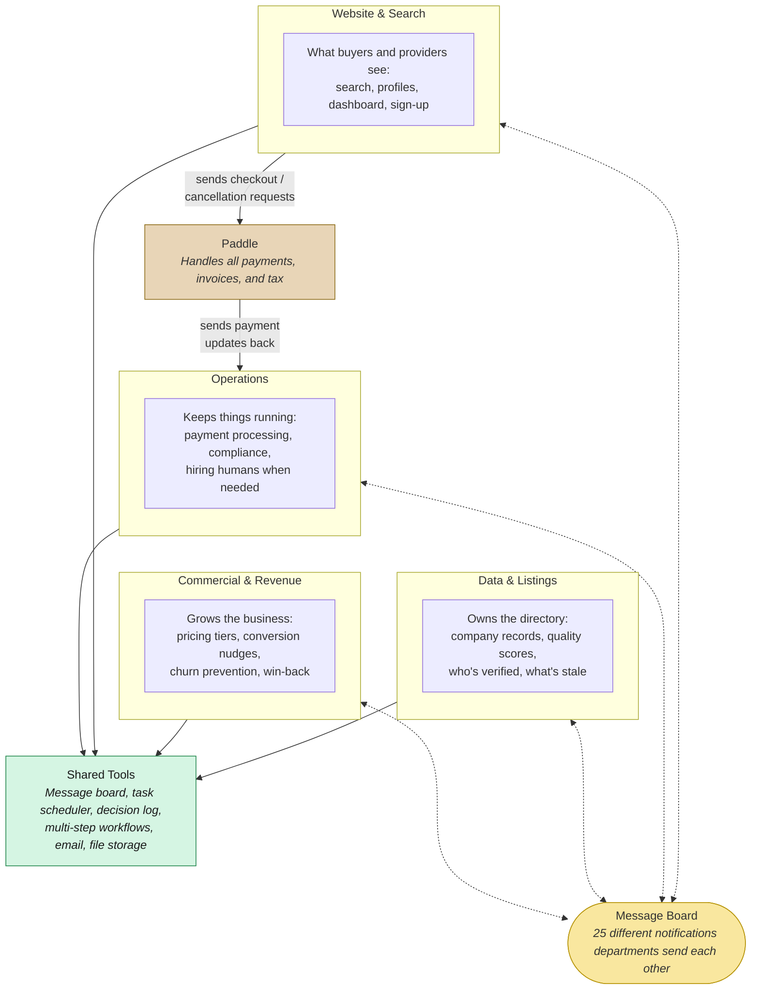
```mermaid
graph TB
    classDef external fill:#e8d5b7,stroke:#8b6914,color:#333
    classDef domain fill:#d4e6f1,stroke:#2471a3,color:#1a1a1a
    classDef bus fill:#f9e79f,stroke:#b7950b,color:#333
    classDef infra fill:#d5f5e3,stroke:#1e8449,color:#1a1a1a

    PADDLE["Paddle<br/><i>Handles all payments, invoices, and tax</i>"]:::external

    subgraph PP ["Website & Search"]
        direction TB
        PP_TOP["What buyers and providers see:<br/>search, profiles, dashboard, sign-up"]
    end
    class PP domain

    subgraph OPS ["Operations"]
        direction TB
        OPS_TOP["Keeps things running:<br/>payment processing, compliance,<br/>hiring humans when needed"]
    end
    class OPS domain

    subgraph DL ["Data & Listings"]
        direction TB
        DL_TOP["Owns the directory:<br/>company records, quality scores,<br/>who's verified, what's stale"]
    end
    class DL domain

    subgraph CR ["Commercial & Revenue"]
        direction TB
        CR_TOP["Grows the business:<br/>pricing tiers, conversion nudges,<br/>churn prevention, win-back"]
    end
    class CR domain

    EB(["Message Board<br/><i>25 different notifications departments send each other</i>"]):::bus
    INFRA["Shared Tools<br/><i>Message board, task scheduler, decision log,<br/>multi-step workflows, email, file storage</i>"]:::infra

    PP -- "sends checkout /<br/>cancellation requests" --> PADDLE
    PADDLE -- "sends payment<br/>updates back" --> OPS

    PP <-..-> EB
    OPS <-..-> EB
    DL <-..-> EB
    CR <-..-> EB

    PP ~~~ DL
    OPS ~~~ CR

    DL & CR & PP & OPS --> INFRA
```

---

## 2. Users and Listings: Who Owns What

Every user gets an account. Accounts can browse and search (buyer side) from day one. Listings are directory records for businesses and freelancers. A listing can exist without an owner (e.g. imported data). When a user claims a listing, they become its owner and can edit it.

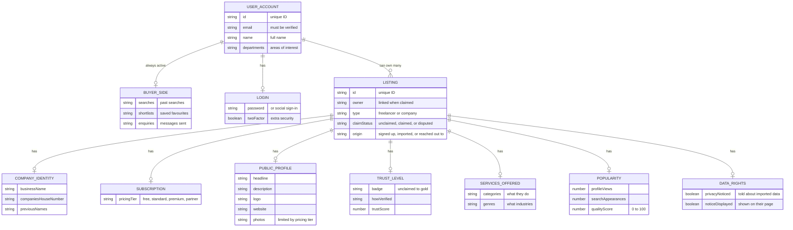
```mermaid
erDiagram
    USER_ACCOUNT {
        string id "unique ID"
        string email "must be verified"
        string name "full name"
        string departments "areas of interest"
    }

    USER_ACCOUNT ||--o| BUYER_SIDE : "always active"
    BUYER_SIDE {
        string searches "past searches"
        string shortlists "saved favourites"
        string enquiries "messages sent"
    }

    USER_ACCOUNT ||--o| LOGIN : has
    LOGIN {
        string password "or social sign-in"
        boolean twoFactor "extra security"
    }

    USER_ACCOUNT ||--o{ LISTING : "can own many"

    LISTING {
        string id "unique ID"
        string owner "linked when claimed"
        string type "freelancer or company"
        string claimStatus "unclaimed, claimed, or disputed"
        string origin "signed up, imported, or reached out to"
    }

    LISTING ||--o| COMPANY_IDENTITY : has
    COMPANY_IDENTITY {
        string businessName
        string companiesHouseNumber
        string previousNames
    }

    LISTING ||--o| SUBSCRIPTION : has
    SUBSCRIPTION {
        string pricingTier "free, standard, premium, partner"
    }

    LISTING ||--o| PUBLIC_PROFILE : has
    PUBLIC_PROFILE {
        string headline
        string description
        string logo
        string website
        string photos "limited by pricing tier"
    }

    LISTING ||--o| TRUST_LEVEL : has
    TRUST_LEVEL {
        string badge "unclaimed to gold"
        string howVerified
        number trustScore
    }

    LISTING ||--o| SERVICES_OFFERED : has
    SERVICES_OFFERED {
        string categories "what they do"
        string genres "what industries"
    }

    LISTING ||--o| POPULARITY : has
    POPULARITY {
        number profileViews
        number searchAppearances
        number qualityScore "0 to 100"
    }

    LISTING ||--o| DATA_RIGHTS : has
    DATA_RIGHTS {
        boolean privacyNoticed "told about imported data"
        boolean noticeDisplayed "shown on their page"
    }
```

---

## 3. How the System Hires Humans

CALLSHEET runs itself automatically. But some tasks need human judgment (e.g. resolving disputes, reviewing showreels). When that happens, the system writes a clear brief and hires someone.

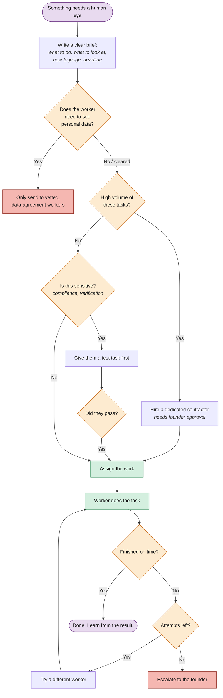
```mermaid
flowchart TD
    classDef startEnd fill:#e8daef,stroke:#6c3483,color:#1a1a1a
    classDef decision fill:#fdebd0,stroke:#ca6f1e,color:#1a1a1a
    classDef escalate fill:#f5b7b1,stroke:#922b21,color:#1a1a1a
    classDef action fill:#d4efdf,stroke:#1e8449,color:#1a1a1a

    A(["Something needs a human eye"]):::startEnd
    B["Write a clear brief:<br/><i>what to do, what to look at,<br/>how to judge, deadline</i>"]

    C{"Does the worker<br/>need to see<br/>personal data?"}:::decision
    D["Only send to vetted,<br/>data-agreement workers"]:::escalate

    E{"High volume of<br/>these tasks?"}:::decision
    F["Hire a dedicated contractor<br/><i>needs founder approval</i>"]

    G{"Is this sensitive?<br/><i>compliance, verification</i>"}:::decision
    H["Give them a test task first"]
    I{"Did they pass?"}:::decision
    J["Assign the work"]:::action

    K["Worker does the task"]:::action
    L{"Finished on time?"}:::decision
    M{"Attempts left?"}:::decision
    N["Try a different worker"]
    O["Escalate to the founder"]:::escalate
    P(["Done. Learn from the result."]):::startEnd

    A --> B --> C
    C -- "Yes" --> D
    C -- "No / cleared" --> E
    E -- "Yes" --> F --> J
    E -- "No" --> G
    G -- "Yes" --> H --> I
    I -- "Yes" --> J
    G -- "No" --> J
    J --> K --> L
    L -- "Yes" --> P
    L -- "No" --> M
    M -- "Yes" --> N --> K
    M -- "No" --> O
```

---

## 4. What Happens When Someone Pays (or Stops Paying)

Paddle sends us a notification whenever a subscription changes. Operations checks it's genuine, then tells the rest of the system what happened.

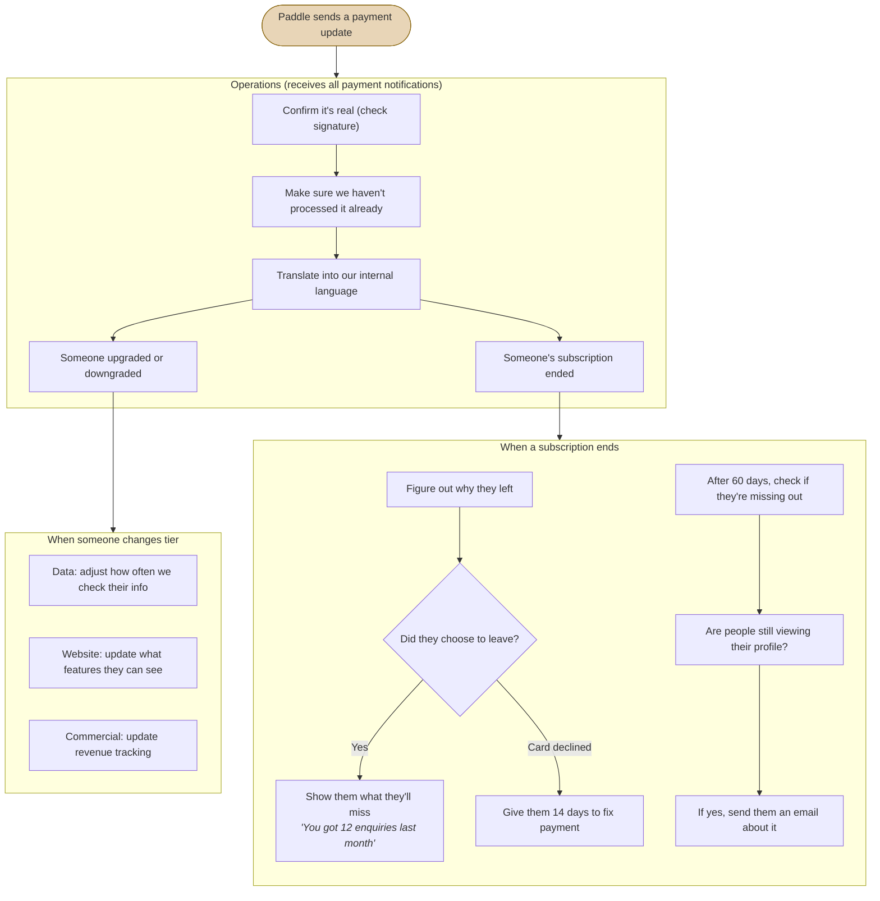
```mermaid
flowchart TD
    classDef external fill:#e8d5b7,stroke:#8b6914,color:#333

    PADDLE(["Paddle sends a payment update"]):::external

    subgraph OPS ["Operations (receives all payment notifications)"]
        direction TB
        O1["Confirm it's real (check signature)"]
        O2["Make sure we haven't processed it already"]
        O3["Translate into our internal language"]
        O1 --> O2 --> O3
        O3 --> STC["Someone upgraded or downgraded"]
        O3 --> SE["Someone's subscription ended"]
    end

    subgraph CONSUMERS ["When someone changes tier"]
        direction LR
        C1["Data: adjust how often we check their info"]
        C2["Website: update what features they can see"]
        C3["Commercial: update revenue tracking"]
    end

    subgraph COMMERCIAL ["When a subscription ends"]
        direction TB
        ECI["Figure out why they left"]
        VOL{"Did they choose to leave?"}
        SHOW["Show them what they'll miss<br/><i>'You got 12 enquiries last month'</i>"]
        GRACE["Give them 14 days to fix payment"]

        ECI --> VOL
        VOL -- "Yes" --> SHOW
        VOL -- "Card declined" --> GRACE

        EWB["After 60 days, check if they're missing out"] --> CHECK["Are people still viewing their profile?"] --> EMIT["If yes, send them an email about it"]
    end

    PADDLE --> OPS
    STC --> CONSUMERS
    SE --> COMMERCIAL
```

---

## 5. How Search Works

When a buyer searches, the system finds matching listings and ranks them. Better-quality profiles appear higher. Paid tiers get a boost, but a great free listing still beats a mediocre paid one.

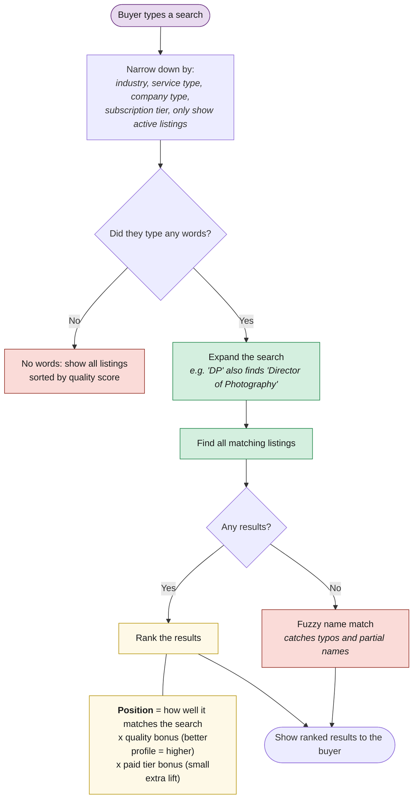
```mermaid
flowchart TD
    classDef input fill:#e8daef,stroke:#6c3483,color:#1a1a1a
    classDef process fill:#d4efdf,stroke:#1e8449,color:#1a1a1a
    classDef formula fill:#fef9e7,stroke:#b7950b,color:#1a1a1a
    classDef fallback fill:#fadbd8,stroke:#922b21,color:#1a1a1a

    Q(["Buyer types a search"]):::input
    FILTERS["Narrow down by:<br/><i>industry, service type, company type,<br/>subscription tier, only show active listings</i>"]

    EMPTY_Q{"Did they type any words?"}

    EMPTY["No words: show all listings<br/>sorted by quality score"]:::fallback

    SYN["Expand the search<br/><i>e.g. 'DP' also finds 'Director of Photography'</i>"]:::process

    FTS["Find all matching listings"]:::process

    HAS_RESULTS{"Any results?"}

    RANK["Rank the results"]:::formula
    FORMULA["<b>Position</b> = how well it matches the search<br/> x quality bonus (better profile = higher)<br/> x paid tier bonus (small extra lift)"]:::formula

    TRI["Fuzzy name match<br/><i>catches typos and partial names</i>"]:::fallback

    RESULT(["Show ranked results to the buyer"])

    Q --> FILTERS --> EMPTY_Q
    EMPTY_Q -- "No" --> EMPTY
    EMPTY_Q -- "Yes" --> SYN --> FTS --> HAS_RESULTS
    HAS_RESULTS -- "Yes" --> RANK
    HAS_RESULTS -- "No" --> TRI --> RESULT
    RANK --- FORMULA
    RANK --> RESULT
```

> **Example:** A free listing with quality score 85 appears above a premium listing with quality score 30, even though premium gets a ranking boost. Quality wins.

---

## 6. Deleting Someone's Data (GDPR)

When someone asks for their data to be erased, the system runs a carefully ordered sequence across all four departments. If anything fails 3 times, the founder gets alerted.

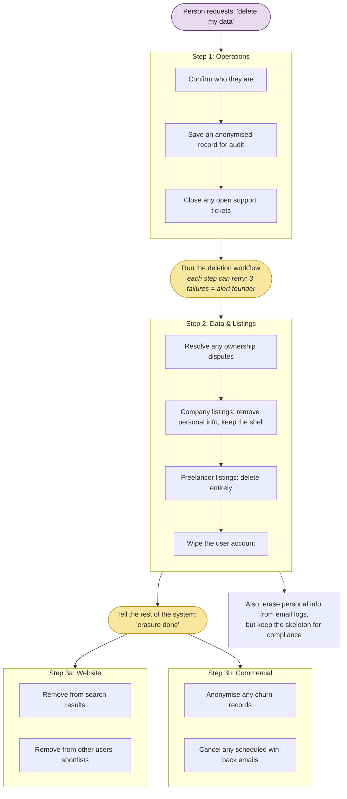
```mermaid
flowchart TD
    classDef startEnd fill:#e8daef,stroke:#6c3483,color:#1a1a1a
    classDef ops fill:#d6eaf8,stroke:#2e86c1,color:#1a1a1a
    classDef dl fill:#d4efdf,stroke:#1e8449,color:#1a1a1a
    classDef bus fill:#f9e79f,stroke:#b7950b,color:#333
    classDef async fill:#fadbd8,stroke:#922b21,color:#1a1a1a

    DS(["Person requests: 'delete my data'"]):::startEnd

    subgraph OPS ["Step 1: Operations"]
        direction TB
        O1["Confirm who they are"]
        O2["Save an anonymised record for audit"]
        O3["Close any open support tickets"]
        O1 --> O2 --> O3
    end

    FLOW(["Run the deletion workflow<br/><i>each step can retry; 3 failures = alert founder</i>"]):::bus

    subgraph DL_STEPS ["Step 2: Data & Listings"]
        direction TB
        D4["Resolve any ownership disputes"]
        D5["Company listings: remove personal info, keep the shell"]
        D6["Freelancer listings: delete entirely"]
        D7["Wipe the user account"]
        D4 --> D5 --> D6 --> D7
    end

    EVT(["Tell the rest of the system: 'erasure done'"]):::bus

    subgraph PP_STEPS ["Step 3a: Website"]
        P8["Remove from search results"]
        P9["Remove from other users' shortlists"]
    end

    subgraph CR_STEPS ["Step 3b: Commercial"]
        C11["Anonymise any churn records"]
        C12["Cancel any scheduled win-back emails"]
    end

    CORR["Also: erase personal info from email logs,<br/>but keep the skeleton for compliance"]

    DS --> OPS --> FLOW --> DL_STEPS --> EVT
    EVT --> PP_STEPS
    EVT --> CR_STEPS
    DL_STEPS -.-> CORR
```

---

## 7. How Departments Notify Each Other

When something important happens (e.g. a listing is claimed, someone cancels), the department where it happened sends a notification. Other departments listen for the ones they care about.

### 7a. Data & Listings says...

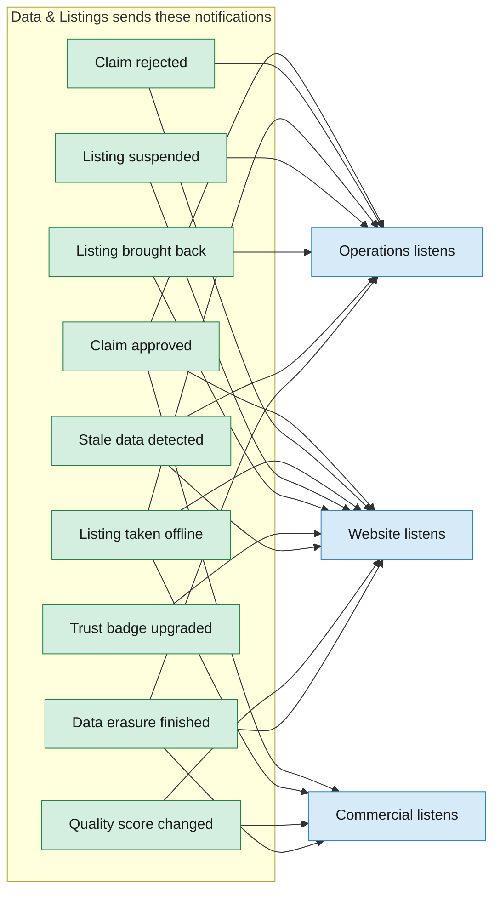
```mermaid
flowchart LR
    classDef dl fill:#d4efdf,stroke:#1e8449,color:#1a1a1a
    classDef consumer fill:#d6eaf8,stroke:#2e86c1,color:#1a1a1a

    subgraph DL ["Data & Listings sends these notifications"]
        CA["Claim approved"]:::dl
        CRJ["Claim rejected"]:::dl
        LA["Listing taken offline"]:::dl
        LS["Listing suspended"]:::dl
        LR["Listing brought back"]:::dl
        VTC["Trust badge upgraded"]:::dl
        DSD["Stale data detected"]:::dl
        QSC["Quality score changed"]:::dl
        EC["Data erasure finished"]:::dl
    end

    OPS_C["Operations listens"]:::consumer
    PP_C["Website listens"]:::consumer
    CR_C["Commercial listens"]:::consumer

    CA & CRJ & LA & LS & LR --> OPS_C
    CA & CRJ & LA & LS & LR & VTC & DSD & QSC & EC --> PP_C
    CA & LA & QSC & EC --> CR_C
    DSD & EC --> OPS_C
```

### 7b. Operations says...

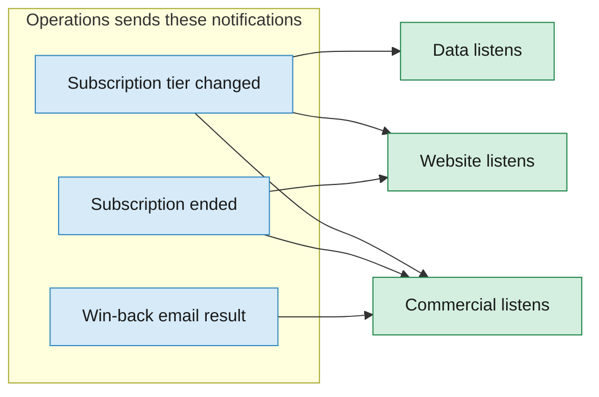
```mermaid
flowchart LR
    classDef ops fill:#d6eaf8,stroke:#2e86c1,color:#1a1a1a
    classDef consumer fill:#d4efdf,stroke:#1e8449,color:#1a1a1a

    subgraph OPS ["Operations sends these notifications"]
        STC["Subscription tier changed"]:::ops
        SE["Subscription ended"]:::ops
        WDR["Win-back email result"]:::ops
    end

    DL_C["Data listens"]:::consumer
    PP_C["Website listens"]:::consumer
    CR_C["Commercial listens"]:::consumer

    STC --> DL_C & PP_C & CR_C
    SE --> PP_C & CR_C
    WDR --> CR_C
```

### 7c. Website says...

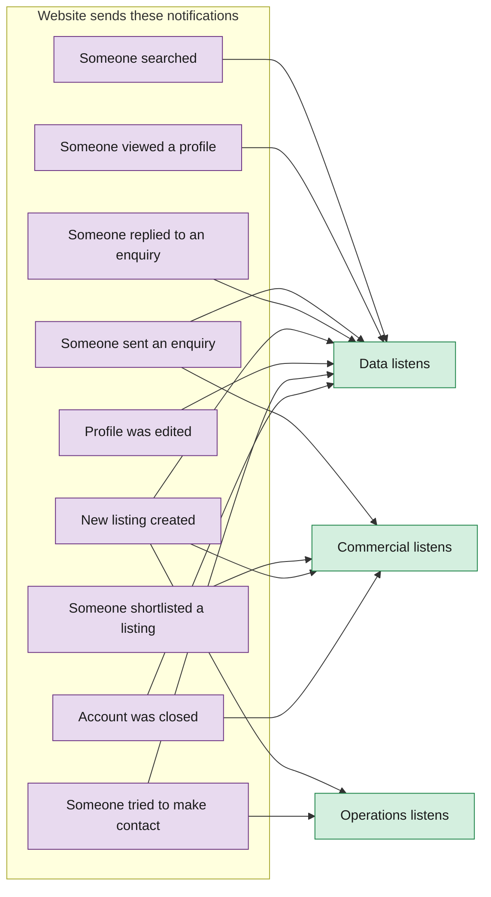
```mermaid
flowchart LR
    classDef pp fill:#e8daef,stroke:#6c3483,color:#1a1a1a
    classDef consumer fill:#d4efdf,stroke:#1e8449,color:#1a1a1a

    subgraph PP ["Website sends these notifications"]
        SP["Someone searched"]:::pp
        PV["Someone viewed a profile"]:::pp
        ES["Someone sent an enquiry"]:::pp
        ER["Someone replied to an enquiry"]:::pp
        SA["Someone shortlisted a listing"]:::pp
        LC["New listing created"]:::pp
        PE["Profile was edited"]:::pp
        CAT["Someone tried to make contact"]:::pp
        AC["Account was closed"]:::pp
    end

    DL_C["Data listens"]:::consumer
    OPS_C["Operations listens"]:::consumer
    CR_C["Commercial listens"]:::consumer

    SP & PV & ES & ER & LC & PE & CAT & AC --> DL_C
    LC & CAT --> OPS_C
    ES & SA & LC & AC --> CR_C
```

### 7d. Commercial says...

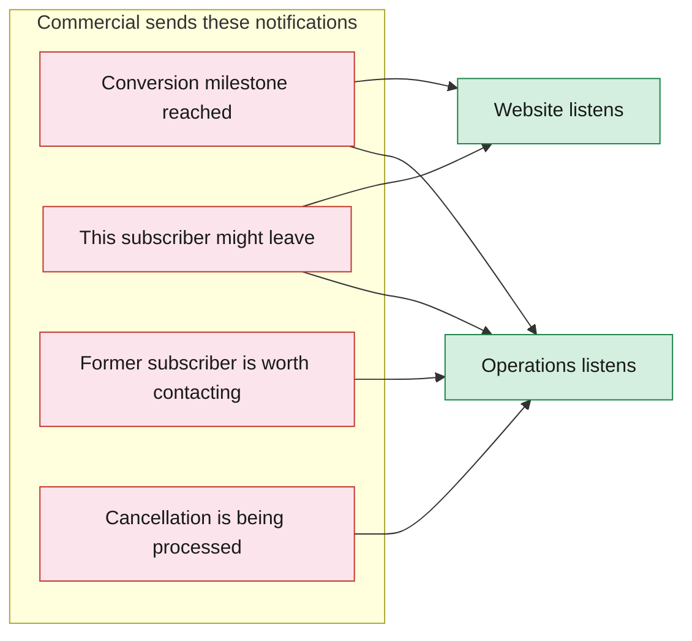
```mermaid
flowchart LR
    classDef cr fill:#fce4ec,stroke:#c0392b,color:#1a1a1a
    classDef consumer fill:#d4efdf,stroke:#1e8449,color:#1a1a1a

    subgraph CR ["Commercial sends these notifications"]
        CM["Conversion milestone reached"]:::cr
        CRD["This subscriber might leave"]:::cr
        WE["Former subscriber is worth contacting"]:::cr
        PCC["Cancellation is being processed"]:::cr
    end

    OPS_C["Operations listens"]:::consumer
    PP_C["Website listens"]:::consumer

    CM & CRD --> OPS_C & PP_C
    WE & PCC --> OPS_C
```

---

## 8. How Trust Builds Over Time

Every listing starts unverified. The system automatically checks credentials and upgrades trust badges. The highest badge requires human review.

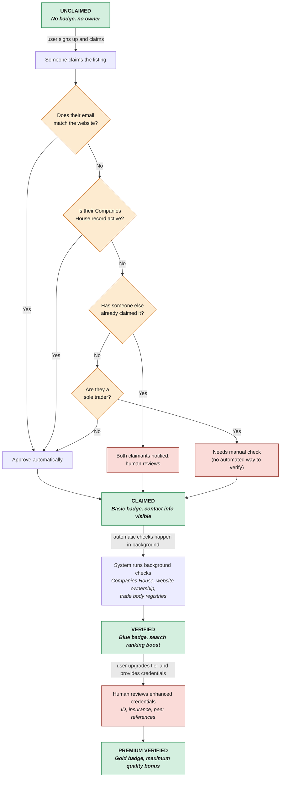
```mermaid
flowchart TD
    classDef tier fill:#d4efdf,stroke:#1e8449,color:#1a1a1a,font-weight:bold
    classDef decision fill:#fdebd0,stroke:#ca6f1e,color:#1a1a1a
    classDef route fill:#fadbd8,stroke:#922b21,color:#1a1a1a

    U["UNCLAIMED<br/><i>No badge, no owner</i>"]:::tier

    CE["Someone claims the listing"]

    R1{"Does their email<br/>match the website?"}:::decision
    R2{"Is their Companies<br/>House record active?"}:::decision
    R3{"Has someone else<br/>already claimed it?"}:::decision
    R4{"Are they a<br/>sole trader?"}:::decision

    AUTO["Approve automatically"]
    DISPUTE["Both claimants notified,<br/>human reviews"]:::route
    MANUAL["Needs manual check<br/>(no automated way to verify)"]:::route

    CLAIMED["CLAIMED<br/><i>Basic badge, contact info visible</i>"]:::tier

    VC["System runs background checks<br/><i>Companies House, website ownership,<br/>trade body registries</i>"]

    VERIFIED["VERIFIED<br/><i>Blue badge, search ranking boost</i>"]:::tier

    MC["Human reviews enhanced credentials<br/><i>ID, insurance, peer references</i>"]:::route

    PV["PREMIUM VERIFIED<br/><i>Gold badge, maximum quality bonus</i>"]:::tier

    U -- "user signs up and claims" --> CE
    CE --> R1
    R1 -- "Yes" --> AUTO
    R1 -- "No" --> R2
    R2 -- "Yes" --> AUTO
    R2 -- "No" --> R3
    R3 -- "Yes" --> DISPUTE
    R3 -- "No" --> R4
    R4 -- "Yes" --> MANUAL
    R4 -- "No" --> AUTO
    AUTO --> CLAIMED
    DISPUTE --> CLAIMED
    MANUAL --> CLAIMED
    CLAIMED -- "automatic checks happen in background" --> VC --> VERIFIED
    VERIFIED -- "user upgrades tier and provides credentials" --> MC --> PV
```

---

## 9. Keeping Data Fresh

Listings go stale. The system regularly checks if websites are still up, emails still work, and companies still exist. If something's wrong, it acts — or asks for help.

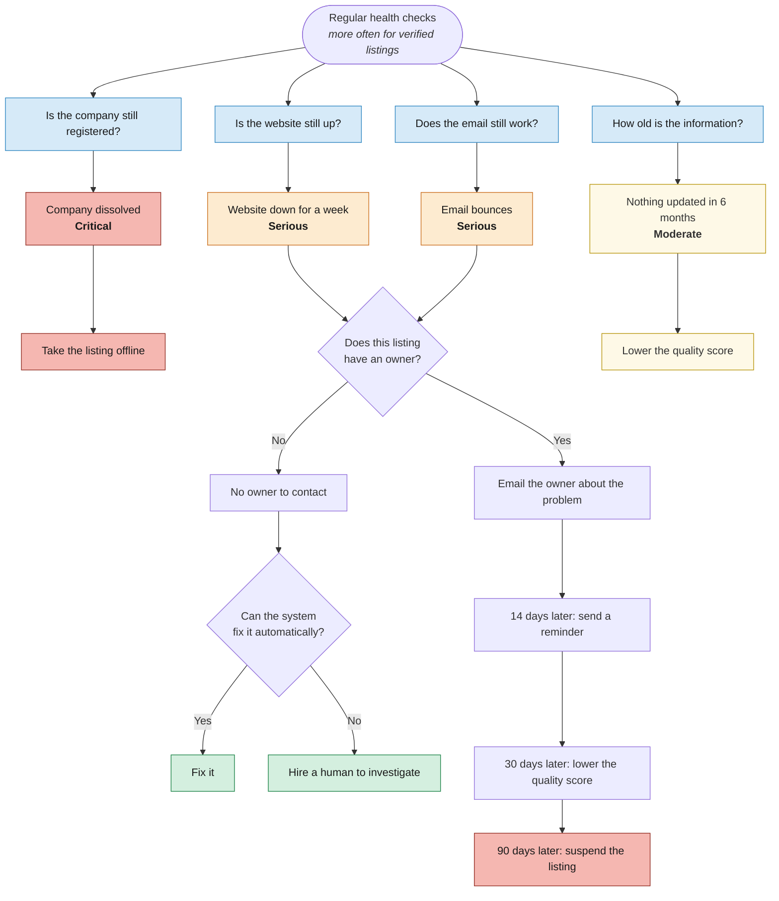
```mermaid
flowchart TD
    classDef check fill:#d6eaf8,stroke:#2e86c1,color:#1a1a1a
    classDef critical fill:#f5b7b1,stroke:#922b21,color:#1a1a1a
    classDef high fill:#fdebd0,stroke:#ca6f1e,color:#1a1a1a
    classDef medium fill:#fef9e7,stroke:#b7950b,color:#333
    classDef action fill:#d4efdf,stroke:#1e8449,color:#1a1a1a

    LC(["Regular health checks<br/><i>more often for verified listings</i>"])

    WEB["Is the website still up?"]:::check
    EMAIL["Does the email still work?"]:::check
    CH["Is the company still registered?"]:::check
    FRESH["How old is the information?"]:::check

    W404["Website down for a week<br/><b>Serious</b>"]:::high
    BOUNCE["Email bounces<br/><b>Serious</b>"]:::high
    DISSOLVED["Company dissolved<br/><b>Critical</b>"]:::critical
    STALE["Nothing updated in 6 months<br/><b>Moderate</b>"]:::medium

    ARCHIVE["Take the listing offline"]:::critical
    CLAIMED_Q{"Does this listing<br/>have an owner?"}
    DEGRADE["Lower the quality score"]:::medium

    NO_OWNER["No owner to contact"]
    YES_OWNER["Email the owner about the problem"]

    AUTOFIX{"Can the system<br/>fix it automatically?"}
    APPLY["Fix it"]:::action
    TASK["Hire a human to investigate"]:::action

    N14["14 days later: send a reminder"]
    N30["30 days later: lower the quality score"]
    N90["90 days later: suspend the listing"]:::critical

    LC --> WEB & EMAIL & CH & FRESH
    WEB --> W404
    EMAIL --> BOUNCE
    CH --> DISSOLVED
    FRESH --> STALE

    W404 & BOUNCE --> CLAIMED_Q
    DISSOLVED --> ARCHIVE
    STALE --> DEGRADE

    CLAIMED_Q -- "No" --> NO_OWNER --> AUTOFIX
    CLAIMED_Q -- "Yes" --> YES_OWNER --> N14 --> N30 --> N90
    AUTOFIX -- "Yes" --> APPLY
    AUTOFIX -- "No" --> TASK
```

---

## 10. The Task Scheduler

Every department can schedule tasks for the future. All these scheduled tasks go into one shared queue. A timer checks the queue regularly and runs whatever is due.

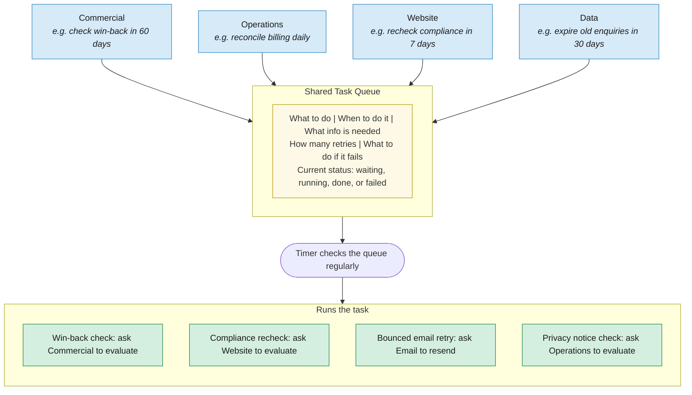
```mermaid
flowchart TD
    classDef domain fill:#d6eaf8,stroke:#2e86c1,color:#1a1a1a
    classDef db fill:#fef9e7,stroke:#b7950b,color:#333
    classDef worker fill:#d4efdf,stroke:#1e8449,color:#1a1a1a

    CR_D["Commercial<br/><i>e.g. check win-back in 60 days</i>"]:::domain
    OPS_D["Operations<br/><i>e.g. reconcile billing daily</i>"]:::domain
    PP_D["Website<br/><i>e.g. recheck compliance in 7 days</i>"]:::domain
    DL_D["Data<br/><i>e.g. expire old enquiries in 30 days</i>"]:::domain

    subgraph QUEUE ["Shared Task Queue"]
        direction LR
        SCHEMA["What to do | When to do it | What info is needed<br/>How many retries | What to do if it fails<br/>Current status: waiting, running, done, or failed"]:::db
    end

    TIMER(["Timer checks the queue regularly"])

    subgraph WORKER ["Runs the task"]
        direction TB
        W1["Win-back check: ask Commercial to evaluate"]:::worker
        W2["Compliance recheck: ask Website to evaluate"]:::worker
        W3["Bounced email retry: ask Email to resend"]:::worker
        W4["Privacy notice check: ask Operations to evaluate"]:::worker
    end

    CR_D & OPS_D & PP_D & DL_D --> QUEUE
    QUEUE --> TIMER --> WORKER
```

**35 different task types** are registered across the four departments — from daily billing checks to 60-day win-back evaluations.

---

## 11. How Support Requests Are Handled

Most support requests are resolved automatically. Humans are only brought in for things the system can't handle.

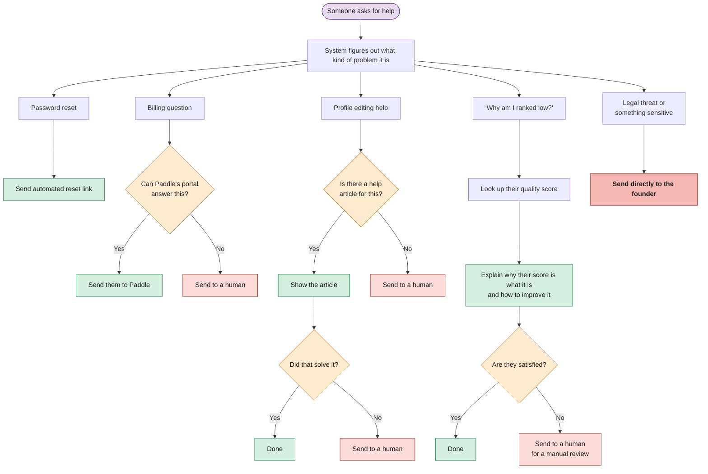
```mermaid
flowchart TD
    classDef startEnd fill:#e8daef,stroke:#6c3483,color:#1a1a1a
    classDef decision fill:#fdebd0,stroke:#ca6f1e,color:#1a1a1a
    classDef auto fill:#d4efdf,stroke:#1e8449,color:#1a1a1a
    classDef human fill:#fadbd8,stroke:#922b21,color:#1a1a1a
    classDef escalate fill:#f5b7b1,stroke:#922b21,color:#1a1a1a,font-weight:bold

    IN(["Someone asks for help"]):::startEnd
    CLASSIFY["System figures out what kind of problem it is"]

    PWD["Password reset"]
    BILL["Billing question"]
    PROF["Profile editing help"]
    RANK["'Why am I ranked low?'"]
    LEGAL["Legal threat or<br/>something sensitive"]

    AUTO_LINK["Send automated reset link"]:::auto

    PADDLE_Q{"Can Paddle's portal<br/>answer this?"}:::decision
    PADDLE_YES["Send them to Paddle"]:::auto
    PADDLE_NO["Send to a human"]:::human

    KB_Q{"Is there a help<br/>article for this?"}:::decision
    KB_YES["Show the article"]:::auto
    KB_NO["Send to a human"]:::human
    KB_RES{"Did that solve it?"}:::decision
    KB_CLOSE["Done"]:::auto
    KB_ROUTE["Send to a human"]:::human

    SCORE["Look up their quality score"]
    EXPLAIN["Explain why their score is what it is<br/>and how to improve it"]:::auto
    SAT{"Are they satisfied?"}:::decision
    SAT_CLOSE["Done"]:::auto
    SAT_ROUTE["Send to a human<br/>for a manual review"]:::human

    ESCALATE["Send directly to the founder"]:::escalate

    IN --> CLASSIFY
    CLASSIFY --> PWD & BILL & PROF & RANK & LEGAL

    PWD --> AUTO_LINK
    BILL --> PADDLE_Q
    PADDLE_Q -- "Yes" --> PADDLE_YES
    PADDLE_Q -- "No" --> PADDLE_NO

    PROF --> KB_Q
    KB_Q -- "Yes" --> KB_YES --> KB_RES
    KB_Q -- "No" --> KB_NO
    KB_RES -- "Yes" --> KB_CLOSE
    KB_RES -- "No" --> KB_ROUTE

    RANK --> SCORE --> EXPLAIN --> SAT
    SAT -- "Yes" --> SAT_CLOSE
    SAT -- "No" --> SAT_ROUTE

    LEGAL --> ESCALATE
```

*If the person asking for help is flagged as a churn risk, their request gets priority.*

---

## 12. How Many Claims Can We Handle?

Starting with ~4,700 imported listings. Most claims are approved automatically (75%). The system monitors workload and alerts when human reviewers are needed.

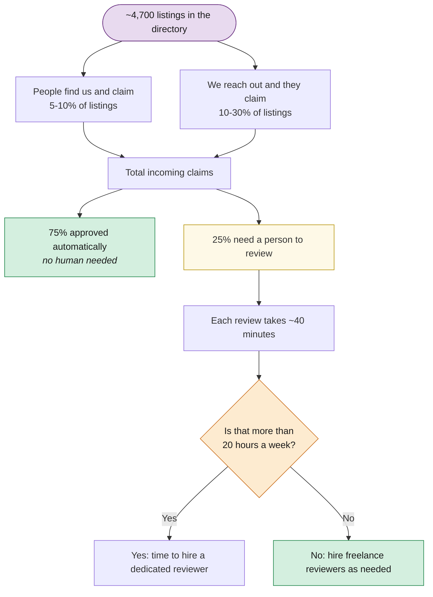
```mermaid
flowchart TD
    classDef input fill:#e8daef,stroke:#6c3483,color:#1a1a1a
    classDef split fill:#fef9e7,stroke:#b7950b,color:#333
    classDef decision fill:#fdebd0,stroke:#ca6f1e,color:#1a1a1a
    classDef action fill:#d4efdf,stroke:#1e8449,color:#1a1a1a

    TOTAL(["~4,700 listings in the directory"]):::input

    ORG["People find us and claim<br/>5-10% of listings"]
    OUT["We reach out and they claim<br/>10-30% of listings"]

    GROSS["Total incoming claims"]

    AUTO["75% approved automatically<br/><i>no human needed</i>"]:::action
    MANUAL["25% need a person to review"]:::split

    CAP["Each review takes ~40 minutes"]

    DECISION{"Is that more than<br/>20 hours a week?"}:::decision
    HIRE["Yes: time to hire a dedicated reviewer"]
    MARKET["No: hire freelance reviewers as needed"]:::action

    TOTAL --> ORG & OUT
    ORG & OUT --> GROSS
    GROSS --> AUTO & MANUAL
    MANUAL --> CAP --> DECISION
    DECISION -- "Yes" --> HIRE
    DECISION -- "No" --> MARKET
```

---

## 13. Three Ways to Get a Listing

Everyone starts by creating an account. Then there are three paths to getting a live listing.

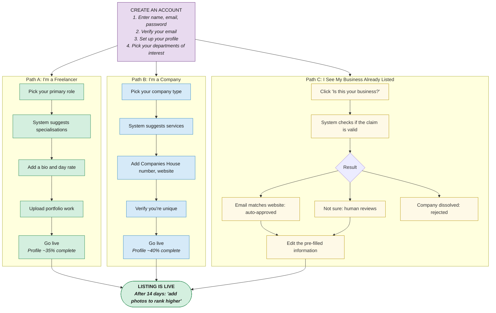
```mermaid
flowchart TD
    classDef core fill:#e8daef,stroke:#6c3483,color:#1a1a1a
    classDef pathA fill:#d4efdf,stroke:#1e8449,color:#1a1a1a
    classDef pathB fill:#d6eaf8,stroke:#2e86c1,color:#1a1a1a
    classDef pathC fill:#fef9e7,stroke:#b7950b,color:#333
    classDef live fill:#d4efdf,stroke:#1e8449,color:#1a1a1a,font-weight:bold

    CORE["CREATE AN ACCOUNT<br/><i>1. Enter name, email, password<br/>2. Verify your email<br/>3. Set up your profile<br/>4. Pick your departments of interest</i>"]:::core

    subgraph A ["Path A: I'm a Freelancer"]
        direction TB
        A1["Pick your primary role"]:::pathA
        A2["System suggests specialisations"]:::pathA
        A3["Add a bio and day rate"]:::pathA
        A4["Upload portfolio work"]:::pathA
        A5["Go live<br/><i>Profile ~35% complete</i>"]:::pathA
        A1 --> A2 --> A3 --> A4 --> A5
    end

    subgraph B ["Path B: I'm a Company"]
        direction TB
        B1["Pick your company type"]:::pathB
        B2["System suggests services"]:::pathB
        B3["Add Companies House number, website"]:::pathB
        B4["Verify you're unique"]:::pathB
        B5["Go live<br/><i>Profile ~40% complete</i>"]:::pathB
        B1 --> B2 --> B3 --> B4 --> B5
    end

    subgraph C ["Path C: I See My Business Already Listed"]
        direction TB
        C1["Click 'Is this your business?'"]:::pathC
        C2["System checks if the claim is valid"]:::pathC
        C3{"Result"}
        C4["Email matches website: auto-approved"]:::pathC
        C5["Not sure: human reviews"]:::pathC
        C6["Company dissolved: rejected"]:::pathC
        C7["Edit the pre-filled information"]:::pathC
        C1 --> C2 --> C3
        C3 --> C4 & C5 & C6
        C4 & C5 --> C7
    end

    LIVE(["LISTING IS LIVE<br/><i>After 14 days: 'add photos to rank higher'</i>"]):::live

    CORE --> A & B & C
    A5 & B5 & C7 --> LIVE
```

---

## 14. How We Convert Free Users to Paid

A timed sequence of nudges based on actual engagement data. If nothing works, we back off. Real events (like receiving an enquiry) can shortcut the whole funnel.

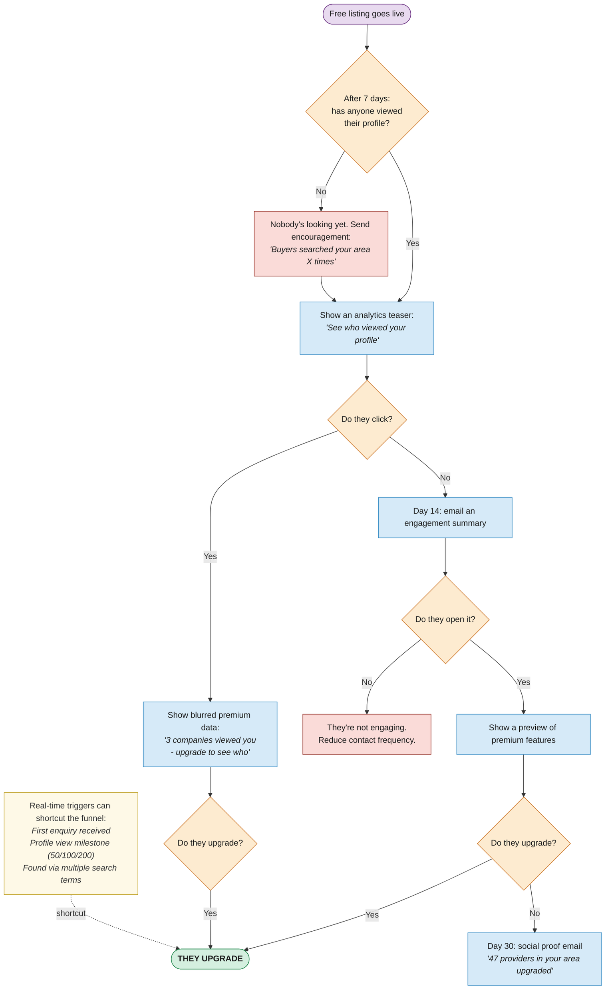
```mermaid
flowchart TD
    classDef start fill:#e8daef,stroke:#6c3483,color:#1a1a1a
    classDef decision fill:#fdebd0,stroke:#ca6f1e,color:#1a1a1a
    classDef action fill:#d6eaf8,stroke:#2e86c1,color:#1a1a1a
    classDef checkout fill:#d4efdf,stroke:#1e8449,color:#1a1a1a,font-weight:bold
    classDef cold fill:#fadbd8,stroke:#922b21,color:#1a1a1a
    classDef event fill:#fef9e7,stroke:#b7950b,color:#333

    FREE(["Free listing goes live"]):::start
    D7Q{"After 7 days:<br/>has anyone viewed<br/>their profile?"}:::decision

    COLD["Nobody's looking yet. Send encouragement:<br/><i>'Buyers searched your area X times'</i>"]:::cold

    TEASER["Show an analytics teaser:<br/><i>'See who viewed your profile'</i>"]:::action

    CLICK1{"Do they click?"}:::decision
    BLUR["Show blurred premium data:<br/><i>'3 companies viewed you<br/>- upgrade to see who'</i>"]:::action

    EMAIL14["Day 14: email an engagement summary"]:::action
    OPEN{"Do they open it?"}:::decision
    LOW["They're not engaging.<br/>Reduce contact frequency."]:::cold
    VIEW_T["Show a preview of premium features"]:::action

    CLICK2{"Do they upgrade?"}:::decision
    D30["Day 30: social proof email<br/><i>'47 providers in your area upgraded'</i>"]:::action
    CLICK3{"Do they upgrade?"}:::decision

    CHECKOUT(["THEY UPGRADE"]):::checkout

    EVENTS["Real-time triggers can shortcut the funnel:<br/><i>First enquiry received<br/>Profile view milestone (50/100/200)<br/>Found via multiple search terms</i>"]:::event

    FREE --> D7Q
    D7Q -- "Yes" --> TEASER
    D7Q -- "No" --> COLD --> TEASER

    TEASER --> CLICK1
    CLICK1 -- "Yes" --> BLUR --> CLICK3
    CLICK1 -- "No" --> EMAIL14 --> OPEN

    OPEN -- "Yes" --> VIEW_T --> CLICK2
    OPEN -- "No" --> LOW

    CLICK2 -- "Yes" --> CHECKOUT
    CLICK2 -- "No" --> D30

    CLICK3 -- "Yes" --> CHECKOUT

    EVENTS -. "shortcut" .-> CHECKOUT
```

---

## 15. When Someone Cancels

Three possible reasons. Each gets a different response. After 60 days, we check if they're missing out — and only contact them if they genuinely are.

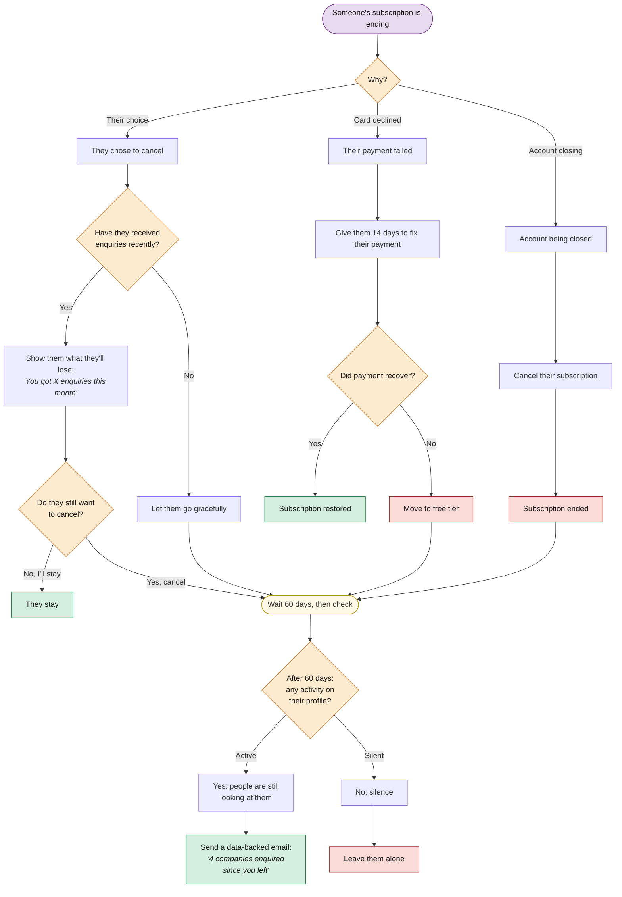
```mermaid
flowchart TD
    classDef start fill:#e8daef,stroke:#6c3483,color:#1a1a1a
    classDef decision fill:#fdebd0,stroke:#ca6f1e,color:#1a1a1a
    classDef retain fill:#d4efdf,stroke:#1e8449,color:#1a1a1a
    classDef lose fill:#fadbd8,stroke:#922b21,color:#1a1a1a
    classDef winback fill:#fef9e7,stroke:#b7950b,color:#333

    CANCEL(["Someone's subscription is ending"]):::start
    REASON{"Why?"}:::decision

    VOL["They chose to cancel"]
    PAY["Their payment failed"]
    RECON["Account being closed"]

    ENQ{"Have they received<br/>enquiries recently?"}:::decision
    SHOW["Show them what they'll lose:<br/><i>'You got X enquiries this month'</i>"]
    ACCEPT1["Let them go gracefully"]

    ANYWAY{"Do they still want<br/>to cancel?"}:::decision
    RETAIN["They stay"]:::retain

    GRACE["Give them 14 days to fix their payment"]
    RECOVERED{"Did payment recover?"}:::decision
    RESTORED["Subscription restored"]:::retain
    DOWNGRADE["Move to free tier"]:::lose

    ACCEPT2["Cancel their subscription"]
    END_SUB["Subscription ended"]:::lose

    WINBACK(["Wait 60 days, then check"]):::winback

    D60{"After 60 days:<br/>any activity on<br/>their profile?"}:::decision
    ENGAGED["Yes: people are still<br/>looking at them"]
    ZERO["No: silence"]

    SEND["Send a data-backed email:<br/><i>'4 companies enquired<br/>since you left'</i>"]:::retain
    NOTHING["Leave them alone"]:::lose

    CANCEL --> REASON
    REASON -- "Their choice" --> VOL --> ENQ
    REASON -- "Card declined" --> PAY --> GRACE
    REASON -- "Account closing" --> RECON --> ACCEPT2

    ENQ -- "Yes" --> SHOW --> ANYWAY
    ENQ -- "No" --> ACCEPT1

    ANYWAY -- "No, I'll stay" --> RETAIN
    ANYWAY -- "Yes, cancel" --> WINBACK
    ACCEPT1 --> WINBACK

    GRACE --> RECOVERED
    RECOVERED -- "Yes" --> RESTORED
    RECOVERED -- "No" --> DOWNGRADE --> WINBACK

    ACCEPT2 --> END_SUB --> WINBACK

    WINBACK --> D60
    D60 -- "Active" --> ENGAGED --> SEND
    D60 -- "Silent" --> ZERO --> NOTHING
```

---

## 16. The Six Shared Tools

Every department uses these six building blocks. They're the foundation everything else is built on.

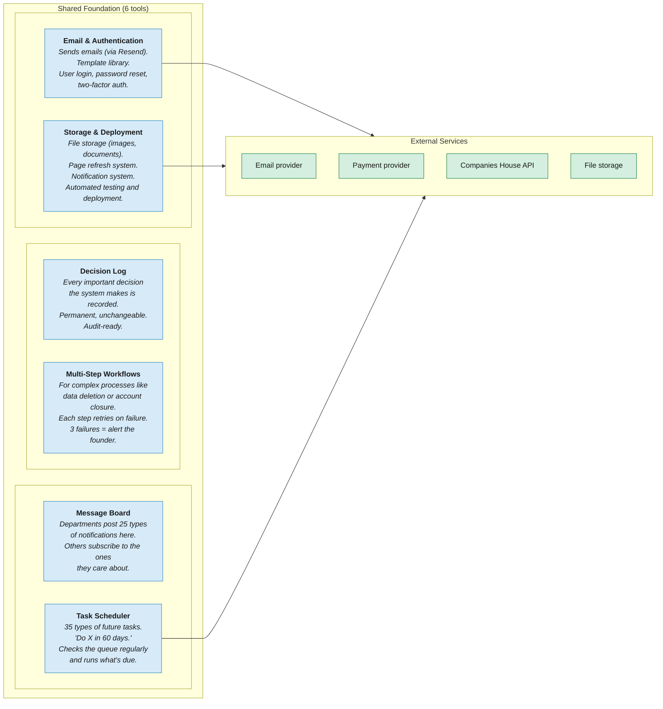
```mermaid
graph LR
    classDef mod fill:#d6eaf8,stroke:#2e86c1,color:#1a1a1a
    classDef svc fill:#d4efdf,stroke:#1e8449,color:#1a1a1a

    subgraph S0 ["Shared Foundation (6 tools)"]
        direction TB

        subgraph ROW1 [" "]
            direction LR
            EB["<b>Message Board</b><br/><i>Departments post 25 types<br/>of notifications here.<br/>Others subscribe to the ones<br/>they care about.</i>"]:::mod

            DAS["<b>Task Scheduler</b><br/><i>35 types of future tasks.<br/>'Do X in 60 days.'<br/>Checks the queue regularly<br/>and runs what's due.</i>"]:::mod
        end

        subgraph ROW2 [" "]
            direction LR
            DEC["<b>Decision Log</b><br/><i>Every important decision<br/>the system makes is recorded.<br/>Permanent, unchangeable.<br/>Audit-ready.</i>"]:::mod

            FE["<b>Multi-Step Workflows</b><br/><i>For complex processes like<br/>data deletion or account closure.<br/>Each step retries on failure.<br/>3 failures = alert the founder.</i>"]:::mod
        end

        subgraph ROW3 [" "]
            direction LR
            EA["<b>Email & Authentication</b><br/><i>Sends emails (via Resend).<br/>Template library.<br/>User login, password reset,<br/>two-factor auth.</i>"]:::mod

            ST["<b>Storage & Deployment</b><br/><i>File storage (images, documents).<br/>Page refresh system.<br/>Notification system.<br/>Automated testing and deployment.</i>"]:::mod
        end
    end

    subgraph SVC ["External Services"]
        direction TB
        S1["Email provider"]:::svc
        S2["Payment provider"]:::svc
        S3["Companies House API"]:::svc
        S4["File storage"]:::svc
    end

    EA --> SVC
    ST --> SVC
    DAS --> SVC
```

---

## 17. How Email Works End to End

When the system sends an email, it goes through a safety chain: check if the person is suppressed, send it, track delivery, and handle bounces.

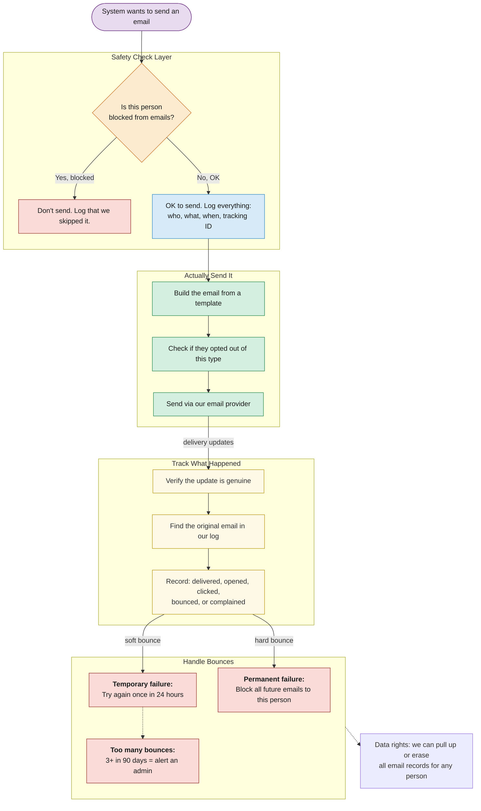
```mermaid
flowchart TD
    classDef app fill:#e8daef,stroke:#6c3483,color:#1a1a1a
    classDef decorator fill:#d6eaf8,stroke:#2e86c1,color:#1a1a1a
    classDef inner fill:#d4efdf,stroke:#1e8449,color:#1a1a1a
    classDef webhook fill:#fef9e7,stroke:#b7950b,color:#333
    classDef bounce fill:#fadbd8,stroke:#922b21,color:#1a1a1a
    classDef decision fill:#fdebd0,stroke:#ca6f1e,color:#1a1a1a

    APP(["System wants to send an email"]):::app

    subgraph LOGGING ["Safety Check Layer"]
        direction TB
        SUP_CHECK{"Is this person<br/>blocked from emails?"}:::decision
        SUP_YES["Don't send. Log that we skipped it."]:::bounce
        DELEGATE["OK to send. Log everything:<br/>who, what, when, tracking ID"]:::decorator
    end

    subgraph INNER ["Actually Send It"]
        direction TB
        RENDER["Build the email from a template"]:::inner
        PREF["Check if they opted out of this type"]:::inner
        SEND["Send via our email provider"]:::inner
        RENDER --> PREF --> SEND
    end

    subgraph WEBHOOK ["Track What Happened"]
        direction TB
        HMAC["Verify the update is genuine"]:::webhook
        LOOKUP["Find the original email in our log"]:::webhook
        VALIDATE["Record: delivered, opened, clicked,<br/>bounced, or complained"]:::webhook
        HMAC --> LOOKUP --> VALIDATE
    end

    subgraph BOUNCE_H ["Handle Bounces"]
        direction TB
        HARD["<b>Permanent failure:</b><br/>Block all future emails to this person"]:::bounce
        SOFT["<b>Temporary failure:</b><br/>Try again once in 24 hours"]:::bounce
        THRESH["<b>Too many bounces:</b><br/>3+ in 90 days = alert an admin"]:::bounce
    end

    RIGHTS["Data rights: we can pull up or erase<br/>all email records for any person"]

    APP --> SUP_CHECK
    SUP_CHECK -- "Yes, blocked" --> SUP_YES
    SUP_CHECK -- "No, OK" --> DELEGATE
    DELEGATE --> RENDER
    SEND -- "delivery updates" --> HMAC
    VALIDATE -- "hard bounce" --> HARD
    VALIDATE -- "soft bounce" --> SOFT
    SOFT -.-> THRESH
    BOUNCE_H -.-> RIGHTS
```

---

## 18. Checking Listing Quality

Before a listing goes live (or after it's edited), it runs through a series of checks. If any check fails, it stops there.

```mermaid
flowchart TD
    classDef input fill:#e8daef,stroke:#6c3483,color:#1a1a1a
    classDef rule fill:#d6eaf8,stroke:#2e86c1,color:#1a1a1a
    classDef taxonomy fill:#d4efdf,stroke:#1e8449,color:#1a1a1a
    classDef import fill:#fef9e7,stroke:#b7950b,color:#333

    INPUT(["Listing is created or updated"]):::input

    subgraph PIPELINE ["Quality checks (stops on first failure)"]
        direction LR
        R1["<b>Check 1: Is this a duplicate?</b><br/><i>Compare names, Companies House numbers.<br/>Catch transitive duplicates<br/>(A = B, B = C, therefore A = C)</i>"]:::rule
        R2["<b>Check 2: Is the identity real?</b><br/><i>Does the name match<br/>Companies House records?</i>"]:::rule
        R3["<b>Check 3: Is the CH number unique?</b><br/><i>No two active listings can<br/>share the same registration</i>"]:::rule
        R1 -- "pass" --> R2 -- "pass" --> R3
    end

    TAX["<b>Category overlap analysis</b><br/><i>How much do two listings' services overlap?<br/>7 industries, 64 service areas, 269 specialisations</i>"]:::taxonomy

    subgraph IMPORT ["Bulk Import (one-time)"]
        direction TB
        I1["5 stages: clean up data, verify companies,<br/>remove duplicates, save, send privacy notices"]:::import
        I2["~4,657 businesses imported"]:::import
        I3["Privacy: emailed or flagged on their page"]:::import
    end

    INPUT --> PIPELINE
    R1 -.-> TAX
    IMPORT -.-> PIPELINE
```

---

## 19. How Search Works Under the Hood

The buyer types a query. The system expands it (e.g. abbreviations), searches the database, and ranks results. If nothing matches, it falls back to fuzzy name matching.

```mermaid
flowchart TD
    classDef input fill:#e8daef,stroke:#6c3483,color:#1a1a1a
    classDef process fill:#d6eaf8,stroke:#2e86c1,color:#1a1a1a
    classDef decision fill:#fdebd0,stroke:#ca6f1e,color:#1a1a1a
    classDef fallback fill:#fadbd8,stroke:#922b21,color:#1a1a1a
    classDef result fill:#d4efdf,stroke:#1e8449,color:#1a1a1a
    classDef infra fill:#fef9e7,stroke:#b7950b,color:#333

    SP(["Buyer enters a search"]):::input

    IDX["Pre-built search index<br/><i>Business names weighted highest,<br/>then service tags, then descriptions.<br/>Includes abbreviation/synonym lookups.</i>"]:::infra

    FILTERS["Narrow down by:<br/><i>industry, service type, company type,<br/>pricing tier, only active listings</i>"]:::process

    E1{"Did they type any words?"}:::decision

    EMPTY["No words typed:<br/>show all listings ranked by quality"]:::fallback

    EXPAND["Expand the query<br/><i>'DP' also matches 'Director of Photography'</i>"]:::process

    FTS["Search the index for matches"]:::process

    HAS{"Any results?"}:::decision

    TRI["Try fuzzy matching<br/><i>catches typos and partial names</i>"]:::fallback

    RESULT(["Show the results, best first"]):::result

    SP --> FILTERS --> E1
    E1 -- "No" --> EMPTY --> RESULT
    E1 -- "Yes" --> EXPAND --> FTS --> HAS
    HAS -- "Yes" --> RESULT
    HAS -- "No" --> TRI --> RESULT

    IDX -.-> FTS
    IDX -.-> TRI
```
