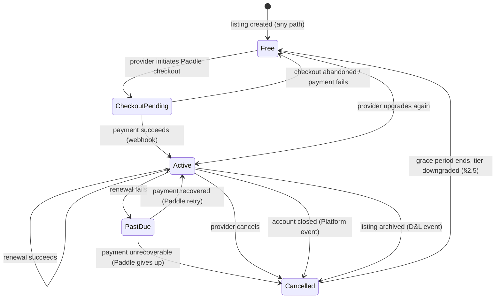
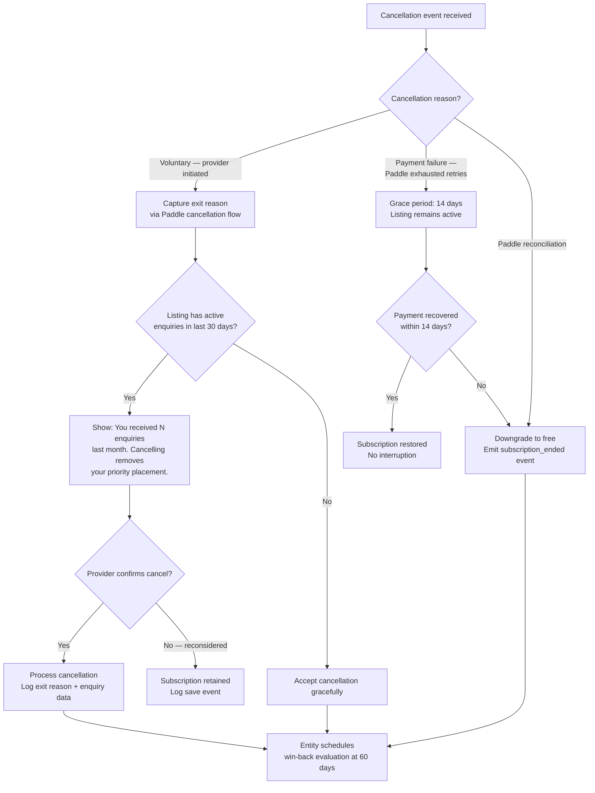
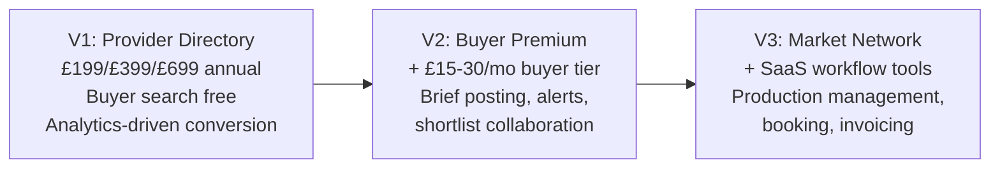

# Commercial & Revenue — Concept Design

**Status:** Draft v4 — cross stress tested with D&L (v5), Operations (v5), Platform & Product (v4). 3 rounds: 35 intra-domain + 20 cross-domain scenarios, 55 total fixes
**Domain:** Commercial & Revenue
**Last updated:** 2026-02-11
**Inputs:** `competitor-pricing-findings.md`, `analogous-directory-pricing-findings.md`, `freemium-conversion-findings.md`, `provider-buyer-duality-findings.md`, `data-and-listings.md` (v5), `operations.md` (v5), `platform-and-product.md` (v4), `entity-architecture-frame.md`
**Downstream:** `cross-domain-dependencies.md`, requirements specification, implementation

**v4 additions (cross stress test with D&L × Ops × PP):** Paddle webhook routing clarified — Operations is sole coordinator, Commercial consumes domain events only (CR-X-14). `subscription_tier_changed` single-emitter rule: Operations emits, Commercial consumes (CR-X-2). Checkout precondition guard: listing must be claimed with accountId (CR-X-1). External cancellation reason tracking via `pending_cancellation` record (CR-X-4). Low-quality intervention grace period for new subscribers (CR-X-5). Feature gate friction query interface from Operations (CR-X-6). Win-back delivery confirmation loop (CR-X-7). `computeFeatureAccess` ownership clarified — Commercial owns canonical definition, Platform imports (CR-X-8). Sponsored listing lifecycle filter (CR-X-9). Refund processing emits `subscription_tier_changed` via `applyDowngrade` (CR-X-15). Analytics query interface dependency on Platform (CR-X-16). Conversion email templates delegated to Platform template library (CR-X-19). Launch discount coupon restriction: new subscriptions only (CR-X-3). `enquiryCount` removed — reads D&L engagement counters (CR-X-10). `basicAnalytics` data source annotated (CR-X-18).

---

## Summary

CALLSHEET's commercial model is a flat-fee provider subscription with a designed-in evolution path toward market network monetisation. The entity optimises revenue as a decision architecture — not a human's pricing intuition. Three investigation streams independently converged on £199/£399/£699 annual pricing. This document specifies the subscription lifecycle, tier differentiation, multi-listing pricing, conversion optimisation, revenue perception, and the V1→V2→V3 commercial evolution — all as entity decision architectures.

**Key structural decisions:**

- Subscriptions attach to Listings, not Accounts. Each Listing carries its own tier. Multi-listing Accounts hold multiple Paddle subscriptions under one customer.
- Revenue optimisation is entity perception: churn signals, conversion friction, pricing page behaviour, and feature gate complaints are inputs to the entity's decision engine, not quarterly human reviews.
- The free/paid boundary is a hard constraint set at launch and not moved. Analytics-as-conversion-lever is the primary upgrade trigger.
- V2 buyer-side premium and V3 SaaS tools are architecturally anticipated but not commercially active at V1.
- VAT treatment: all published prices are ex-VAT. Paddle handles VAT calculation and display at checkout.

---

## 1. Pricing Architecture

### 1.1 Confirmed Pricing

Three investigation streams converged. Pricing is settled. [Source: `analogous-directory-pricing-findings.md` — §Pricing Tension Resolution]

```typescript
type SubscriptionTier = "free" | "standard" | "premium" | "partner"

type TierPricing = {
  tier: SubscriptionTier
  annualPrice: number       // GBP, ex-VAT
  monthlyPrice: number      // GBP, ex-VAT — rounded up to clean number, 15–20% above annual monthly equivalent
  targetPersona: string
  billingCadence: "annual" | "monthly"
}

const PRICING: TierPricing[] = [
  { tier: "free",     annualPrice: 0,   monthlyPrice: 0,  targetPersona: "Directory population. Buyer-satisfying base." },
  { tier: "standard", annualPrice: 199, monthlyPrice: 19, targetPersona: "Sole traders, emerging freelancers" },
  { tier: "premium",  annualPrice: 399, monthlyPrice: 39, targetPersona: "Established freelancers, small companies" },
  { tier: "partner",  annualPrice: 699, monthlyPrice: 69, targetPersona: "Established companies, facilities, post houses" }
]
```

**Pricing rationale:**

| Tier | Market Anchor | Why This Price |
|---|---|---|
| Standard £199/yr | Above 4rfv Basic (£120), below 4rfv Profile (£395). Below Bark Elite Pro (~£239). | Lowest barrier to paid. "Under £200" psychological threshold. |
| Premium £399/yr | Matches Clutch Verified (~£399). Below The Knowledge Enhanced (£495). | Natural sweet spot for established providers who want competitive advantage. |
| Partner £699/yr | Below The Knowledge Premier (£1,120). Below Checkatrade Lite (~£1,022). | Top tier without entering lead-gen pricing territory. |

**Annual vs monthly presentation:** Annual is the default display. Monthly option exists for flexibility but is not promoted. The UK production market thinks in annual terms (existing competitors charge annually). Monthly billing creates higher churn risk — the entity monitors annual-vs-monthly cohort retention as a learning signal.

**Monthly pricing rule:** Monthly prices are the annual-equivalent divided by 12, rounded up to the nearest clean integer that yields a 15–20% premium. Standard: £199/12=£16.58 → £19 (14.6%). Premium: £399/12=£33.25 → £39 (17.3%). Partner: £699/12=£58.25 → £69 (18.5%). The rule is "round to clean number in the 15–20% premium band" — not a fixed percentage. [CR-3]

### 1.1a Pricing Change Protocol

[CR-34] If the entity or principal decides to change pricing (e.g., raise Standard from £199 to £249):

- **Existing subscribers are grandfathered** at their current price until they voluntarily change tier. A Standard subscriber at £199 continues paying £199 on renewal indefinitely.
- **New subscribers and returning churned subscribers** pay the new price.
- **Paddle implementation:** Create a new Paddle plan at the new price. Sunset the old plan for new subscriptions (set to inactive). Existing subscriptions remain on the old plan. Paddle handles this natively — no custom billing logic needed.
- **Revenue perception:** The entity stores `effectivePriceAtSubscription` per listing alongside `subscriptionTier`. Revenue perception distinguishes grandfathered MRR from new-price MRR. Price changes require principal approval and are logged as governance events.
- **Communication:** Existing subscribers receive no notification (their price doesn't change). Pricing page updates to show new prices. Grandfathering is not advertised — it's an implied contract, per Principle C7.

### 1.2 VAT Treatment

All published prices are **ex-VAT**. Rationale: CALLSHEET's customers are B2B (production companies, freelancers). B2B buyers expect ex-VAT pricing. Paddle handles VAT calculation at checkout — UK VAT-registered buyers see VAT separately; non-UK buyers see their local tax treatment.

**Pre-VAT registration:** CALLSHEET Ltd will initially be below the £90K VAT threshold. Until registered, no VAT is charged. The entity monitors rolling 12-month revenue and alerts the principal at 80% of threshold (£72K) per Operations §5 compliance calendar. On VAT registration, Paddle automatically applies UK VAT to all new and renewing subscriptions. No price changes needed — £199 ex-VAT becomes £238.80 inc-VAT, which Paddle displays correctly.

**Pricing page display:** Show ex-VAT prices with a footnote: "All prices exclude VAT. VAT will be added at checkout where applicable." This is standard for UK B2B directories (4rfv, The Knowledge both show ex-VAT).

[Resolves D&L open question #5]

### 1.3 Launch Discount

First-year Standard tier at **£99** (annual only). Rationale: matches Mandy's annual price point (psychologically familiar in the industry), reduces switching cost to near-zero, and creates urgency ("first 500 subscribers" or time-limited).

```typescript
type LaunchDiscount = {
  eligibleTier: "standard"
  discountedAnnualPrice: 99         // GBP ex-VAT (vs £199 full price)
  mechanism: "coupon_code"          // applied via Paddle coupon
  maxRedemptions: 500               // or 6 months from launch, whichever first
  renewalPrice: 199                 // full price on year 2
  restrictions: "annual_only"       // monthly subscribers ineligible
  paddleCouponScope: "new_subscriptions_only"  // [CR-X-3] prevents application to existing subscriptions
}
```

**Entity decision:** The entity monitors coupon redemption velocity. If <50% redeemed after 3 months, extend the offer or widen eligibility. If >80% redeemed within 1 month, consider whether to create a similar offer for Premium (£199 first year). These decisions are entity-autonomous within the launch discount budget.

---

## 2. Subscription Lifecycle

### 2.1 Lifecycle State Machine

Subscriptions are per-Listing, managed via Paddle. The entity does not build custom billing — Paddle is the source of truth for subscription state.



**CheckoutPending** is not a billing state — it is a transient UI state lasting seconds to minutes while the provider completes Paddle's checkout overlay. No tier features are granted during CheckoutPending. No free trial period exists at V1. The entity transitions to Active only on receipt of Paddle's `checkout.completed` webhook. If the provider closes the checkout overlay, the state reverts to Free with no side effects. [CR-1]

**Checkout precondition [CR-X-1]:** Paddle checkout may only be initiated for a listing where `listing.claimStatus in ["claimed"]` AND `listing.accountId != null`. Platform blocks the checkout CTA on unclaimed and `pending_review` listings. If a `checkout.completed` webhook arrives for a listing that fails this precondition (race condition between claim and checkout), the event is deferred to a retry queue and reprocessed every 5 minutes for up to 1 hour. If the listing is still not claimed after 1 hour, the entity refunds the transaction via Paddle API and logs the anomaly. This prevents paid features being granted to unclaimed listings.

**Paddle manages:** payment collection, retry logic (3 attempts over 7 days), invoice generation, VAT calculation, customer portal.

**Paddle webhook routing [CR-X-14]:** Operations is the sole coordinator for Paddle webhooks. Paddle webhooks are received by Operations' webhook handler, which performs signature verification, idempotency dedup, and state coordination before emitting domain events (`subscription_tier_changed`, `subscription_ended`). Commercial does NOT process Paddle webhooks directly — it consumes domain events from Operations. The `mapPaddleWebhook` function (§2.2) is documented here for reference but executes within Operations' webhook handler, not as a Commercial endpoint. This eliminates the double-processing risk where both Operations reconciliation and Commercial webhook handling act on the same subscription change.

**Webhook processing safeguards [CR-10]:**
- **Signature verification:** All Paddle webhooks verified against Paddle webhook secret before processing. Unsigned or invalid-signature requests rejected with 401.
- **Idempotency:** Each Paddle event has a unique `event_id`. The entity stores processed event IDs and skips duplicates (Paddle retries on non-2xx responses).
- **Out-of-order handling:** The subscription lifecycle handler validates that the incoming event is compatible with the listing's current subscription state. If incompatible (e.g., `renewal_succeeded` for a listing in Free state), the event is logged as anomalous and deferred to billing reconciliation (Operations §7) for resolution.
- **Webhook endpoint returns 200 immediately** after signature verification and event ID dedup check, then processes asynchronously. This prevents Paddle timeout retries.

### 2.2 Paddle Webhook Mapping

[CR-21] Paddle emits a finite set of webhook event types. The entity maps these to the internal `SubscriptionEvent` type. Paddle's `subscription.updated` covers upgrades, downgrades, *and* billing cadence changes — the mapping function disambiguates.

```
mapPaddleWebhook(paddleEvent: PaddleWebhookEvent): SubscriptionEvent | null

  match paddleEvent.event_type:
    "subscription.created" | "transaction.completed":
      return { type: "checkout_completed",
               listingId: paddleEvent.data.custom_data.listingId,
               tier: mapPaddlePlan(paddleEvent.data.items[0].price.id),
               billingCadence: paddleEvent.data.billing_cycle.interval == "month" ? "monthly" : "annual",
               paddleSubscriptionId: paddleEvent.data.id }

    "subscription.updated":
      previousTier = mapPaddlePlan(paddleEvent.data.previous.items[0].price.id)
      newTier = mapPaddlePlan(paddleEvent.data.items[0].price.id)
      previousCadence = paddleEvent.data.previous.billing_cycle.interval == "month" ? "monthly" : "annual"
      newCadence = paddleEvent.data.billing_cycle.interval == "month" ? "monthly" : "annual"

      if previousTier != newTier AND tierRank(newTier) > tierRank(previousTier):
        return { type: "subscription_upgraded", listingId: extractListingId(paddleEvent),
                 previousTier, newTier }
      if previousTier != newTier AND tierRank(newTier) < tierRank(previousTier):
        return { type: "subscription_downgraded", listingId: extractListingId(paddleEvent),
                 previousTier, newTier }
      if previousCadence != newCadence:
        return { type: "billing_cadence_changed", listingId: extractListingId(paddleEvent),
                 tier: newTier, previousCadence, newCadence }
      // Same tier, same cadence — no-op (e.g. payment method update)
      log({ type: "paddle_webhook_noop", eventId: paddleEvent.event_id })
      return null

    "subscription.canceled":
      return { type: "subscription_cancelled",
               listingId: extractListingId(paddleEvent),
               tier: mapPaddlePlan(paddleEvent.data.items[0].price.id),
               reason: inferCancellationReason(paddleEvent),
               effectiveAt: paddleEvent.data.scheduled_change?.effective_at ?? now() }

    "transaction.payment_failed":
      return { type: "renewal_failed",
               listingId: extractListingId(paddleEvent),
               tier: mapPaddlePlan(paddleEvent.data.items[0].price.id),
               attempt: paddleEvent.data.payments?.length ?? 1 }

    _:
      log({ type: "paddle_webhook_unrecognised", eventType: paddleEvent.event_type,
            eventId: paddleEvent.event_id, raw: paddleEvent })
      return null
```

### 2.3 Subscription Lifecycle Decision Architecture

```typescript
type SubscriptionEvent =
  | { type: "checkout_completed", listingId: UUID, tier: SubscriptionTier, billingCadence: "annual" | "monthly", paddleSubscriptionId: string }
  | { type: "renewal_succeeded", listingId: UUID, tier: SubscriptionTier }
  | { type: "renewal_failed", listingId: UUID, tier: SubscriptionTier, attempt: number }
  | { type: "subscription_cancelled", listingId: UUID, tier: SubscriptionTier, reason: CancellationReason, effectiveAt: ISO8601 }
  | { type: "subscription_upgraded", listingId: UUID, previousTier: SubscriptionTier, newTier: SubscriptionTier }
  | { type: "subscription_downgraded", listingId: UUID, previousTier: SubscriptionTier, newTier: SubscriptionTier }
  | { type: "billing_cadence_changed", listingId: UUID, tier: SubscriptionTier, previousCadence: "annual" | "monthly", newCadence: "annual" | "monthly" }  // [CR-21]
  | { type: "grace_period_expired", listingId: UUID, previousTier: SubscriptionTier }

// [CR-5] All cancellation paths — not just Paddle-initiated
type CancellationReason =
  | "voluntary"              // provider cancels via Paddle portal
  | "payment_failure"        // Paddle exhausted retries
  | "paddle_reconciliation"  // billing reconciliation catch-all
  | "account_closed"         // Platform emits account_closed → entity cancels via Paddle API
  | "listing_archived"       // D&L emits listing_archived → entity cancels via Paddle API

function handleSubscriptionEvent(event: SubscriptionEvent): void

  match event.type:
    "checkout_completed":
      listing = findListing(event.listingId)
      listing.commercial.subscriptionTier = event.tier
      listing.commercial.paddleSubscriptionId = event.paddleSubscriptionId
      emitEvent("subscription_tier_changed", {
        listingId: event.listingId,
        previousTier: "free",
        newTier: event.tier,
        reason: "checkout"
      })
      // Trigger: Operations recalculates enrichment cadence
      // Trigger: Platform recalculates feature access
      // Entity learning: log conversion (free → paid, time since account creation, quality score at conversion)

    "renewal_succeeded":
      logRenewal(event)
      // Entity perception: renewal is a positive signal. Feed into L4 (verification ↔ renewal correlation).

    "renewal_failed":
      if event.attempt == 1:
        // Paddle handles retry. Entity sends supplementary notification.
        listing = findListing(event.listingId)
        createNotification(listing.accountId, {
          type: "payment_warning",
          message: "Your payment for " + listing.name + " didn't go through. We'll retry automatically.",
          actions: [{ label: "Update payment method", target: paddlePortalUrl(listing) }]
        })
      // Do NOT downgrade on first failure — Paddle retries over 7 days.

    "subscription_cancelled":
      evaluateChurnIntervention(event)

    "subscription_upgraded":
      emitEvent("subscription_tier_changed", {
        listingId: event.listingId,
        previousTier: event.previousTier,
        newTier: event.newTier,
        reason: "upgrade"
      })

    "subscription_downgraded":
      applyDowngrade(event)  // see §2.5
      emitEvent("subscription_tier_changed", {
        listingId: event.listingId,
        previousTier: event.previousTier,
        newTier: event.newTier,
        reason: "downgrade"
      })

    // [CR-21] Same-tier billing cadence change (monthly ↔ annual)
    "billing_cadence_changed":
      listing = findListing(event.listingId)
      listing.commercial.billingCadence = event.newCadence
      logPerceptionSignal({
        type: "billing_cadence_switch",
        listingId: event.listingId,
        previousCadence: event.previousCadence,
        newCadence: event.newCadence
      })
      // Entity learning: monthly → annual is a retention signal. Annual → monthly is a churn risk signal.

    // [CR-2] Terminal event when grace period expires — the actual tier change
    "grace_period_expired":
      listing = findListing(event.listingId)
      // [CR-22] Guard: if listing is already free (e.g. refund processed during grace period), no-op
      if listing.commercial.subscriptionTier == "free":
        log({ type: "grace_period_expired_noop", listingId: event.listingId,
              reason: "listing already on free tier (likely refund during grace period)" })
        return
      listing.commercial.subscriptionTier = "free"
      applyDowngrade({ listingId: event.listingId, previousTier: event.previousTier, newTier: "free" })
      emitEvent("subscription_tier_changed", {
        listingId: event.listingId,
        previousTier: event.previousTier,
        newTier: "free",
        reason: "grace_period_expired"
      })
      // This is the event Operations consumes as "subscription_ended" for churn analysis
```

**External cancellation handling [CR-5]:** When Platform emits `account_closed` or D&L emits `listing_archived`, the entity cancels active Paddle subscriptions via Paddle API (`POST /subscriptions/{id}/cancel` with `effective_from: "immediately"`). The resulting Paddle webhook is processed as a `subscription_cancelled` event with the appropriate reason. No churn intervention is shown for account closure or archival — the decision has already been made.

**Cancellation reason tracking [CR-X-4]:** When the entity cancels a subscription via Paddle API in response to an external event (`listing_archived`, `account_closed`), it stores a `pending_cancellation` record: `{ paddleSubscriptionId, reason: CancellationReason, initiatedAt: ISO8601 }`. When the Paddle `subscription.canceled` webhook arrives (routed via Operations), Operations' `mapPaddleWebhook` checks this record first to determine the reason. If found, the reason from the record is used (not inferred from Paddle data). If not found, the reason is inferred from Paddle data (`voluntary`, `payment_failure`). Records are purged 24 hours after creation. This prevents churn intervention from firing for entity-initiated cancellations where Paddle's webhook carries no reason context.

### 2.3 Cancellation and Churn Intervention

Churn intervention is an entity decision, not a human sales call. The entity does not use aggressive retention tactics — the production industry is small and word travels.



```
evaluateChurnIntervention(event: SubscriptionCancelled): ChurnDecision

  listing = findListing(event.listingId)

  // Hard constraint: no aggressive tactics. One data-driven prompt, then accept.
  if event.reason == "voluntary":
    recentEnquiries = countEnquiries(listing, period = "30d")
    recentViews = listing.engagement.profileViews  // from D&L

    // One transparent intervention: show them what they're losing
    if recentEnquiries > 0 OR recentViews > 50:
      return { action: "show_retention_data",
               data: { enquiries: recentEnquiries, views: recentViews },
               message: "In the last 30 days, your listing received " + recentEnquiries +
                        " enquiries and " + recentViews + " profile views. These will continue on the free tier, but without priority placement or analytics.",
               outcome: "provider_decides" }

    return { action: "accept_cancellation",
             reason: "low_engagement — retention unlikely" }

  if event.reason == "payment_failure":
    return { action: "grace_period",
             duration: "14_days",
             notification: "We couldn't process your payment. Your listing stays active for 14 days while you update your payment method.",
             fallback: "downgrade_to_free" }

  return { action: "accept_cancellation" }
```

### 2.4 Win-Back as Entity Decision

```
evaluateWinBack(listing: Listing, daysSinceCancellation: number, cancelledAccountId: UUID): WinBackDecision

  // [CR-6] Hard constraint: no win-back for inactive listings
  if listing.lifecycle.status != "active":
    return { action: "no_action", reason: "listing_not_active" }

  // [CR-24] Hard constraint: no win-back if listing ownership has changed since cancellation
  if listing.accountId != cancelledAccountId:
    return { action: "cancel_winback_schedule", reason: "listing_ownership_changed" }

  if daysSinceCancellation < 60:
    return { action: "wait" }  // too soon — respect the decision

  if daysSinceCancellation > 180:
    return { action: "no_action", reason: "window expired" }

  // Check engagement since cancellation
  recentViews = getViewsSince(listing, cancellationDate)
  recentEnquiries = getEnquiriesSince(listing, cancellationDate)

  if recentEnquiries > 3:
    return { action: "send_winback_email",
             template: "winback_enquiry_activity",
             message: "Your listing received " + recentEnquiries + " enquiries since you cancelled. Upgrade to respond faster and appear higher in search.",
             offer: null }  // no discount — value data speaks for itself

  if recentViews > 100:
    return { action: "send_winback_email",
             template: "winback_view_activity",
             message: "Your listing was viewed " + recentViews + " times since your subscription ended.",
             offer: null }

  return { action: "no_action", reason: "insufficient_engagement_signal" }
```

**Hard constraints on win-back:**
- Maximum 1 win-back email per churned listing. No drip sequences.
- No discounts in win-back. The value proposition is engagement data, not cheaper price.
- Win-back evaluated only if the listing remains active (not archived/suspended).
- Win-back schedule stores `cancelledAccountId` at creation. If listing ownership changes (reclaim by different account), the win-back schedule is cancelled. [CR-24]

### 2.5 Tier Downgrade Handling

[CR-8]

Downgrades occur via two paths: voluntary (provider switches from Premium to Standard via Paddle portal) and involuntary (grace period expires after payment failure → downgrade to free). Both paths use the same data reconciliation logic.

**When the downgrade takes effect:** Voluntary downgrades take effect at end of current billing period (Paddle's default behaviour — the provider has paid for the current period). Involuntary downgrades (grace period expiry) take effect immediately.

```
applyDowngrade(event: { listingId: UUID, previousTier: SubscriptionTier, newTier: SubscriptionTier }): void

  listing = findListing(event.listingId)
  newLimits = TIER_LIMITS[event.newTier]

  // Media: excess items become read-only, not deleted
  if listing.media.count > newLimits.maxMedia:
    listing.media.excessItems = listing.media.items
      .sortBy(uploadedAt, "desc")
      .slice(newLimits.maxMedia)
    listing.media.excessItems.forEach(m => m.visibility = "hidden_from_search")
    // Hidden media remains on the listing but is not displayed to buyers.
    // Provider sees "5 media items hidden — upgrade to restore visibility"
    // If provider re-upgrades, items become visible again. No re-upload needed.

  // Credits: excess credits become read-only, not deleted
  if event.newTier != "premium" AND event.newTier != "partner":
    if listing.credits.count > newLimits.maxCredits:
      listing.credits.excessItems = listing.credits.items
        .sortBy(addedAt, "desc")
        .slice(newLimits.maxCredits)
      listing.credits.excessItems.forEach(c => c.visibility = "hidden_from_search")

  // Custom tags: removed from search facets, retained in database
  if event.newTier == "free":
    listing.customTags.forEach(t => t.searchable = false)

  // Analytics: historical data retained but access gated by new tier
  // No data deletion — if provider re-upgrades, full history is available

  // [CR-23] Sponsored placement: clear eligibility on downgrade from Premium/Partner
  if event.previousTier in ["premium", "partner"] AND event.newTier not in ["premium", "partner"]:
    clearSponsoredEligibility(listing.id)
    // selectSponsoredListings (§4.4) filters by tier on each query, so this is a
    // cache-safety measure. Sponsored selection must not be cached beyond a single
    // search request, or must be invalidated on subscription_tier_changed events.

  listing.commercial.subscriptionTier = event.newTier

  // [CR-X-15] applyDowngrade always emits subscription_tier_changed — this ensures Platform,
  // D&L, and Operations are notified regardless of which path triggered the downgrade
  // (voluntary, grace_period_expired, refund, archival). Callers do NOT need to emit separately.
  emitEvent("subscription_tier_changed", {
    listingId: event.listingId,
    previousTier: event.previousTier,
    newTier: event.newTier,
    reason: "downgrade"
  })

  // [CR-32] Notification includes both media and credit excess counts
  excessMediaMsg = listing.media.excessItems?.length > 0
    ? " " + listing.media.excessItems.length + " media items are now hidden from search."
    : ""
  excessCreditMsg = listing.credits.excessItems?.length > 0
    ? " " + listing.credits.excessItems.length + " credits are now hidden."
    : ""

  createNotification(listing.accountId, {
    type: "tier_downgraded",
    message: "Your listing " + listing.name + " is now on the " + event.newTier + " tier." +
             excessMediaMsg + excessCreditMsg,
    actions: [{ label: "See what changed", target: "/dashboard/listings/" + listing.id + "/subscription" }]
  })
```

**Design principle:** Downgrade never deletes provider data. Excess media and credits are hidden from buyer-facing views but retained in the database. This reduces friction for re-upgrade (all content restored instantly) and avoids the punitive feel of data deletion.

### 2.6 Refund Policy

[CR-13]

**Cooling-off period:** 14-day full refund from the date of initial purchase or upgrade, no questions asked. This satisfies the UK Consumer Contracts Regulations 2013 cooling-off requirement (which may apply to sole traders, who constitute a significant portion of CALLSHEET's customer base). Refund issued via Paddle API.

**Pro-rata refund (15–365 days):** After the 14-day cooling-off period and up to 30 days from purchase, the entity may issue a pro-rata refund at its discretion (typical case: provider purchased in error, or experienced a platform issue). After 30 days, refunds require principal approval.

```typescript
type RefundPolicy = {
  coolingOffPeriod: 14              // days — full refund, automatic
  proRataWindow: 30                 // days — pro-rata, entity discretion
  beyondProRataWindow: "principal"  // requires principal approval
}

type RefundRequest = {
  listingId: UUID
  paddleSubscriptionId: string
  daysSincePurchase: number
  reason: string
  requestedAmount: number           // £
}

function evaluateRefund(request: RefundRequest): RefundDecision

  // [CR-22] Cancel any active grace period before processing refund
  activeGracePeriod = findActiveGracePeriod(request.listingId)
  if activeGracePeriod:
    cancelGracePeriod(activeGracePeriod)
    log({ type: "grace_period_cancelled_by_refund", listingId: request.listingId })

  if request.daysSincePurchase <= 14:
    return { action: "auto_approve_full_refund",
             amount: getFullPaymentAmount(request.paddleSubscriptionId),
             method: "paddle_refund_api",
             tierAfterRefund: "free",
             note: "14-day cooling-off — automatic" }

  if request.daysSincePurchase <= 30:
    remainingDays = billingPeriodRemaining(request.paddleSubscriptionId)
    proRataAmount = computeProRata(request.paddleSubscriptionId, remainingDays)
    return { action: "entity_discretion",
             suggestedAmount: proRataAmount,
             method: "paddle_refund_api",
             tierAfterRefund: "free",
             note: "Pro-rata refund — entity evaluates reason" }

  return { action: "escalate_to_principal",
           reason: "Refund request beyond 30-day window",
           daysSincePurchase: request.daysSincePurchase }
```

**On refund processing:** The listing immediately downgrades to free tier via `applyDowngrade` (§2.5). All downgrade data preservation rules apply. The refund is logged in the churn analysis log with reason "refund" — distinct from voluntary cancellation.

**Launch discount refund:** A £99 discounted Standard subscriber who requests a refund within 14 days receives £99 back (the amount actually paid), not £199.

### 2.7 Launch Discount and Upgrade Interaction

[CR-14]

```
handleUpgradeFromDiscount(listing: Listing, targetTier: SubscriptionTier): UpgradeCalculation

  // The £99 launch discount applies ONLY to Standard tier.
  // Upgrading means paying the target tier's full price, with Paddle pro-rating
  // the remaining credit from the discounted period.

  currentSubscription = getPaddleSubscription(listing.commercial.paddleSubscriptionId)
  remainingCredit = computeRemainingCredit(currentSubscription)
  // e.g., if 6 months remain on a £99 annual, credit ≈ £49.50

  targetAnnualPrice = PRICING.find(t => t.tier == targetTier).annualPrice
  // e.g., Premium = £399

  // Paddle handles proration: charge (targetAnnualPrice - remainingCredit) immediately,
  // then bill targetAnnualPrice on the next annual renewal.
  // No launch discount carries to the new tier.

  return { proRatedCharge: targetAnnualPrice - remainingCredit,
           renewalPrice: targetAnnualPrice,
           note: "Discount does not carry to upgraded tier. Year 2 renews at full " + targetTier + " price." }
```

Year 2 renewal: the subscriber renews at whichever tier they occupy at full price. The launch discount is a one-time, one-tier incentive.

---

## 3. Multi-Listing Subscription Pricing

[Resolves D&L stress test #23]

### 3.1 Design Decision: Per-Listing Pricing, No Discount at V1

Each Listing carries its own subscription independently. An Account owning 3 Listings pays 3 separate subscriptions, potentially at different tiers. Paddle natively supports multiple subscriptions per customer.

**Paddle customer mapping [CR-18]:**
- Paddle customer is created on first checkout, not on account creation. Most accounts never pay — creating Paddle customers eagerly wastes resources.
- `paddleCustomerId` is stored on the Account entity. All subsequent checkouts for other listings reuse this customer ID.
- Each Listing stores its own `paddleSubscriptionId` (set on checkout_completed).
- Paddle's customer portal (`paddle.com/customer`) shows all active subscriptions for that customer — the provider manages billing for all their listings from one place.
- If an Account has no `paddleCustomerId` when initiating checkout, Paddle creates the customer inline during the checkout flow and returns the ID in the webhook.

**Why no bundle or discount at V1:**

| Option | Verdict | Rationale |
|---|---|---|
| Per-listing (full price each) | **V1 choice** | Simplest. Matches Paddle's native model (1 subscription per product). No custom billing logic. Entity learns actual multi-listing demand before designing discounts. |
| Account-level subscription | Rejected | Forces same tier on all listings. A freelancer listing (Standard) and a post house listing (Partner) under one account would be forced to the higher tier or lose features on one. |
| Bundle discount (e.g. 20% off 2nd listing) | V2 consideration | Premature optimisation. Multi-listing accounts are projected at <10% of V1 paid base. Discount logic adds billing complexity for minimal revenue impact. |
| Per-listing with volume discount | V2 consideration | Same as bundle — wait for data. |

### 3.2 Entity Learning for Multi-Listing Pricing

The entity tracks multi-listing behaviour to inform V2 pricing:

```typescript
type MultiListingSignal = {
  accountId: UUID
  listingCount: number
  paidListingCount: number
  tierDistribution: Record<SubscriptionTier, number>
  supportTicketsAboutPricing: number     // from Operations feature-gate triage
  churnedListingsThatWereSecondary: number
}

function evaluateMultiListingPricingEvolution(): MultiListingPricingRecommendation

  multiListingAccounts = findAccounts(listingCount > 1, paidListingCount >= 1)

  if multiListingAccounts.length < 20:
    return { action: "insufficient_data", recommendation: "wait" }

  // Signal 1: multi-listing accounts churning secondary listings
  secondaryChurnRate = multiListingAccounts
    .filter(a => a.churnedListingsThatWereSecondary > 0).length / multiListingAccounts.length

  if secondaryChurnRate > 0.3:
    return { action: "recommend_bundle_discount",
             reason: "30%+ of multi-listing accounts churn secondary listings — price sensitivity signal",
             suggestedDiscount: "15-25% on 2nd+ listing",
             escalation: "principal" }

  // Signal 2: support tickets asking about multi-listing pricing
  pricingTickets = sumBy(multiListingAccounts, a => a.supportTicketsAboutPricing)
  if pricingTickets > 10:
    return { action: "recommend_bundle_discount",
             reason: pricingTickets + " support tickets about multi-listing pricing",
             escalation: "principal" }

  return { action: "no_change", reason: "multi-listing demand healthy at current pricing" }
```

---

## 4. Tier Differentiation as Entity Decision

### 4.1 The Free/Paid Boundary

The boundary is a hard constraint. [Source: `freemium-conversion-findings.md` — §Anti-Patterns]

**Principle: the free tier serves buyers. The paid tiers serve providers' competitive ambitions.**

```
Free tier gives buyers everything they need:
├── Full contact details (phone, email, website) — ALWAYS visible [PP-5]
├── Business description, taxonomy tags, location
├── Up to 5 media items, up to 10 credits
├── Appear in organic search results (ranked by quality, not payment)
├── Receive and respond to buyer enquiries (unlimited)
└── Basic analytics: total view count (all-time), total search appearances (all-time), total enquiry count (all-time)
    Note [CR-16]: all-time totals are intentionally non-time-segmented. A provider with high
    all-time views but collapsing recent views sees a misleadingly positive number. This is by
    design — analytics scarcity drives upgrades. The entity is aware this creates a perception
    gap; if churn analysis shows "surprised by low engagement" as a common exit reason from
    providers who never upgraded, reconsider showing "views this month" on free tier.

Paid tiers give providers competitive intelligence and visibility:
├── Standard: trend data, top search terms, +15 ranking boost, 20 media, 50 credits
├── Premium: viewer breakdown, competitor comparison, 90-day trends, sponsored placement, +25 boost, 50 media, unlimited credits
└── Partner: same as Premium + account management pathway (V2)
```

**Why this boundary works:**

| Principle | Enforcement |
|---|---|
| Contact details never gated | `computeFeatureAccess` does not include `directContactVisible` — always true for claimed listings [PP-5] |
| Free tier satisfies buyer need | Buyer can find, evaluate, and contact any provider without paying |
| Analytics is the conversion lever | 74% of LinkedIn Premium subscribers cite "who viewed your profile" — gated analytics is the single strongest upgrade trigger [Source: `freemium-conversion-findings.md` §2] |
| Paid boost is additive, not replacement | Quality score (0–100) dominates ranking. Paid boost adds 15 or 25 points. A free listing at quality 85 outranks a paid listing at quality 30. Payment cannot overcome poor quality. |
| Set at launch, never moved | Evernote/Equals cautionary tales. The free tier contract is permanent. Entity logs any proposal to tighten it as an escalation requiring principal approval. |

### 4.2 Feature Access Specification

[CR-4] Commercial owns the feature differentiation matrix. Platform consumes it via `computeFeatureAccess`. The typed specification:

```typescript
type TierLimits = {
  maxMedia: number            // max media uploads
  maxCredits: number | "unlimited"
  customTags: boolean
  trendAnalytics: "none" | "30d" | "90d"
  topSearchTerms: boolean
  rankingBoost: number        // additive points
  viewerDemographics: boolean
  competitorBenchmarking: boolean
  sponsoredPlacement: boolean
  enquiryResponseInsights: boolean
  prioritySupport: boolean
}

const TIER_LIMITS: Record<SubscriptionTier, TierLimits> = {
  free:     { maxMedia: 5,  maxCredits: 10,          customTags: false, trendAnalytics: "none", topSearchTerms: false, rankingBoost: 0,  viewerDemographics: false, competitorBenchmarking: false, sponsoredPlacement: false, enquiryResponseInsights: false, prioritySupport: false },
  standard: { maxMedia: 20, maxCredits: 50,          customTags: true,  trendAnalytics: "30d",  topSearchTerms: true,  rankingBoost: 15, viewerDemographics: false, competitorBenchmarking: false, sponsoredPlacement: false, enquiryResponseInsights: false, prioritySupport: false },
  premium:  { maxMedia: 50, maxCredits: "unlimited", customTags: true,  trendAnalytics: "90d",  topSearchTerms: true,  rankingBoost: 25, viewerDemographics: true,  competitorBenchmarking: true,  sponsoredPlacement: true,  enquiryResponseInsights: true,  prioritySupport: false },
  partner:  { maxMedia: 50, maxCredits: "unlimited", customTags: true,  trendAnalytics: "90d",  topSearchTerms: true,  rankingBoost: 25, viewerDemographics: true,  competitorBenchmarking: true,  sponsoredPlacement: true,  enquiryResponseInsights: true,  prioritySupport: true }
}

function computeFeatureAccess(listing: Listing): FeatureAccess
  tier = listing.commercial.subscriptionTier
  limits = TIER_LIMITS[tier]

  return {
    ...limits,
    directContactVisible: true,           // ALWAYS true for claimed listings [PP-5] — not tier-gated
    organicSearchVisible: true,            // ALWAYS true — not tier-gated
    enquiriesEnabled: true,               // ALWAYS true — not tier-gated
    basicAnalytics: true,                 // total views, total searches, total enquiries — ALWAYS true
  }
```

**`basicAnalytics` definition [CR-33]:** The `basicAnalytics: true` flag grants access to exactly three metrics, typed exhaustively:

```typescript
type BasicAnalytics = {
  totalProfileViews: number      // all-time cumulative
  totalSearchAppearances: number // all-time cumulative
  totalEnquiriesReceived: number // all-time cumulative
}
```

Any metric not in this type is tier-gated. Response rate, shortlist counts, and time-series data are not included in `basicAnalytics`.

**Data source [CR-X-18]:** These three fields map 1:1 to `listing.engagement.{profileViews, searchAppearances, enquiriesReceived}` from D&L's Listing entity (§1). Platform reads the same D&L source. No computation — direct pass-through of D&L counters.

**`enquiryResponseInsights` definition [CR-31]:** Premium/Partner feature. Provides actionable intelligence on how the provider handles enquiries, sourced from D&L `enquiry_responded` events via Platform:

```typescript
type EnquiryResponseInsights = {
  medianResponseTime: number            // hours — across all enquiries in the analytics period
  p90ResponseTime: number               // hours — 90th percentile
  responseRate: number                  // % of enquiries responded to
  responseRateVsCategoryAverage: number // percentage point delta vs category peers
  enquiryToEngagementRate: number       // % of enquiries where buyer subsequently viewed profile again
  peakEnquiryTimes: {                   // most active enquiry receipt times
    dayOfWeek: string
    hourRange: string                   // e.g. "10:00–12:00"
    enquiryCount: number
  }[]
}
```

**Ownership [CR-X-8]:** Commercial is the canonical owner of `TIER_LIMITS` and `computeFeatureAccess`. Platform imports this configuration — it does not redefine it. Platform's UI-layer function is `mapFeatureAccessToUI(access: FeatureAccess)`, which transforms Commercial's output into UI concerns (progress bars, feature gates, CTA visibility). Any feature access field defined here is the authoritative source. `applyDowngrade` (§2.5) uses `TIER_LIMITS` for excess data reconciliation.

### 4.3 Feature Differentiation Table

Comprehensive feature matrix for the pricing page. Platform owns display (§1.5); this section owns definitions.

| Feature | Free | Standard (£199/yr) | Premium (£399/yr) | Partner (£699/yr) |
|---|---|---|---|---|
| **Contact details visible to buyers** | ✓ | ✓ | ✓ | ✓ |
| **Appear in organic search** | ✓ | ✓ | ✓ | ✓ |
| **Receive & respond to enquiries** | ✓ | ✓ | ✓ | ✓ |
| **Profile views (total count)** | ✓ | ✓ | ✓ | ✓ |
| **Search appearances (total count)** | ✓ | ✓ | ✓ | ✓ |
| **Media uploads** | 5 | 20 | 50 | 50 |
| **Credits** | 10 | 50 | Unlimited | Unlimited |
| **Custom tags** | — | ✓ | ✓ | ✓ |
| **30-day trend analytics** | — | ✓ | ✓ | ✓ |
| **Top search terms** | — | ✓ | ✓ | ✓ |
| **Ranking boost** | — | +15 | +25 | +25 |
| **Viewer demographics** | — | — | ✓ | ✓ |
| **Competitor benchmarking** | — | — | ✓ | ✓ |
| **90-day trend analytics** | — | — | ✓ | ✓ |
| **Sponsored placement** | — | — | ✓ | ✓ |
| **Enquiry response insights** | — | — | ✓ | ✓ |
| **Priority support** | — | — | — | ✓ |
| **Account management pathway** | — | — | — | V2 |

### 4.4 Sponsored Placement Specification

[CR-9] Sponsored placement is a Premium/Partner tier feature. It is a distinct section in search results, not an inline boost.

**Where it appears:** Search results pages. A "Sponsored" section appears above organic results, separated by a clear visual divider and labelled "Sponsored" (required: ASA CAP Code rule 2.4 — ads must be identifiable as such).

**Slot count:** Maximum 3 sponsored slots per search results page. If fewer than 3 eligible listings match the query, show only those that match. If zero match, the section is absent — no empty sponsored section.

**Selection algorithm when multiple eligible listings compete:**

```
selectSponsoredListings(query: SearchQuery, eligibleListings: Listing[]): Listing[]

  // Eligible = Premium or Partner tier + matches query taxonomy/location + active lifecycle [CR-X-9]
  candidates = eligibleListings
    .filter(l => l.commercial.subscriptionTier in ["premium", "partner"])
    .filter(l => l.lifecycle.status == "active")  // [CR-X-9] excludes suspended/archived — aligns with Platform search exclusion
    .filter(l => matchesQuery(l, query))

  if candidates.length == 0:
    return []

  // Rank by quality score (not paid boost) — sponsored section rewards quality, not just payment
  // [CR-30] Rotation: deterministic daily offset prevents the same 3 listings dominating
  ranked = candidates.sortBy(l => l.qualityScore.composite + dailyRotationOffset(l.id))

  return ranked.take(3)

// [CR-30] Rotation offset: deterministic, daily-varying, per-listing
function dailyRotationOffset(listingId: UUID): number
  return hash(listingId + formatDate(now(), "YYYY-MM-DD")) % 100
  // Produces 0–99, changes daily, distributes fairly over time.
  // Entity monitoring: if any listing receives >50% of sponsored impressions
  // for a given query category over 7 days, flag for investigation.
  // Track via sponsoredImpressionCount per listing per query service area.
```

**Relationship to ranking boost:** Sponsored placement and ranking boost are independent. Ranking boost (+15/+25) affects position in organic results. Sponsored placement is a separate display section. A Premium listing appears in sponsored (if selected) AND in organic results (with its boost). The organic entry is not suppressed.

**Cache constraint [CR-23]:** Sponsored selection results must not be cached beyond a single search request. `selectSponsoredListings` re-evaluates tier eligibility on every query. If search-level caching is introduced for performance, sponsored selection must be invalidated when `subscription_tier_changed` events are received for any listing in the cached result set.

**Transparency:** Each sponsored listing card shows a small "Sponsored" label. Clicking the label shows: "This provider has a Premium subscription which includes sponsored placement in relevant searches. Ranking in organic results below is based on quality score."

### 4.5 Standard vs Premium Justification

The £199→£399 jump is a 100% increase. The entity must deliver measurable additional value at Premium to justify the gap.

**Standard (£199)** solves: "Am I visible?" Provider sees trends, search terms, and gets a ranking boost. This answers "is my listing working?" and provides a foundation of competitive awareness.

**Premium (£399)** solves: "Am I competitive?" Provider sees viewer demographics, competitor benchmarking, and gets sponsored placement. This answers "how do I compare to others in my category?" and provides active competitive advantage.

**Partner (£699)** solves: "Am I maximised?" Same platform features as Premium — the differentiation is service-level. Priority support routing (Operations §4 SLA: 4 business hours vs 1 business day), and the V2 account management pathway (dedicated relationship for high-value providers). Partner at V1 is primarily a pricing anchor and a signal of commitment; its unique value grows in V2.

### 4.6 Premium Subscriber at Low Quality Score

[Resolves D&L stress test #10 — commercial tension with buyer perception]

A provider paying £399/yr but scoring 25/100 quality creates a tension: they receive a ranking boost (+25), but their low quality score means they still rank poorly. The paid boost cannot overcome genuinely poor data. This is by design — payment buys visibility, not credibility (D&L Principle P2).

```
handleLowQualityPaidSubscriber(listing: Listing): CommercialIntervention

  // [CR-X-5] Grace period: suppress intervention for first 14 days after subscription start.
  // New subscribers haven't had time to complete progressive disclosure — low quality is expected.
  if listing.commercial.subscriptionStartDate AND daysSince(listing.commercial.subscriptionStartDate) < 14:
    return  // within onboarding window — progressive disclosure handles quality improvement

  if listing.commercial.subscriptionTier in ["premium", "partner"]
     AND listing.qualityScore.composite < 40:

    // Entity proactively helps — not to retain revenue, but because a paid
    // subscriber at low quality is getting poor ROI, which leads to churn.

    explanation = listing.qualityScoreExplanation  // from D&L §4b
    topImprovements = explanation.topImprovements.take(3)

    createNotification(listing.accountId, {
      type: "quality_improvement_suggestion",
      message: "Your " + listing.commercial.subscriptionTier + " subscription includes priority placement, but your quality score of " + listing.qualityScore.composite + "/100 limits your visibility. Here are 3 quick wins:",
      actions: topImprovements.map(i => ({ label: i, target: "/dashboard/listings/" + listing.id + "/edit" }))
    })

    // Schedule follow-up: if quality doesn't improve in 30 days, send one more nudge
    scheduleDeferredAction({
      action: "check_quality_improvement",
      params: { listingId: listing.id, baselineScore: listing.qualityScore.composite },
      executeAt: now() + 30 days
    })

    // Entity perception: paid subscriber at low quality is a leading churn indicator
    logPerceptionSignal({
      type: "paid_low_quality_risk",
      listingId: listing.id,
      qualityScore: listing.qualityScore.composite,
      subscriptionTier: listing.commercial.subscriptionTier,
      daysSubscribed: daysSince(listing.verification.claimedAt)
    })
```

**Messaging strategy:** Never tell a paying provider they're getting poor value. Instead, proactively help them improve: "Here's how to make your Premium subscription work harder for you." The entity frames quality improvement as ROI maximisation, not deficiency.

---

## 5. Conversion Optimisation as Entity Decision Architecture

### 5.1 Conversion Funnel

```mermaid
flowchart TD
    A[Listing exists<br/>free tier] --> B{Provider engagement<br/>in first 7 days?}

    B -->|Yes — views, searches,<br/>enquiries| C[Activation achieved]
    B -->|No activity| D[Cold start intervention<br/>see §5.2]

    C --> E[Day 7-14: analytics<br/>teaser notification]
    E --> F{Provider views<br/>analytics page?}
    F -->|Yes| G[Show blurred premium data<br/>"3 companies viewed you —<br/>upgrade to see who"]
    F -->|No| H[Day 14: email with<br/>engagement summary]

    G --> I{Provider clicks<br/>upgrade CTA?}
    I -->|Yes| J[Paddle checkout<br/>→ subscription_created]
    I -->|No| K[Day 30: social proof email<br/>"47 providers in your area upgraded"]

    H --> I2{Provider opens email?}
    I2 -->|Yes| G
    I2 -->|No| L[Entity classifies as<br/>"low activation" — reduce<br/>outreach frequency]

    K --> M{Conversion within<br/>60 days?}
    M -->|Yes| J
    M -->|No| N[Quarterly re-engagement<br/>if new engagement data exists]
    N --> O{New enquiry or<br/>view spike?}
    O -->|Yes| P[Triggered conversion prompt:<br/>"You just received 3 enquiries —<br/>see who's viewing you"]
    O -->|No| Q[Silent — no further<br/>unprompted outreach]

    style J fill:#c8e6c9
    style Q fill:#ffcdd2
```

### 5.2 Cold Start and Activation

The biggest V1 risk is the cold start: no buyer traffic → no engagement data → analytics-based conversion triggers don't fire. [Source: `freemium-conversion-findings.md` §Flagged Risks]

```
evaluateColdStartIntervention(listing: Listing): ColdStartDecision

  daysSinceCreation = daysSince(listing.lifecycle.createdAt)

  if daysSinceCreation > 7 AND listing.engagement.profileViews < 5:
    // No organic engagement — use category-level proxy data
    categoryStats = getCategoryAggregates(listing.capabilities.taxonomyTags)

    return { action: "send_category_signal",
             message: "Buyers searched for " + categoryStats.topServiceArea +
                      " " + categoryStats.monthlySearches + " times this month in your area. " +
                      "Complete your profile to appear in these searches.",
             dataSource: "category_aggregate",
             fallback: true }

  if daysSinceCreation > 7 AND listing.engagement.profileViews >= 5:
    // Some engagement exists — use actual data
    return { action: "send_engagement_signal",
             message: "Your listing was viewed " + listing.engagement.profileViews +
                      " times in your first week.",
             dataSource: "actual" }

  return { action: "wait", reason: "within_activation_window" }
```

**Pre-launch cold start mitigation:** Before buyer traffic exists, the entity uses category-level aggregate data from the 4rfv import to provide proxy signals: "There are 47 camera operators listed in London — buyers searching this category will see your listing alongside them. Upgrade to appear first." This is honest (aggregate data, not fabricated engagement) and provides a competitive framing even without individual engagement data.

### 5.3 Conversion Triggers

Every conversion trigger is an entity decision with defined inputs and thresholds.

```typescript
type ConversionTrigger = {
  name: string
  condition: (listing: Listing) => boolean
  action: ConversionAction
  cooldown: number              // days between repeat triggers
  maxFiringsPerListing: number  // lifetime cap
}

const CONVERSION_TRIGGERS: ConversionTrigger[] = [
  {
    name: "first_enquiry",
    condition: (l) => l.engagement.enquiriesReceived == 1 AND l.commercial.subscriptionTier == "free",
    action: { type: "in_app_notification",
              message: "You just received your first enquiry! Upgrade to see which companies are viewing your profile." },
    cooldown: 0,  // fires once by definition
    maxFiringsPerListing: 1
  },
  {
    name: "view_threshold",
    // [CR-11] Milestone-based: fires only when crossing next threshold, not on every evaluation
    milestones: [50, 100, 200],
    condition: (l) => {
      nextMilestone = milestones.find(m => m > l.commercial.lastViewMilestoneFired ?? 0)
      return nextMilestone != null
        AND l.engagement.profileViews >= nextMilestone
        AND l.commercial.subscriptionTier == "free"
    },
    onFire: (l) => { l.commercial.lastViewMilestoneFired = nextMilestone },
    action: { type: "email",
              template: "conversion_view_milestone",
              subject: "Your listing has been viewed " + nextMilestone + "+ times" },
    cooldown: 7,    // min days between milestone emails (prevents 50→100 in same week)
    maxFiringsPerListing: 3  // one per milestone
  },
  {
    name: "search_term_tease",
    condition: (l) => l.engagement.searchTerms.length >= 3 AND l.commercial.subscriptionTier == "free",
    action: { type: "in_app_notification",
              message: "Buyers found you via 3+ different search terms. Upgrade to see what they searched for." },
    cooldown: 14,
    maxFiringsPerListing: 2
  },
  {
    name: "competitor_upgraded",
    condition: (l) => {
      // [CR-26] taxonomyOverlap computed as Jaccard similarity on Service Area tags.
      // Service Area is the right granularity: Sector is too broad (all Camera listings match),
      // Specialisation is too narrow (most listings won't overlap).
      // computeTaxonomyOverlap(a, b) = |a.serviceAreaTags ∩ b.serviceAreaTags| / |a.serviceAreaTags ∪ b.serviceAreaTags|
      sameCategory = findListings(computeTaxonomyOverlap(l, candidate) > 0.5, sameRegion = true)
      // [CR-12] Anonymity threshold: only fire when pool is large enough
      // that "3 providers upgraded" doesn't reveal specific competitors
      if sameCategory.length < 20:
        return false
      recentUpgrades = sameCategory.filter(c => c.upgradedWithin(30 days)).length
      return recentUpgrades >= 3 AND l.commercial.subscriptionTier == "free"
    },
    action: { type: "email",
              template: "conversion_social_proof",
              subject: "Providers in your service area are upgrading" },
    cooldown: 60,
    maxFiringsPerListing: 2
  },
  {
    name: "endowment_threshold",
    condition: (l) => l.engagement.profileViews >= 5 AND l.commercial.subscriptionTier == "free",
    action: { type: "in_app_cta",
              message: "See who's viewing your profile",
              target: "/pricing",
              placement: "analytics_section" },
    cooldown: 0,  // persistent CTA, not a notification
    maxFiringsPerListing: 1
  }
]
```

**Conversion email template ownership [CR-X-19]:** Commercial owns trigger logic and message content for conversion emails. Platform owns implementation and delivery via Resend. Conversion-specific templates added to Platform §10.1: `"conversion_analytics_teaser"`, `"conversion_social_proof"`, `"conversion_view_milestone"`, `"conversion_engagement_summary"`. This follows the same ownership split as Operations' Article 14 email (compliance content + D&L CTA + Platform delivery).

**Conversion touchpoint channel specification [CR-19]:**

| Touchpoint | Primary Channel | Fallback | Requires |
|---|---|---|---|
| Day 7–14: analytics teaser | In-app notification | — | Dashboard login |
| Day 14: engagement summary | Email (marketing) | In-app notification | Email not unsubscribed (PP §10) |
| Day 30: social proof | Email (marketing) | In-app notification | Email not unsubscribed |
| Quarterly re-engagement | Email (marketing) | None — silent if unsubscribed | Email not unsubscribed |
| Event-triggered (first enquiry, view spike) | In-app notification | — | Dashboard login |
| Endowment CTA | In-app (persistent) | — | Dashboard login |

If a provider has unsubscribed from marketing emails (PP §10 email preferences), email-channel touchpoints fall back to in-app notifications where a fallback exists. If no fallback, the touchpoint is skipped. The entity does not send conversion emails to unsubscribed addresses — this is a legal requirement (PECR / UK GDPR) and a hard constraint.

**Conversion trigger state reset on reclaim [CR-29]:** When `claim_approved` fires for a listing that was previously claimed (i.e., has prior `commercial.lastViewMilestoneFired` data or non-zero trigger firing counts from a previous owner), all conversion trigger state resets: `lastViewMilestoneFired = null`, all trigger firing counts = 0. The new owner experiences the conversion funnel fresh. This is handled in the `claim_approved` event consumer (§7.1).

**Endowment CTA threshold [XP-16]:** The "See who's viewing your profile" CTA appears on the free-tier analytics page once a listing has received ≥5 profile views. Below 5, the CTA is absent — showing "upgrade to see who's viewing you" when nobody is viewing creates a negative experience. Category-level fallback: if the listing has <5 views but the listing's primary service area has >20 monthly searches, show "Providers in [service area] receive an average of X views per month — upgrade to track yours."

### 5.4 Upgrade Path Decision Architecture

```
evaluateUpgradeSuggestion(listing: Listing): UpgradeSuggestion | null

  currentTier = listing.commercial.subscriptionTier

  if currentTier == "free":
    // Standard is the universal first upgrade
    return { suggestedTier: "standard",
             reason: "First paid tier — analytics and visibility boost",
             primaryBenefit: "See which companies view your profile" }

  if currentTier == "standard":
    // [CR-28] Quality guard: don't suggest Premium if quality is below the low-quality threshold.
    // A Standard subscriber at quality 30 who upgrades to Premium would immediately trigger
    // §4.6 low-quality intervention — contradicting the upgrade suggestion.
    if listing.qualityScore.composite < 40:
      return { suggestedTier: null,
               reason: "Improve your quality score before upgrading — here's how",
               primaryBenefit: "A higher quality score means better visibility at any tier",
               actions: listing.qualityScoreExplanation.topImprovements.take(3) }

    // Suggest Premium when engagement justifies it
    monthlyViews = getViewsTrend(listing, period = "30d").total
    monthlyEnquiries = countEnquiries(listing, period = "30d")

    if monthlyViews > 100 OR monthlyEnquiries > 5:
      return { suggestedTier: "premium",
               reason: "High engagement — competitive intelligence and sponsored placement deliver more value",
               primaryBenefit: "See how you compare to competitors + appear in Sponsored section" }

    return null  // not enough engagement to justify upgrade suggestion

  if currentTier == "premium":
    // Suggest Partner only for specific profiles
    if listing.entityType in ["company"] AND listing.engagement.enquiriesReceived > 20:
      return { suggestedTier: "partner",
               reason: "High-volume provider — priority support",
               primaryBenefit: "Priority support response" }

    return null

  return null
```

---

## 6. Revenue Optimisation as Entity Perception

### 6.1 Revenue Metrics the Entity Monitors

Revenue is a perception signal, not a report. The entity monitors these metrics continuously and makes decisions based on threshold breaches.

```typescript
type RevenuePerception = {
  // Core revenue metrics
  mrr: number                          // monthly recurring revenue
  arr: number                          // annual recurring revenue
  mrrGrowthRate: number                // month-over-month %
  netRevenue: number                   // after Paddle fees (5% + $0.50/txn)

  // Conversion metrics
  freeToStandardRate: number           // monthly conversion %
  freeToStandardRate_discounted: number  // [CR-27] conversion rate for launch-discount cohort
  freeToStandardRate_fullPrice: number   // [CR-27] conversion rate for full-price cohort
  standardToPremiumRate: number
  premiumToPartnerRate: number
  overallPaidRate: number              // paid / total claimed listings
  medianTimeToFirstConversion: number  // days from listing creation to first payment

  // Retention metrics
  monthlyChurnRate: number             // cancellations / active subscriptions
  annualRenewalRate: number            // renewed / due for renewal
  netRevenueRetention: number          // (revenue from existing customers this month) / (their revenue last month)
  churnByTier: Record<SubscriptionTier, number>

  // Per-listing revenue metrics
  arpu: number                         // average revenue per user (paid only)
  ltv: number                          // estimated lifetime value
  cac: number                          // customer acquisition cost (when measurable)
  ltvToCacRatio: number

  // Aggregate counts
  totalPaid: number                    // total active paid subscriptions [CR-17]

  // Health signals
  paidLowQualityCount: number          // paid subscribers with quality < 40
  monthlyBillingChurnVsAnnual: number  // churn rate comparison by billing cadence
  multiListingPaidAccounts: number
  featureGateFrictionSignals: number   // from Operations support triage [OPS-ST-16]
}
```

### 6.2 Revenue Decision Thresholds

```
evaluateRevenueHealth(perception: RevenuePerception): RevenueDecision[]

  decisions = []

  // Conversion health
  if perception.overallPaidRate < 0.03 AND daysSinceLaunch() > 90:
    decisions.push({
      signal: "conversion_below_floor",
      severity: "high",
      metric: perception.overallPaidRate,
      threshold: 0.03,
      recommendation: "Review free/paid boundary. Check: analytics teaser firing? Engagement data flowing? Cold start mitigations working?",
      actor: "entity_investigation"
    })

  if perception.overallPaidRate > 0.10:
    decisions.push({
      signal: "conversion_above_ceiling",
      severity: "medium",
      metric: perception.overallPaidRate,
      threshold: 0.10,
      recommendation: "Free tier may be too restrictive — monitor buyer satisfaction signals. Alternatively, product-market fit is strong — consider price increase for new subscribers.",
      actor: "principal_review"
    })

  // Churn health
  if perception.monthlyChurnRate > 0.05:
    decisions.push({
      signal: "elevated_churn",
      severity: "high",
      metric: perception.monthlyChurnRate,
      threshold: 0.05,
      recommendation: "Monthly churn >5%. Investigate: exit reasons, tier distribution of churners, quality score of churners, billing cadence of churners.",
      actor: "entity_investigation"
    })

  if perception.annualRenewalRate < 0.70:
    decisions.push({
      signal: "low_annual_renewal",
      severity: "high",
      metric: perception.annualRenewalRate,
      threshold: 0.70,
      recommendation: "Annual renewal <70%. This is the critical V1→V2 health signal. If providers don't renew, the value proposition isn't landing. Escalate to principal.",
      actor: "principal_escalation"
    })

  // Revenue growth
  if perception.mrrGrowthRate < 0 AND daysSinceLaunch() > 180:
    decisions.push({
      signal: "revenue_contraction",
      severity: "critical",
      metric: perception.mrrGrowthRate,
      recommendation: "MRR contracting after 6 months. Systemic issue — not seasonal fluctuation. Principal escalation for strategic review.",
      actor: "principal_escalation"
    })

  // Feature gate friction [OPS-ST-16]
  if perception.featureGateFrictionSignals > 10:
    decisions.push({
      signal: "feature_gate_friction",
      severity: "medium",
      metric: perception.featureGateFrictionSignals,
      threshold: 10,
      recommendation: "10+ support tickets about the same feature gate this month. Evaluate: is this gate converting (good friction) or repelling (bad friction)? Check conversion rate of users who trigger this gate.",
      actor: "entity_investigation"
    })

  // [CR-27] Discount cohort divergence — detect whether launch discount inflated conversion
  if perception.freeToStandardRate_discounted > 0 AND perception.freeToStandardRate_fullPrice > 0:
    discountPremium = perception.freeToStandardRate_discounted / perception.freeToStandardRate_fullPrice
    if discountPremium > 3.0:
      decisions.push({
        signal: "discount_conversion_divergence",
        severity: "medium",
        metric: discountPremium,
        recommendation: "Discount cohort converts at " + discountPremium + "x full-price rate. " +
                        "Monitor discount cohort renewal rate — if <50% renew at full price, " +
                        "the discount attracted price-sensitive subscribers who won't retain.",
        actor: "entity_investigation"
      })

  // Paid low quality [ST-10]
  if perception.paidLowQualityCount > perception.totalPaid * 0.2:
    decisions.push({
      signal: "paid_low_quality_concentration",
      severity: "medium",
      metric: perception.paidLowQualityCount,
      recommendation: "20%+ of paid subscribers have quality <40. High churn risk. Activate §4.6 low-quality intervention for all affected listings.",
      actor: "entity"
    })

  return decisions
```

### 6.3 Feature Gate Friction Signals

[Resolves OPS-ST-16 — feature gate friction from Operations support triage]

Operations' support triage surfaces high-volume complaints about specific feature gates. Commercial consumes these signals to evaluate whether a gate is driving conversions (positive friction) or driving churn (negative friction).

```
evaluateFeatureGateFriction(gate: string, period: "30d"): GateFrictionDecision

  complaints = countSupportTickets(category = "feature_gating_confusion", gate = gate, period)
  conversions = countConversions(triggeredByGate = gate, period)

  frictionRatio = complaints / max(conversions, 1)

  if frictionRatio > 5:
    // 5x more complaints than conversions — gate is repelling, not converting
    return { action: "escalate_to_principal",
             recommendation: "Feature gate '" + gate + "' generated " + complaints +
                            " complaints but only " + conversions + " conversions. " +
                            "Consider: (a) improving the gate's explanation, (b) moving the feature to a lower tier, (c) removing the gate entirely." }

  if frictionRatio < 1:
    // More conversions than complaints — gate is working
    return { action: "no_change", note: "Gate '" + gate + "' is net-positive. " + conversions + " conversions vs " + complaints + " complaints." }

  return { action: "monitor", note: "Friction ratio " + frictionRatio + " — borderline. Continue monitoring." }
```

---

## 7. Domain Event Consumption and Emission

### 7.1 Events Consumed by Commercial

Commercial consumes events from Operations, Platform, and D&L to maintain revenue perception.

| Event | Source | Commercial Action |
|---|---|---|
| `subscription_tier_changed` | Operations (sole emitter — [CR-X-2]) | Update revenue metrics (MRR, tier distribution). Log conversion event. Trigger upgrade celebration or downgrade analysis. Commercial does NOT re-emit this event — Operations is the authoritative emitter for all subscription state changes. |
| `subscription_ended` | Operations | Log churn event with reason. Schedule win-back evaluation at 60 days. Update churn metrics. |
| `claim_approved` | D&L | Conversion funnel entry: new claimed listing = new potential subscriber. Start activation tracking. **[CR-29]** If listing has prior conversion trigger state from a previous owner, reset all trigger state (`lastViewMilestoneFired = null`, firing counts = 0). |
| `listing_archived` | D&L | If paid subscriber: log churn (voluntary archival). Update revenue metrics. |
| `quality_score_changed` | D&L | If paid subscriber drops below 40: trigger §4.6 low-quality intervention. |
| `account_closed` | Platform | Log churn (account closure). Update all affected listing revenue metrics. Cancel win-back schedules. |
| `search_performed` | Platform (analytics signal — not domain event bus) | Aggregate demand data by category/location. Feed cold start proxy signals (§5.2). Read via analytics query, not event subscription. [CR-15] |
| `profile_viewed` | Platform (analytics signal — not domain event bus) | Aggregate engagement data. Feed conversion triggers (§5.3). Read via Platform analytics query interface [CR-X-16], not event subscription. [CR-15] |
| `enquiry_submitted` | D&L (domain event) | [CR-X-10] Handler: evaluate `first_enquiry` conversion trigger using `listing.engagement.enquiriesReceived` (D&L-owned counter — Commercial does not maintain a separate counter). Feed aggregate enquiry metrics to revenue perception. Event-driven, not query-based. [CR-20] |
| `feature_gate_friction_summary` | Operations (monthly aggregate — [CR-X-6]) | Operations exposes a query interface for feature gate friction counts by gate name. Commercial consumes in monthly Conversion Funnel Analysis ceremony. Feeds §6.3 `evaluateFeatureGateFriction`. |
| `winback_delivery_result` | Operations ([CR-X-7]) | Delivery confirmation after win-back email processing: `delivered`, `bounced`, `unsubscribed`, `suppressed`. Commercial updates churn analysis log with actual delivery status. Win-back effectiveness calculated only against confirmed deliveries. |

### 7.2 Events Emitted by Commercial

Commercial emits events that other domains consume.

```typescript
// [CR-X-2] Commercial does NOT emit subscription_tier_changed — Operations is the sole emitter.
// Commercial emits business-level events that other domains consume for non-billing decisions.
type CommercialDomainEvent =
  | { type: "conversion_milestone", listingId: UUID, milestone: "first_paid" | "upgrade" | "annual_renewal", tier: SubscriptionTier }
  | { type: "churn_risk_detected", listingId: UUID, riskLevel: "medium" | "high", signals: string[] }
  | { type: "winback_eligible", listingId: UUID, daysSinceCancellation: number, template: string, message: string }  // [CR-35] Operations owns delivery; Commercial provides content
  | { type: "pending_cancellation_created", paddleSubscriptionId: string, reason: CancellationReason, listingId: UUID }  // [CR-X-4] Operations reads this to attribute incoming Paddle webhook
```

**Consumer mapping:**

| Event | Operations | Platform |
|---|---|---|
| `conversion_milestone` | Learning hypothesis L3 (outreach vs organic conversion) | Dashboard notification ("Welcome to Standard!") |
| `churn_risk_detected` | Support triage: prioritise tickets from at-risk subscribers | Dashboard: proactive quality improvement suggestions |
| `winback_eligible` | **Owns delivery.** Receives template + message from Commercial event payload. Sends via entity outreach channel. Operations owns all external email delivery infrastructure. [CR-35] | — |

---

## 8. Commercial Evolution Path

### 8.1 V1 → V2 → V3 Roadmap

[Source: `provider-buyer-duality-findings.md` — §Recommended Commercial Evolution Path]

The evolution path is architecturally designed, not aspirational. Each phase adds value rather than extracting it.



### 8.2 V1 (Months 0–18): Directory Revenue

**Commercial model:** Provider subscriptions only. Buyers free.

**Revenue target:**

| Scenario | Conversion Rate | Paid Providers | Revenue/yr |
|---|---|---|---|
| Conservative (3%) | 141 | 99 Standard + 35 Premium + 7 Partner | £38,559 |
| Target (5.5%) | 259 | 181 Standard + 65 Premium + 13 Partner | £71,041 |
| Optimistic (8%) | 376 | 263 Standard + 94 Premium + 19 Partner | £103,124 |

Based on ~4,700 providers at launch. Tier distribution assumption: 70% Standard, 25% Premium, 5% Partner. [Source: `analogous-directory-pricing-findings.md` — §Updated Revenue Projection]

**Revenue beyond subscriptions:** Advertising revenue is not modelled at V1. 4rfv charges £290–600/unit/4 weeks. CALLSHEET should design advertising capability once monthly unique buyers exceed 5,000.

### 8.3 V2 Transition Criteria

Transition to V2 buyer-side premium is data-driven, not calendar-driven. Seven metrics determine readiness:

| Metric | Threshold | What It Means |
|---|---|---|
| Dual-role ratio | >40% of paying providers also use buyer features monthly | Buyer-side value proposition validated |
| Search frequency per user/month | >8 searches/month | Search is habitual enough to support premium features |
| Buyer→provider conversion | >10% of free searchers eventually pay for listing | Airbnb guest→host pipeline is working |
| Provider renewal rate | >70% annual | Directory value prop is strong — safe to layer new streams |
| Repeat connection rate | >30% of connections | Facilitating relationships (good) but disintermediation risk (monitor) |
| Feature request patterns | 3+ of top 10 requests are buyer-side tools | Market signalling readiness |
| Monthly unique buyers | >5,000 | Sufficient buyer liquidity for premium buyer features to deliver value |

[Source: `provider-buyer-duality-findings.md` — §Metrics That Trigger V1→V2 Transition]

### 8.4 V2 (Months 12–24): Buyer-Side Premium

**Likely features** (based on comparable platform patterns):

| Feature | Price Signal | Evidence |
|---|---|---|
| Brief/job posting with distribution | Medium willingness-to-pay | Production managers currently post on multiple platforms |
| Automated search alerts | Low willingness-to-pay | Standard in modern SaaS |
| Shortlist collaboration (team-based) | Medium | Multi-person crew selection is the workflow |
| Availability calendar integration | Medium | Reduces wasted enquiries |

**Pricing:** Optional £15–30/month buyer tier, distinct from provider subscription. A company operating in both roles pays for both but gets differentiated value from each.

**Dual-role fee architecture:** No discount for operating in both roles at V1/V2. Each role delivers independent value. The entity monitors dual-role account satisfaction separately. If dual-role accounts churn at higher rates than single-role accounts, evaluate a bundled discount.

### 8.5 V3 (Months 24–36+): Market Network

**Trigger:** Feature request patterns signal demand for workflow tools.

**Candidates for SaaS tools:**
- Digital call sheets (production management)
- Crew scheduling and availability management
- Booking/payment infrastructure (optional, not required)
- Invoicing integration

This follows the "come for the tool, stay for the network" strategy (Chris Dixon). Each SaaS capability provides standalone value even without network activity, reducing dependency on marketplace liquidity.

**Revenue model:** Per-seat or per-project SaaS pricing layered on top of directory subscriptions. Not designed at concept level — requires V1/V2 usage data to scope.

---

## 9. Revenue Projection Model

### 9.1 V1 Financial Model

```typescript
type RevenueProjection = {
  totalProviders: number
  paidConversionRate: number
  tierDistribution: { standard: number; premium: number; partner: number }
  annualRevenue: number
  paddleFees: number             // 5% + $0.50/transaction
  netRevenue: number
  operatingCosts: number         // from Operations §6 + §7
  netMargin: number
}

function projectRevenue(
  providers: number,
  conversionRate: number,
  tierSplit = { standard: 0.70, premium: 0.25, partner: 0.05 },
  monthlyBillingRatio = 0.20  // [CR-25] proportion paying monthly — default 20% at launch
): RevenueProjection

  paidCount = Math.round(providers * conversionRate)
  standardCount = Math.round(paidCount * tierSplit.standard)
  premiumCount = Math.round(paidCount * tierSplit.premium)
  partnerCount = Math.round(paidCount * tierSplit.partner)

  // [CR-25] Split each tier into annual and monthly billing cohorts
  annualRatio = 1 - monthlyBillingRatio
  grossRevenue =
    (Math.round(standardCount * annualRatio) * 199) + (Math.round(standardCount * monthlyBillingRatio) * 19 * 12) +
    (Math.round(premiumCount * annualRatio) * 399) + (Math.round(premiumCount * monthlyBillingRatio) * 39 * 12) +
    (Math.round(partnerCount * annualRatio) * 699) + (Math.round(partnerCount * monthlyBillingRatio) * 69 * 12)
  // Monthly subscribers pay more per year (15–20% premium) but churn at higher rates.
  // Entity tracks actual monthlyBillingRatio to refine projections post-launch.

  // Paddle fees: 5% + $0.50 ≈ 5.5% effective on average CALLSHEET transaction
  paddleFees = grossRevenue * 0.055

  // Operating costs (from Operations §6 + §7)
  // Pre-revenue: ~£36/month hosting + tools = £432/yr
  // Early traction: +£600-1,400 data import contractor (one-time)
  // Growth: +£500-1,000/month contracted resources
  operatingCosts = 432 + (paidCount > 50 ? 6000 : 0) + (paidCount > 200 ? 12000 : 0)

  netRevenue = grossRevenue - paddleFees
  netMargin = netRevenue - operatingCosts

  return { totalProviders: providers, paidConversionRate: conversionRate,
           tierDistribution: { standard: standardCount, premium: premiumCount, partner: partnerCount },
           annualRevenue: grossRevenue, paddleFees, netRevenue, operatingCosts, netMargin }
```

### 9.2 Scenario Table

| Scenario | Providers | Conv. Rate | Standard | Premium | Partner | Gross Revenue | Net (after Paddle) | Est. Op. Costs | Net Margin |
|---|---|---|---|---|---|---|---|---|---|
| **Conservative** | 4,700 | 3% | 99 | 35 | 7 | £38,559 | £36,438 | £6,432 | **£30,006** |
| **Target** | 4,700 | 5.5% | 181 | 65 | 13 | £71,041 | £67,134 | £18,432 | **£48,702** |
| **Optimistic** | 4,700 | 8% | 263 | 94 | 19 | £103,124 | £97,452 | £18,432 | **£79,020** |
| **Growth** | 10,000 | 5.5% | 385 | 138 | 27 | £150,993 | £142,688 | £18,432 | **£124,256** |

**Year 1 launch discount impact [CR-7]:** The launch discount (§1.3) offers Standard at £99 vs £199 for up to 500 subscribers. Year 1 projections should be adjusted:

| Scenario | Standard (discounted) | Standard Revenue Impact | Adjusted Year 1 Gross | Steady-State Gross (Year 2+) |
|---|---|---|---|---|
| **Conservative** | 99 × £99 = £9,801 | -£9,900 vs full price | **£28,659** | £38,559 |
| **Target** | 181 × £99 = £17,919 | -£18,119 vs full price | **£52,922** | £71,041 |
| **Optimistic** | 263 × £99 = £26,037 | -£26,137 vs full price | **£76,987** | £103,124 |

Note: assumes all Standard subscribers use the launch discount in year 1 (worst case). Actual impact depends on discount redemption rate and timing. The entity's revenue perception system must distinguish launch-discount MRR from steady-state MRR to avoid false contraction signals when discounted subscribers renew at full price in year 2.

**Assumptions:**
- Paddle fee modelled at 5.5% effective (5% + $0.50 per transaction, averaged across price points)
- Operating costs from Operations §6/§7: £36/month base, +£500/month contractor at >50 paid, +£1K/month at >200 paid
- No advertising revenue modelled
- All figures ex-VAT
- Growth scenario assumes directory expansion beyond 4,700 through organic growth and enrichment
- Year 1 figures above do not include Paddle fees or operating costs — apply the same deductions as §9.2
- [CR-25] Scenario table uses 100% annual billing for simplicity. Actual revenue will be ~3–4% higher if 20% of subscribers choose monthly billing (monthly carries a 15–20% premium). The entity tracks actual monthly-vs-annual billing split to refine projections post-launch.

---

## 10. Concept Design: 5-Layer Framework

### Layer 1: Principles

| # | Principle | Derived From | Enforcement |
|---|---|---|---|
| C1 | **Payment buys visibility, not credibility** | D&L Principle P2 | `computePaidBoost` is additive to quality score, never a replacement. A free listing at high quality outranks a paid listing at low quality. |
| C2 | **The free/paid boundary is set at launch and never tightened** | `freemium-conversion-findings.md` §Anti-Patterns (Evernote/Equals) | Any proposal to move features from free to paid requires principal approval and is logged as a governance event. |
| C3 | **Analytics is the conversion lever, not the primary value** | `freemium-conversion-findings.md` §Key Finding 2 (ProfitWell) | Providers pay for visibility. Analytics proves the visibility works. Conversion messaging leads with "be seen more", not "see more data." |
| C4 | **No aggressive sales tactics** | `freemium-conversion-findings.md` §Anti-Patterns (Yelp) | Maximum conversion touchpoints per listing: 5 automated over 60 days, then event-triggered only. No outbound calls. No competitor ads on profiles. |
| C5 | **Subscriptions attach to Listings, not Accounts** | D&L structural decision (D2: multi-listing) + Paddle architecture | Each Listing has independent subscription state. Account-level pricing is a V2 consideration pending data. |
| C6 | **Revenue is entity perception, not a dashboard** | `entity-architecture-frame.md` §Design Principle 4 | Every revenue metric feeds the decision engine. No metric exists solely for reporting. |
| C7 | **Commercial evolution adds value, never extracts it** | `provider-buyer-duality-findings.md` §Key Finding 7 (Thumbtack, Yelp cautionary tales) | V1→V2→V3 transitions add capabilities. The entity never renegotiates the implied contract with existing subscribers. |

### Layer 2: Ways of Working

| Process | Actor | Cadence | Escalation |
|---|---|---|---|
| **Conversion funnel monitoring** | Entity (automated) | Continuous — evaluated on every subscription event | Conversion <3% after 90 days → entity investigation → principal escalation if unresolvable |
| **Churn analysis** | Entity (automated) | On every cancellation event + monthly aggregate | Churn >5% monthly → entity investigation. Annual renewal <70% → principal escalation. |
| **Win-back evaluation** | Entity (automated) | Triggered at 60 days post-cancellation | Single email, no further outreach if no response |
| **Feature gate friction evaluation** | Entity (automated) | Monthly aggregate from Operations support signals | Friction ratio >5:1 (complaints:conversions) → principal review |
| **Revenue health monitoring** | Entity (automated) | Continuous — MRR, churn, conversion tracked in real-time | Critical threshold breaches → immediate principal notification |
| **Multi-listing pricing evaluation** | Entity (automated) | Quarterly review | Recommendation to principal if data supports bundle discount |
| **Pricing page optimisation** | Entity (perception) + principal (approval) | Triggered by conversion friction signals | Page visits without conversion >80% over 30 days → investigate messaging |

### Layer 3: Ceremonies

| Ceremony | Cadence | Input | Participants | Output |
|---|---|---|---|---|
| **Revenue Review** | Monthly (part of Principal Operations Briefing §9 of Operations) | MRR, churn, conversion rates, tier distribution, feature gate friction, revenue health decisions | Entity (generates) + principal (reviews) | Pricing adjustments (rare), feature gate changes, conversion strategy updates |
| **V2 Readiness Assessment** | Quarterly (from month 6) | Seven V2 transition metrics (§8.3), buyer-side feature requests, dual-role usage data | Entity (compiles) + principal (strategic decision) | Go/no-go on V2 buyer premium launch |
| **Conversion Funnel Analysis** | Monthly | Funnel stage conversion rates, activation timing, trigger effectiveness, cold start performance | Entity (autonomous) | Trigger threshold adjustments, messaging changes, outreach timing changes |

### Layer 4: Activities

| Activity | Trigger | Actor | Duration | Output |
|---|---|---|---|---|
| Log subscription event | Paddle webhook or reconciliation | Entity | <1 second | Updated revenue metrics |
| Evaluate conversion trigger | Engagement event on free listing | Entity | <1 second | Notification, email, or no action |
| Evaluate churn intervention | Cancellation event | Entity | <1 second | Retention prompt or graceful acceptance |
| Evaluate win-back | Scheduled at 60 days post-churn | Entity | <1 second | Single email or no action |
| Generate revenue report | Monthly schedule | Entity | <5 seconds | Revenue section of Principal Operations Briefing |
| Evaluate feature gate friction | Support ticket tagged as feature_gating | Entity | <1 second | Friction signal logged. Aggregate evaluated monthly. |
| Evaluate upgrade suggestion | Dashboard load for paid subscriber | Entity | <1 second | Suggestion CTA or nothing |
| Evaluate cold start intervention | 7 days post listing creation with low engagement | Entity | <1 second | Category-level signal or actual engagement signal |
| Evaluate refund request | Support ticket or Paddle portal | Entity (≤30 days) or principal (>30 days) | <1 second | Refund approved/denied via Paddle API + tier downgrade |
| Apply tier downgrade | Downgrade or grace_period_expired event | Entity | <1 second | Media/credits hidden, tier updated, notification sent |
| Select sponsored listings | Search query with Premium/Partner matches | Entity | <1 second | 0–3 sponsored listings for search results page |
| Cancel subscription via Paddle API | account_closed or listing_archived event | Entity | <5 seconds | Paddle subscription cancelled, webhook triggers state update |
| Map Paddle webhook to internal event | Paddle webhook received | Entity | <1 second | SubscriptionEvent or null (unrecognised) [CR-21] |
| Reset conversion trigger state | claim_approved for previously-claimed listing | Entity | <1 second | Trigger state zeroed for new owner [CR-29] |

### Layer 5: Assets

| Asset | Type | Owner | Consumers |
|---|---|---|---|
| **Tier pricing configuration** | Structured config (tiers, prices, features) | Commercial | Platform (pricing page, feature access), Operations (billing reconciliation, principal briefing) |
| **Feature differentiation matrix** | Structured config (feature → tier mapping) | Commercial | Platform (`computeFeatureAccess`), Marketing (pricing page content) |
| **Conversion trigger configuration** | Structured config (triggers, thresholds, cooldowns) | Commercial | Platform (notification delivery), Entity (conversion monitoring) |
| **Revenue perception dashboard** | Real-time metrics (MRR, churn, conversion, health signals) | Commercial | Entity (decision engine), Principal (briefing), Operations (scaling triggers) |
| **Churn analysis log** | Structured event log (cancellation + reason + intervention + outcome) | Commercial | Entity Layer 2 (learning), Principal (reporting) |
| **Win-back schedule** | Deferred action list (listing + evaluation date) | Commercial | Entity (outreach scheduling) |
| **Launch discount configuration** | Paddle coupon config (eligible tier, price, max redemptions) | Commercial | Platform (pricing page display), Paddle (checkout flow) |
| **V2 transition metrics tracker** | 7-metric dashboard with thresholds | Commercial | Entity (quarterly V2 assessment), Principal (strategic decisions) |
| **Feature gate friction log** | Aggregated support signals per feature gate | Commercial | Entity (monthly evaluation), Principal (pricing decisions) |
| **Refund policy configuration** | Structured rules (cooling-off, pro-rata, escalation) | Commercial | Platform (support flow), Operations (support triage), Paddle (refund API) |
| **TIER_LIMITS configuration** | Typed feature/limit map per tier | Commercial | Platform (`computeFeatureAccess`, downgrade reconciliation), Operations (billing reconciliation) |
| **Sponsored placement selection logic** | Algorithm config (slot count, rotation seed, quality ranking, fairness monitoring) | Commercial | Platform (search results rendering) |
| **Paddle webhook mapping** | Function mapping Paddle event types to internal SubscriptionEvent [CR-21]. Executes within Operations' webhook handler [CR-X-14]. | Commercial (defines) + Operations (executes) | Webhook handler (§2.2, Ops §7) |
| **Pending cancellation registry** | Tracks entity-initiated Paddle cancellations with original reason [CR-X-4] | Commercial | Operations (reason attribution in `mapPaddleWebhook`) |
| **Pricing change protocol** | Grandfathering rules, plan versioning, effectivePriceAtSubscription tracking [CR-34] | Commercial | Platform (pricing page), Paddle (plan management), Revenue perception |
| **Enquiry response insights definition** | Typed spec for Premium/Partner analytics feature [CR-31] | Commercial | Platform (dashboard rendering), D&L (enquiry_responded data source) |

---

## 11. Open Questions (Scoped)

| # | Question | Resolution Owner | Resolution Phase | Dependency |
|---|---|---|---|---|
| 1 | Launch discount: time-limited (6 months) or volume-limited (500 redemptions)? Which creates better urgency? | Principal decision | Pre-launch | None — either works with Paddle coupons |
| 2 | Should the pricing page show monthly prices alongside annual, or only annual with a "monthly available" footnote? | Platform (UX testing) | Requirements phase | Conversion data from comparable SaaS |
| 3 | At what buyer traffic threshold should advertising capability be designed? Planning assumption: 5,000 monthly uniques. | Entity perception + principal | Post-launch | Buyer traffic data |
| 4 | Partner tier account management: what does this look like at V1 vs V2? Placeholder or real human touchpoint? | Operations + Commercial | V2 scoping | Support volume and contractor capacity |
| 5 | Should the entity proactively suggest annual billing to monthly subscribers approaching renewal? | Commercial (entity decision) | Post-launch optimisation | Churn data by billing cadence |

---

## 12. Cross-References

| Document | Relationship |
|---|---|
| `competitor-pricing-findings.md` | **Consumed.** Market map, pricing gaps, Companies House financials. Pricing confirmed at £199/£399/£699. |
| `analogous-directory-pricing-findings.md` | **Consumed.** Cross-market validation, monetisation archetypes. Pricing confirmed. Revenue projections adopted. |
| `freemium-conversion-findings.md` | **Consumed.** Tier structure, conversion targets (3–8%), anti-patterns (hard constraints), activation strategy, analytics-as-conversion-lever. Monthly pricing superseded by annual. |
| `provider-buyer-duality-findings.md` | **Consumed.** Unified account architecture (already in D&L v5). Option E commercial evolution path adopted. V2 transition metrics adopted. |
| `data-and-listings.md` (v5) | **Primary data contract.** SubscriptionTier type, quality score (independent of payment), domain events consumed, multi-listing model, GDPR erasure (subscription_ended on archival). Resolves ST-10 (low quality paid subscriber) and ST-23 (multi-listing pricing). Cross stress test: taxonomy overlap asset acknowledged (CR-X-12), engagement counters as single source for basicAnalytics (CR-X-18). |
| `operations.md` (v5) | **Operational contract.** Operations is the sole emitter of `subscription_tier_changed` and `subscription_ended` (CR-X-2, CR-X-14). Paddle webhooks routed through Operations. Feature gate friction query interface (CR-X-6). Win-back delivery confirmation loop (CR-X-7). Churn risk consumption for support prioritisation (CR-X-20). Revenue section of Principal Operations Briefing. Budget limits and scaling thresholds. |
| `platform-and-product.md` (v4) | **UX contract.** Imports `TIER_LIMITS` and `computeFeatureAccess` from Commercial — does not redefine (CR-X-8). Pricing page (co-owned). Checkout CTA blocked on unclaimed/pending_review listings (CR-X-1). Analytics query interface consumed by Commercial for time-series engagement data (CR-X-16). Conversion email templates delivered via Resend (CR-X-19). Subscription management via Paddle. |
| `entity-architecture-frame.md` | **Governing frame.** Revenue optimisation is entity cognition. Commercial decisions are entity decisions. Conversion, churn, and pricing are perception signals feeding the decision engine. |

---

## Appendix: Cross-Domain Stress Test Log — Round 3

**Test:** Commercial & Revenue v3 × Data & Listings v5 × Operations v5 × Platform & Product v4
**Scenarios:** 20 (targeting interfaces between Commercial and all three domains)
**Result:** Commercial v3 → v4. Fixes also required in D&L (→v6), Operations (→v6), Platform & Product (→v5).

### Severity Summary

| Severity | Count | IDs |
|---|---|---|
| High | 5 | CR-X-1, CR-X-2, CR-X-8, CR-X-14, CR-X-15 |
| Medium | 10 | CR-X-3, CR-X-4, CR-X-5, CR-X-6, CR-X-7, CR-X-9, CR-X-16, CR-X-19, CR-X-20, CR-X-10 |
| Low | 5 | CR-X-11, CR-X-12, CR-X-13, CR-X-17, CR-X-18 |

### Scenario Detail

| # | Scenario | Severity | Domains | Fix |
|---|---|---|---|---|
| CR-X-1 | Paddle `checkout.completed` arrives before `claim_approved` — subscription set on unclaimed listing | High | CR, PP | Guard in `handleSubscriptionEvent`: require `claimStatus in ["claimed", "pending_review"]` AND `accountId != null`. Platform blocks checkout CTA on unclaimed/pending_review listings. Retry queue for deferred webhooks. |
| CR-X-2 | `subscription_tier_changed` emitted by both Operations and Commercial — duplicate processing | High | CR, Ops | Operations is sole emitter. Commercial processes internally (conversion tracking, churn analysis) but does not re-emit. Removed from Commercial emitted events. |
| CR-X-3 | Launch discount coupon applicable to existing same-tier subscription | Medium | CR | Paddle coupon restriction: `applies_to: "new_subscriptions_only"`. `mapPaddleWebhook` detects same-tier price changes as perception signals. |
| CR-X-4 | `listing_archived` → cancel → `subscription.canceled` webhook — churn intervention fired for entity-initiated cancellation | Medium | CR | Pending cancellation registry keyed by `paddleSubscriptionId`. `inferCancellationReason` checks registry before Paddle inference. |
| CR-X-5 | `quality_score_changed` triggers low-quality intervention on brand-new listing | Medium | CR | 14-day grace period after `subscriptionStartDate`. Aligns with PP progressive disclosure window. |
| CR-X-6 | `featureGateFrictionSignals` depends on Operations ticket data — no integration path | Medium | CR, Ops | Operations exposes feature gate friction query interface (monthly aggregate). Commercial consumes in Conversion Funnel Analysis ceremony. |
| CR-X-7 | Win-back email: no delivery confirmation loop from Operations | Medium | CR, Ops | Operations emits `winback_delivery_result` event. Commercial updates churn analysis log with actual delivery status. |
| CR-X-8 | `computeFeatureAccess` defined in both Commercial and Platform with different type signatures | High | CR, PP | Commercial is canonical owner. Platform imports and maps to UI via `mapFeatureAccessToUI`. Platform removes its own definition. |
| CR-X-9 | `selectSponsoredListings` doesn't check `listing.lifecycle.status` | Medium | CR | Added `lifecycle.status == "active"` filter before tier/query matching. |
| CR-X-10 | `enquiry_submitted` increments counter in both D&L and Commercial — separate `enquiryCount` field | Medium | CR | Removed `listing.commercial.enquiryCount`. Commercial reads `listing.engagement.enquiriesReceived` from D&L. |
| CR-X-11 | Revenue projection `operatingCosts` uses hard-coded numbers, not Operations cost model | Low | CR | Cross-reference to Operations cost components. Projection model consumes Operations cost ledger once available. |
| CR-X-12 | `computeTaxonomyOverlap` operates on D&L data but D&L doesn't acknowledge it | Low | D&L | D&L Layer 5 assets: "Taxonomy comparison utilities" as shared data contract. |
| CR-X-13 | Pricing page shows stale tier during Paddle checkout processing | Low | PP | Client-side optimistic update after Paddle JS `checkout.closed` with `status: "completed"`. |
| CR-X-14 | Commercial processes Paddle webhooks directly AND Operations emits events for same changes — double processing | High | CR, Ops | Paddle webhooks → Operations (sole processor) → domain events → Commercial consumes. Commercial's `mapPaddleWebhook` moved to Operations. |
| CR-X-15 | Refund `applyDowngrade` doesn't emit `subscription_tier_changed` — paid features retained until reconciliation | High | CR | `applyDowngrade` always emits `subscription_tier_changed` regardless of call path. |
| CR-X-16 | `evaluateUpgradeSuggestion` reads time-series engagement data — no analytics query interface defined | Medium | PP | Platform exposes `getListingAnalytics(listingId, period)` analytics query interface. Commercial and D&L consume. |
| CR-X-17 | Win-back schedule not cancelled on listing re-claim (wastes evaluation at day 60) | Low | CR, D&L | Commercial `claim_approved` handler: `cancelWinBackSchedule(event.listingId)`. Defensive cleanup. |
| CR-X-18 | `basicAnalytics` data source implicit — three domains reference same data without explicit annotation | Low | CR | Explicit annotation: fields map 1:1 to `listing.engagement.*` from D&L. |
| CR-X-19 | Conversion marketing emails not in Platform's template inventory | Medium | CR, PP | 4 conversion templates added to Platform §10.1. Commercial owns trigger logic, Platform delivers via Resend. |
| CR-X-20 | `churn_risk_detected` emitted by Commercial — Operations has no handler | Medium | Ops | Operations adds consumed event + `churn_risk_registry`. Support triage elevates tickets from at-risk subscribers. |
