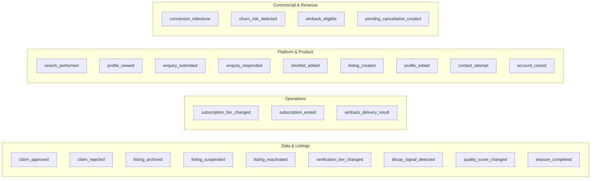
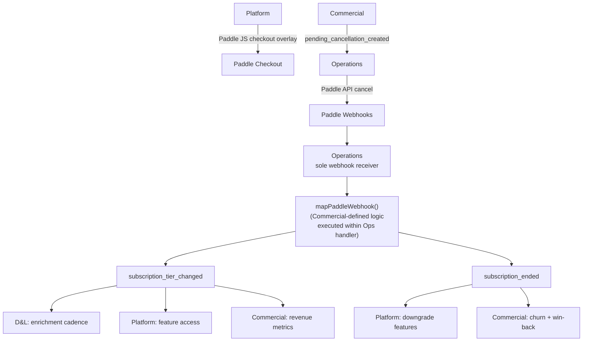
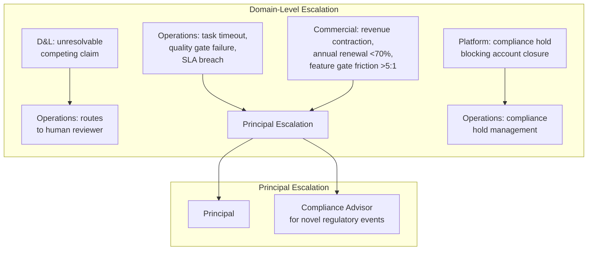
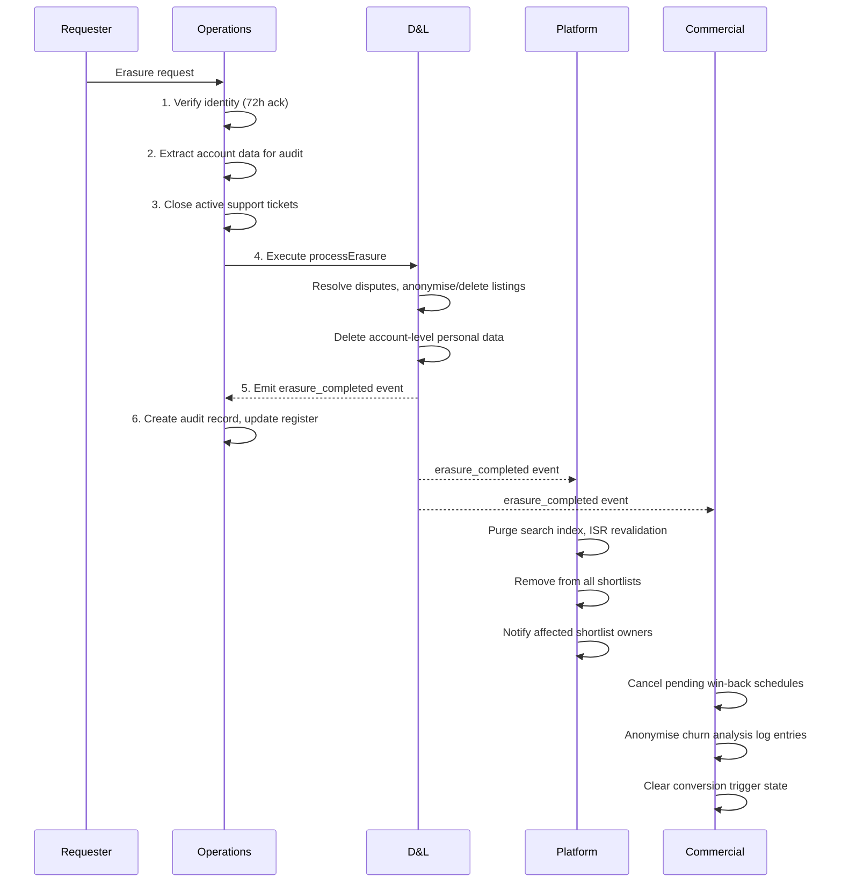
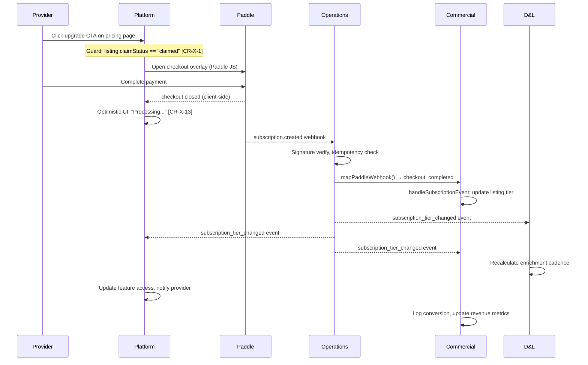
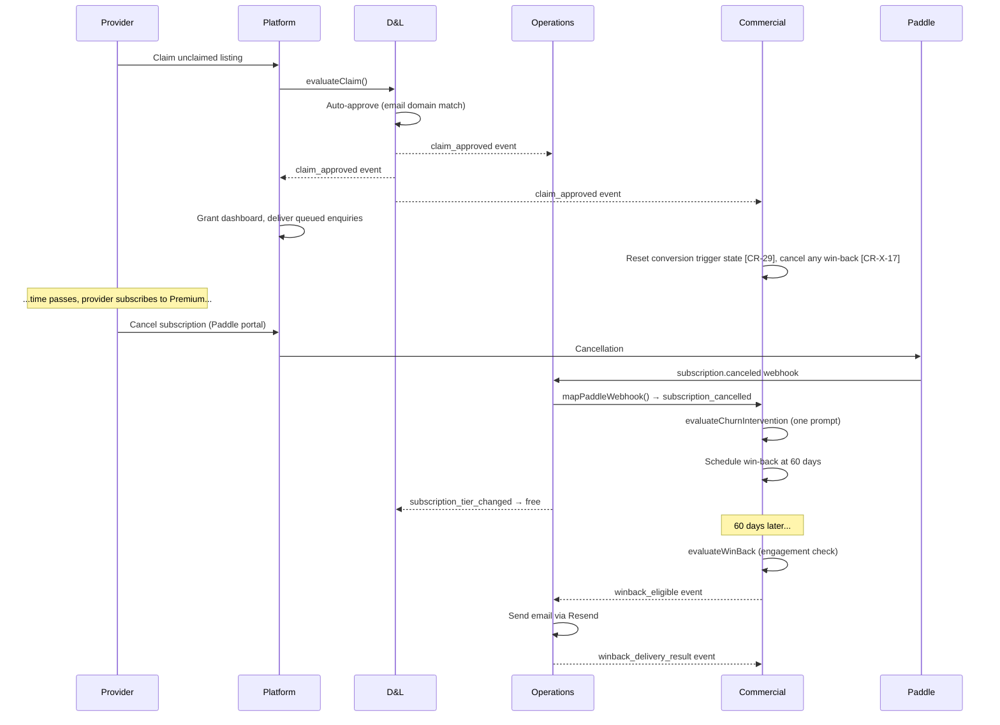
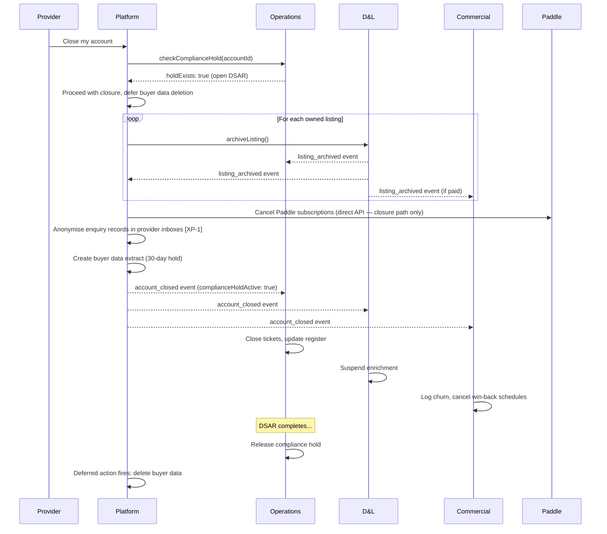
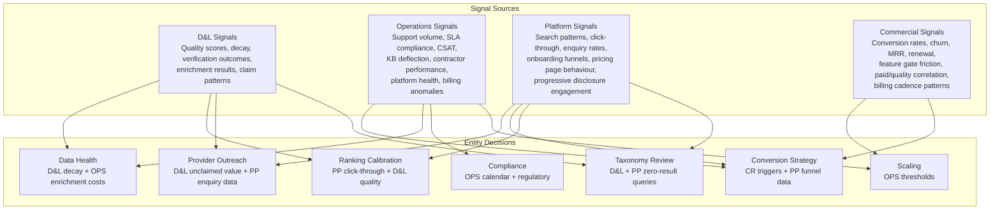
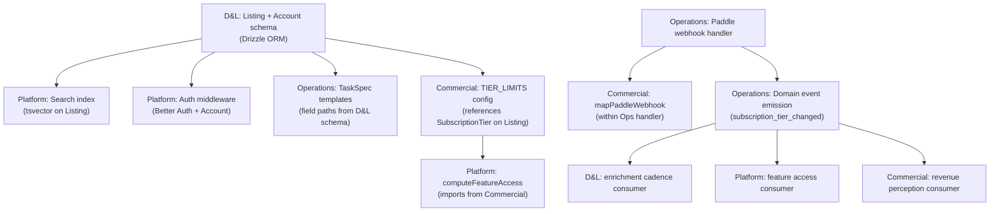

# Cross-Domain Dependencies — Concept Design

**Status:** Draft v3 — v2 + 2 event schema amendments, §10 questions resolved (see `3-requirements/decisions/interface-questions-trade-off-evaluation.md`)
**Domain:** Cross-Domain
**Last updated:** 2026-02-12
**Inputs:** `data-and-listings.md` (v6), `operations.md` (v6), `platform-and-product.md` (v5), `commercial-and-revenue.md` (v4)
**Downstream:** requirements specification, implementation

---

## Summary

This document is the authoritative interface map for CALLSHEET's four concept design domains. It resolves every question of "who owns what", "who emits what", "who reads whose data", and "what happens when domains must coordinate". It is a synthesis — not a discovery exercise. Every interface documented here was established and stress tested during the domain-level concept design phase (320 scenarios total, 194 fixes across 4 domains).

**Structural finding:** Domain events are the primary coordination mechanism. Four domains emit 25 typed events across domain boundaries. Direct query interfaces exist for 6 read-only contracts. One shared infrastructure concern (deferred action scheduler) crosses all domains. The single highest-complexity cross-domain flow is GDPR erasure (5 sequential steps across 3 domains).

---

## 1. Entity Ownership Map

Every entity, process, and data structure has exactly one canonical owner. No shared ownership — one domain defines, others consume.

### 1.1 Data Entities

| Entity / Data Structure | Owner | Consumers | Notes |
|---|---|---|---|
| `Listing` (full entity) | D&L | Platform (display, search index), Operations (TaskSpec context), Commercial (engagement counters) | Includes profile, capabilities, verification, quality score, engagement, lifecycle |
| `Account` (full entity) | D&L | Platform (auth, dashboard), Operations (ticket context), Commercial (subscription mapping) | Includes authentication, buyer facet, cross-role |
| `QualityScore` + `QualityScoreExplanation` | D&L | Platform (dashboard, ranking), Operations (support agent explanation), Commercial (conversion triggers, low-quality intervention) | Entity-calculated, stored on Listing |
| `TaxonomyTag` hierarchy | D&L | Platform (search filters, suggestions), Operations (contractor TaskSpec references), Commercial (competitor_upgraded trigger) | 7 sectors, ~51 service areas, ~209 specialisations |
| Taxonomy comparison utilities (`computeTaxonomyOverlap`) | D&L | Commercial (Jaccard similarity on Service Area tags for conversion triggers) | Shared data contract [CR-X-12] |
| `Synonym` / alias lookup | D&L | Platform (search query expansion) | Query-time expansion |
| Controlled vocabularies (equipment, accreditations, regions, genres) | D&L | Platform (filters, autocomplete) | |
| `Engagement` counters (`profileViews`, `searchAppearances`, `enquiriesReceived`) | D&L | Platform (dashboard display), Commercial (`basicAnalytics` maps 1:1 to these [CR-X-18]) | Single source of truth — Commercial does not maintain separate counters [CR-X-10] |
| `PendingEnquiry` queue (on unclaimed Listings) | D&L | Platform (creates on enquiry submission), Operations (referenced in support triage for unreachable listings) | Max 90-day retention. Delivered to claimant on successful claim. Retroactive linking on account creation [XP-10]. |
| `SubscriptionTier` type definition | D&L | All domains | Enum type. D&L defines the type; all domains import. |
| `SubscriptionTier` value (on Listing) | D&L (stores) | Platform (feature gating, ranking boost), Commercial (revenue metrics) | D&L schema owns the column. Updated by D&L consumer of `subscription_tier_changed` event. |
| Subscription tier business rules (`TIER_LIMITS`, `computeFeatureAccess`) | Commercial | Platform (imports via `mapFeatureAccessToUI`) | What each tier means. See row below. |
| Subscription tier state transitions (Paddle → event → storage) | Operations (sole emitter of `subscription_tier_changed`) | D&L (stores updated value), Platform (enforces gates), Commercial (logs metrics) | Paddle is external source of truth; Operations reconciles and emits events [CR-X-14]. |
| `TIER_LIMITS` + `computeFeatureAccess` | Commercial | Platform (imports, maps to UI via `mapFeatureAccessToUI` [CR-X-8]) | Commercial is canonical owner |
| `PRICING` configuration | Commercial | Platform (pricing page), Operations (principal briefing) | |
| `TaskSpec` standard + template library | Operations | D&L (manual review task specs), Platform (admin queue display) | Operations owns templates, versioned against D&L schema |
| `ComplianceRegister` (DSAR log, DPA register, ROPA) | Operations | Platform (admin dashboard read-only query) | |
| `ActiveTicketRegistry` | Operations | D&L (queries before suspension/decay signals) | Read-only interface |
| `ChurnRiskRegistry` | Operations | Operations support triage (ticket priority elevation) | Populated by Commercial events [CR-X-20] |
| Search index | Platform | — (internal) | Maintained from D&L Listing data + events |
| `SearchEvent` / analytics data | Platform | D&L (taxonomy review), Commercial (demand signals via query interface [CR-X-16]) | |
| Email template library (22 templates) | Platform (delivery pipeline via Resend) | Operations (compliance content for Article 14, DSAR), Commercial (conversion trigger content [CR-X-19]) | Multi-owner content, single delivery pipeline. Content ownership: 14 transactional (Platform), 4 compliance (Operations: Article 14 notice, DSAR acknowledgment, DSAR completion, erasure confirmation), 4 conversion marketing (Commercial: analytics teaser, social proof, view milestone, engagement summary [CR-X-19]) |

### 1.2 Process Ownership

| Process | Owner | Collaborators | Boundary |
|---|---|---|---|
| Claim evaluation | D&L (decision logic) | Operations (manual review execution) | D&L evaluates, routes to Operations via TaskSpec if manual review needed. Operations executes, calls D&L's `onManualReviewComplete` callback. |
| Quality score computation | D&L | — | Fully autonomous. Emits `quality_score_changed` for consumers. |
| Decay detection + response | D&L (detection, decision tree) | Operations (active ticket registry query) | D&L checks Operations' ticket registry before suspension. Annotates decay events with `activeSupportTicket`. |
| Enrichment scheduling | D&L (defines cadence per `scheduleEnrichment`) | Operations (unified scheduler merges D&L + Ops schedules) | D&L authority on liveness checks, full enrichment, provider prompts. Operations authority on credential recheck, client credit, portfolio review. |
| Verification re-check | Operations | D&L (Companies House data) | Operations-owned verification-specific activities only |
| Support triage + response | Operations | Platform (admin dashboard UI), Commercial (churn risk priority elevation) | Operations classifies, routes, monitors SLA. Platform renders admin views. |
| Billing reconciliation | Operations | Commercial (`mapPaddleWebhook` logic, executed within Ops handler) | Operations is sole Paddle webhook processor [CR-X-14]. Emits domain events for consumers. |
| Subscription lifecycle | Commercial (business logic) | Operations (event emission), Platform (feature access enforcement) | Commercial defines state machine. Operations emits `subscription_tier_changed` / `subscription_ended`. Platform enforces feature gates. |
| Conversion optimisation | Commercial (trigger logic, evaluation) | Platform (notification + email delivery), Operations (feature gate friction data [CR-X-6]) | Commercial evaluates triggers. Platform delivers. |
| Win-back | Commercial (evaluation + content) | Operations (email delivery + confirmation [CR-X-7]) | Commercial decides eligibility and provides template. Operations delivers via Resend and emits `winback_delivery_result`. |
| Churn intervention | Commercial (decision) | Platform (retention data display) | One transparent prompt, then accept. |
| GDPR erasure | Operations (request lifecycle) | D&L (data-level execution), Platform (search/cache purge) | See §5 for full orchestration protocol. |
| Account closure | Platform (orchestration) | Operations (compliance hold check [XP-20]), D&L (listing archival), Commercial (subscription cancellation) | Platform checks compliance hold → archives listings → cancels Paddle → anonymises enquiries → emits event. |
| Search + ranking | Platform | D&L (quality score input), Commercial (paid boost, sponsored placement logic) | Platform executes. D&L provides quality data. Commercial provides boost configuration. |
| Onboarding flows | Platform | D&L (integrity checks on listing creation) | Platform captures user input. D&L's `checkDuplicate`, `verifyNewListingIdentity`, `checkCHUniqueness` execute before listing goes live. |
| Sponsored placement selection | Commercial (selection algorithm) | D&L (quality score input), Platform (rendering in search results) | Commercial's `selectSponsoredListings` applies quality ranking, lifecycle status filter [CR-X-9], daily rotation [CR-30]. Platform renders with ASA labelling. |
| Admin dashboard | Platform (UI + queries) | Operations (compliance data, billing status, ticket registry), D&L (listing data, quality explanations) | Platform renders. Operations and D&L expose read-only query interfaces. |

---

## 2. Domain Event Topology

Domain events are the primary cross-domain coordination mechanism. No domain polls another domain's state. Events are typed, versioned, and have explicit consumer mappings.

### 2.1 Complete Event Catalogue



**Event count by domain:** D&L emits 9. Operations emits 3. Platform emits 9. Commercial emits 4. **Total: 25 cross-domain event types.**

**Note:** Domain-internal events also exist (e.g., Commercial's `billing_cadence_changed` from `mapPaddleWebhook`, D&L's internal decay scoring signals) but are not catalogued here because they do not cross domain boundaries.

### 2.2 Full Consumer Matrix

| Event | Emitter | D&L Consumes | Operations Consumes | Platform Consumes | Commercial Consumes |
|---|---|---|---|---|---|
| `claim_approved` | D&L | — | Claim volume tracking, learning L2/L3 | Dashboard access, ISR revalidation | Funnel entry, win-back cancellation [CR-X-17], conversion trigger reset [CR-29] |
| `claim_rejected` | D&L | — | Claim volume tracking | Rejection notification [PP-ST-4] | — |
| `listing_archived` | D&L | — | Close active tickets | Remove from search, ISR revalidation, shortlist update [XP-15] | Churn analysis (if paid) |
| `listing_suspended` | D&L | — | Close/update relevant tickets (note: D&L checks ticket registry *before* emitting this event [X-20]) | Warning indicator, ISR revalidation, shortlist warning [XP-15] | — |
| `listing_reactivated` | D&L | — | Resume outreach, re-enable enrichment [XP-3] | Restore to search, ISR revalidation, shortlist restore [XP-15] | — |
| `verification_tier_changed` | D&L | — | — | Badge display, search index update [XP-13] | — |
| `decay_signal_detected` | D&L | — | Cross-ref active tickets, suppress duplicates [X-6] | "May be outdated" indicator (high/critical) [PP-32] | — |
| `quality_score_changed` | D&L | — | — | Ranking recalculation, clear decay indicator if improved [XP-7] | Conversion triggers, low-quality intervention (if paid <40) |
| `erasure_completed` | D&L | — | Close DSAR case, update compliance register | Purge from search, ISR revalidation, remove from shortlists, anonymise outbound enquiries [PP-ST-8, XP-15] | Cancel win-back schedules, anonymise churn log entries, clear conversion trigger state [CD-18] |
| `subscription_tier_changed` | Operations | Recalculate enrichment cadence [X-18] | — | Update feature access, notify provider | Update revenue metrics, log conversion/downgrade |
| `subscription_ended` | Operations (primary), D&L (archival), Platform (closure) | — | — | Downgrade feature access, show re-subscribe CTA | Churn event, schedule win-back at 60 days |
| `winback_delivery_result` | Operations | — | — | — | Update churn analysis log with delivery status [CR-X-7] |
| `search_performed` | Platform | Zero-result tracking, taxonomy review | — | — | — ¹ |
| `profile_viewed` | Platform | Engagement metric update | — | — | — ¹ |
| `enquiry_submitted` | Platform | Engagement metric update, unclaimed enquiry queue (by `enquiryId` reference) [PP-ST-12] | — | — | first_enquiry conversion trigger [CR-X-10] |
| `enquiry_responded` | Platform | Response rate/time calculation | — | — | Provider engagement health |
| `shortlist_added` | Platform | — | — | — | Conversion signal |
| `listing_created` | Platform | Initial quality score computation [XP-19] | Track onboarding volume | — | Funnel: signup → listing → paid |
| `profile_edited` | Platform | Quality score recalculation, freshness reset | — | — | — |
| `contact_attempt` | Platform | Data quality signal (unreachable) | Outreach prioritisation | — | — |
| `account_closed` | Platform | Suspend enrichment for archived listings [XP-2] | Close tickets, update compliance register [XP-2] | — | Churn analysis, cancel win-back schedules |
| `conversion_milestone` | Commercial | — | Learning hypothesis L3 | Dashboard notification | — |
| `churn_risk_detected` | Commercial | — | Support triage priority elevation [CR-X-20] | Dashboard quality suggestions | — |
| `winback_eligible` | Commercial | — | Email delivery via Resend [CR-35] | — | — |
| `pending_cancellation_created` | Commercial | — | Reason attribution for Paddle webhook [CR-X-4] | — | — |

¹ Commercial accesses search and profile view data via the `getListingAnalytics` query interface (§2.6), not via the event bus. These events have no Commercial event-bus consumer.

### 2.3 Event Payload Schemas

Every cross-domain event carries a typed payload. Consumers depend on these contracts.

```typescript
// --- D&L Events ---
type ClaimApprovedEvent = {
  type: "claim_approved"; listingId: UUID; accountId: UUID;
  method: "auto" | "manual" | "disputed_resolved"; timestamp: ISO8601
}
type ClaimRejectedEvent = {
  type: "claim_rejected"; listingId: UUID; claimantAccountId: UUID;  // [PP-ST-4]
  reason: string; timestamp: ISO8601
}
type ListingArchivedEvent = {
  type: "listing_archived"; listingId: UUID; accountId: UUID | null;
  previousStatus: LifecycleStatus; reason: string; reactivatable: boolean;
  subscriptionTier: SubscriptionTier
}
type ListingSuspendedEvent = {
  type: "listing_suspended"; listingId: UUID; reason: string;
  previousStatus: LifecycleStatus
}
type ListingReactivatedEvent = {
  type: "listing_reactivated"; listingId: UUID; accountId: UUID
}
type VerificationTierChangedEvent = {
  type: "verification_tier_changed"; listingId: UUID;
  previousTier: VerificationTier; newTier: VerificationTier
}
type DecaySignalDetectedEvent = {
  type: "decay_signal_detected"; listingId: UUID;
  signal: { type: string; severity: "low" | "medium" | "high" | "critical" };
  activeSupportTicket?: UUID
}
type QualityScoreChangedEvent = {
  type: "quality_score_changed"; listingId: UUID;
  previousComposite: number; newComposite: number; changedDimensions: string[]
}
type ErasureCompletedEvent = {
  type: "erasure_completed"; accountHash: string;
  senderAccountId: UUID;  // original accountId for PP buyer enquiry anonymisation [PP-ST-8]
  listingIdsAnonymised: UUID[]; listingIdsDeleted: UUID[];
  freelancerListingsDeleted: number; timestamp: ISO8601
}

// --- Operations Events ---
type SubscriptionTierChangedEvent = {
  type: "subscription_tier_changed"; listingId: UUID; accountId: UUID;
  previousTier: SubscriptionTier; newTier: SubscriptionTier; timestamp: ISO8601
}
type SubscriptionEndedEvent = {
  type: "subscription_ended"; listingId: UUID; accountId: UUID;
  previousTier: SubscriptionTier; reason: "cancellation" | "grace_period_expired" | "account_closure";
  origin: "paddle" | "archival" | "closure"; timestamp: ISO8601
}
type WinbackDeliveryResultEvent = {
  type: "winback_delivery_result"; listingId: UUID;
  accountId: UUID;  // carried through from winback_eligible.cancelledAccountId [OPS-ST-13]
  status: "delivered" | "bounced" | "failed"; timestamp: ISO8601
}

// --- Platform Events ---
type SearchPerformedEvent = {
  type: "search_performed"; query: string;
  filters: { sectors?: string[]; serviceAreas?: string[]; specialisations?: string[]; location?: string };  // typed [PP-ST-10]
  resultCount: number; sessionId?: string; timestamp: ISO8601
}
type ProfileViewedEvent = {
  type: "profile_viewed"; listingId: UUID; source: "search" | "direct" | "shortlist"; timestamp: ISO8601
}
type EnquirySubmittedEvent = {
  type: "enquiry_submitted"; enquiryId: UUID; listingId: UUID;  // PII removed [PP-ST-12]
  timestamp: ISO8601
}
type EnquiryRespondedEvent = {
  type: "enquiry_responded"; listingId: UUID; enquiryId: UUID;
  responseTimeMinutes: number; timestamp: ISO8601
}
type ShortlistAddedEvent = {
  type: "shortlist_added"; listingId: UUID; accountId: UUID; timestamp: ISO8601
}
type ListingCreatedEvent = {
  type: "listing_created"; listingId: UUID; accountId: UUID;
  entityType: EntityType; timestamp: ISO8601
}
type ProfileEditedEvent = {
  type: "profile_edited"; listingId: UUID; accountId: UUID;
  changedFields: string[]; timestamp: ISO8601
}
type ContactAttemptEvent = {
  type: "contact_attempt"; listingId: UUID;
  result: "reached" | "unreachable"; reporterAccountId?: UUID; timestamp: ISO8601
}
type AccountClosedEvent = {
  type: "account_closed"; accountId: UUID; listingsArchived: UUID[];
  buyerDataDeleted: boolean; complianceHoldActive: boolean;
  paddleCancellationsPending: boolean; timestamp: ISO8601
}

// --- Commercial Events ---
type ConversionMilestoneId = "first_subscription" | "first_upgrade" | "premium_reached" | "partner_reached"  // [CR-ST-3]
type ChurnRiskFactor = "quality_declining" | "engagement_dropping" | "payment_at_risk" | "low_quality_paid" | "billing_cadence_switch_to_monthly"  // [CR-ST-4]

type ConversionMilestoneEvent = {
  type: "conversion_milestone"; listingId: UUID; accountId: UUID;
  milestone: ConversionMilestoneId; milestoneLabel: string;  // [CR-ST-3] typed + display label
  timestamp: ISO8601
}
type ChurnRiskDetectedEvent = {
  type: "churn_risk_detected"; listingId: UUID; accountId: UUID;
  riskFactors: ChurnRiskFactor[]; timestamp: ISO8601  // [CR-ST-4] typed union
}
type WinbackEligibleEvent = {
  type: "winback_eligible"; listingId: UUID; cancelledAccountId: UUID;
  mergeFields: { subject: string; body: string; listingName: string; enquiryCount?: number; viewCount?: number };  // [CR-ST-5] renamed from emailContent
  timestamp: ISO8601
}
type PendingCancellationCreatedEvent = {
  type: "pending_cancellation_created"; paddleSubscriptionId: string;
  listingId: UUID; reason: CancellationReason; timestamp: ISO8601  // [CR-ST-6] typed
}
```

### 2.4 Critical Single-Emitter Rules

These events have exactly one emitter. Violations were caught during cross-domain stress testing.

| Event | Sole Emitter | Violation Caught | Reference |
|---|---|---|---|
| `subscription_tier_changed` | Operations | Commercial also emitted → duplicate processing | CR-X-2 |
| `subscription_ended` | Operations (primary) | D&L `archiveListing` and Platform `closeAccount` also emit for archival/closure paths [CD-ST-21]. Design intent: Operations is the authoritative emitter for Paddle-originated endings. D&L/PP emit for entity-initiated endings (voluntary archival, account closure) where Paddle cancellation is a downstream side-effect. Consumers must handle both origins. | CD-ST-21 |
| `quality_score_changed` | D&L | — | D&L sole calculator |
| `account_closed` | Platform | — | Platform orchestrates closure |

### 2.4 Event Bus vs Query Interface

Not all cross-domain data flows use events. Six read-only query interfaces exist for request/response patterns where eventual consistency is insufficient or the data is aggregate.

| Interface | Owner | Consumer | Pattern | Reference |
|---|---|---|---|---|
| `hasActiveTicket(listingId)` | Operations | D&L | Synchronous query before suspension | X-20 |
| `checkComplianceHold(accountId)` | Operations | Platform | Synchronous query during account closure | XP-20 |
| `getDSARStatus()` | Operations | Platform (admin) | Dashboard polling | XP-12 |
| `getFeatureGateFrictionSummary(period)` | Operations | Commercial | Monthly ceremony input | CR-X-6 |
| `getListingAnalytics(listingId, period)` | Platform | Commercial, D&L | Time-bucketed engagement data | CR-X-16 |
| `getBillingReconciliationStatus()` | Operations | Platform (admin) | Last run, status, active holds, last anomaly | XP-18 |

**Design rule:** Use events when the consumer reacts to a state change. Use query interfaces when the consumer needs a point-in-time snapshot or aggregate.

---

## 3. Shared Data Contracts

Data structures that cross domain boundaries. Each has exactly one canonical definition; consumers import, not redefine.

### 3.1 Type Definitions Shared Across Domains

```typescript
// --- Defined by D&L, consumed by all ---
type SubscriptionTier = "free" | "standard" | "premium" | "partner"
type VerificationTier = "unclaimed" | "claimed" | "verified" | "premium_verified"
type LifecycleStatus = "active" | "inactive" | "merged" | "dissolved" | "suspended" | "archived"
type ClaimStatus = "unclaimed" | "pending_review" | "claimed" | "disputed"
type EntityType = "freelancer" | "company" | "education" | "industry_body" | "public_sector" | "non_profit"
type CreditFormat = "feature" | "tv_series" | "tv_one_off" | "short" | "commercial" | "corporate" | "music_video" | "digital_social" | "live_event"

// --- Defined by Operations, consumed by D&L and Commercial ---
type TaskSpec = { ... }  // See operations.md §2

// --- Defined by Commercial, consumed by Platform ---
type TierLimits = { ... }  // See commercial-and-revenue.md §4.2
type FeatureAccess = { ... }  // Output of computeFeatureAccess()

// --- Defined by D&L, used by all domains ---
type DeferredAction = { ... }  // See data-and-listings.md §4. Type defined by D&L; scheduler is shared infrastructure (§3.2).
```

### 3.2 Shared Infrastructure: Deferred Action Scheduler

`DeferredAction` type was defined by D&L (§4), but all domains register deferred actions: D&L (snapshot cleanup, enquiry queue expiry), Operations (compliance schedule, billing reconciliation), Platform (compliance hold re-check during account closure [PP §13.3]), Commercial (win-back scheduling). The scheduler is **shared infrastructure** — not owned by a single domain.

```typescript
type DeferredAction = {
  id: UUID
  action: string                      // deterministic operation name
  params: Record<string, any>
  executeAt: ISO8601
  retryPolicy: "once" | "retry_3"
  onFailure: "log" | "alert_principal"
}
```

**Distinction from TaskSpec:** DeferredActions are deterministic entity operations (delete snapshot, expire enquiry queue, send reminder, check compliance hold). TaskSpecs are scoped human tasks with acceptance criteria and learning capture. They share scheduling infrastructure but have different lifecycles.

**Implementation note:** A single job queue (e.g., `pg_cron` or application-level queue) processes both. The queue is domain-agnostic infrastructure. Each domain registers actions; the scheduler executes them. At V1 scale (~4,700 listings), a single Supabase cron job is sufficient.

### 3.3 Paddle Integration Boundary

Paddle is an external system that touches three domains. The integration boundary is strict:



| Paddle Touchpoint | Domain | Direction | Mechanism |
|---|---|---|---|
| Webhook receipt + signature verification | Operations | Paddle → CALLSHEET | Single HTTP endpoint |
| Webhook-to-event mapping | Commercial (defines) + Operations (executes) | Internal | `mapPaddleWebhook()` [CR-X-14] |
| Checkout overlay (JS SDK) | Platform | CALLSHEET → Paddle | Client-side Paddle JS |
| Subscription cancellation (API) — entity-initiated (churn, low-quality) | Operations | CALLSHEET → Paddle | Server-side Paddle API via `pending_cancellation_created` event |
| Subscription cancellation (API) — account closure | Platform | CALLSHEET → Paddle | Server-side Paddle API during `closeAccount()` [PP §13.3]. Platform has direct Paddle API access for closure-path cancellations only. |
| Customer portal link | Platform | CALLSHEET → Paddle | URL redirect |
| Refund processing (API) | Commercial (decision) → Operations (execution) | CALLSHEET → Paddle | Server-side Paddle API |
| Reconciliation polling | Operations | CALLSHEET → Paddle | Daily batch `listSubscriptions` |

**Paddle customer mapping:** Account = Paddle Customer (1:1, created lazily on first checkout). Listing = Paddle Subscription (1:1). Multi-listing Accounts hold multiple Paddle subscriptions under one customer. [CR-18]

---

## 4. Escalation Topology

Every process has defined escalation paths. Escalations flow upward through domains and ultimately to the principal.



### 4.1 Escalation by Domain

| Domain | Escalation Trigger | Target | Max Wait | Default if Unresponsive |
|---|---|---|---|---|
| D&L | Competing claim unresolvable in 14 days | Operations → Principal | 14 days + 72h principal wait | Compliance advisor resolves [Ops §3] |
| D&L | Cost-bearing enrichment decision (>10% aggregate cost change) | Principal | 72h | Defer, continue at current cadence |
| Operations | Task timeout after 3 re-routes | Principal | 72h | Depends on type (see Ops §3 default actions) |
| Operations | P1 incident (data breach, legal threat) | Principal | 4h | Entity applies incident response plan |
| Operations | Budget approval for new contractor | Principal | 72h | Defer procurement, continue marketplace |
| Operations | Novel regulatory event | Compliance advisor → Principal if needed | 48h | Retain advisor at ≤£500 autonomously |
| Platform | Compliance hold blocks account closure | Operations (hold management) | Until hold clears | Weekly re-check via deferred action |
| Commercial | Monthly churn >5% | Entity investigation | Autonomous | Entity adjusts conversion strategy |
| Commercial | Annual renewal <70% | Principal | Immediate | Strategic review |
| Commercial | Revenue contraction (MRR declining after 6 months) | Principal | Immediate | Strategic review |
| Commercial | Feature gate friction ratio >5:1 | Principal | Monthly ceremony | Monitor and adjust |
| Commercial | Refund request >30 days post-purchase | Principal | 72h | Entity autonomous for ≤30 days (14-day cooling-off full refund, 30-day pro-rata). Beyond 30 days requires principal decision [CR-13]. |

### 4.2 Principal Unavailability Chain

Operations §3 defines the fallback: 24h → 48h → 72h reminders with escalating channels (email → email+SMS → email+SMS+phone). After 72h, default action by type. >3 missed escalations in 30 days triggers alert requesting updated contact preferences.

---

## 5. GDPR Data Map — Cross-Domain Erasure Responsibilities

GDPR erasure is the most complex cross-domain flow. It spans four domains — three in the critical path (Operations, D&L, Platform), plus Commercial for domain-specific cleanup.

### 5.1 Erasure Orchestration Protocol



**Critical constraint:** Steps 1–3 (Operations) must complete before step 4 (D&L) begins. If Operations extraction fails, erasure does not proceed but the 30-day clock continues — failure triggers immediate principal escalation.

### 5.2 Data Location by Domain

| Domain | Data Categories | Erasure Action | Responsibility |
|---|---|---|---|
| **D&L** | Listing data (profile, capabilities, credits, verification, quality, engagement, enquiry queue), Account identity, authentication, buyer facet, cross-role | Company listings: anonymise + unlink + revert to unclaimed. Freelancer listings: full delete. Account: anonymise identity, delete auth, anonymise buyer facet + cross-role. | D&L executes `processErasure()` [D&L §6] |
| **Operations** | Support ticket history, compliance interactions (DSARs, erasure records), TaskSpec history | Close active tickets (step 3). Retain anonymised audit record (Art 5(2) accountability). | Operations extracts before erasure, creates post-erasure audit record |
| **Platform** | Search index entries, ISR-cached profile pages, shortlist references, session data | Purge from search index. Invalidate profile cache. Remove from all shortlists. Notify affected shortlist owners. | Platform consumes `erasure_completed` event |
| **Commercial** | Subscription history, payment records, churn analysis log (keyed by listingId), conversion trigger state (per listing), win-back schedules, revenue perception entries | Paddle retains billing records (Paddle's data controller obligations). CALLSHEET-side: subscription state anonymised as part of D&L account erasure. Churn analysis log entries anonymised. Conversion trigger state cleared. Pending win-back schedules cancelled. | Commercial consumes `erasure_completed` event for domain-specific cleanup. Subscription column covered by D&L account anonymisation. |

### 5.3 Account Closure vs GDPR Erasure

These are distinct flows that share some mechanics but have different legal bases and outcomes.

| Dimension | Account Closure | GDPR Erasure |
|---|---|---|
| Trigger | Provider voluntary action | Art 17 right invocation |
| Orchestrator | Platform (§13.3) | Operations (§5) |
| Listings | Archived (retained, reactivatable) | Anonymised (company) or deleted (freelancer) |
| Buyer data | Deleted (or deferred if compliance hold) | Deleted per data map |
| Account | Deactivated, 30-day reopen window | Anonymised permanently |
| Compliance hold check | Yes — before buyer data deletion | Yes — before any erasure |
| Audit record | Closure event logged | Mandatory Art 5(2) compliance record |
| Reversion | Reopen within 30 days | Irreversible |

---

## 6. Cross-Domain Lifecycle Flows

Three lifecycle flows touch all four domains simultaneously.

### 6.1 New Paid Subscription (Happy Path)



### 6.2 Claim → Verify → Subscribe → Churn → Win-Back



### 6.3 Account Closure with Compliance Hold



---

## 7. Entity Perception Signal Map

Every domain generates signals the entity uses for autonomous decision-making. This is the complete signal topology.



### 7.1 Cross-Domain Perception Feeds

| Entity Decision | Primary Signal Domain | Secondary Signal Domains | Ceremony |
|---|---|---|---|
| Taxonomy additions/merges | D&L (free-text tag clustering) | Platform (zero-result queries, filter usage) | Quarterly Taxonomy Review |
| Provider outreach prioritisation | D&L (unclaimed listing quality, engagement) | Platform (enquiry volume to unclaimed listings) | Monthly Provider Outreach Cycle |
| Ranking formula calibration | Platform (click-through rates, search-to-enquiry) | D&L (quality score distribution) | Monthly Search Quality Review |
| Conversion strategy adjustments | Commercial (funnel metrics, trigger effectiveness) | Platform (pricing page behaviour, onboarding drop-off), Operations (feature gate friction [CR-X-6]) | Monthly Conversion Funnel Analysis |
| Scaling decisions | Operations (support volume, verification throughput) | Commercial (MRR for budget) | Continuous + Monthly Operational Health Review |
| Data health response | D&L (decay signals, enrichment coverage) | Operations (API cost, enrichment budget) | Monthly Data Health Review |
| Compliance posture | Operations (calendar, DSAR deadlines) | — | Quarterly Compliance Review |

---

## 8. Ceremony Cross-References

Ceremonies that span or feed multiple domains.

| Ceremony | Owner | Cadence | D&L Input | Ops Input | PP Input | CR Input | Output |
|---|---|---|---|---|---|---|---|
| **Taxonomy Review** | D&L | Quarterly | Free-text tag clustering | — | Zero-result queries, filter usage | — | Taxonomy additions/merges |
| **Data Health Review** | D&L | Monthly | Quality score distribution, decay trends | Enrichment API costs | — | — | Adjusted enrichment cadence |
| **Verification Calibration** | D&L | Quarterly | Auto-approve accuracy, false positive/negative | Manual review outcomes, contractor quality | — | Verification ↔ renewal correlation | Threshold adjustments |
| **Provider Outreach Cycle** | D&L | Monthly | Unclaimed listing ranked by value | Outreach resource availability | Enquiry volume to unclaimed | — | Claim conversion rate |
| **Operational Health Review** | Operations | Monthly | Decay signal trends | Support volume, SLA, CSAT, KB health, contractor performance, learning hypotheses | — | MRR (budget context for scaling) | Scaling recommendations |
| **Compliance Review** | Operations | Quarterly | — | DSAR log, DPA register, regulatory news | — | — | Policy updates |
| **Principal Operations Briefing** | Operations | Monthly | Active listings, avg quality | All Ops §9 template sections | — | MRR, churn, conversion | Budget approvals, governance |
| **Search Quality Review** | Platform | Monthly | Synonym hit rates | — | Zero-results, click-through, search→enquiry conversion | — | Synonym updates, filter changes |
| **Onboarding Funnel Analysis** | Platform | Monthly | — | — | Signup→listing→completion rates, progressive disclosure engagement | Pricing page conversion | Sequence adjustments |
| **Conversion Funnel Analysis** | Commercial | Monthly | Quality score of converters | Feature gate friction summary | Funnel stage rates, activation timing | Trigger effectiveness, cold start | Threshold adjustments, messaging changes |
| **Revenue Review** | Commercial | Monthly | — | — | — | MRR, churn, conversion, tier distribution, feature gate friction | Pricing adjustments (rare) |
| **V2 Readiness Assessment** | Commercial | Quarterly (from month 6) | — | — | Buyer traffic, feature requests | 7 V2 metrics | Go/no-go on V2 |

---

## 9. Implementation Dependencies

The following constraints affect implementation ordering.

### 9.1 Data Model Dependencies



### 9.2 Implementation Order Constraints

| Constraint | Reason | Blocks |
|---|---|---|
| Shared infrastructure (event transport + deferred action scheduler) must exist before any domain event emission or scheduled action | All cross-domain coordination depends on these. Transport mechanism is open question #1. | All domains |
| D&L schema must be implemented first | Every domain references Listing/Account model | All other domains |
| Operations Paddle handler before Commercial subscription logic | Commercial must not process webhooks directly | Commercial subscription lifecycle |
| Commercial `TIER_LIMITS` before Platform feature gating | Platform imports, does not define | Platform subscription-gated features |
| D&L domain events before Operations consumers | Operations reacts to D&L state changes | Operations verification tracking, enrichment coordination |
| Platform `account_closed` event before Operations consumer | Operations needs closure signal | Operations ticket cleanup, compliance register |
| Deferred action scheduler before D&L snapshot cleanup | Snapshot deletion at 90 days requires scheduling | D&L claim lifecycle |
| Platform email pipeline (Resend) before Operations and Commercial delivery needs | Operations requires email for Article 14 notices, DSAR responses, win-back delivery. Commercial requires email for conversion triggers. | Operations compliance, Commercial conversion |

---

## 10. Interface Questions (Resolved)

All four questions resolved during requirements phase. Full rationale, stress test (12 scenarios), and changelist in `3-requirements/decisions/interface-questions-trade-off-evaluation.md`.

| # | Question | Decision | Confidence | Reference |
|---|---|---|---|---|
| 1 | Event transport mechanism | Application-level event bus (in-process TypeScript module). Migration trigger: async consumer execution time >30% of avg request duration → evaluate Inngest. | 0.90 | interface-questions §1 OQ-1 |
| 2 | Schema versioning protocol | TypeScript const exports from D&L, imported by consumers. Compiler enforces versioning. | 0.95 | interface-questions §1 OQ-2 |
| 3 | Cross-domain transaction boundaries | Two patterns: orchestrated flows (sequential function calls, single orchestrator) + reactive flows (event bus dispatch, independent consumers). | 0.92 | interface-questions §1 OQ-3 |
| 4 | Consumer health monitoring | Try/catch structured logging + startup registration check (`EVENT_CONSUMER_MATRIX`) + integration test suite. No heartbeat — unnecessary for in-process bus. | 0.88 | interface-questions §1 OQ-4 |

---

## 11. Stress Test Resolution Log

21 scenarios targeting interface consistency, completeness, and implementability. 4 High, 10 Medium, 5 Low, 2 Pass. 19 fixes applied.

| # | Scenario | Severity | Resolution |
|---|---|---|---|
| CD-1 | Email template ownership split unclear — implementer doesn't know which domain owns content for which templates | Medium | Fixed. §1.1 email template row expanded with 14/4/4 content ownership split (Platform transactional, Operations compliance, Commercial conversion). |
| CD-3 | `listing_suspended` Operations consumer says "check tickets before suspension" — but D&L checks *before* emitting | Medium | Fixed. Consumer matrix corrected: Operations action on receipt is "close/update relevant tickets." Pre-emission check is D&L's responsibility. |
| CD-4 | `billing_cadence_changed` internal Commercial event not acknowledged | Medium | Fixed. Note added below event catalogue clarifying domain-internal events exist but aren't catalogued because they don't cross boundaries. |
| CD-5 | Refund processing principal escalation (>30 days) missing from escalation topology | Low | Fixed. Added to §4.1 escalation table with 30-day autonomous boundary. |
| CD-6 | `search_performed` and `profile_viewed` show Commercial as event consumer, but Commercial accesses via query interface | Medium | Fixed. Consumer matrix corrected to "—" for Commercial on these events. Footnote added explaining query interface access. |
| CD-7 | `SubscriptionTier` triple-ownership violates single-owner rule | **High** | Fixed. Decomposed into 4 distinct concerns: type definition (D&L), stored value (D&L), business rules (Commercial), state transitions (Operations). Each has single ownership. |
| CD-8 | `getBillingReconciliationStatus()` query interface missing from §2.6 | Medium | Fixed. Added as 6th query interface. Summary updated (5→6). |
| CD-9 | Implementation dependency missing: email pipeline needed by Operations and Commercial | Medium | Fixed. Added to §9.2 implementation order constraints. |
| CD-10 | Platform cancels Paddle subscriptions directly in account closure (§6.3) but §3.3 says Operations owns Paddle cancellation API | **High** | Fixed. §3.3 Paddle touchpoints split into two cancellation rows: entity-initiated (Operations) and account-closure (Platform — direct Paddle API access for closure path only). §6.3 diagram updated. |
| CD-11 | Operational Health Review shows no Commercial input — but scaling depends on MRR | Low | Fixed. Added MRR as CR Input to Operational Health Review in §8. |
| CD-12 | Sponsored placement selection missing from process ownership table | Medium | Fixed. Added to §1.2 with Commercial as owner, D&L and Platform as collaborators. |
| CD-13 | No event payload schemas — consumers can't implement from this document | **High** | Fixed. §2.3 added with full typed payload definitions for all 25 events. |
| CD-14 | `DeferredAction` ownership contradicts between §3.1 (D&L) and §3.2 (shared) | Medium | Fixed. §3.1 clarified: type defined by D&L, scheduler is shared infrastructure. §3.2 expanded to list all domains' deferred actions (D&L, Operations, Platform, Commercial). |
| CD-15 | `PendingEnquiry` queue not in entity ownership map — 3 domains interact with it | Low | Fixed. Added to §1.1 with D&L as owner. |
| CD-16 | Perception signal map omits Operations→Conversion edge (feature gate friction) | Medium | Fixed. Added `OPS_S --> CONV` to Mermaid diagram. Updated §7.1 table to include Operations as secondary signal for conversion. |
| CD-18 | GDPR erasure: Commercial domain-specific data not addressed in erasure protocol | Medium | Fixed. Commercial added to erasure sequence diagram and data location table. Commercial consumes `erasure_completed` to cancel win-backs, anonymise churn log, clear trigger state. Consumer matrix updated. |
| CD-19 | Implementation dependencies don't list shared infrastructure as first prerequisite | Low | Fixed. Added shared infrastructure (event transport + deferred action scheduler) as first constraint in §9.2. |

| CD-21 | `subscription_ended` listed as sole-emitter (Operations) but D&L `archiveListing` and Platform `closeAccount` both emit it directly for archival/closure paths | **High** | Fixed. Single-emitter rule updated: Operations is primary (Paddle-originated). D&L and Platform emit for entity-initiated endings (archival, closure) where Paddle cancellation is a downstream side-effect. Consumer matrix updated to show multi-emitter. |

**Pass (no action):** CD-2 (`listing_archived` conditional qualifier sufficient), CD-17 (`pending_cancellation_created` temporal dependency implicit at concept level), CD-20 (Data Health Review PP input is minor).

---

## Cross-References

| Document | Relationship |
|---|---|
| `data-and-listings.md` (v6) | Domain events (§4a), consumed events (§4a table), quality score explanation (§4b), taxonomy comparison utilities (§5 Layer 5), GDPR erasure (§6), entity model (§1) |
| `operations.md` (v6) | TaskSpec standard (§2), billing reconciliation + Paddle routing (§7), compliance query interfaces (§5), active ticket registry (§4), churn risk registry (§4), feature gate friction interface (§4), principal escalation (§3) |
| `platform-and-product.md` (v5) | Domain event consumption (§9), account closure (§13.3), analytics query interface (§11.3), admin dashboard (§8), email templates (§10), search + ranking (§2), onboarding (§4) |
| `commercial-and-revenue.md` (v4) | Subscription lifecycle (§2), TIER_LIMITS + computeFeatureAccess (§4.2), conversion triggers (§5.3), revenue perception (§6), domain events (§7), Paddle webhook mapping (§2.2), sponsored placement (§4.4) |
| `entity-architecture-frame.md` | Governing frame. Cross-domain coordination is Layer 3 infrastructure. Domain events implement Layer 2 perception. Escalation topology implements Layer 1 governance constraints. |
