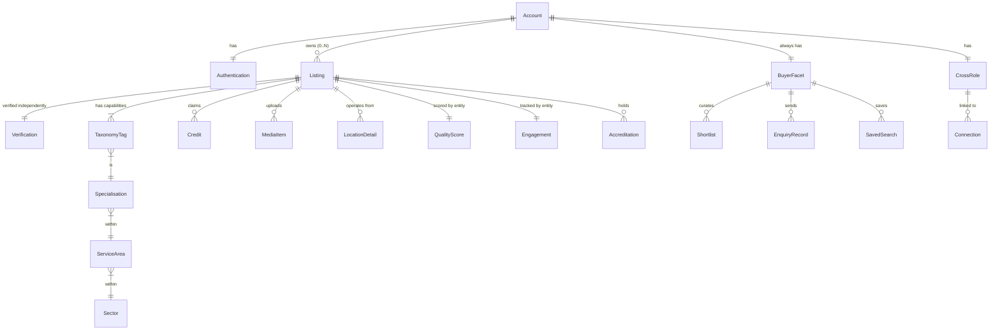
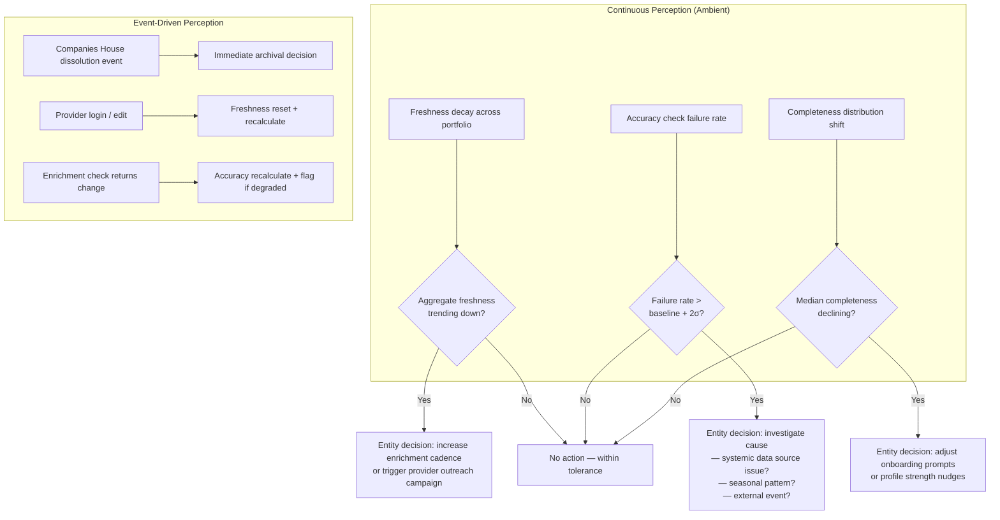
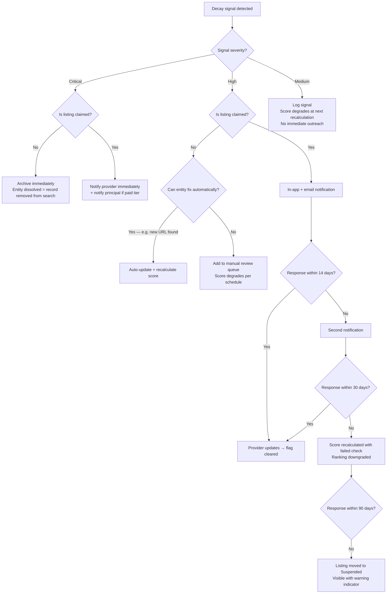
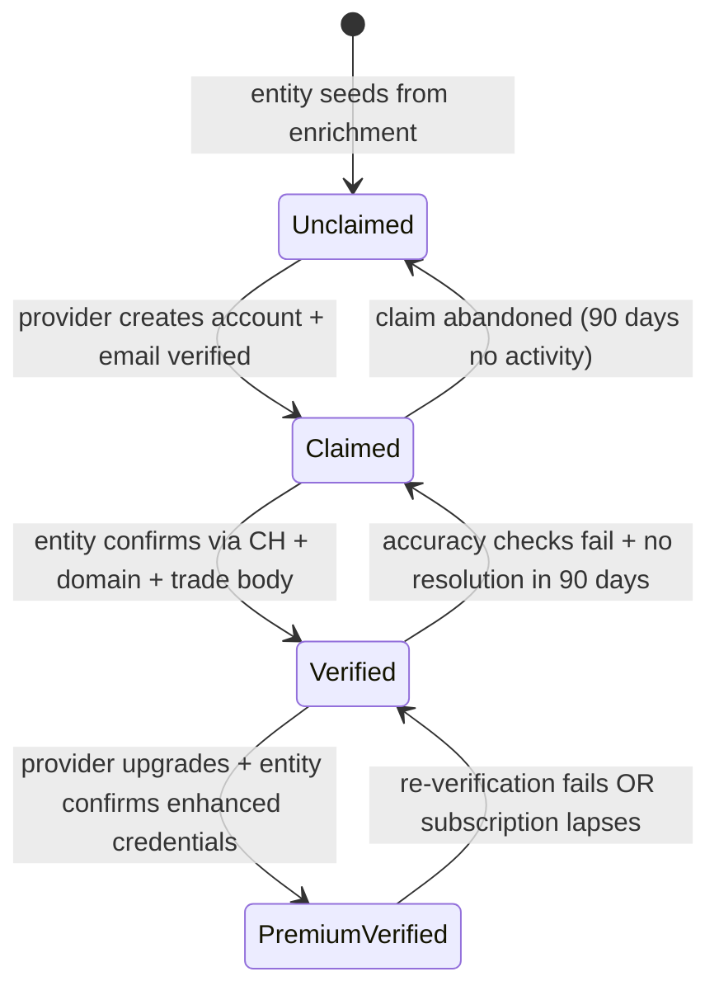
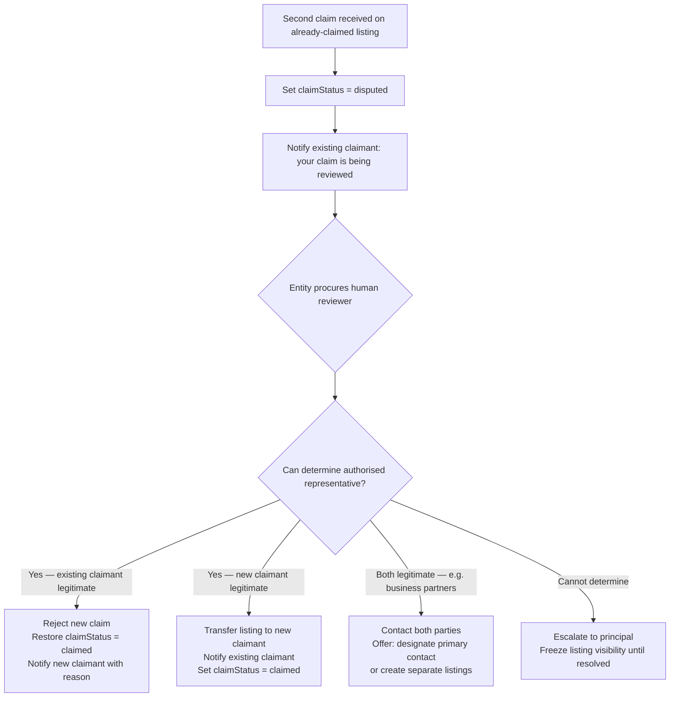
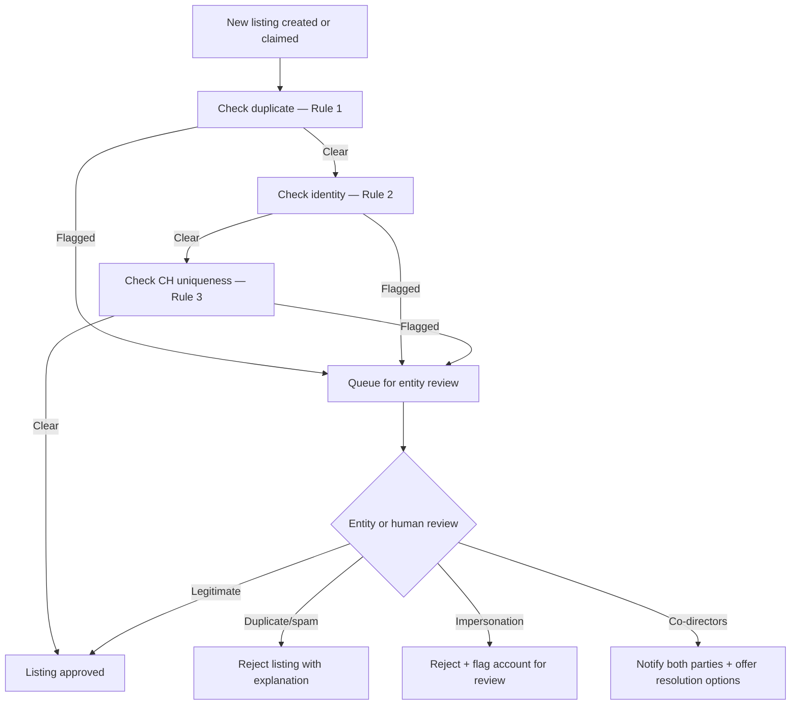
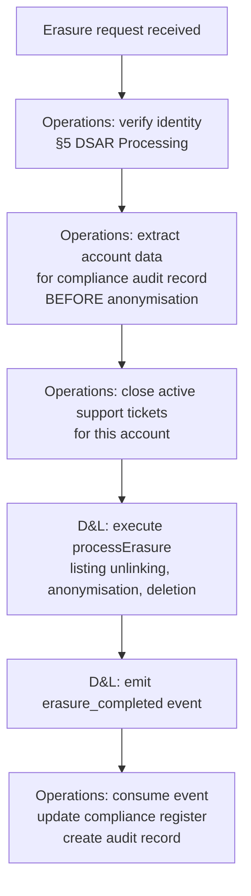

# Data & Listings — Concept Design

**Status:** Draft v6 — cross stress tested with all four domains. 5 rounds: 35 intra-domain + 20 D&L×Ops cross + 20 PP×D&L×Ops cross + CR×D&L×Ops×PP cross scenarios, 32 total fixes
**Domain:** Data & Listings
**Last updated:** 2026-02-11
**Inputs:** `data-model-proposal.md`, `taxonomy-v1-proposal.md`, `data-quality-framework.md`, `trust-verification-findings.md`, `on-screen-talent-scope-findings.md`, `provider-buyer-duality-findings.md`, `onboarding-flow-findings.md`, `entity-architecture-frame.md`
**Downstream:** `platform-and-product.md` (search, profiles, dashboards), `operations.md` (verification throughput, enrichment cadence), `commercial-and-revenue.md` (subscription tiers, conversion triggers), `cross-domain-dependencies.md`

---

## Summary

This document resolves the two flagged revisions from investigation (Account/Listing data model, talent-facing B2B taxonomy categories), populates the 5-layer concept design framework for the Data & Listings domain, and reframes every data process as an entity decision architecture per the governing frame. Three rounds of stress testing (35 intra-domain + 20 cross-domain scenarios) produced 27 fixes across four drafts.

**Key structural decisions:** Listing and Account are independent entities that converge on claim. Listings can exist without Accounts (unclaimed directory records). Accounts can own multiple Listings (multi-business users). EntityType lives on Listing, not Account.

**v3 additions:** Listing integrity rules (duplicate detection, new-listing identity verification, CH number uniqueness), atomic claim operations with pre-claim snapshots, enquiry handling for unclaimed listings, engagement metric scoping. GDPR erasure spec refined for dispute interactions. Full stress test resolution log for both rounds.

**v4 additions (cross stress test with Operations):** Claim lock semantics clarified — lock released on routing to manual review, claimStatus set to "pending_review" to block concurrent claims. Domain event emission (`claim_approved`, `claim_rejected`, `listing_archived`, `listing_suspended`, `decay_signal_detected`). Voluntary listing archival process. Quality score explanation object for support agents. `searchTerms` privacy note (aggregated, not raw queries). Batch import integrity mode for 4rfv. Deferred action scheduler distinguished from human TaskSpec. GDPR erasure orchestration protocol with Operations.

---

## 1. Account-Centric Data Model

### Design Decisions

**D1: Account is root entity.** Provider is an opt-in facet. Buyer is an always-active facet. Verification is performed once at account level. Settled — see `provider-buyer-duality-findings.md` §Key Finding 3.

**D2: Multiple Listings per Account.** An Account can own multiple Listings. A freelance DP who also runs an equipment hire company creates one Account with two Listings — one typed as "freelancer" (camera services), one typed as "company" (kit hire). EntityType lives on the Listing, not the Account, because the same person operates in different entity types across their listings. `[Stress test #1, #5 — one person, two companies]`

**D3: Listings exist independently of Accounts.** Unclaimed directory records (seeded from 4rfv import or entity enrichment) are Listings without a parent Account. When a provider claims a listing, an Account is created (or linked) and becomes the Listing's owner. This is the critical structural distinction: Account = registered user identity. Listing = directory record. The two converge on claim, but Listings can exist alone. `[Stress test #3 — 75% of launch data has no registered user]`

**D4: Listing integrity is entity-enforced.** The entity enforces three integrity rules on all listings to prevent spam, impersonation, and duplication. These apply at listing creation (not just claim). `[Stress test #26, #27, #35]`

- **Duplicate detection:** Listings owned by the same Account with >80% taxonomy tag overlap are flagged for review. Entity decision: legitimate separate businesses, or spam.
- **Identity verification at creation:** New listings (not claims) providing a companiesHouseNumber must pass a CH director check against the Account holder. New listings whose name matches an existing listing at >90% string similarity are flagged for review.
- **CH number uniqueness:** When a Listing is created or claimed with a companiesHouseNumber, the entity checks for existing Listings with the same CH number. If found under a different Account: notify both parties, offer merge or co-director resolution. If found under the same Account: flag as likely duplicate.

### Entity Model

```
Listing (directory record — can exist without Account)
├── id: UUID
├── accountId?: UUID (null if unclaimed)
├── entityType: EntityType
├── claimStatus: "unclaimed" | "claimed" | "disputed"
│
├── Identity
│   ├── name: string (trading name or individual name)
│   ├── companiesHouseNumber?: string
│   ├── vatNumber?: string
│   ├── foundedYear?: number
│   └── formerlyKnownAs: string[]
│
├── Profile
│   ├── headline: string (one-line professional title)
│   ├── bio: string (max ~500 words)
│   ├── logo?: URL
│   ├── headshot?: URL
│   ├── websiteUrl?: URL
│   ├── socialProfiles: SocialProfile[]
│   ├── contactEmail?: string
│   ├── contactPhone?: string
│   └── media: MediaItem[] (showreel URLs, gallery images)
│
├── Capabilities
│   ├── taxonomyTags: TaxonomyTag[] (Sector → Service Area → Specialisation)
│   ├── transactionTypes: TransactionType[]
│   ├── worksIn: Genre[]
│   └── freeTextTags: string[]
│
├── Location
│   ├── baseLocation: GeoLocation (postcode + region + coordinates)
│   ├── serviceRegions: Region[]
│   ├── travelWillingness: TravelWillingness
│   └── additionalLocations: LocationDetail[]
│
├── Availability
│   ├── status: AvailabilityStatus
│   ├── availableFrom?: ISO8601
│   ├── seasonalPatterns?: string
│   └── leadTime: LeadTime
│
├── Commercial
│   ├── budgetTier: BudgetTier
│   ├── dayRate?: number
│   ├── currency: Currency
│   └── subscriptionTier: SubscriptionTier
│
├── Credentials
│   ├── accreditations: Accreditation[]
│   ├── equipmentOwned: string[] (controlled vocabulary)
│   ├── softwareTools: string[] (controlled vocabulary)
│   ├── taxRegimeExpertise: string[]
│   └── regulatoryCompliance: string[]
│
├── Credits: Credit[]
│
├── Capacity? (conditional — S5/S6 providers)
│   ├── maxCrewSize?: string
│   ├── fleetStockSize?: ScaleIndicator
│   ├── stageSize?: string
│   ├── powerSpec?: string
│   └── parkingBasecamp?: string
│
├── Quality Score (entity-calculated, not provider-controlled)
│   ├── completeness: number (0–25)
│   ├── freshness: number (0–25)
│   ├── accuracy: number (0–20)
│   ├── richness: number (0–15)
│   ├── verification: number (0–15)
│   └── composite: number (0–100)
│
├── Verification
│   ├── tier: VerificationTier
│   ├── claimedAt?: ISO8601
│   ├── verifiedAt?: ISO8601
│   ├── verificationMethods: VerificationMethod[]
│   ├── lastVerificationCheck: ISO8601
│   └── verificationScore: number (0–15)
│
├── Lifecycle
│   ├── status: LifecycleStatus
│   ├── createdAt: ISO8601
│   ├── lastUpdated: ISO8601
│   ├── lastProviderLogin?: ISO8601
│   ├── mergedInto?: UUID
│   └── succeededBy?: UUID
│
├── Engagement (entity perception — not provider-controlled)
│   ├── profileViews: number
│   ├── profileViewers: ViewerRecord[] (gated by tier)
│   ├── searchAppearances: number
│   ├── searchTerms: string[] (gated by tier)
│   ├── enquiriesReceived: number (claimed listings only — see §Enquiries to Unclaimed Listings)
│   ├── enquiryResponseRate?: number (null for unclaimed — no respondent exists)
│   ├── enquiryResponseTime?: number (null for unclaimed)
│   └── trendData: TrendSnapshot[] (gated by tier)
│
├── EnquiryQueue: PendingEnquiry[] (unclaimed listings only — held until claim, max 90 days)
│
└── preClaimSnapshot?: ListingSnapshot (stored on claim, deleted after dispute window)
    // Frozen copy of listing state at moment of claim. Enables rollback if claim
    // proves fraudulent. Retained for 90 days post-claim or until dispute resolution.
    // [Stress test #31]


Account (registered user — created on signup or claim)
├── id: UUID
├── email: string (unique, verified)
├── fullName: string
├── createdAt: ISO8601
│
├── Authentication
│   ├── passwordHash: string
│   ├── ssoProviders: SSOProvider[] (Google, LinkedIn)
│   ├── mfaEnabled: boolean
│   └── lastLoginAt: ISO8601
│
├── Listings: Listing[] (0..N — account can own multiple listings)
│
├── Buyer Facet (always active)
│   ├── searchHistory: SearchRecord[]
│   ├── savedSearches: SavedSearch[]
│   ├── shortlists: Shortlist[]
│   ├── enquiriesSent: EnquiryRecord[]
│   ├── searchFrequency: number (monthly)
│   └── responsePatterns: BuyerResponseMetrics
│
└── Cross-Role
    ├── reputation: ReputationScore (composite of provider + buyer behaviour)
    ├── network: Connection[] (past collaborations, V2)
    └── activityLog: ActivityEvent[] (unified audit trail)
```

### Why Listing Is Separated from Account

The investigation-phase assumption was that Provider (now Listing) lives inside Account. Stress testing revealed two structural problems:

1. **Unclaimed records.** 75% of launch data (~3,500 listings) are enriched directory records with no registered user. These must exist as searchable entities before anyone claims them. They cannot be "Accounts" because there is no authenticated identity.

2. **Multi-listing users.** A freelance DP who also runs a kit hire company needs two distinct listings with different entity types, taxonomy tags, locations, and pricing. One Account → many Listings is the natural cardinality.

The Listing entity is what buyers search. The Account entity is what users authenticate with. They converge when a provider claims a listing (linking `listing.accountId` to their Account), but Listings have an independent lifecycle.

### Verification Placement

Verification lives on the **Listing**, not the Account. Rationale: each listing represents a distinct business identity that must be independently verified. A freelancer's personal DP listing is verified through different evidence than their equipment hire company listing. Account-level identity (email verification, authentication) is separate from listing-level business verification (Companies House, trade body, client credits).

The Account's identity is verified once (email, authentication). Each Listing's business identity is verified independently through the tier system.

### Entity Relationship Diagram



**Key cardinalities:** Account → Listing is 0..N (account can exist with no listings; account can own multiple listings). Listing → Account is 0..1 (unclaimed listings have no account).

### Type Definitions

```typescript
// --- Core entities ---

type EntityType = "freelancer" | "company" | "education" | "industry_body" | "public_sector" | "non_profit"
// Lives on Listing, not Account. Same person can own a freelancer listing and a company listing.

type ClaimStatus = "unclaimed" | "pending_review" | "claimed" | "disputed"
// "pending_review" = claim submitted, routed to manual review — blocks concurrent claims [Cross stress test X-2]
// "disputed" = competing claim received while listing is already claimed [Stress test #14]

type VerificationTier = "unclaimed" | "claimed" | "verified" | "premium_verified"

type VerificationMethod =
  | "email_domain_match"
  | "companies_house_active"
  | "companies_house_deep"
  | "website_bidirectional"
  | "vat_registration"
  | "trade_body_membership"
  | "client_confirmed_credit"
  | "portfolio_review"
  | "imdb_verified"
  | "insurance_verified"
  | "award_verified"
  | "linkedin_verified"

type SubscriptionTier = "free" | "standard" | "premium" | "partner"

type LifecycleStatus = "active" | "inactive" | "merged" | "dissolved" | "suspended" | "archived"

type AvailabilityStatus = "available" | "available_from" | "unavailable"

type TravelWillingness = "local_only" | "regional" | "uk_wide" | "international"

type BudgetTier = "£" | "££" | "£££"

type Currency = "GBP" | "EUR" | "both"

type LeadTime = "same_day" | "1_week" | "2_4_weeks" | "6_plus_weeks"

type ScaleIndicator = "small" | "medium" | "large"

type TransactionType = "hire" | "buy" | "service" | "consult"

type Genre = "drama" | "documentary" | "commercial" | "corporate" | "entertainment" | "news" | "sport" | "music" | "digital_social"

// --- Composite types ---

type Credit = {
  id: UUID
  projectName: string
  clientCommissioner?: string
  roleProvided: string           // mapped to taxonomy
  year: number
  format: CreditFormat
  genres: string[]
  awards: string[]
  sourcingMethod: "self_reported" | "imdb_linked" | "client_confirmed"
  verificationDate?: ISO8601
  imdbUrl?: URL
  clientCompanyName?: string     // for client-confirmed credits
}

type CreditFormat = "feature" | "tv_series" | "tv_one_off" | "short" | "commercial" | "corporate" | "music_video" | "digital_social" | "live_event"

type QualityScore = {
  completeness: number           // 0–25
  freshness: number              // 0–25
  accuracy: number               // 0–20
  richness: number               // 0–15
  verification: number           // 0–15
  composite: number              // 0–100, weighted sum
  lastCalculated: ISO8601
}

// --- Score variants ---
// The composite score (0–100) is the single source of truth for provider-facing "Profile Strength".
// Downstream consumers may derive weighted variants:
//   - Search ranking: may re-weight dimensions (e.g. boost Richness for buyer relevance)
//   - Entity perception: may re-weight dimensions (e.g. boost Freshness for data health monitoring)
// Raw dimension scores are always available. The composite is a convenience, not a constraint.
// [Stress test #18 — composite score serves multiple purposes]
```

### Migration Path from Investigation Data Model

The investigation-phase `data-model-proposal.md` Provider entity maps to the Listing entity:

| Investigation Entity | Concept Design Location | Change |
|---|---|---|
| Provider (root) | Listing (root) | Renamed. Listing can exist without Account (unclaimed). EntityType stays on Listing. |
| Provider.Identity | Listing.Identity | Name, CH number, VAT, founded year, aliases — all stay on listing. Email moved to Profile (optional for unclaimed). |
| Provider.Profile | Listing.Profile | No field changes. contactEmail now optional (unclaimed listings may lack it). |
| Provider.Capabilities | Listing.Capabilities | No field changes. |
| Provider.Location | Listing.Location | No field changes. |
| Provider.Availability | Listing.Availability | No field changes. |
| Provider.Commercial | Listing.Commercial | No field changes. |
| Provider.Credentials | Listing.Credentials | No field changes. |
| Provider.Credits | Listing.Credits | No field changes. |
| Provider.Verification | Listing.Verification | Stays on listing — each listing verified independently. |
| Provider.Quality Score | Listing.QualityScore | No field changes. |
| Provider.Lifecycle | Listing.Lifecycle | No field changes. |
| Provider.Engagement | Listing.Engagement | Stays on listing. Buyer engagement added to Account.BuyerFacet. |
| Provider.Capacity | Listing.Capacity | No field changes. |
| *(new)* | Account | New — registered user identity, authentication, buyer facet, cross-role. |
| *(new)* | Account.Authentication | New — SSO, MFA, session management. |
| *(new)* | Account.BuyerFacet | New — search history, shortlists, enquiries sent. |
| *(new)* | Account.CrossRole | New — shared reputation, network, activity log. |
| *(new)* | Listing.claimStatus | New — "unclaimed" / "claimed" / "disputed". |

**No investigation-phase fields are lost.** The revision renames Provider → Listing, adds Account as an independent entity linked on claim, and adds Buyer Facet and Cross-Role on Account. The structural change is: Listing can exist without Account (unclaimed records), and Account can own multiple Listings (multi-business users).

---

## 2. Taxonomy Revision — Talent-Facing B2B Categories

### Design Decision

Add a "Talent Services" service area under S7: Business Services. Nine new categories covering all B2B talent service providers flagged in `on-screen-talent-scope-findings.md`. The boundary is absolute: **business entities = in, individual performer profiles = out.**

### Revised S7: Business Services

| Service Area | Specialisations |
|---|---|
| **Finance** | Production accounting, Tax credits/relief, Completion bonds, Cashflow |
| **Insurance** | Production insurance, E&O, Equipment insurance |
| **Legal** | Entertainment law, Rights clearance, Contracts, IP |
| **Training & Education** | Short courses, Degrees, Apprenticeships, Mentoring, CPD |
| **Recruitment** | Permanent, Freelance, Crew agencies |
| **Talent Services** | Casting directors, Talent agents, Voice-over agencies, Presenter/speaker agencies, Extras/supporting artist agencies, Child performer agencies, Model agencies, Stunt coordination, Voice-over production |
| **Industry Bodies** | Unions, Guilds, Trade associations, Certification bodies |
| **Marketing & PR** | EPK, Unit publicity, Digital marketing, Social media, Festival strategy |
| **Distribution** | Sales agents, Aggregators, Platform delivery, Theatrical |

### What Changed

| Category | Previous Location | New Location | Rationale |
|---|---|---|---|
| Casting directors | S7: Recruitment | S7: Talent Services | Distinct workflow from crew recruitment. Casting directors source performers, not crew. |
| Talent agents | S7: Recruitment | S7: Talent Services | Same rationale. Agents represent performers, not crew. |
| Voice-over agencies | **Missing** | S7: Talent Services | Flagged in `on-screen-talent-scope-findings.md`. Closes 4rfv gap. |
| Presenter/speaker agencies | **Missing** | S7: Talent Services | Flagged. Corporate/events presenter sourcing is B2B workflow. |
| Extras/supporting artist agencies | **Missing** | S7: Talent Services | Flagged. Agencies are B2B entities, not individual performers. |
| Child performer agencies | **Missing** | S7: Talent Services | Flagged. Licensed agencies (child performance regulations). |
| Model agencies | **Missing** | S7: Talent Services | Flagged. Fashion/commercial model agencies serving production. |
| Stunt coordination | S3: Stunts & Action | S7: Talent Services (added) + S3: Stunts & Action (retained) | Stunt coordinators are B2B service providers. Individual stunt performers stay in S3. Dual listing appropriate — coordination is a service, performance is crew. |
| Voice-over production | **Missing** | S7: Talent Services | Companies that produce finished voice-over audio (script-to-delivery). Distinct from recording studios (S5) and individual voice artists (excluded). |

### Taxonomy Counts (Updated)

| Level | Previous Count | Updated Count |
|---|---|---|
| Sectors | 7 | 7 (unchanged) |
| Service Areas | ~50 | ~51 (+1: Talent Services) |
| Specialisations | ~200 | ~209 (+9 new categories) |

### V2+ Extensibility

The "Talent Services" service area is architecturally positioned so individual talent subcategories can be added beneath it without restructuring. Example future path:

```
S7: Business Services
└── Talent Services
    ├── Casting Directors (V1 — B2B)
    ├── Voice-Over Agencies (V1 — B2B)
    ├── Voice-Over Artists (V2+ — individual profiles, separate template)
    └── ...
```

This requires no taxonomy restructure — only a new profile template type and the GDPR/special-category-data compliance layer described in `on-screen-talent-scope-findings.md` §Key Finding 4.

---

## 3. Data Quality as Entity Perception

### Reframing

The data quality framework (`data-quality-framework.md`) describes scoring rules, decay detection, and enrichment cadence. Under the entity architecture frame, this is not an operational dashboard — it is the entity's primary visual system for the Data & Listings domain.

The entity perceives its data estate through five channels (the quality dimensions). Anomalies in any channel are perception signals that trigger decisions. The framework's escalation paths are decision architectures the entity executes.

### Entity Perception Signals



### Quality Score Computation as Entity Decision

```typescript
function computeQualityScore(listing: Listing): QualityScore {
  const completeness = scoreCompleteness(listing)         // 0–25
  const freshness = scoreFreshness(listing)               // 0–25
  const accuracy = scoreAccuracy(listing)                 // 0–20
  const richness = scoreRichness(listing)                 // 0–15
  const verification = listing.verification.verificationScore  // 0–15

  const composite = completeness + freshness + accuracy + richness + verification

  return { completeness, freshness, accuracy, richness, verification, composite, lastCalculated: now() }
}
```

Scoring rules are defined in `data-quality-framework.md` §Dimension Scoring Rules. No changes to the rules — only the actor changes. The entity computes this continuously, not on a cron schedule.

**Freshness for unclaimed listings:** A successful enrichment liveness check (website confirms live, email confirms deliverable) counts as a Freshness event and resets the Freshness clock — even for unclaimed listings with no provider activity. This prevents unclaimed records from being permanently stuck at Freshness = 0 when the underlying data is demonstrably current. `[Stress test #12]`

### Decay Detection as Entity Sensory Loop

```
detectDecay(listing: Listing):
  signals = []

  // Automated checks — entity performs without human involvement
  if listing.profile.websiteUrl AND websiteCheck(listing.profile.websiteUrl) == FAILED for 7+ consecutive days:
    signals.push({ type: "website_dead", severity: "high", scoreImpact: -4 })

  if listing.profile.contactEmail AND emailCheck(listing.profile.contactEmail) == HARD_BOUNCE:
    signals.push({ type: "email_bounced", severity: "high", scoreImpact: -4 })

  if listing.identity.companiesHouseNumber AND companiesHouseCheck(listing.identity.companiesHouseNumber) != "active":
    signals.push({ type: "ch_not_active", severity: "critical", scoreImpact: -5 })
    // Critical — triggers immediate archival decision

  if listing.claimStatus == "claimed" AND daysSinceLastActivity(listing) > 180:
    signals.push({ type: "stale_listing", severity: "medium", scoreImpact: freshnessDegradation() })

  // For each signal: entity decides response
  for signal in signals:
    evaluateDecayResponse(signal, listing)

  return signals
```

### Decay Response Decision Architecture



### Enrichment as Entity Self-Maintenance

The enrichment cadence from `data-quality-framework.md` §Tiered Schedule is reframed as the entity maintaining its own perceptual accuracy:

```
scheduleEnrichment(listing: Listing):
  tier = listing.verification.tier
  subscription = listing.commercial.subscriptionTier

  // Entity prioritises its own perception of high-value records
  // All enrichment decisions are subject to Layer 1 financial constraints (not yet defined).
  // If aggregate enrichment cost exceeds budget threshold, entity escalates to principal.
  // [Stress test #16 — entity decisions with cost implications]

  if subscription in ["premium", "partner"]:
    return { fullCycle: "quarterly", livenessCheck: "weekly", providerPrompt: "annual" }

  if tier in ["claimed", "verified"]:
    return { fullCycle: "semi_annual", livenessCheck: "fortnightly", providerPrompt: "annual" }

  if tier == "unclaimed":
    return { fullCycle: "annual", livenessCheck: "monthly", providerPrompt: null }
    // No provider prompt — entity sends claim outreach instead
```

---

## 4. Trust & Verification as Entity Decision Architecture

### Verification Tier Progression

The four tiers from `trust-verification-findings.md` are reframed as entity decisions, not operational processes.



### Claim Evaluation Decision

**Atomicity constraint:** Claim evaluation must be atomic per listing. Only one claim request is evaluated at a time. Use optimistic locking on `listing.claimStatus` — if a concurrent modification is detected, the second request receives a "claim in progress, please retry" response. `[Stress test #30]`

**Lock lifecycle:** `[Cross stress test X-2]` The optimistic lock is held only during the synchronous evaluation phase (milliseconds). When a claim routes to manual review, the lock is released but `claimStatus` is set to `"pending_review"` — this blocks concurrent claims at the application level without holding a database lock for 24+ hours. A second claim arriving while status is `"pending_review"` receives the same "claim in progress" response as a locked listing.

```
evaluateClaim(request: ClaimRequest, listing: Listing): ClaimDecision

  // Acquire lock on listing.claimStatus (optimistic lock — fail if concurrent modification)
  if !acquireLock(listing.id, "claim_evaluation"):
    return { action: "retry", reasons: ["concurrent claim in progress"] }

  // Block if already under review [Cross stress test X-2]
  if listing.claimStatus == "pending_review":
    releaseLock(listing.id, "claim_evaluation")
    return { action: "retry", reasons: ["claim already under manual review"] }

  // Step 0: Check for competing claim [Stress test #14]
  if listing.claimStatus == "claimed":
    listing.claimStatus = "disputed"
    releaseLock(listing.id, "claim_evaluation")
    return { action: "queue_dispute_resolution", confidence: 0.0,
             reasons: ["listing already claimed — competing claim received"],
             taskSpec: {
               task: "Resolve competing claim",
               listing: listing.id,
               existingClaimant: listing.accountId,
               newClaimant: request.accountId,
               acceptanceCriteria: "Verify which claimant is authorised representative. Check CH directors, domain ownership, or request authorisation letter.",
               escalation: "If unresolvable within 14 days, escalate to principal."
             }}

  // Step 1: Email domain match (fastest path)
  if emailDomainMatches(request.claimEmail, listing.profile.websiteUrl):
    releaseLock(listing.id, "claim_evaluation")
    return { action: "auto_approve", confidence: 0.9, tier: "claimed", points: 5 }

  // Step 2: Companies House verification
  chMatch = companiesHouse.lookup(request.companiesHouseNumber)

  if chMatch == null AND listing.entityType == "freelancer":
    listing.claimStatus = "pending_review"  // Block concurrent claims [X-2]
    releaseLock(listing.id, "claim_evaluation")
    return { action: "queue_manual_review", confidence: 0.4,
             reasons: ["sole trader — no CH record, need alternative verification"],
             taskSpec: manualReviewTaskSpec(listing, request, "sole_trader") }

  if chMatch.status == "dissolved":
    releaseLock(listing.id, "claim_evaluation")
    return { action: "auto_reject", confidence: 0.95,
             reasons: ["entity dissolved per Companies House"] }

  if chMatch.status == "active" AND emailDomainMatches(request.claimEmail, chMatch.registeredDomain):
    releaseLock(listing.id, "claim_evaluation")
    return { action: "auto_approve", confidence: 0.9, tier: "claimed", points: 5 }

  // Step 3: Partial match — entity queues for review
  listing.claimStatus = "pending_review"  // Block concurrent claims [X-2]
  releaseLock(listing.id, "claim_evaluation")
  return { action: "queue_manual_review", confidence: 0.5,
           reasons: ["CH match but no domain confirmation"],
           taskSpec: manualReviewTaskSpec(listing, request, "partial_match") }

// Manual review outcome callback (invoked by Operations when TaskSpec completes):
onManualReviewComplete(listing: Listing, decision: "approve" | "reject"):
  if decision == "approve":
    onClaimApproved(listing, findAccount(listing.pendingClaimAccountId))
  else:
    listing.claimStatus = "unclaimed"  // Release for future claims
    emitEvent("claim_rejected", { listingId: listing.id, reason: "manual_review_rejection" })

// Post-approval processing (runs after any successful claim):
onClaimApproved(listing: Listing, account: Account):
  listing.preClaimSnapshot = freezeListingState(listing)  // [Stress test #31]
  listing.accountId = account.id
  listing.claimStatus = "claimed"
  listing.verification.tier = "claimed"
  listing.verification.claimedAt = now()
  deliverPendingEnquiries(listing, account)  // [Stress test #22 — flush enquiry queue]
  recalculateQualityScore(listing)

  // Emit domain event for Operations perception [Cross stress test X-19]
  emitEvent("claim_approved", {
    listingId: listing.id,
    accountId: account.id,
    method: listing.preClaimSnapshot ? "auto" : "manual",  // inferred from snapshot timing
    timestamp: now()
  })

  // Schedule snapshot cleanup via deferred action scheduler [Cross stress test X-4]
  scheduleDeferredAction({ action: "delete_snapshot", listing: listing.id, executeAt: now() + 90 days })
```

**Deferred action scheduler:** `[Cross stress test X-4]` Automated entity actions scheduled for future execution (snapshot cleanup, enquiry queue expiry, notification reminders) use `scheduleDeferredAction`, not Operations' `TaskSpec`. TaskSpecs are for human-procured tasks with acceptance criteria and learning capture. Deferred actions are deterministic entity operations — no human involvement, no ambiguity. The deferred action scheduler is a shared infrastructure concern; its implementation is specified in `cross-domain-dependencies.md`.

```typescript
type DeferredAction = {
  id: UUID
  action: string                      // deterministic operation name
  params: Record<string, any>         // action-specific parameters
  executeAt: ISO8601                  // when to run
  retryPolicy: "once" | "retry_3"    // default: retry_3 with exponential backoff
  onFailure: "log" | "alert_principal"
}
// Distinguished from TaskSpec: no human actor, no acceptance criteria, no learning capture.
// Examples: delete_snapshot, expire_enquiry_queue, send_reminder_email.
```

### Manual Review Task Specification

Every manual review task the entity generates includes a standardised checklist. `[Stress test #13 — fraudulent claim prevention]`

```
manualReviewTaskSpec(listing: Listing, request: ClaimRequest, reason: string): TaskSpec
  return {
    task: "Verify claim authenticity for listing",
    listing: listing.id,
    claimant: request.accountId,
    reason: reason,
    checklist: [
      "Verify claimant is a director, partner, or authorised representative",
      "If CH number provided: cross-reference claimant name against CH director list",
      "If sole trader: check VAT registration, trade body membership, or portfolio evidence",
      "If partial match: verify domain ownership via WHOIS or request authorisation letter on company letterhead",
      "Check for red flags: Gmail/Hotmail claiming a corporate listing, mismatched location, no professional presence"
    ],
    acceptanceCriteria: "Approve only if claimant demonstrates legitimate authority over the business entity",
    escalation: "If evidence is ambiguous, reject claim with explanation and invite resubmission with additional evidence",
    estimatedTime: "10–15 minutes"
  }
```

### Competing Claims Resolution



### Verification Upgrade Decision

```
evaluateVerificationUpgrade(listing: Listing): UpgradeDecision

  if listing.verification.tier != "claimed":
    return { eligible: false, reason: "must be claimed first" }

  checks = {
    chDeep: companiesHouse.deepCheck(listing.identity.companiesHouseNumber),
    tradeBody: checkTradeBodyMembership(listing.credentials.accreditations),
    clientCredit: countClientConfirmedCredits(listing.credits),
    portfolioReview: null  // requires human — entity procures this
  }

  score = 0
  if checks.chDeep.clean: score += 1
  if checks.tradeBody.confirmed: score += 1
  score += min(checks.clientCredit * 2, 4)  // max 4 points from credits

  if score >= 6 AND checks.portfolioReview == null:
    // Entity needs human review of portfolio — procure resource
    return { eligible: "pending_human_review",
             taskSpec: {
               task: "Review portfolio/showreel for professional quality",
               listing: listing.id,
               evidence: listing.profile.media,
               acceptanceCriteria: "Genuine professional-grade work in claimed service areas",
               estimatedTime: "5–10 minutes"
             }}

  if score >= 6 AND checks.portfolioReview == "pass":
    return { eligible: true, newTier: "verified", newScore: score + 1 }

  return { eligible: false, score: score, threshold: 6,
           guidance: missingChecks(checks) }
```

### Entity Learning from Verification Outcomes

Every verification decision generates learning data for the cognitive substrate:

| Event | Data Captured | What Entity Learns |
|---|---|---|
| Auto-approve claim → provider active 90 days later | Claim confidence + retention outcome | Which claim signals predict genuine engagement |
| Manual review → approve → provider active | Review decision + outcome | Whether manual reviews are correctly calibrated |
| Manual review → approve → provider never returns | Review decision + abandonment | False positive rate in manual review |
| Client credit confirmation → 50% response rate | Outreach method + response rate | Which outreach approaches yield highest confirmation |
| Verification upgrade → provider renews subscription | Verification tier + renewal | Whether verification correlates with commercial value |

This data feeds Layer 2 learning. Log format: `{ event, timestamp, inputs, decision, outcome, outcomeTimestamp }`.

### Listing Integrity Rules

`[Stress test #26, #27, #35]`

Three entity-enforced rules that apply at listing creation and claim, not just post-hoc moderation.

#### Rule 1: Duplicate/Near-Duplicate Detection

```
checkDuplicate(newListing: Listing, account: Account): IntegrityDecision

  // Check 1: Same-account taxonomy overlap
  existingListings = findListings(accountId = account.id)
  for existing in existingListings:
    overlap = taxonomyOverlap(newListing.capabilities.taxonomyTags, existing.capabilities.taxonomyTags)
    if overlap > 0.8:
      return { action: "flag_for_review",
               reasons: ["new listing shares >80% taxonomy tags with existing listing " + existing.id],
               taskSpec: {
                 task: "Determine if listings represent separate businesses or duplicate",
                 newListing: newListing.id,
                 existingListing: existing.id,
                 acceptanceCriteria: "Different trading names, different CH numbers, or different physical locations = legitimate. Same entity listed twice = reject new listing.",
                 estimatedTime: "5 minutes"
               }}

  // Check 2: Name similarity across all listings
  similarListings = findListingsByNameSimilarity(newListing.identity.name, threshold = 0.9)
  if similarListings.length > 0 AND similarListings[0].accountId != account.id:
    return { action: "flag_for_review",
             reasons: ["listing name >90% similar to existing listing owned by different account"],
             similarListings: similarListings.map(l => l.id) }

  return { action: "allow" }
```

#### Rule 2: Identity Verification at Creation

```
verifyNewListingIdentity(listing: Listing, account: Account): IntegrityDecision

  // If CH number provided, verify account holder is associated
  if listing.identity.companiesHouseNumber:
    chData = companiesHouse.lookup(listing.identity.companiesHouseNumber)

    if chData == null:
      return { action: "allow_with_warning",
               reasons: ["CH number not found — may be invalid or sole trader misentry"] }

    if chData.status == "dissolved":
      return { action: "reject", reasons: ["CH entity is dissolved"] }

    directors = chData.directors.map(d => d.name.toLowerCase())
    accountName = account.fullName.toLowerCase()
    if !fuzzyMatch(accountName, directors, threshold = 0.85):
      return { action: "flag_for_review",
               reasons: ["Account holder name does not match any CH director"],
               evidence: { accountName: account.fullName, directors: chData.directors },
               taskSpec: {
                 task: "Verify account holder is authorised to create listing for this company",
                 checklist: [
                   "Check if account holder is an employee, not director",
                   "Check if name mismatch is due to maiden name, abbreviation, or middle name",
                   "If no match found, request authorisation letter"
                 ],
                 estimatedTime: "10 minutes"
               }}

  return { action: "allow" }
```

#### Rule 3: Companies House Number Uniqueness

```
checkCHUniqueness(listing: Listing): IntegrityDecision

  if !listing.identity.companiesHouseNumber:
    return { action: "allow" }

  existingWithSameCH = findListings(companiesHouseNumber = listing.identity.companiesHouseNumber)
    .filter(l => l.id != listing.id)

  if existingWithSameCH.length == 0:
    return { action: "allow" }

  // Same CH number already exists
  for existing in existingWithSameCH:
    if existing.accountId == listing.accountId:
      return { action: "flag_duplicate",
               reasons: ["same account already has a listing with this CH number"],
               existingListing: existing.id }

    if existing.accountId != listing.accountId:
      // Different accounts claim same legal entity — possible co-directors
      return { action: "flag_co_director",
               reasons: ["different account owns a listing with the same CH number"],
               existingListing: existing.id,
               existingAccount: existing.accountId,
               resolution: "Notify both parties. Options: (a) designate primary listing owner, (b) merge listings, (c) keep separate if genuinely different service offerings from same entity." }

  return { action: "allow" }
```



#### Batch Import Integrity Mode

`[Cross stress test X-16]`

The integrity rules above assume incremental listing creation (one at a time, checked against the existing corpus). The 4rfv import creates ~4,700 listings in a batch. Batch mode modifies the integrity pipeline:

```
batchImportIntegrity(records: ImportRecord[]): BatchIntegrityResult

  // Phase 1: Intra-batch deduplication (runs before any records are committed)
  // Sort records by name for deterministic comparison order
  sorted = records.sortBy(r => r.identity.name)
  duplicateClusters = clusterByNameSimilarity(sorted, threshold = 0.9)
  chDuplicates = clusterByCHNumber(sorted)

  // For each cluster: keep the most complete record, flag the rest
  for cluster in duplicateClusters + chDuplicates:
    primary = selectMostComplete(cluster)  // highest field count
    for duplicate in cluster.exclude(primary):
      duplicate.importStatus = "flagged_duplicate"
      duplicate.mergeCandidate = primary.id

  // Phase 2: Commit non-flagged records
  // Phase 3: Route flagged records to manual cleaning (Operations §6 Phase 3)

  // Rule 2 (identity verification) is skipped for batch import — no Account exists
  // to verify against. These are unclaimed listings; identity verification applies at claim time.

  return { committed: nonFlagged.length, flagged: flagged.length, clusters: duplicateClusters.length }
```

**Key difference from incremental mode:** Import order does not matter because the entire batch is clustered before any record is committed. No asymmetric detection. Rule 2 (identity verification at creation) does not apply — batch-imported listings have no Account and cannot be verified against a person. Rules 1 and 3 apply in modified form (intra-batch clustering rather than incremental checking).

### Enquiries to Unclaimed Listings

`[Stress test #22]`

Unclaimed listings have no Account to receive in-app messages. Enquiry handling follows a three-tier approach:

```
handleEnquiryToListing(listing: Listing, enquiry: Enquiry): EnquiryResult

  if listing.claimStatus == "claimed":
    // Normal path — deliver to account inbox
    deliverToAccount(listing.accountId, enquiry)
    listing.engagement.enquiriesReceived += 1
    return { delivered: true, method: "in_app" }

  if listing.claimStatus == "unclaimed":
    if listing.profile.contactEmail:
      // Forward via email with claim CTA
      sendEnquiryForwardEmail(listing.profile.contactEmail, enquiry, claimCTA = true)
      // Also queue for delivery if/when claimed
      listing.enquiryQueue.push({ enquiry, forwardedAt: now(), expiresAt: now() + 90 days })
      listing.engagement.enquiriesReceived += 1
      return { delivered: true, method: "email_forward",
               claimConversion: "email includes 'Claim your listing to respond directly'" }

    else:
      // No email — show buyer the listing's phone/website for direct contact
      // Queue enquiry for delivery if/when claimed
      listing.enquiryQueue.push({ enquiry, forwardedAt: null, expiresAt: now() + 90 days })
      return { delivered: false, method: "direct_contact_shown",
               buyerMessage: "Contact this provider directly via their website or phone." }

  if listing.claimStatus == "disputed":
    // Freeze enquiry delivery until dispute resolved
    listing.enquiryQueue.push({ enquiry, forwardedAt: null, expiresAt: now() + 90 days })
    return { delivered: false, method: "queued_pending_dispute" }
```

### Voluntary Listing Archival

`[Cross stress test X-12]`

Operations' support triage includes "Remove my listing." D&L Principle P6 states listings are never deleted — only archived or GDPR-erased. This process covers a provider voluntarily requesting their listing be taken down (distinct from GDPR erasure, which is a legal right).

```
archiveListing(listing: Listing, account: Account, reason: string): ArchivalResult

  if listing.accountId != account.id:
    return { action: "reject", reason: "account does not own this listing" }

  // Paid subscribers: confirm subscription will not be refunded
  if listing.commercial.subscriptionTier != "free":
    emitEvent("subscription_ended", {
      listingId: listing.id,
      previousTier: listing.commercial.subscriptionTier,
      reason: "voluntary_archival"
    })

  listing.lifecycle.status = "archived"
  listing.commercial.subscriptionTier = "free"
  // Listing removed from search results but record preserved
  // Provider can reactivate by logging in and setting status back to "active"

  emitEvent("listing_archived", {
    listingId: listing.id,
    accountId: account.id,
    reason: reason,
    reactivatable: true
  })

  return { action: "archived", reactivatable: true,
           message: "Your listing has been removed from search. You can reactivate it at any time from your dashboard." }
```

**Reactivation:** Archived listings can be restored to "active" by the owning Account at any time. Quality score is recalculated on reactivation (freshness will have decayed). No re-verification needed if the listing was previously verified — the verification tier is preserved through archival.

**Enquiry queue lifecycle:** Pending enquiries are held for 90 days maximum. On claim, all pending enquiries are delivered to the new Account's inbox (see `onClaimApproved`). After 90 days unclaimed, expired enquiries are deleted. The buyer is notified if their enquiry expires without delivery: "This provider hasn't claimed their listing yet. Here are similar providers who are active on CALLSHEET."

**Entity perception signal:** Enquiries to unclaimed listings are a high-value signal for the Provider Outreach Cycle ceremony — listings receiving enquiries should be prioritised for claim outreach. An unclaimed listing with 5 pending enquiries is more valuable to claim than one with 0.

**Retroactive anonymous enquiry linking `[XP-10]`:** Platform allows anonymous enquiry submission (no account required). When a buyer later creates an account with the same email, D&L scans `PendingEnquiry[]` across all listings for matching `senderEmail`. If found, `senderAccountId` is updated to the new account's ID. This links the enquiry to the buyer's account for enquiry history tracking. Low priority — functional without it, but improves data consistency for the buyer's "Enquiries sent" dashboard view.

```
onAccountCreated(account: Account):
  // Retroactive linking of anonymous enquiries [XP-10]
  orphanedEnquiries = findEnquiriesBySenderEmail(account.email)
  for enquiry in orphanedEnquiries:
    if enquiry.senderAccountId == null:
      enquiry.senderAccountId = account.id
```

---

## 4a. Domain Events Emitted by Data & Listings

`[Cross stress test X-19, X-6, X-18, X-20]`

D&L emits domain events for every significant state change. Other domains consume these events — they do not poll D&L state. This is the primary cross-domain coordination mechanism.

```typescript
type DLDomainEvent =
  | { type: "claim_approved", listingId: UUID, accountId: UUID, method: "auto" | "manual", timestamp: ISO8601 }
  | { type: "claim_rejected", listingId: UUID, reason: string, timestamp: ISO8601 }
  | { type: "listing_archived", listingId: UUID, accountId: UUID, reason: string, reactivatable: boolean }
  | { type: "listing_suspended", listingId: UUID, reason: string, previousStatus: LifecycleStatus }
  | { type: "listing_reactivated", listingId: UUID, accountId: UUID }
  | { type: "verification_tier_changed", listingId: UUID, previousTier: VerificationTier, newTier: VerificationTier }
  | { type: "decay_signal_detected", listingId: UUID, signal: DecaySignal, activeSupportTicket?: UUID }
  | { type: "quality_score_changed", listingId: UUID, previousComposite: number, newComposite: number, changedDimensions: string[] }
  | { type: "erasure_completed", accountHash: string, listingsAffected: number, freelancerListingsDeleted: number }
```

**Consumer mapping:**

| Event | Operations | Commercial | Platform |
|---|---|---|---|
| `claim_approved` | Claim volume tracking, learning hypothesis L2/L3 | Conversion funnel + cancel pending win-back schedule for listing `[CR-X-17]` | Dashboard access, ISR revalidation |
| `claim_rejected` | Claim volume tracking | — | — |
| `listing_archived` | Close active support tickets for listing | Churn analysis | Remove from search, ISR revalidation, update shortlists `[XP-15]` |
| `listing_suspended` | Check for active support tickets before suspension `[X-20]` | — | Add warning indicator, ISR revalidation `[XP-11]`, update shortlists `[XP-15]` |
| `listing_reactivated` | Resume suppressed outreach, re-enable enrichment cadence scheduling `[XP-3]` | — | Restore to search, ISR revalidation `[XP-5]`, restore shortlist entries `[XP-15]` |
| `verification_tier_changed` | — | Badge display | Profile display, search index update `[XP-13]` |
| `decay_signal_detected` | Cross-reference with active support tickets `[X-6]` | — | Add "outdated" indicator (high/critical) `[PP-32]` |
| `quality_score_changed` | — | Conversion triggers | Ranking recalculation, clear decay indicator if improved `[XP-7]` |
| `erasure_completed` | Close DSAR case, update compliance register | — | Purge from search, ISR revalidation, remove from shortlists `[XP-15]` |

**Decay/support coordination `[X-6, X-20]`:** Before emitting `decay_signal_detected`, the entity checks Operations' active ticket registry. If an active support ticket exists for the same listing and the ticket category is "data_correction" or "search_visibility", the decay signal is annotated with `activeSupportTicket: ticketId`. Operations consumes this and suppresses duplicate outreach — the provider is already engaged on the issue. Conversely, before D&L suspends a listing (90-day decay non-response), it emits `listing_suspended` and Operations checks for active cases. If an active support ticket exists, suspension is deferred until the ticket resolves.

### Events Consumed by D&L

`[XP-19, XP-2]`

D&L consumes events from Platform & Product and Operations:

| Event | Source | D&L Action |
|---|---|---|
| `listing_created` | Platform | Compute initial quality score, generate initial `QualityScoreExplanation`, emit `quality_score_changed` event `[XP-19]` |
| `profile_edited` | Platform | Recalculate quality score (freshness reset + field change), emit `quality_score_changed` |
| `subscription_tier_changed` | Operations | Recalculate enrichment cadence via `scheduleEnrichment()` `[X-18]` |
| `account_closed` | Platform | Immediately suspend enrichment for all archived listings owned by closed account `[XP-2]` |

**Initial quality score computation `[XP-19]`:** When Platform emits `listing_created`, D&L's `computeQualityScore()` executes on the new listing data. For Paths A and B (new listings), this computes a score from the initial field set. For Path C (claim), D&L's `onClaimApproved()` already calls `recalculateQualityScore()` — but the `listing_created` event provides an explicit trigger that does not rely on implicit data-change detection. D&L emits `quality_score_changed` so Platform can update the dashboard immediately.

---

## 4b. Quality Score Explanation Object

`[Cross stress test X-13]`

D&L Principle P3 guarantees transparency. The `computeQualityScore` function returns a composite number, but support agents and the provider dashboard need *explanations* — which fields are missing, which checks failed. D&L produces a structured explanation alongside every score.

```typescript
type QualityScoreExplanation = {
  composite: number                           // 0–100
  dimensions: {
    name: string                              // "completeness" | "freshness" | etc.
    score: number                             // dimension score
    maxScore: number                          // dimension maximum
    factors: {
      factor: string                          // e.g. "missing_headline", "website_dead", "no_credits"
      impact: "positive" | "neutral" | "negative"
      detail: string                          // human-readable: "No headline set — add a one-line title"
    }[]
  }[]
  topImprovements: string[]                   // top 3 actions to improve score, ordered by impact
}

function explainQualityScore(listing: Listing): QualityScoreExplanation
  // Computed alongside every score calculation. Stored on listing for instant retrieval.
  // Consumed by: provider dashboard (self-service), Operations support agents (ticket resolution),
  // entity perception (identifies systematic quality issues across portfolio).
```

This object is an **asset** — stored on the Listing and refreshed on every score recalculation. Operations' support triage uses it to auto-generate the "Your listing scores X/100 because..." explanation without needing to reverse-engineer the score.

---

## 4c. Search Terms Privacy Note

`[Cross stress test X-11]`

`Listing.Engagement.searchTerms` stores **aggregated term frequencies**, not raw per-user queries. Format: `{ term: string, count: number, period: string }[]`. Individual buyer queries are not stored on the Listing — they exist only in `Account.BuyerFacet.searchHistory` (subject to 12-month retention per Operations §5). When search history is purged or erased, Listing-side aggregates are unaffected because they contain no personal identifiers. A search term like "camera operator london" appearing on a Listing indicates the term surfaced that listing N times — not who searched for it.

**Exception:** If a search term is unique enough to plausibly identify a specific buyer (single-count terms containing names or unique identifiers), the entity strips it from the Listing aggregate during the nightly aggregation batch. Threshold: terms with count = 1 that match a known Account name or contain more than 3 proper nouns are excluded.

---

## 5. Concept Design: 5-Layer Framework

### Layer 1: Principles

Eight governing principles for the Data & Listings domain. These are constraints, not aspirations.

| # | Principle | Derived From | Enforcement |
|---|---|---|---|
| P1 | **Listing and Account are independent entities that converge on claim** | `provider-buyer-duality-findings.md` + stress test | Listing can exist without Account (unclaimed). Account can own 0..N Listings. No orphan constraint — both have independent lifecycles. |
| P2 | **Verification tier is independent of payment tier** | `trust-verification-findings.md` | A paying subscriber who fails verification checks does not receive a Verified badge. Code-enforced separation. |
| P3 | **Quality score is transparent — never opaque** | `data-quality-framework.md`, `trust-verification-findings.md` | Every score dimension and its calculation visible to provider. Methodology published. |
| P4 | **Data quality is entity perception, not a feature** | `entity-architecture-frame.md` §Design Principle 3 | Quality signals feed entity decision engine, not just provider dashboards. Dual-purpose by design. |
| P5 | **Business entities in, individual performers out (V1)** | `on-screen-talent-scope-findings.md` | Taxonomy and profile templates enforce boundary. No individual talent data model in V1. |
| P6 | **A listing is never deleted — only archived or GDPR-erased** | `data-quality-framework.md` §Hard Rules | Soft delete for archival. True delete only for GDPR Art 17 requests. |
| P7 | **Absence of credentials is never penalised** | `trust-verification-findings.md` §Credit Schema | No IMDb = neutral, not negative. No awards = neutral. Score only adds, never subtracts for missing optional signals. |
| P8 | **Listing integrity is enforced at creation, not just post-hoc** | Stress test round 2 | Duplicate detection, identity verification, and CH uniqueness checks run before a listing goes live. Entity prevents impersonation and spam proactively. |

### Layer 2: Ways of Working

How the entity and its procured resources operate on data.

| Process | Actor | Cadence | Escalation |
|---|---|---|---|
| **Quality score computation** | Entity (automated) | Continuous — recalculate on any input change | None — fully autonomous |
| **Liveness checks** (website, email, social) | Entity (automated) | Weekly (paid) / Fortnightly (claimed) / Monthly (unclaimed) | Failed check → decay response decision tree |
| **Companies House monitoring** | Entity (automated) | Monthly polling + streaming API for dissolution events | Dissolution → immediate archival. Name/address change → flag for confirmation. |
| **Full enrichment cycle** | Entity (automated + human review for edge cases) | Quarterly (paid) / Semi-annual (claimed) / Annual (unclaimed) | Entity procures human reviewer when automated checks are inconclusive |
| **Claim evaluation** | Entity (automated for 65–85%) | On-demand — triggered by claim submission | Manual review queue for low-confidence claims. Entity writes task spec for human reviewer. |
| **Verification upgrade** | Entity (automated checks) + human (portfolio review, credit confirmation) | On-demand — triggered by provider request or entity suggestion | Entity procures human for portfolio review and client outreach |
| **Taxonomy governance** | Entity (automated clustering of free-text tags) + human (quarterly review) | Monthly automated analysis / Quarterly human review ceremony | Entity surfaces promotion candidates. Human confirms additions. |
| **Decay response** | Entity (decision tree) | Continuous — triggered by signal detection | Paid listings: never reduce visibility without human confirmation |

### Layer 3: Ceremonies

Recurring events with defined inputs, participants, outputs.

| Ceremony | Cadence | Input | Participants | Output |
|---|---|---|---|---|
| **Taxonomy Review** | Quarterly | Free-text tag clustering report, zero-result search queries, provider feedback | Entity + industry advisor (procured) | Taxonomy additions/merges/deprecations |
| **Data Health Review** | Monthly | Aggregate quality score distribution, decay signal trends, enrichment coverage | Entity (autonomous) | Adjusted enrichment cadence, outreach campaigns, resource procurement decisions |
| **Verification Calibration** | Quarterly | Auto-approve accuracy rate, manual review outcomes, false positive/negative rates | Entity + verification specialist (procured) | Threshold adjustments, process refinements |
| **Provider Outreach Cycle** | Monthly | Unclaimed listings ranked by estimated value (sector, location, engagement potential) | Entity (campaign generation) + outreach resource (procured if volume exceeds entity capability) | Claim conversion rate, outreach effectiveness data |

### Layer 4: Activities

Discrete actions performed within the ways of working.

| Activity | Trigger | Actor | Duration | Output |
|---|---|---|---|---|
| Compute quality score | Any input change (provider edit, enrichment result, verification event) | Entity | <1 second | Updated QualityScore on ProviderFacet |
| Run liveness check | Scheduled per enrichment cadence | Entity | <5 seconds per provider | Pass/fail per check. Failed → decay signal. |
| Evaluate claim request | Provider submits claim | Entity | <10 seconds (auto) / 5–15 minutes (manual) | ClaimDecision: approve, reject, or queue |
| Confirm client credit | Provider requests or entity initiates | Entity (sends email) + client (responds) | 1–14 days (waiting for response) | Credit sourcing upgraded to "client_confirmed" or no response |
| Review portfolio | Verification upgrade requires human judgment | Procured human (verification specialist) | 5–10 minutes | Pass/fail + quality notes |
| Archive dissolved entity | Companies House dissolution detected | Entity | Immediate | Listing removed from search. Record preserved internally. |
| Process GDPR erasure | Provider invokes Art 17 right | Entity (automated deletion) + principal notification | <24 hours | Erasure per GDPR data map (see §GDPR Erasure Specification below). |

### Layer 5: Assets

Artifacts produced and maintained by the domain.

| Asset | Type | Owner | Consumers |
|---|---|---|---|
| **Account-Provider data model schema** | Database schema (Drizzle ORM) | Data & Listings | All domains |
| **Taxonomy hierarchy** | Structured data (Sector → Service Area → Specialisation) | Data & Listings | Platform & Product (search, filters), Operations (categorisation) |
| **Synonym/alias lookup table** | Search configuration | Data & Listings | Platform & Product (search layer) |
| **Quality scoring ruleset** | Configuration (weights, thresholds, dimension definitions) | Data & Listings | Platform & Product (ranking), Commercial (conversion triggers) |
| **Verification decision tree** | Decision architecture (pseudocode + thresholds) | Data & Listings | Operations (human review tasks), Commercial (badge display) |
| **Controlled vocabularies** | Curated lists (equipment, accreditations, regions, genres) | Data & Listings | Platform & Product (filters, autocomplete) |
| **Enrichment pipeline configuration** | Scheduling + API integration specs | Data & Listings | Operations (monitoring), Entity (autonomous execution) |
| **Free-text tag corpus** | Accumulated provider-entered tags with clustering metadata | Data & Listings | Taxonomy Review ceremony |
| **Verification outcome log** | Structured event log (decision + inputs + outcome) | Data & Listings | Entity Layer 2 (learning), Principal (reporting) |
| **Quality score explanation cache** | Per-listing structured explanation (dimensions, factors, top improvements) `[X-13]` | Data & Listings | Platform & Product (provider dashboard), Operations (support agents) |
| **Domain event schema** | Typed event definitions for all D&L state changes `[X-19]` | Data & Listings | Operations, Commercial, Platform (consumers) |
| **Taxonomy reference export** | Machine-readable and human-readable taxonomy hierarchy export (JSON + spreadsheet) `[X-17]` | Data & Listings | Operations (contractor tasks), Platform & Product (search configuration) |
| **Taxonomy comparison utilities** | Shared data contract: `computeTaxonomyOverlap(a, b)` (Jaccard similarity on Service Area tags) `[CR-X-12]` | Data & Listings (data source) | Commercial (competitor_upgraded conversion trigger, §5.3) |

---

## 6. GDPR Erasure Specification

`[Stress test #4, #19 — cross-entity data dependencies under erasure]`

When an Account holder invokes Art 17 right to erasure, the entity processes deletion per this data map:

| Data Category | Location | Erasure Action | Rationale |
|---|---|---|---|
| **Account identity** (name, email) | Account | **Delete** | Personal data of the requesting party. |
| **Authentication data** | Account.Authentication | **Delete** | Personal data. |
| **Listing(s) owned by account** | Listing (where accountId = requester) | **Anonymise listing, unlink account.** Listing reverts to unclaimed with personal identifiers removed. Business-level data (company name, capabilities, location) retained under legitimate interest for directory integrity. If individual freelancer listing, **delete entirely** — the listing IS the personal data. | Companies are not data subjects. Freelancer listings are personal data. |
| **Buyer search history** | Account.BuyerFacet.searchHistory | **Delete** | Personal data (behavioural). |
| **Saved searches & shortlists** | Account.BuyerFacet | **Delete** | Personal data. |
| **Enquiries sent (as buyer)** | Account.BuyerFacet.enquiriesSent | **Delete from requester's records.** Receiving provider retains their copy of the enquiry under legitimate interest (business communication received). Requester's identity anonymised in provider's inbox ("Deleted user"). | Provider has legitimate interest in retaining business communications sent to them. |
| **Enquiries received (as provider)** | Listing.Engagement.enquiriesReceived | **Aggregate counts retained, anonymised.** Individual enquiry records: sender identity already belongs to other party. Listing-level aggregate (count, response rate) is not personal data of the requester. | Aggregates are not personal data. |
| **Client-confirmed credits referencing this account's company** | Other providers' Credit records | **No change.** Credit says "worked with [Company Name]" — company names are not personal data. If credit references an individual freelancer by name, **anonymise** to "Client confirmed (name redacted)". | Company names are not personal data under GDPR. Individual names are. |
| **Activity log** | Account.CrossRole.activityLog | **Anonymise.** Replace account identifier with "deleted-[hash]". Retain event types and timestamps for entity learning. | Proportionate: retains structural learning data, removes personal identifiers. |
| **Audit record of erasure** | System | **Create and retain.** "Erasure processed for account [hash] on [date]. Categories deleted: [list]." | Required for compliance demonstration (Art 5(2) accountability). |

### Erasure Orchestration Protocol

`[Cross stress test X-9]`

GDPR erasure spans both domains. **Operations receives and verifies the request. D&L executes the data-level erasure. Operations completes the compliance record.** Execution order matters — Operations must extract any data needed for DSAR response *before* D&L anonymises the account.



**Critical constraint:** Operations' data extraction (step C) must complete before D&L's `processErasure` begins. The entity enforces this sequencing — no parallel execution. If Operations' extraction fails, the erasure does not proceed (but the 30-day clock continues, so failure triggers immediate principal escalation).

### Erasure Decision Logic

```
processErasure(account: Account):

  // Pre-condition: Operations has completed identity verification and data extraction [X-9]

  // Step 0: Resolve any active disputes [Stress test #28]
  disputedListings = findListings(accountId = account.id, claimStatus = "disputed")
  for listing in disputedListings:
    // Erasure of current owner auto-resolves dispute — competing claimant can proceed
    resolveDisputeInFavourOf(listing, competingClaimant)
    // The listing will be unlinked from this account below regardless

  competingDisputes = findDisputesWhereCompetingClaimant(account.id)
  for dispute in competingDisputes:
    // Erasure of competing claimant withdraws their competing claim
    withdrawCompetingClaim(dispute)
    restoreListingClaimStatus(dispute.listing, "claimed")

  // Step 1: Identify all owned listings
  listings = findListings(accountId = account.id)

  for listing in listings:
    if listing.entityType == "freelancer":
      // Freelancer listing IS personal data — full delete
      archiveForAudit(listing)  // anonymised snapshot for compliance record
      deleteListing(listing)
    else:
      // Company listing — anonymise, unlink, revert to unclaimed
      listing.accountId = null
      listing.claimStatus = "unclaimed"
      listing.preClaimSnapshot = null  // no longer relevant
      removePersonalIdentifiers(listing)  // contact email, contact phone, bio references to individual
      listing.verification.tier = "unclaimed"
      recalculateQualityScore(listing)

  // Step 2: Delete account-level personal data
  anonymiseBuyerFacet(account)
  anonymiseCrossRole(account)
  deleteAuthentication(account)
  anonymiseAccount(account)  // replace name/email with "deleted-[hash]"

  // Step 3: Notify principal
  notifyPrincipal({ type: "gdpr_erasure", accountHash: hash(account.id), timestamp: now() })

  // Step 4: Emit domain event for Operations [Cross stress test X-9]
  emitEvent("erasure_completed", {
    accountHash: hash(account.id),
    listingsAffected: listings.length,
    freelancerListingsDeleted: listings.filter(l => l.entityType == "freelancer").length,
    timestamp: now()
  })

  // Step 5: Create audit record
  createAuditRecord(account, categoriesDeleted, timestamp)
```

---

## 7. Layer 1 Financial Governance Placeholder

`[Stress test #16 — entity decisions with cost implications need budget awareness]`

The entity architecture frame (§Layer 1) specifies that financial limits are governance rules set by the principal. Layer 1 is not yet defined. Until it is, the following constraint applies:

**Any entity decision that changes aggregate operational cost by >10% triggers principal escalation.** Examples: increasing enrichment cadence for all unclaimed listings (increases API call volume), procuring additional human verification resources, launching a bulk outreach campaign.

Entity decisions with cost implications must log: `{ decision, estimatedCostImpact, currentBudgetUtilisation, escalated: boolean }`.

This placeholder will be replaced by the formal Layer 1 specification when it is defined. The concept design does not depend on Layer 1 details — it only acknowledges that cost-bearing decisions are governance-constrained.

---

## 8. Open Questions (Scoped)

| # | Question | Resolution Owner | Resolution Phase | Dependency |
|---|---|---|---|---|
| 1 | Which Drizzle ORM schema patterns best express the Listing + Account relationship? Separate tables with FK, or polymorphic pattern? | Platform & Product concept design | Concept design | None — schema design decision |
| 2 | Should the entity expose a public API for listing data, or is all access mediated through the platform UI? | Platform & Product concept design | Concept design | None |
| 3 | How does the Buyer Facet's search history interact with privacy (GDPR Art 5(1)(e) — storage limitation)? Retention period for search history? | Operations concept design | Concept design | GDPR review |
| 4 | Cross-role reputation scoring specifics — how does buyer behaviour (response time, enquiry quality) feed into the composite reputation? | V2 design | Post-V1 | Requires usage data |
| 5 | VAT treatment of subscription pricing — ex-VAT or inc-VAT display affects perceived price by 20% | Commercial & Revenue concept design | Concept design | None |

---

## 9. Stress Test Resolution Log

35 intra-domain scenarios across 2 rounds + 20 cross-domain scenarios with Operations. 5 High, 17 Medium, 11 Low severity findings total. All resolved.

### Round 1 (20 scenarios — v1 → v2)

| # | Scenario | Severity | Resolution |
|---|---|---|---|
| 1 | One person, two companies | **High** | Account owns 0..N Listings. EntityType on Listing. §1 D2. |
| 3 | Unclaimed import has no Account | **High** | Listing exists independently of Account. §1 D3. |
| 5 | EntityType on Account vs Listing | **High** (dep) | EntityType on Listing. Resolved with #1. |
| 4 | GDPR erasure cross-entity references | **Medium** | Full erasure data map. §6. |
| 13 | Fraudulent claim — manual review underspecified | **Medium** | Manual review task spec with director checklist. §4. |
| 14 | Competing claims | **Medium** | ClaimStatus = "disputed", resolution flowchart. §4. |
| 16 | Entity decision exceeds budget | **Medium** | Layer 1 financial governance placeholder. §7. |
| 18 | Composite score serves three purposes | **Medium** | Score variants note in type definitions. |
| 19 | GDPR erasure cross-entity messages | **Medium** | Covered by erasure data map. §6. |
| 12 | Unclaimed Freshness ceiling | **Low** | Enrichment liveness check = Freshness event. §3. |
| 2,6–11,15,17,20 | (11 scenarios) | Pass | No action required. |

### Round 2 (15 scenarios — v2 → v3)

| # | Scenario | Severity | Resolution |
|---|---|---|---|
| 26 | Multi-listing spam | **Medium** | Duplicate detection rule (>80% taxonomy overlap). §4 Listing Integrity Rule 1. |
| 27 | New listing impersonation | **Medium** | Identity verification at creation — CH director check + name similarity. §4 Rule 2. |
| 30 | Concurrent claim race condition | **Medium** | Atomic claim with optimistic locking. §4 Claim Evaluation. |
| 31 | Fraudulent claim overwrites data | **Medium** | Pre-claim snapshot on Listing. 90-day retention. §1 Entity Model + §4 onClaimApproved. |
| 35 | Same CH number on different Listings | **Medium** | CH uniqueness check with co-director handling. §4 Rule 3. |
| 22 | Enquiries to unclaimed listings | **Medium** | Three-tier handling: email forward + queue + direct contact. §4 Enquiries to Unclaimed Listings. |
| 28 | GDPR erasure during active dispute | **Low** | Dispute auto-resolves on erasure. §6 processErasure Step 0. |
| 33 | Engagement metrics for unclaimed | **Low** | Response metrics null for unclaimed. §1 Entity Model. |
| 23 | Subscription per listing | **Low** | Design intent. Flagged for Commercial & Revenue. |
| 21,24,25,29,32,34 | (6 scenarios) | Pass | No action required. |

### Round 3: Cross Stress Test with Operations (20 scenarios — v3 → v4)

| # | Scenario | Severity | Owner | Resolution |
|---|---|---|---|---|
| X-1 | TaskSpec field mapping to D&L model | Medium | Operations | Operations maintains TaskSpec field mapping templates per D&L schema version. Ops §2. |
| X-2 | Claim lock held during 24-hour manual review | **High** | D&L | Lock released on routing. `claimStatus = "pending_review"` blocks concurrent claims at application level. §4 Claim Evaluation. |
| X-3 | Dispute timeline: D&L 14-day vs Ops 7+7 | Low | Both | Timelines nominally align. Re-route gap documented as accepted risk. |
| X-4 | Automated deferred actions use TaskSpec model | Medium | D&L | `DeferredAction` type introduced — distinct from `TaskSpec`. §4 Claim Evaluation. |
| X-5 | Auto-approval rate assumption vs population | Medium | Operations | Ops monitors actual rate monthly and adjusts projections. Ops §3. |
| X-6 | Parallel decay notification + support ticket | Medium | Both | D&L emits `decay_signal_detected` with `activeSupportTicket` annotation. Operations suppresses duplicate outreach. §4a Domain Events. |
| X-7 | Unified scheduler merge unspecified | Medium | Operations | Operations owns `mergeSchedules` function. Ops §3. |
| X-8 | Enrichment API costs not tracked by Operations | Medium | Operations | Operations adds API cost ledger alongside procurement spend. Ops §2. |
| X-9 | GDPR erasure execution order across domains | **High** | Both | Orchestration protocol: Ops extracts data → D&L executes erasure → D&L emits event → Ops updates register. §6 Erasure Orchestration. |
| X-10 | DSAR data compilation across domains | Medium | Operations | Operations owns cross-domain data inventory. Ops §5. |
| X-11 | searchTerms as indirect identifier | Low | D&L | searchTerms stores aggregated frequencies, not raw queries. Single-count terms with names stripped. §4c. |
| X-12 | Voluntary listing removal — no D&L process | **High** | D&L | `archiveListing` process added. Provider can archive and reactivate. §4 (before Enquiries). |
| X-13 | Score explanation for support agents | Low | D&L | `QualityScoreExplanation` object added. §4b. |
| X-14 | Dead-end enquiry → support path | Low | Operations | "Unreachable unclaimed listing" triage path added. Ops §4. |
| X-15 | Article 14 email template ownership | Medium | Operations | Operations owns template (compliance), D&L provides claim CTA content. Ops §5. |
| X-16 | Batch import vs incremental integrity rules | Medium | D&L | Batch import integrity mode: intra-batch clustering before commit. §4 Listing Integrity Rules. |
| X-17 | Taxonomy reference for contractors | Low | D&L | Taxonomy reference export added as asset. §5 Layer 5. |
| X-18 | `subscription_ended` → D&L enrichment cadence | Medium | Operations | Operations emits `subscription_tier_changed` event. D&L consumes and recalculates enrichment. Ops §7. |
| X-19 | Claim approval emits no domain event | Medium | D&L | Domain event schema added. `claim_approved`, `claim_rejected`, and 6 other events. §4a. |
| X-20 | Decay automation vs active support case | Medium | Both | D&L checks active ticket registry before suspension. Annotates decay signals. §4a Domain Events. |

### Round 5: Cross Stress Test with Commercial & Revenue (CR-X — v5 → v6)

D&L fixes from CR × D&L × Ops × PP cross-domain stress test (20 scenarios total; 2 required D&L changes):

| # | Scenario | Severity | Resolution |
|---|---|---|---|
| CR-X-12 | `computeTaxonomyOverlap` operates on D&L taxonomy data — D&L doesn't acknowledge the cross-domain query | Low | Taxonomy comparison utilities added as shared data contract in Layer 5 assets. §5. |
| CR-X-17 | Win-back schedule not cancelled on listing re-claim by different account | Low | `claim_approved` consumer mapping updated: Commercial cancels pending win-back schedule for listing. §4a Consumer Mapping. |

---

## Cross-References

| Document | Relationship |
|---|---|
| `data-model-proposal.md` | **Superseded structurally** by this document's Account-centric model. Field definitions remain valid — all moved under appropriate facets. |
| `taxonomy-v1-proposal.md` | **Amended** — Talent Services service area added with 9 categories. All other sectors/service areas unchanged. |
| `data-quality-framework.md` | **Reframed** as entity perception system. Scoring rules, decay detection, enrichment cadence unchanged. Actor changed from human operator to entity. |
| `trust-verification-findings.md` | **Reframed** as entity decision architectures. Tier definitions, checks, costs unchanged. Claim evaluation and upgrade decisions expressed as pseudocode. |
| `on-screen-talent-scope-findings.md` | **Resolved** — B2B talent categories added to taxonomy. V2+ extensibility path preserved. |
| `provider-buyer-duality-findings.md` | **Resolved** — Account-centric model with Provider and Buyer facets designed. Unified verification. Cross-Role layer specified. |
| `onboarding-flow-findings.md` | **Consumed** — Account creation → Provider activation → progressive disclosure flow accommodated by the data model. Onboarding creates Account, then optionally activates ProviderFacet. |
| `entity-architecture-frame.md` | **Applied** — all data processes reframed as entity decisions. Learning data captured at every decision point. Human resources procured by task spec, not assumed. |
| `operations.md` (v4) | **Cross stress tested.** 20 cross-domain scenarios resolved. Domain event contract established. Erasure orchestration protocol defined. Cadence ownership confirmed. Shared interfaces: claim lifecycle, decay/support coordination, GDPR processing, scheduling. |
| `commercial-and-revenue.md` (v4) | **Cross stress tested.** Taxonomy comparison utilities acknowledged as shared data contract [CR-X-12]. `claim_approved` consumer mapping includes Commercial win-back schedule cancellation [CR-X-17]. Engagement counters (`listing.engagement.*`) confirmed as single source for Commercial's `basicAnalytics` [CR-X-18]. |
