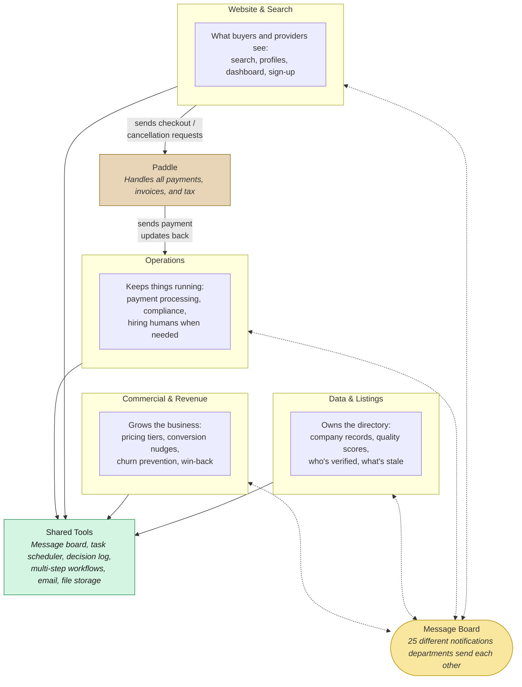

# The Big Picture

CALLSHEET has four departments that each own a clear job. They talk to each other through a central message board, and they all share a set of common tools. Paddle (a third-party payment provider) handles all billing.

