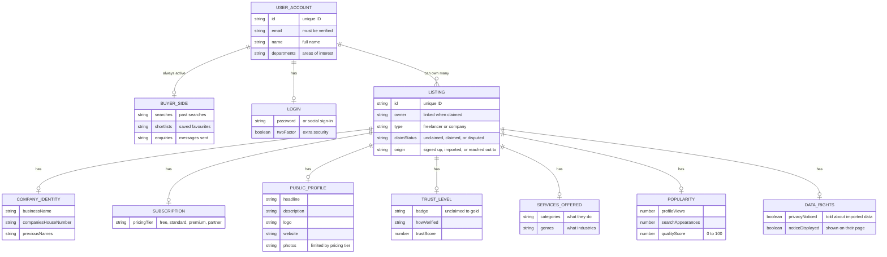

# Users and Listings: Who Owns What

Every user gets an account. Accounts can browse and search (buyer side) from day one. Listings are directory records for businesses and freelancers. A listing can exist without an owner (e.g. imported data). When a user claims a listing, they become its owner and can edit it.

