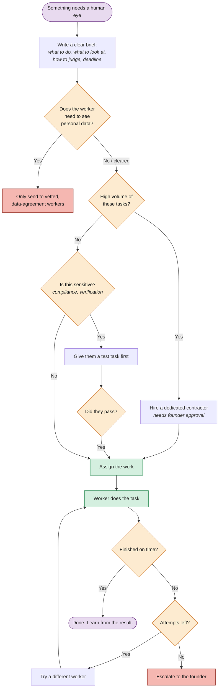

# How the System Hires Humans

CALLSHEET runs itself automatically. But some tasks need human judgment (e.g. resolving disputes, reviewing showreels). When that happens, the system writes a clear brief and hires someone.

