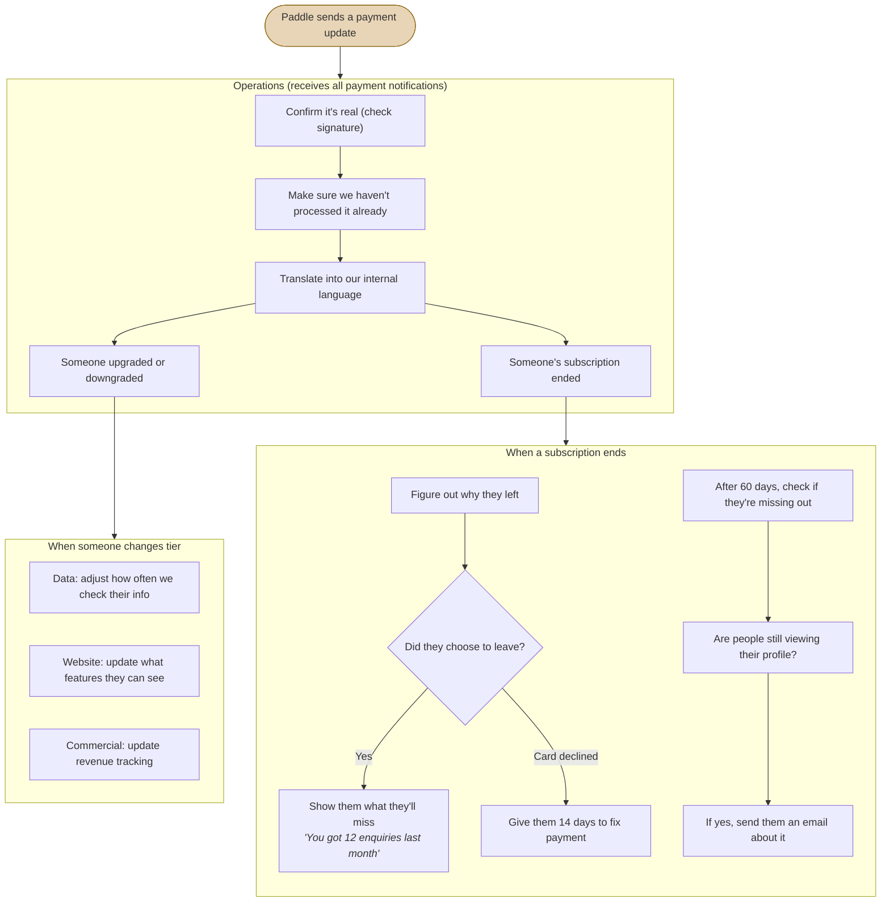

# What Happens When Someone Pays (or Stops Paying)

Paddle sends us a notification whenever a subscription changes. Operations checks it's genuine, then tells the rest of the system what happened.

