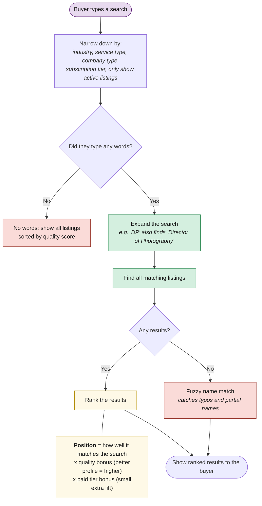

# How Search Works

When a buyer searches, the system finds matching listings and ranks them. Better-quality profiles appear higher. Paid tiers get a boost, but a great free listing still beats a mediocre paid one.

> **Example:** A free listing with quality score 85 appears above a premium listing with quality score 30, even though premium gets a ranking boost. Quality wins.
