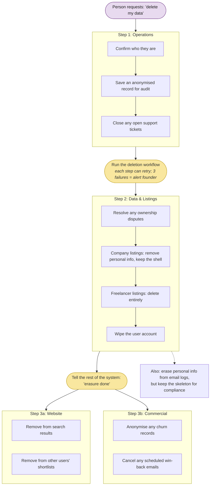

# Deleting Someone's Data (GDPR)

When someone asks for their data to be erased, the system runs a carefully ordered sequence across all four departments. If anything fails 3 times, the founder gets alerted.

