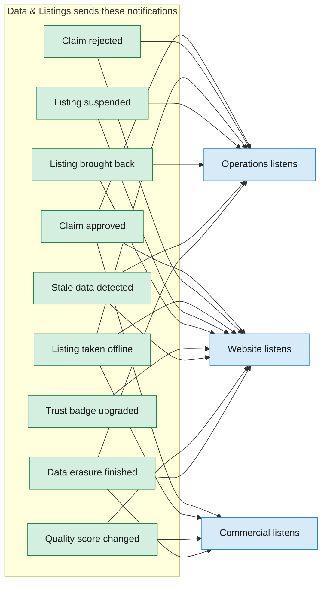
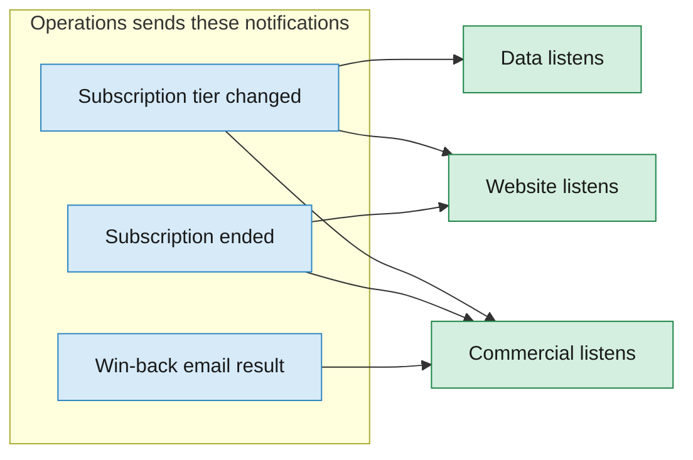
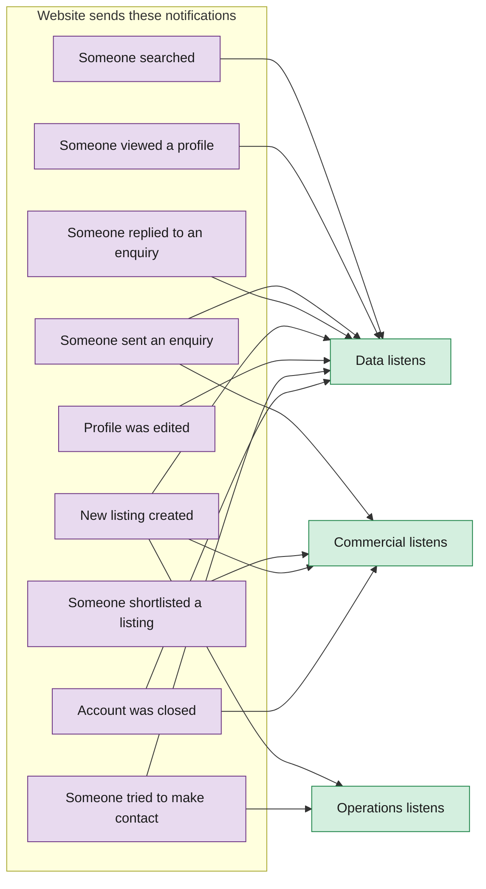
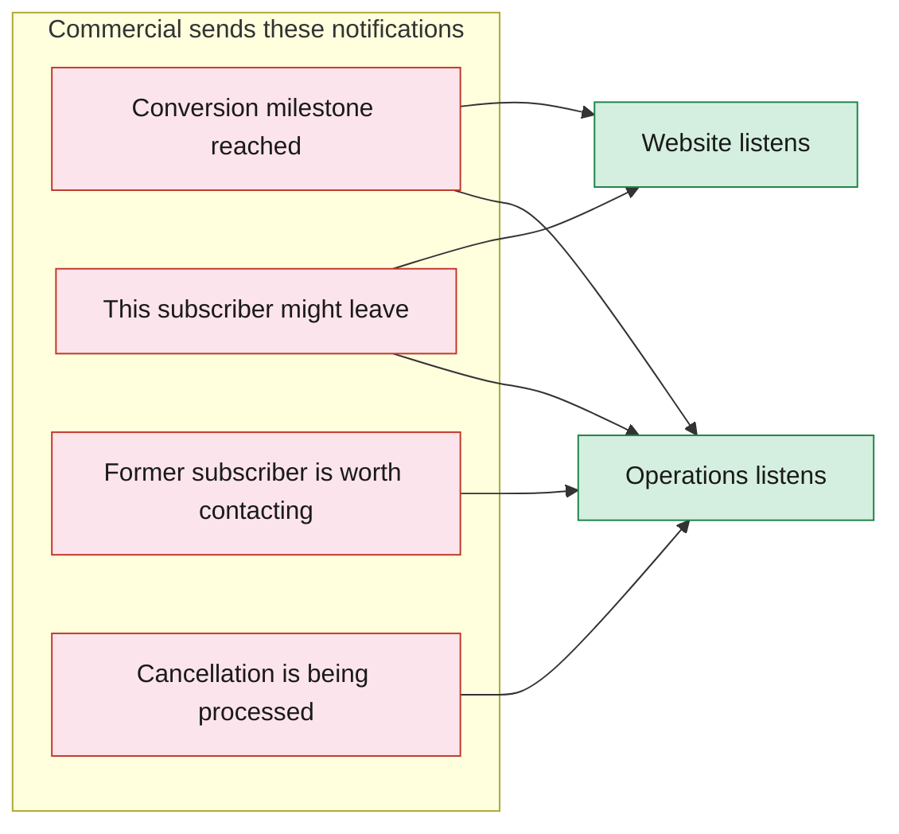

# How Departments Notify Each Other

When something important happens (e.g. a listing is claimed, someone cancels), the department where it happened sends a notification. Other departments listen for the ones they care about.

### 7a. Data & Listings says...

### 7b. Operations says...

### 7c. Website says...

### 7d. Commercial says...

