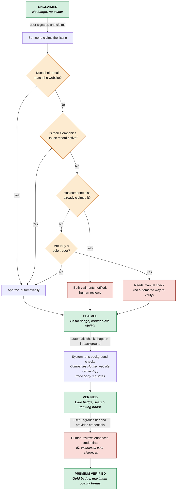

# How Trust Builds Over Time

Every listing starts unverified. The system automatically checks credentials and upgrades trust badges. The highest badge requires human review.

```mermaid
flowchart TD
    classDef tier fill:#d4efdf,stroke:#1e8449,color:#1a1a1a,font-weight:bold
    classDef decision fill:#fdebd0,stroke:#ca6f1e,color:#1a1a1a
    classDef route fill:#fadbd8,stroke:#922b21,color:#1a1a1a

    U["UNCLAIMED<br/><i>No badge, no owner</i>"]:::tier

    CE["Someone claims the listing"]

    R1{"Does their email<br/>match the website?"}:::decision
    R2{"Is their Companies<br/>House record active?"}:::decision
    R3{"Has someone else<br/>already claimed it?"}:::decision
    R4{"Are they a<br/>sole trader?"}:::decision

    AUTO["Approve automatically"]
    DISPUTE["Both claimants notified,<br/>human reviews"]:::route
    MANUAL["Needs manual check<br/>(no automated way to verify)"]:::route

    CLAIMED["CLAIMED<br/><i>Basic badge, contact info visible</i>"]:::tier

    VC["System runs background checks<br/><i>Companies House, website ownership,<br/>trade body registries</i>"]

    VERIFIED["VERIFIED<br/><i>Blue badge, search ranking boost</i>"]:::tier

    MC["Human reviews enhanced credentials<br/><i>ID, insurance, peer references</i>"]:::route

    PV["PREMIUM VERIFIED<br/><i>Gold badge, maximum quality bonus</i>"]:::tier

    U -- "user signs up and claims" --> CE
    CE --> R1
    R1 -- "Yes" --> AUTO
    R1 -- "No" --> R2
    R2 -- "Yes" --> AUTO
    R2 -- "No" --> R3
    R3 -- "Yes" --> DISPUTE
    R3 -- "No" --> R4
    R4 -- "Yes" --> MANUAL
    R4 -- "No" --> AUTO
    AUTO --> CLAIMED
    DISPUTE --> CLAIMED
    MANUAL --> CLAIMED
    CLAIMED -- "automatic checks happen in background" --> VC --> VERIFIED
    VERIFIED -- "user upgrades tier and provides credentials" --> MC --> PV
```
