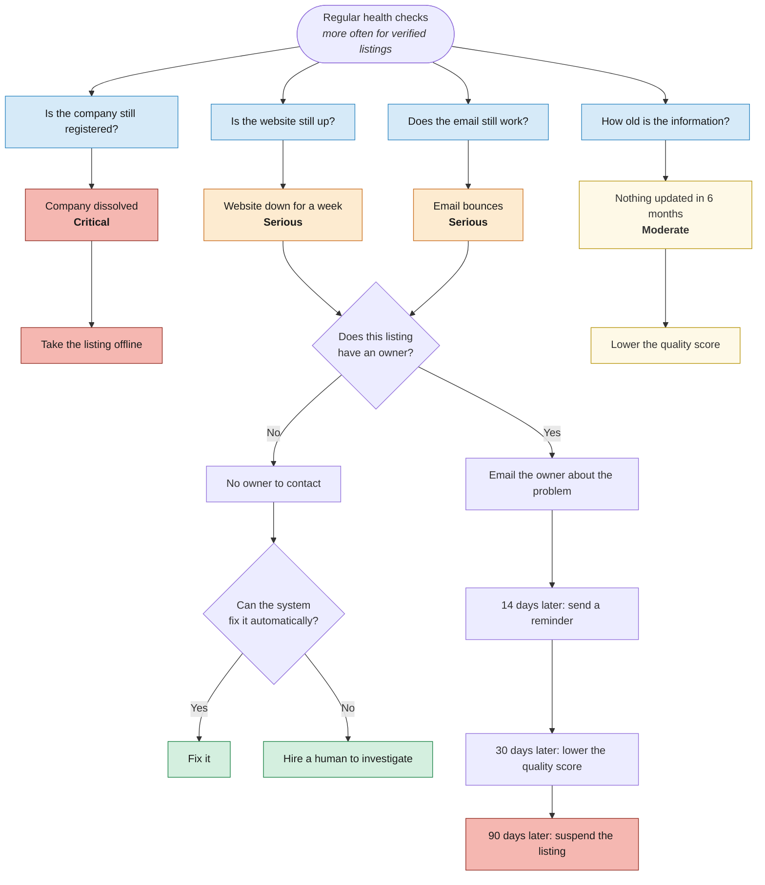

# Keeping Data Fresh

Listings go stale. The system regularly checks if websites are still up, emails still work, and companies still exist. If something's wrong, it acts — or asks for help.

```mermaid
flowchart TD
    classDef check fill:#d6eaf8,stroke:#2e86c1,color:#1a1a1a
    classDef critical fill:#f5b7b1,stroke:#922b21,color:#1a1a1a
    classDef high fill:#fdebd0,stroke:#ca6f1e,color:#1a1a1a
    classDef medium fill:#fef9e7,stroke:#b7950b,color:#333
    classDef action fill:#d4efdf,stroke:#1e8449,color:#1a1a1a

    LC(["Regular health checks<br/><i>more often for verified listings</i>"])

    WEB["Is the website still up?"]:::check
    EMAIL["Does the email still work?"]:::check
    CH["Is the company still registered?"]:::check
    FRESH["How old is the information?"]:::check

    W404["Website down for a week<br/><b>Serious</b>"]:::high
    BOUNCE["Email bounces<br/><b>Serious</b>"]:::high
    DISSOLVED["Company dissolved<br/><b>Critical</b>"]:::critical
    STALE["Nothing updated in 6 months<br/><b>Moderate</b>"]:::medium

    ARCHIVE["Take the listing offline"]:::critical
    CLAIMED_Q{"Does this listing<br/>have an owner?"}
    DEGRADE["Lower the quality score"]:::medium

    NO_OWNER["No owner to contact"]
    YES_OWNER["Email the owner about the problem"]

    AUTOFIX{"Can the system<br/>fix it automatically?"}
    APPLY["Fix it"]:::action
    TASK["Hire a human to investigate"]:::action

    N14["14 days later: send a reminder"]
    N30["30 days later: lower the quality score"]
    N90["90 days later: suspend the listing"]:::critical

    LC --> WEB & EMAIL & CH & FRESH
    WEB --> W404
    EMAIL --> BOUNCE
    CH --> DISSOLVED
    FRESH --> STALE

    W404 & BOUNCE --> CLAIMED_Q
    DISSOLVED --> ARCHIVE
    STALE --> DEGRADE

    CLAIMED_Q -- "No" --> NO_OWNER --> AUTOFIX
    CLAIMED_Q -- "Yes" --> YES_OWNER --> N14 --> N30 --> N90
    AUTOFIX -- "Yes" --> APPLY
    AUTOFIX -- "No" --> TASK
```
