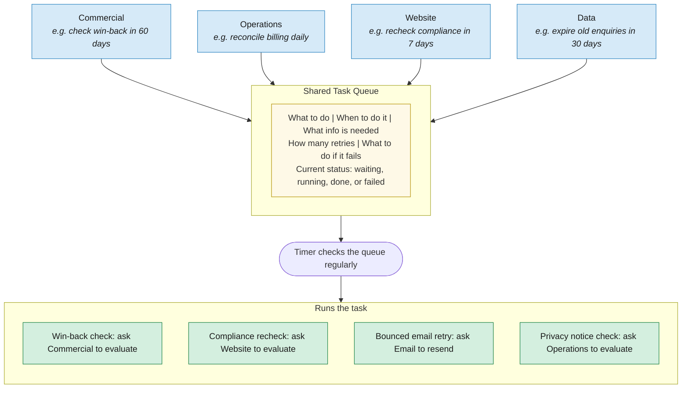

# The Task Scheduler

Every department can schedule tasks for the future. All these scheduled tasks go into one shared queue. A timer checks the queue regularly and runs whatever is due.

**35 different task types** are registered across the four departments — from daily billing checks to 60-day win-back evaluations.
