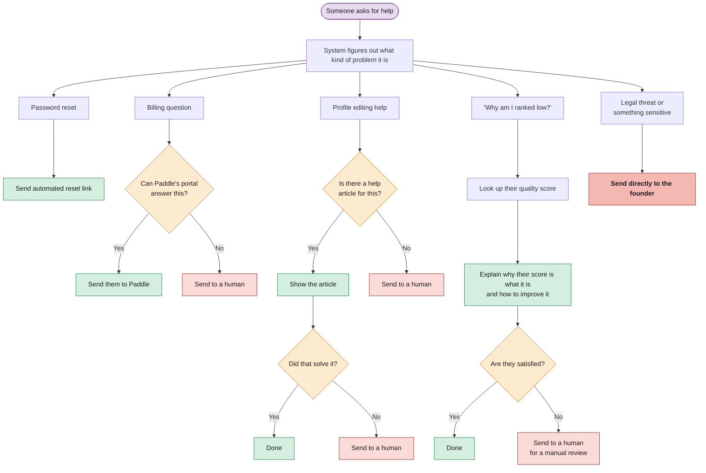

# How Support Requests Are Handled

Most support requests are resolved automatically. Humans are only brought in for things the system can't handle.

*If the person asking for help is flagged as a churn risk, their request gets priority.*
