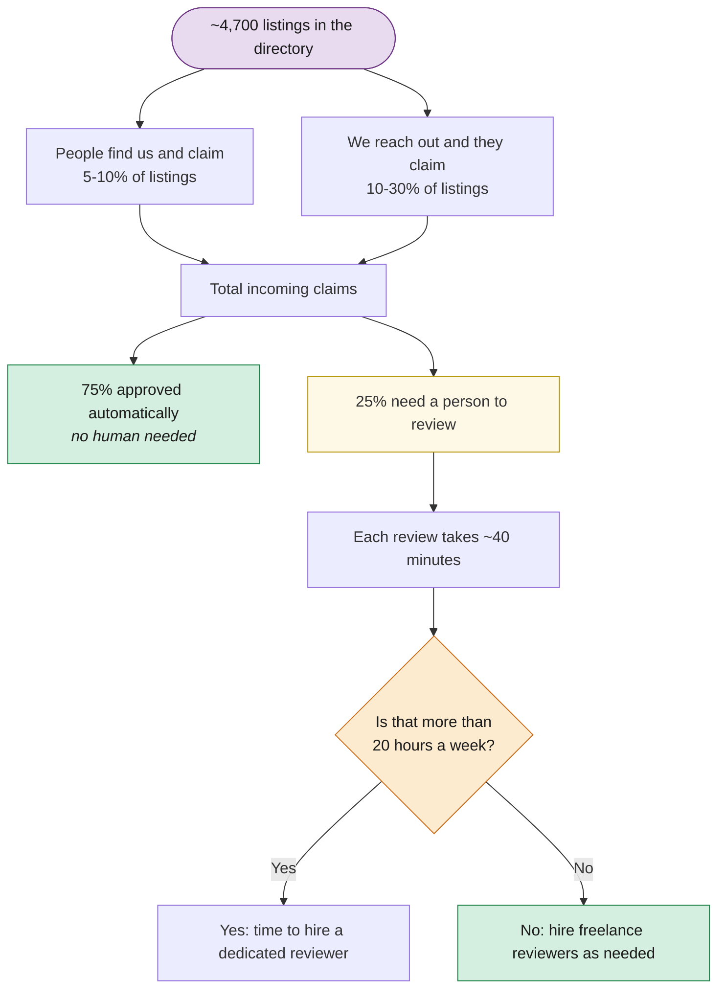

# How Many Claims Can We Handle?

Starting with ~4,700 imported listings. Most claims are approved automatically (75%). The system monitors workload and alerts when human reviewers are needed.

```mermaid
flowchart TD
    classDef input fill:#e8daef,stroke:#6c3483,color:#1a1a1a
    classDef split fill:#fef9e7,stroke:#b7950b,color:#333
    classDef decision fill:#fdebd0,stroke:#ca6f1e,color:#1a1a1a
    classDef action fill:#d4efdf,stroke:#1e8449,color:#1a1a1a

    TOTAL(["~4,700 listings in the directory"]):::input

    ORG["People find us and claim<br/>5-10% of listings"]
    OUT["We reach out and they claim<br/>10-30% of listings"]

    GROSS["Total incoming claims"]

    AUTO["75% approved automatically<br/><i>no human needed</i>"]:::action
    MANUAL["25% need a person to review"]:::split

    CAP["Each review takes ~40 minutes"]

    DECISION{"Is that more than<br/>20 hours a week?"}:::decision
    HIRE["Yes: time to hire a dedicated reviewer"]
    MARKET["No: hire freelance reviewers as needed"]:::action

    TOTAL --> ORG & OUT
    ORG & OUT --> GROSS
    GROSS --> AUTO & MANUAL
    MANUAL --> CAP --> DECISION
    DECISION -- "Yes" --> HIRE
    DECISION -- "No" --> MARKET
```
