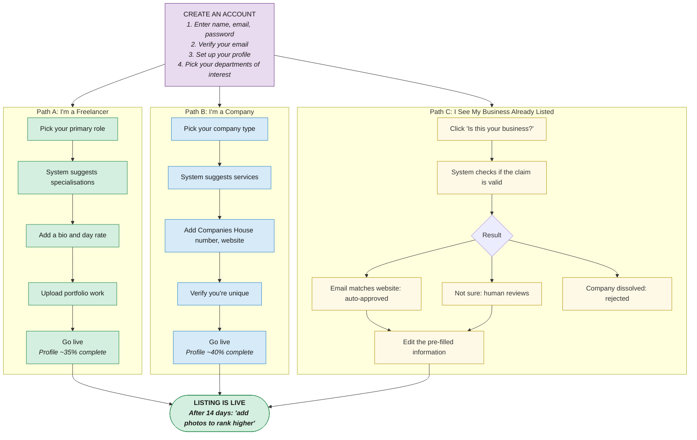

# Three Ways to Get a Listing

Everyone starts by creating an account. Then there are three paths to getting a live listing.

```mermaid
flowchart TD
    classDef core fill:#e8daef,stroke:#6c3483,color:#1a1a1a
    classDef pathA fill:#d4efdf,stroke:#1e8449,color:#1a1a1a
    classDef pathB fill:#d6eaf8,stroke:#2e86c1,color:#1a1a1a
    classDef pathC fill:#fef9e7,stroke:#b7950b,color:#333
    classDef live fill:#d4efdf,stroke:#1e8449,color:#1a1a1a,font-weight:bold

    CORE["CREATE AN ACCOUNT<br/><i>1. Enter name, email, password<br/>2. Verify your email<br/>3. Set up your profile<br/>4. Pick your departments of interest</i>"]:::core

    subgraph A ["Path A: I'm a Freelancer"]
        direction TB
        A1["Pick your primary role"]:::pathA
        A2["System suggests specialisations"]:::pathA
        A3["Add a bio and day rate"]:::pathA
        A4["Upload portfolio work"]:::pathA
        A5["Go live<br/><i>Profile ~35% complete</i>"]:::pathA
        A1 --> A2 --> A3 --> A4 --> A5
    end

    subgraph B ["Path B: I'm a Company"]
        direction TB
        B1["Pick your company type"]:::pathB
        B2["System suggests services"]:::pathB
        B3["Add Companies House number, website"]:::pathB
        B4["Verify you're unique"]:::pathB
        B5["Go live<br/><i>Profile ~40% complete</i>"]:::pathB
        B1 --> B2 --> B3 --> B4 --> B5
    end

    subgraph C ["Path C: I See My Business Already Listed"]
        direction TB
        C1["Click 'Is this your business?'"]:::pathC
        C2["System checks if the claim is valid"]:::pathC
        C3{"Result"}
        C4["Email matches website: auto-approved"]:::pathC
        C5["Not sure: human reviews"]:::pathC
        C6["Company dissolved: rejected"]:::pathC
        C7["Edit the pre-filled information"]:::pathC
        C1 --> C2 --> C3
        C3 --> C4 & C5 & C6
        C4 & C5 --> C7
    end

    LIVE(["LISTING IS LIVE<br/><i>After 14 days: 'add photos to rank higher'</i>"]):::live

    CORE --> A & B & C
    A5 & B5 & C7 --> LIVE
```
