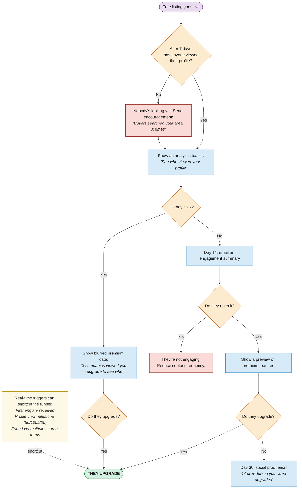

# How We Convert Free Users to Paid

A timed sequence of nudges based on actual engagement data. If nothing works, we back off. Real events (like receiving an enquiry) can shortcut the whole funnel.

