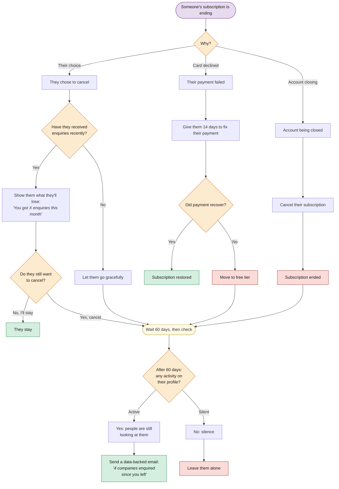

# When Someone Cancels

Three possible reasons. Each gets a different response. After 60 days, we check if they're missing out — and only contact them if they genuinely are.

```mermaid
flowchart TD
    classDef start fill:#e8daef,stroke:#6c3483,color:#1a1a1a
    classDef decision fill:#fdebd0,stroke:#ca6f1e,color:#1a1a1a
    classDef retain fill:#d4efdf,stroke:#1e8449,color:#1a1a1a
    classDef lose fill:#fadbd8,stroke:#922b21,color:#1a1a1a
    classDef winback fill:#fef9e7,stroke:#b7950b,color:#333

    CANCEL(["Someone's subscription is ending"]):::start
    REASON{"Why?"}:::decision

    VOL["They chose to cancel"]
    PAY["Their payment failed"]
    RECON["Account being closed"]

    ENQ{"Have they received<br/>enquiries recently?"}:::decision
    SHOW["Show them what they'll lose:<br/><i>'You got X enquiries this month'</i>"]
    ACCEPT1["Let them go gracefully"]

    ANYWAY{"Do they still want<br/>to cancel?"}:::decision
    RETAIN["They stay"]:::retain

    GRACE["Give them 14 days to fix their payment"]
    RECOVERED{"Did payment recover?"}:::decision
    RESTORED["Subscription restored"]:::retain
    DOWNGRADE["Move to free tier"]:::lose

    ACCEPT2["Cancel their subscription"]
    END_SUB["Subscription ended"]:::lose

    WINBACK(["Wait 60 days, then check"]):::winback

    D60{"After 60 days:<br/>any activity on<br/>their profile?"}:::decision
    ENGAGED["Yes: people are still<br/>looking at them"]
    ZERO["No: silence"]

    SEND["Send a data-backed email:<br/><i>'4 companies enquired<br/>since you left'</i>"]:::retain
    NOTHING["Leave them alone"]:::lose

    CANCEL --> REASON
    REASON -- "Their choice" --> VOL --> ENQ
    REASON -- "Card declined" --> PAY --> GRACE
    REASON -- "Account closing" --> RECON --> ACCEPT2

    ENQ -- "Yes" --> SHOW --> ANYWAY
    ENQ -- "No" --> ACCEPT1

    ANYWAY -- "No, I'll stay" --> RETAIN
    ANYWAY -- "Yes, cancel" --> WINBACK
    ACCEPT1 --> WINBACK

    GRACE --> RECOVERED
    RECOVERED -- "Yes" --> RESTORED
    RECOVERED -- "No" --> DOWNGRADE --> WINBACK

    ACCEPT2 --> END_SUB --> WINBACK

    WINBACK --> D60
    D60 -- "Active" --> ENGAGED --> SEND
    D60 -- "Silent" --> ZERO --> NOTHING
```
