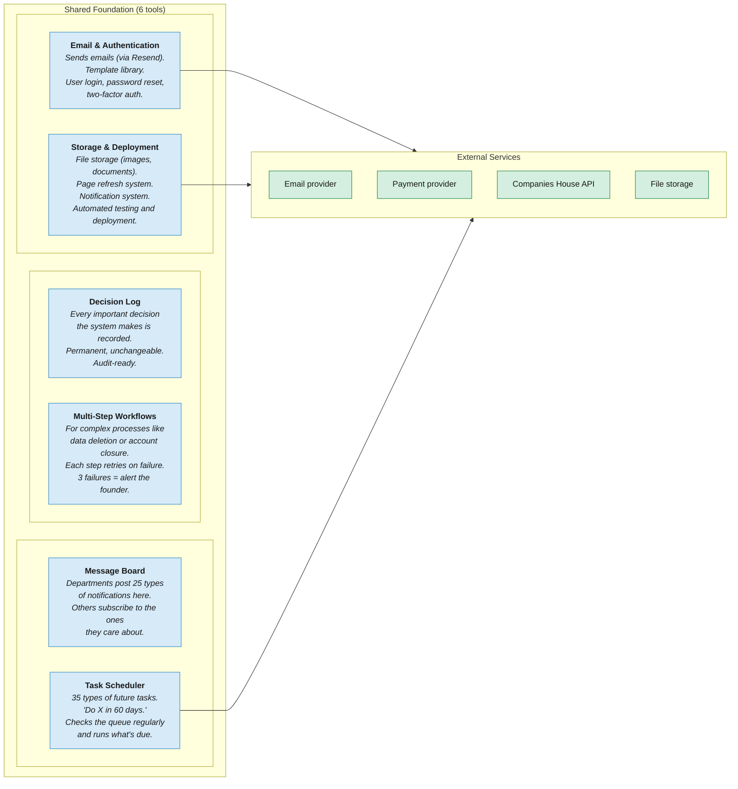

# The Six Shared Tools

Every department uses these six building blocks. They're the foundation everything else is built on.

```mermaid
graph LR
    classDef mod fill:#d6eaf8,stroke:#2e86c1,color:#1a1a1a
    classDef svc fill:#d4efdf,stroke:#1e8449,color:#1a1a1a

    subgraph S0 ["Shared Foundation (6 tools)"]
        direction TB

        subgraph ROW1 [" "]
            direction LR
            EB["<b>Message Board</b><br/><i>Departments post 25 types<br/>of notifications here.<br/>Others subscribe to the ones<br/>they care about.</i>"]:::mod

            DAS["<b>Task Scheduler</b><br/><i>35 types of future tasks.<br/>'Do X in 60 days.'<br/>Checks the queue regularly<br/>and runs what's due.</i>"]:::mod
        end

        subgraph ROW2 [" "]
            direction LR
            DEC["<b>Decision Log</b><br/><i>Every important decision<br/>the system makes is recorded.<br/>Permanent, unchangeable.<br/>Audit-ready.</i>"]:::mod

            FE["<b>Multi-Step Workflows</b><br/><i>For complex processes like<br/>data deletion or account closure.<br/>Each step retries on failure.<br/>3 failures = alert the founder.</i>"]:::mod
        end

        subgraph ROW3 [" "]
            direction LR
            EA["<b>Email & Authentication</b><br/><i>Sends emails (via Resend).<br/>Template library.<br/>User login, password reset,<br/>two-factor auth.</i>"]:::mod

            ST["<b>Storage & Deployment</b><br/><i>File storage (images, documents).<br/>Page refresh system.<br/>Notification system.<br/>Automated testing and deployment.</i>"]:::mod
        end
    end

    subgraph SVC ["External Services"]
        direction TB
        S1["Email provider"]:::svc
        S2["Payment provider"]:::svc
        S3["Companies House API"]:::svc
        S4["File storage"]:::svc
    end

    EA --> SVC
    ST --> SVC
    DAS --> SVC
```
