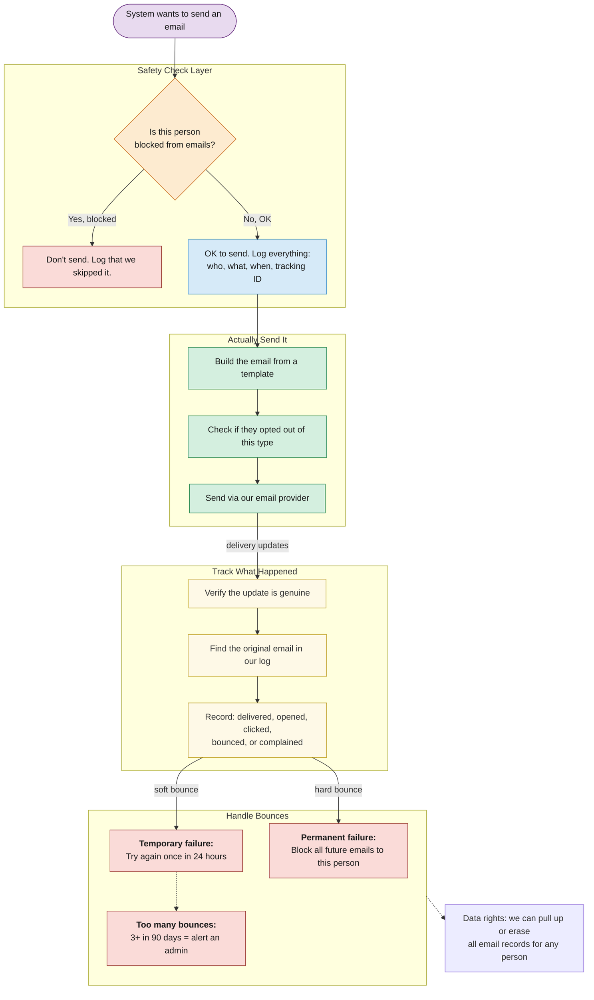

# How Email Works End to End

When the system sends an email, it goes through a safety chain: check if the person is suppressed, send it, track delivery, and handle bounces.

```mermaid
flowchart TD
    classDef app fill:#e8daef,stroke:#6c3483,color:#1a1a1a
    classDef decorator fill:#d6eaf8,stroke:#2e86c1,color:#1a1a1a
    classDef inner fill:#d4efdf,stroke:#1e8449,color:#1a1a1a
    classDef webhook fill:#fef9e7,stroke:#b7950b,color:#333
    classDef bounce fill:#fadbd8,stroke:#922b21,color:#1a1a1a
    classDef decision fill:#fdebd0,stroke:#ca6f1e,color:#1a1a1a

    APP(["System wants to send an email"]):::app

    subgraph LOGGING ["Safety Check Layer"]
        direction TB
        SUP_CHECK{"Is this person<br/>blocked from emails?"}:::decision
        SUP_YES["Don't send. Log that we skipped it."]:::bounce
        DELEGATE["OK to send. Log everything:<br/>who, what, when, tracking ID"]:::decorator
    end

    subgraph INNER ["Actually Send It"]
        direction TB
        RENDER["Build the email from a template"]:::inner
        PREF["Check if they opted out of this type"]:::inner
        SEND["Send via our email provider"]:::inner
        RENDER --> PREF --> SEND
    end

    subgraph WEBHOOK ["Track What Happened"]
        direction TB
        HMAC["Verify the update is genuine"]:::webhook
        LOOKUP["Find the original email in our log"]:::webhook
        VALIDATE["Record: delivered, opened, clicked,<br/>bounced, or complained"]:::webhook
        HMAC --> LOOKUP --> VALIDATE
    end

    subgraph BOUNCE_H ["Handle Bounces"]
        direction TB
        HARD["<b>Permanent failure:</b><br/>Block all future emails to this person"]:::bounce
        SOFT["<b>Temporary failure:</b><br/>Try again once in 24 hours"]:::bounce
        THRESH["<b>Too many bounces:</b><br/>3+ in 90 days = alert an admin"]:::bounce
    end

    RIGHTS["Data rights: we can pull up or erase<br/>all email records for any person"]

    APP --> SUP_CHECK
    SUP_CHECK -- "Yes, blocked" --> SUP_YES
    SUP_CHECK -- "No, OK" --> DELEGATE
    DELEGATE --> RENDER
    SEND -- "delivery updates" --> HMAC
    VALIDATE -- "hard bounce" --> HARD
    VALIDATE -- "soft bounce" --> SOFT
    SOFT -.-> THRESH
    BOUNCE_H -.-> RIGHTS
```
