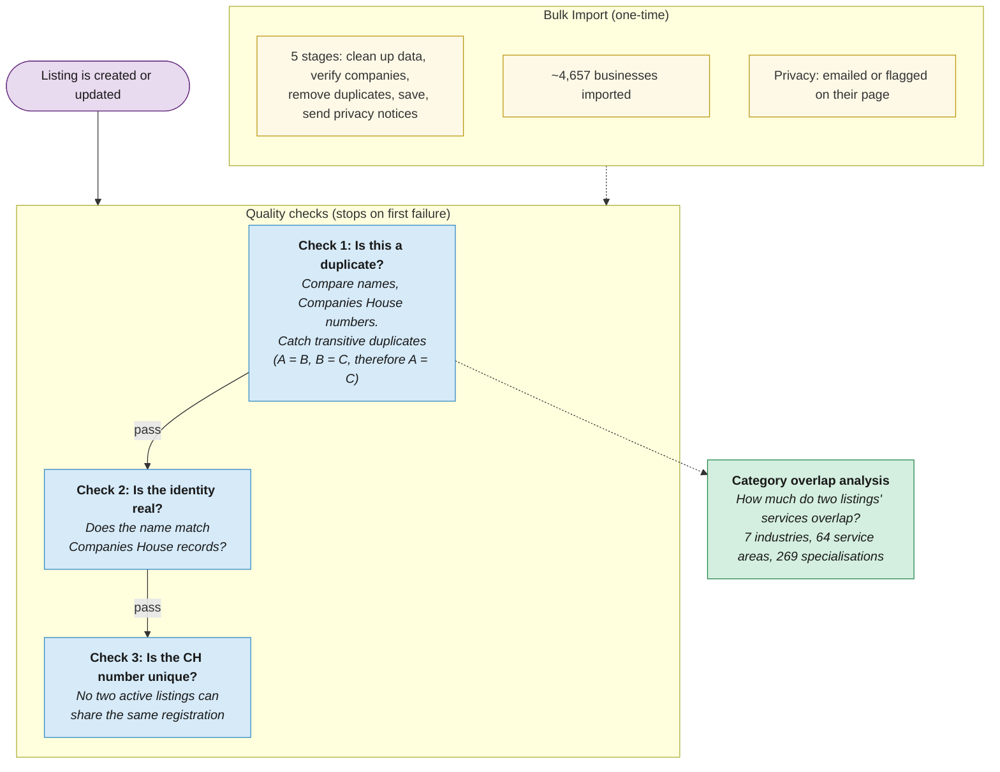

# Checking Listing Quality

Before a listing goes live (or after it's edited), it runs through a series of checks. If any check fails, it stops there.

```mermaid
flowchart TD
    classDef input fill:#e8daef,stroke:#6c3483,color:#1a1a1a
    classDef rule fill:#d6eaf8,stroke:#2e86c1,color:#1a1a1a
    classDef taxonomy fill:#d4efdf,stroke:#1e8449,color:#1a1a1a
    classDef import fill:#fef9e7,stroke:#b7950b,color:#333

    INPUT(["Listing is created or updated"]):::input

    subgraph PIPELINE ["Quality checks (stops on first failure)"]
        direction LR
        R1["<b>Check 1: Is this a duplicate?</b><br/><i>Compare names, Companies House numbers.<br/>Catch transitive duplicates<br/>(A = B, B = C, therefore A = C)</i>"]:::rule
        R2["<b>Check 2: Is the identity real?</b><br/><i>Does the name match<br/>Companies House records?</i>"]:::rule
        R3["<b>Check 3: Is the CH number unique?</b><br/><i>No two active listings can<br/>share the same registration</i>"]:::rule
        R1 -- "pass" --> R2 -- "pass" --> R3
    end

    TAX["<b>Category overlap analysis</b><br/><i>How much do two listings' services overlap?<br/>7 industries, 64 service areas, 269 specialisations</i>"]:::taxonomy

    subgraph IMPORT ["Bulk Import (one-time)"]
        direction TB
        I1["5 stages: clean up data, verify companies,<br/>remove duplicates, save, send privacy notices"]:::import
        I2["~4,657 businesses imported"]:::import
        I3["Privacy: emailed or flagged on their page"]:::import
    end

    INPUT --> PIPELINE
    R1 -.-> TAX
    IMPORT -.-> PIPELINE
```
