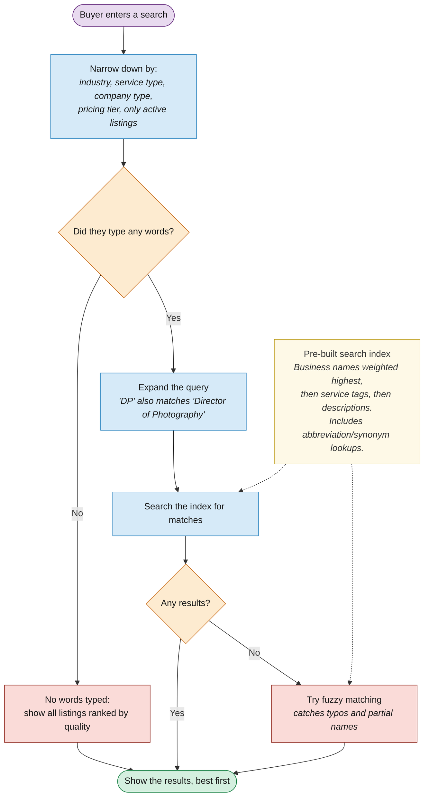

# How Search Works Under the Hood

The buyer types a query. The system expands it (e.g. abbreviations), searches the database, and ranks results. If nothing matches, it falls back to fuzzy name matching.

