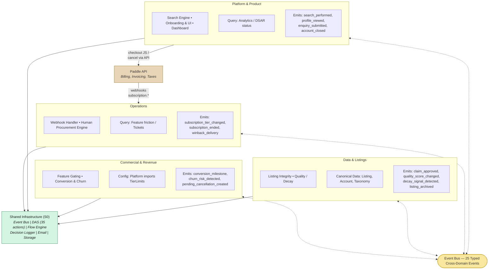

# 1. Macro Topology & Cross-Domain Dependencies

The entity operates across four distinct domains. Coordination happens via the Event Bus (25 typed events) and 6 explicit query interfaces. Infrastructure services are shared across all domains.

