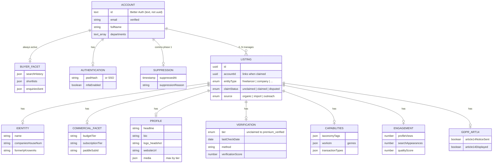

# 2. Data & Listings: Entity Relationship Model

`Account` (user) and `Listing` (directory record) are independent entities that converge on claim. An Account can manage many Listings (0..N). A Listing has 0..1 Account.

