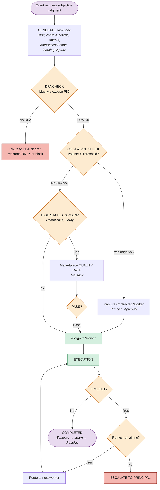

# 3. Operations: Task Specification & Procurement Engine

When the entity encounters a boundary requiring subjective judgment, it procures a human via a scoped `TaskSpec`.

```mermaid
flowchart TD
    classDef startEnd fill:#e8daef,stroke:#6c3483,color:#1a1a1a
    classDef decision fill:#fdebd0,stroke:#ca6f1e,color:#1a1a1a
    classDef escalate fill:#f5b7b1,stroke:#922b21,color:#1a1a1a
    classDef action fill:#d4efdf,stroke:#1e8449,color:#1a1a1a

    A(["Event requires subjective judgment"]):::startEnd
    B["GENERATE TaskSpec<br/><i>task, context, criteria, timeout,<br/>dataAccessScope, learningCapture</i>"]

    C{"DPA CHECK<br/>Must we expose PII?"}:::decision
    D["Route to DPA-cleared<br/>resource ONLY, or block"]:::escalate

    E{"COST & VOL CHECK<br/>Volume > Threshold?"}:::decision
    F["Procure Contracted Worker<br/><i>Principal Approval</i>"]

    G{"HIGH STAKES DOMAIN?<br/><i>Compliance, Verify</i>"}:::decision
    H["Marketplace QUALITY GATE<br/><i>Test task</i>"]
    I{"PASS?"}:::decision
    J["Assign to Worker"]:::action

    K["EXECUTION"]:::action
    L{"TIMEOUT?"}:::decision
    M{"Retries remaining?"}:::decision
    N["Route to next worker"]
    O["ESCALATE TO PRINCIPAL"]:::escalate
    P(["COMPLETED<br/><i>Evaluate &rarr; Learn &rarr; Resolve</i>"]):::startEnd

    A --> B --> C
    C -- "No DPA" --> D
    C -- "DPA OK" --> E
    E -- "Yes (high vol)" --> F --> J
    E -- "No (low vol)" --> G
    G -- "Yes" --> H --> I
    I -- "Pass" --> J
    G -- "No" --> J
    J --> K --> L
    L -- "No" --> P
    L -- "Yes" --> M
    M -- "Yes" --> N --> K
    M -- "No" --> O
```
