# 4. Commercial: Subscription Lifecycle & Paddle Webhook Routing

Paddle is the source of truth for billing. Operations receives webhooks, ensures idempotency and signature verification, then maps them into domain events.

```mermaid
flowchart TD
    classDef external fill:#e8d5b7,stroke:#8b6914,color:#333
    classDef ops fill:#d6eaf8,stroke:#2e86c1,color:#1a1a1a
    classDef commercial fill:#fce4ec,stroke:#c0392b,color:#1a1a1a

    PADDLE(["Paddle Webhooks<br/><i>subscription.updated / canceled / created</i>"]):::external

    subgraph OPS ["Operations Domain (Sole Webhook Receiver)"]
        direction TB
        O1["1. Fast 200 OK"] --> O2["2. Signature Verify (HMAC)"] --> O3["3. Idempotency Check"] --> O4["4. mapPaddleWebhook()"]
        O4 --> STC["subscription_tier_changed"]
        O4 --> SE["subscription_ended"]
    end

    subgraph CONSUMERS ["All Domains (tier_changed)"]
        direction LR
        C1["D&L: Adjust enrichment cadence"]
        C2["PP: Refresh UI feature gates"]
        C3["CR: Update revenue metrics"]
    end

    subgraph COMMERCIAL ["Commercial Domain (subscription_ended)"]
        direction TB
        ECI["evaluateChurnIntervention"]
        VOL{"Voluntary?"}
        SHOW["Show retention data<br/><i>'You got 12 enquiries...'</i>"]
        GRACE["Enter Grace Period"]

        ECI --> VOL
        VOL -- "Yes" --> SHOW
        VOL -- "No (payment fail)" --> GRACE

        EWB["evaluateWinBack"] --> WAIT["Wait 60 Days"] --> CHECK["Check engagement"] --> EMIT["Emit winback_eligible"]
    end

    PADDLE --> OPS
    STC --> CONSUMERS
    SE --> COMMERCIAL
```

