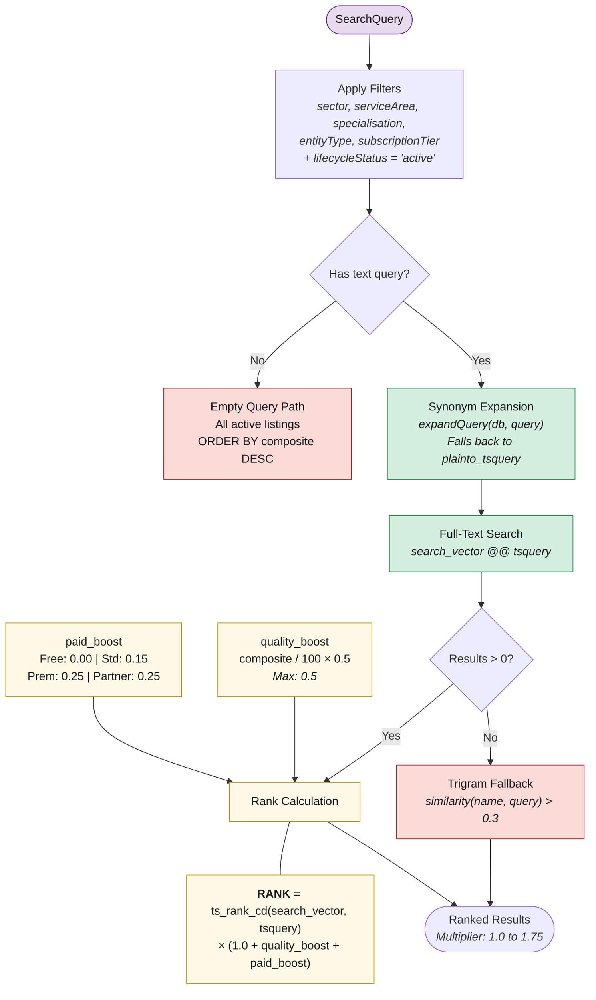

# 5. Platform: Search & Ranking Equation

PostgreSQL full-text search with synonym expansion, trigram fallback, and a multiplicative ranking formula where quality amplifies relevance.

> **Example:** Listing A (ts_rank=0.30, quality=85, free) = 0.428 beats Listing B (ts_rank=0.30, quality=30, premium) = 0.420. High-quality free listing beats low-quality premium.
