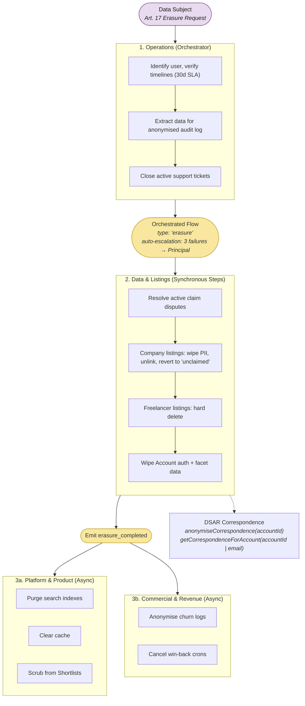

# 6. GDPR Erasure Orchestration Protocol

The most complex cross-domain transaction. Implemented as an Orchestrated Flow with step-level retry, skip, and auto-escalation after 3 consecutive failures.

