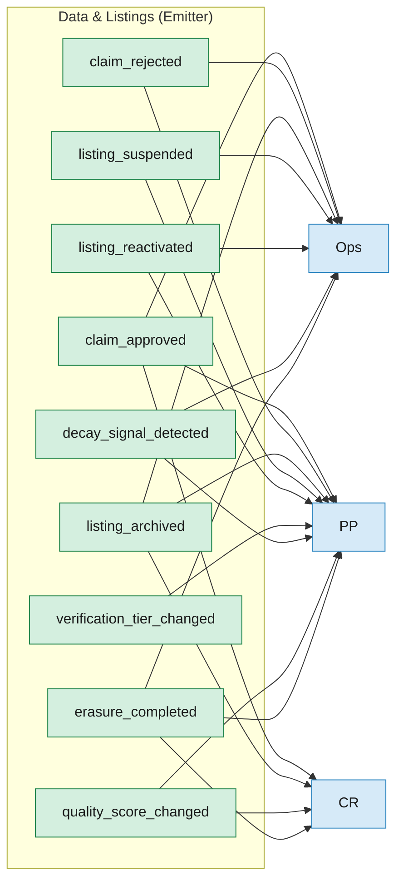
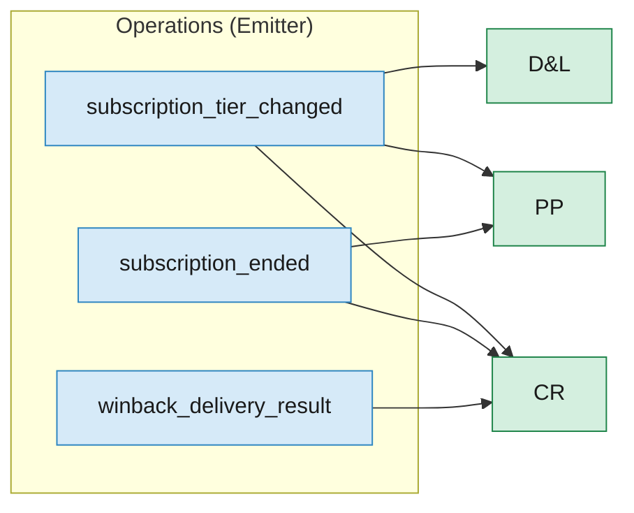
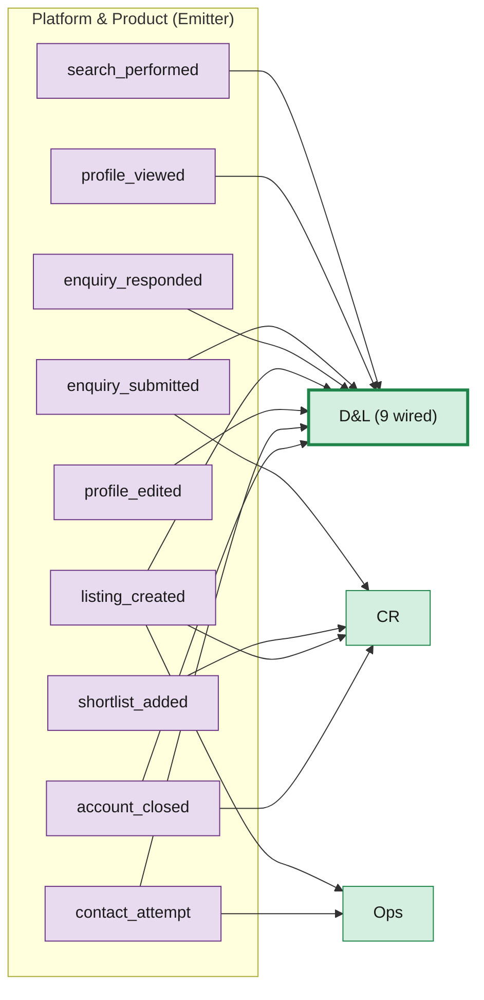
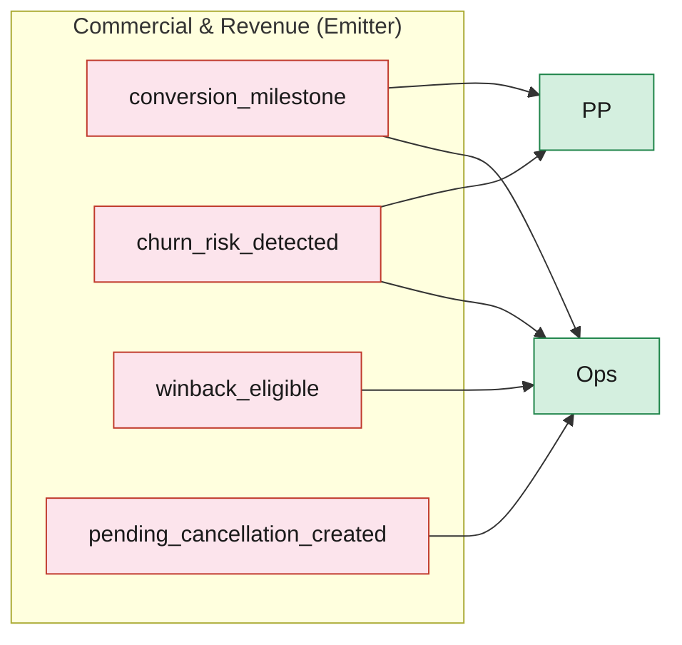

# 7. Domain Event Consumer Matrix

25 typed cross-domain events across 4 emitter domains. The matrix below shows which consumer domains subscribe to each event.

### 7a. Data & Listings Events (9 events)

### 7b. Operations Events (3 events)

### 7c. Platform & Product Events (9 events)

### 7d. Commercial & Revenue Events (4 events)

