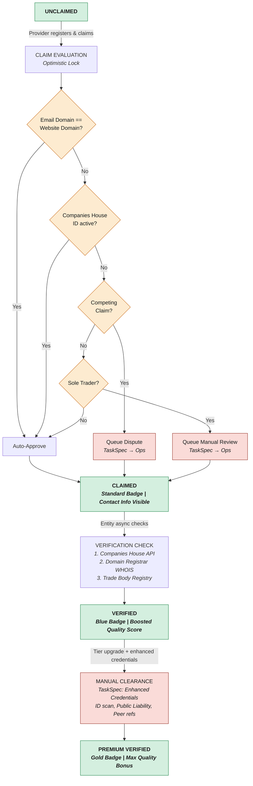

# 8. Trust & Verification Tier Escalation

Verification is an entity decision driven by automated checks, API interactions, and asynchronous human procurement.

```mermaid
flowchart TD
    classDef tier fill:#d4efdf,stroke:#1e8449,color:#1a1a1a,font-weight:bold
    classDef decision fill:#fdebd0,stroke:#ca6f1e,color:#1a1a1a
    classDef route fill:#fadbd8,stroke:#922b21,color:#1a1a1a

    U["UNCLAIMED"]:::tier

    CE["CLAIM EVALUATION<br/><i>Optimistic Lock</i>"]

    R1{"Email Domain ==<br/>Website Domain?"}:::decision
    R2{"Companies House<br/>ID active?"}:::decision
    R3{"Competing<br/>Claim?"}:::decision
    R4{"Sole Trader?"}:::decision

    AUTO["Auto-Approve"]
    DISPUTE["Queue Dispute<br/><i>TaskSpec &rarr; Ops</i>"]:::route
    MANUAL["Queue Manual Review<br/><i>TaskSpec &rarr; Ops</i>"]:::route

    CLAIMED["CLAIMED<br/><i>Standard Badge | Contact Info Visible</i>"]:::tier

    VC["VERIFICATION CHECK<br/><i>1. Companies House API<br/>2. Domain Registrar WHOIS<br/>3. Trade Body Registry</i>"]

    VERIFIED["VERIFIED<br/><i>Blue Badge | Boosted Quality Score</i>"]:::tier

    MC["MANUAL CLEARANCE<br/><i>TaskSpec: Enhanced Credentials<br/>ID scan, Public Liability, Peer refs</i>"]:::route

    PV["PREMIUM VERIFIED<br/><i>Gold Badge | Max Quality Bonus</i>"]:::tier

    U -- "Provider registers & claims" --> CE
    CE --> R1
    R1 -- "Yes" --> AUTO
    R1 -- "No" --> R2
    R2 -- "Yes" --> AUTO
    R2 -- "No" --> R3
    R3 -- "Yes" --> DISPUTE
    R3 -- "No" --> R4
    R4 -- "Yes" --> MANUAL
    R4 -- "No" --> AUTO
    AUTO --> CLAIMED
    DISPUTE --> CLAIMED
    MANUAL --> CLAIMED
    CLAIMED -- "Entity async checks" --> VC --> VERIFIED
    VERIFIED -- "Tier upgrade + enhanced credentials" --> MC --> PV
```
