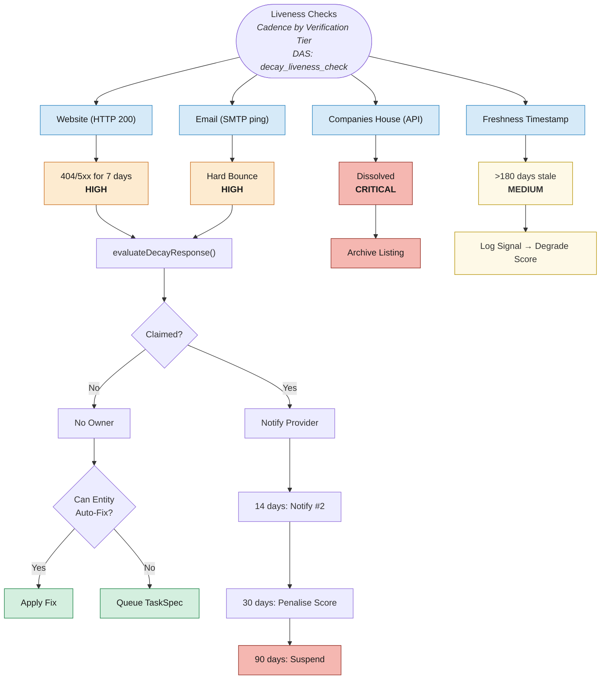

# 9. Data Quality & Decay Loop

Data quality decays. The entity perceives data rot as a score drop and orchestrates self-healing.

```mermaid
flowchart TD
    classDef check fill:#d6eaf8,stroke:#2e86c1,color:#1a1a1a
    classDef critical fill:#f5b7b1,stroke:#922b21,color:#1a1a1a
    classDef high fill:#fdebd0,stroke:#ca6f1e,color:#1a1a1a
    classDef medium fill:#fef9e7,stroke:#b7950b,color:#333
    classDef action fill:#d4efdf,stroke:#1e8449,color:#1a1a1a

    LC(["Liveness Checks<br/><i>Cadence by Verification Tier<br/>DAS: decay_liveness_check</i>"])

    WEB["Website (HTTP 200)"]:::check
    EMAIL["Email (SMTP ping)"]:::check
    CH["Companies House (API)"]:::check
    FRESH["Freshness Timestamp"]:::check

    W404["404/5xx for 7 days<br/><b>HIGH</b>"]:::high
    BOUNCE["Hard Bounce<br/><b>HIGH</b>"]:::high
    DISSOLVED["Dissolved<br/><b>CRITICAL</b>"]:::critical
    STALE[">180 days stale<br/><b>MEDIUM</b>"]:::medium

    EVAL["evaluateDecayResponse()"]

    ARCHIVE["Archive Listing"]:::critical
    CLAIMED_Q{"Claimed?"}
    DEGRADE["Log Signal &rarr; Degrade Score"]:::medium

    NO_OWNER["No Owner"]
    YES_OWNER["Notify Provider"]

    AUTOFIX{"Can Entity<br/>Auto-Fix?"}
    APPLY["Apply Fix"]:::action
    TASK["Queue TaskSpec"]:::action

    N14["14 days: Notify #2"]
    N30["30 days: Penalise Score"]
    N90["90 days: Suspend"]:::critical

    LC --> WEB & EMAIL & CH & FRESH
    WEB --> W404
    EMAIL --> BOUNCE
    CH --> DISSOLVED
    FRESH --> STALE

    W404 & BOUNCE --> EVAL
    DISSOLVED --> ARCHIVE
    STALE --> DEGRADE

    EVAL --> CLAIMED_Q
    CLAIMED_Q -- "No" --> NO_OWNER --> AUTOFIX
    CLAIMED_Q -- "Yes" --> YES_OWNER --> N14 --> N30 --> N90
    AUTOFIX -- "Yes" --> APPLY
    AUTOFIX -- "No" --> TASK
```
