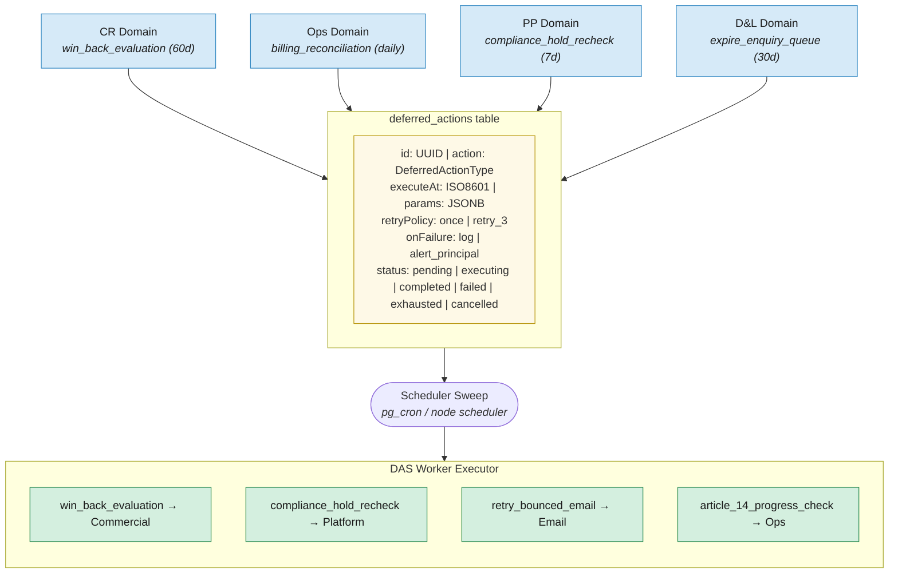

# 10. Shared Infrastructure: Deferred Action Scheduler

The DAS merges operations from all 4 domains into a single timeline execution engine. 35 action types registered.

**Full Action Registry (35 actions):**

| Cross-Domain / Infrastructure | Domain-Specific |
|-------------------------------|-----------------|
| expire_enquiry_queue | decay_liveness_check |
| compliance_schedule_check | enrichment_full_cycle |
| billing_reconciliation | claim_abandonment_check |
| compliance_hold_recheck | taxonomy_review_preparation |
| win_back_evaluation | data_health_review |
| auto_escalation_check | verification_calibration_review |
| notification_cleanup | provider_outreach_ranking |
| grace_period_expiry | conversion_funnel_analysis |
| checkout_precondition_retry | revenue_health_extended |
| listing_update_reminder | multi_listing_pricing_evaluation |
| enquiry_response_reminder | sponsored_placement_learning |
| search_history_cleanup | operational_health_review |
| sla_breach_warning | contractor_performance_review |
| task_timeout_check | principal_briefing_generation |
| billing_hold_expiry | proactive_churn_detection |
| compliance_self_audit | learning_hypothesis_analysis |
| check_quality_improvement | article_14_progress_check |
| quality_score_recalculation | retry_bounced_email |
