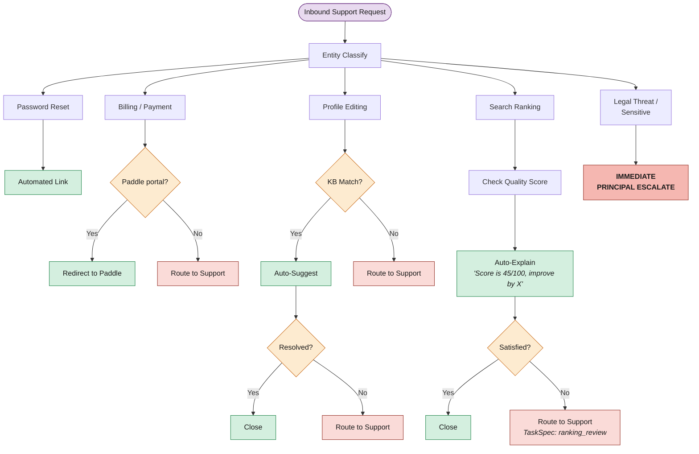

# 11. Support Triage Decision Tree

Operations reframes support as an entity decision architecture. Most tickets are deflected or auto-resolved; humans are procured only for judgment tasks.

*High Churn Risk subscribers get elevated priority. Unreachable Claimed Profile: Entity auto-responds with alternative active providers.*
