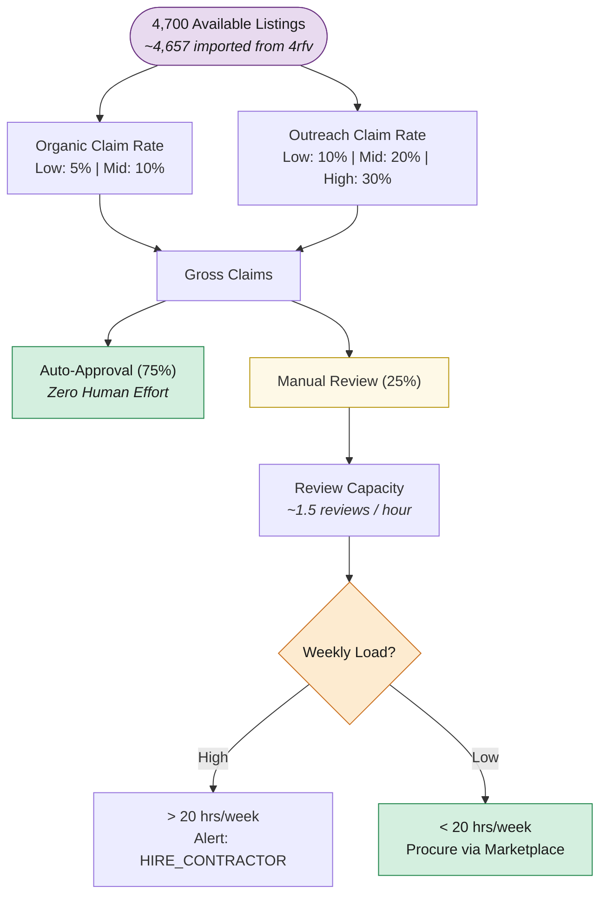

# 12. Claim Volume Projection & Capacity

How organic and outreach volume translates into human verification load.

```mermaid
flowchart TD
    classDef input fill:#e8daef,stroke:#6c3483,color:#1a1a1a
    classDef split fill:#fef9e7,stroke:#b7950b,color:#333
    classDef decision fill:#fdebd0,stroke:#ca6f1e,color:#1a1a1a
    classDef action fill:#d4efdf,stroke:#1e8449,color:#1a1a1a

    TOTAL(["4,700 Available Listings<br/><i>~4,657 imported from 4rfv</i>"]):::input

    ORG["Organic Claim Rate<br/>Low: 5% | Mid: 10%"]
    OUT["Outreach Claim Rate<br/>Low: 10% | Mid: 20% | High: 30%"]

    GROSS["Gross Claims"]

    AUTO["Auto-Approval (75%)<br/><i>Zero Human Effort</i>"]:::action
    MANUAL["Manual Review (25%)"]:::split

    CAP["Review Capacity<br/><i>~1.5 reviews / hour</i>"]

    DECISION{"Weekly Load?"}:::decision
    HIRE["> 20 hrs/week<br/>Alert: HIRE_CONTRACTOR"]
    MARKET["< 20 hrs/week<br/>Procure via Marketplace"]:::action

    TOTAL --> ORG & OUT
    ORG & OUT --> GROSS
    GROSS --> AUTO & MANUAL
    MANUAL --> CAP --> DECISION
    DECISION -- "High" --> HIRE
    DECISION -- "Low" --> MARKET
```
