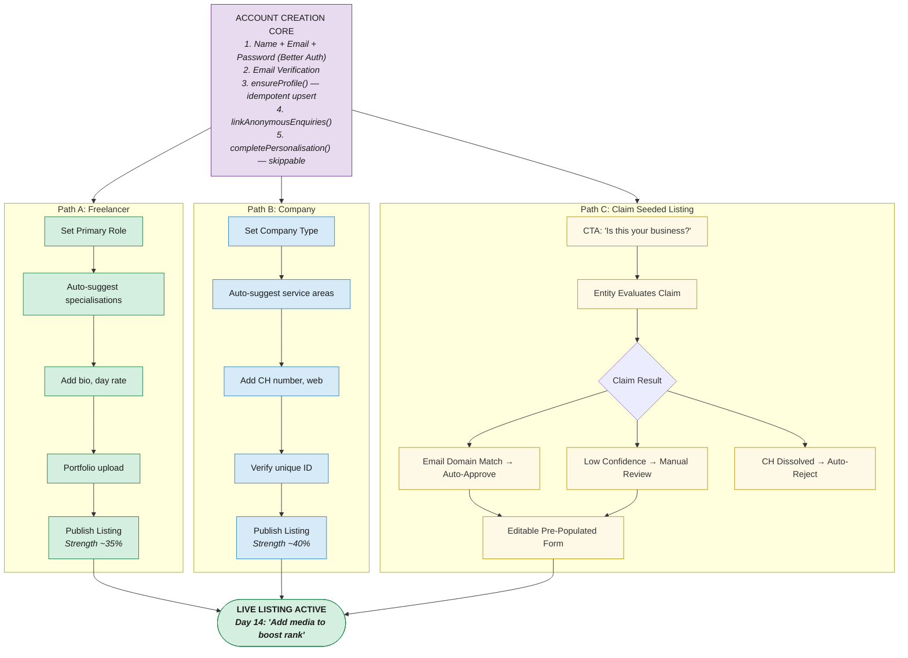

# 13. Onboarding & Listing Activation Paths (A, B, C)

Three distinct funnels converge on a unified Account+Listing model. Path C (Claiming) is the supply-side growth engine.

```mermaid
flowchart TD
    classDef core fill:#e8daef,stroke:#6c3483,color:#1a1a1a
    classDef pathA fill:#d4efdf,stroke:#1e8449,color:#1a1a1a
    classDef pathB fill:#d6eaf8,stroke:#2e86c1,color:#1a1a1a
    classDef pathC fill:#fef9e7,stroke:#b7950b,color:#333
    classDef live fill:#d4efdf,stroke:#1e8449,color:#1a1a1a,font-weight:bold

    CORE["ACCOUNT CREATION CORE<br/><i>1. Name + Email + Password (Better Auth)<br/>2. Email Verification<br/>3. ensureProfile() &mdash; idempotent upsert<br/>4. linkAnonymousEnquiries()<br/>5. completePersonalisation() &mdash; skippable</i>"]:::core

    subgraph A ["Path A: Freelancer"]
        direction TB
        A1["Set Primary Role"]:::pathA
        A2["Auto-suggest specialisations"]:::pathA
        A3["Add bio, day rate"]:::pathA
        A4["Portfolio upload"]:::pathA
        A5["Publish Listing<br/><i>Strength ~35%</i>"]:::pathA
        A1 --> A2 --> A3 --> A4 --> A5
    end

    subgraph B ["Path B: Company"]
        direction TB
        B1["Set Company Type"]:::pathB
        B2["Auto-suggest service areas"]:::pathB
        B3["Add CH number, web"]:::pathB
        B4["Verify unique ID"]:::pathB
        B5["Publish Listing<br/><i>Strength ~40%</i>"]:::pathB
        B1 --> B2 --> B3 --> B4 --> B5
    end

    subgraph C ["Path C: Claim Seeded Listing"]
        direction TB
        C1["CTA: 'Is this your business?'"]:::pathC
        C2["Entity Evaluates Claim"]:::pathC
        C3{"Claim Result"}
        C4["Email Domain Match &rarr; Auto-Approve"]:::pathC
        C5["Low Confidence &rarr; Manual Review"]:::pathC
        C6["CH Dissolved &rarr; Auto-Reject"]:::pathC
        C7["Editable Pre-Populated Form"]:::pathC
        C1 --> C2 --> C3
        C3 --> C4 & C5 & C6
        C4 & C5 --> C7
    end

    LIVE(["LIVE LISTING ACTIVE<br/><i>Day 14: 'Add media to boost rank'</i>"]):::live

    CORE --> A & B & C
    A5 & B5 & C7 --> LIVE
```
