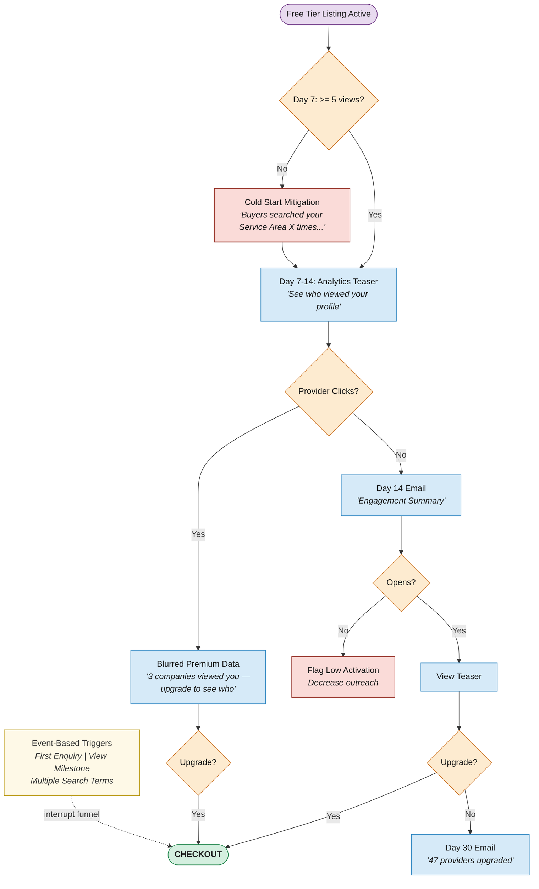

# 14. Conversion Optimisation Funnel

Conversion is an entity decision architecture based on engagement signals, milestone triggers, and cold-start mitigations.

```mermaid
flowchart TD
    classDef start fill:#e8daef,stroke:#6c3483,color:#1a1a1a
    classDef decision fill:#fdebd0,stroke:#ca6f1e,color:#1a1a1a
    classDef action fill:#d6eaf8,stroke:#2e86c1,color:#1a1a1a
    classDef checkout fill:#d4efdf,stroke:#1e8449,color:#1a1a1a,font-weight:bold
    classDef cold fill:#fadbd8,stroke:#922b21,color:#1a1a1a
    classDef event fill:#fef9e7,stroke:#b7950b,color:#333

    FREE(["Free Tier Listing Active"]):::start
    D7Q{"Day 7: >= 5 views?"}:::decision

    COLD["Cold Start Mitigation<br/><i>'Buyers searched your Service Area X times...'</i>"]:::cold

    TEASER["Day 7-14: Analytics Teaser<br/><i>'See who viewed your profile'</i>"]:::action

    CLICK1{"Provider Clicks?"}:::decision
    BLUR["Blurred Premium Data<br/><i>'3 companies viewed you &mdash;<br/>upgrade to see who'</i>"]:::action

    EMAIL14["Day 14 Email<br/><i>'Engagement Summary'</i>"]:::action
    OPEN{"Opens?"}:::decision
    LOW["Flag Low Activation<br/><i>Decrease outreach</i>"]:::cold
    VIEW_T["View Teaser"]:::action

    CLICK2{"Upgrade?"}:::decision
    D30["Day 30 Email<br/><i>'47 providers upgraded'</i>"]:::action
    CLICK3{"Upgrade?"}:::decision

    CHECKOUT(["CHECKOUT"]):::checkout

    EVENTS["Event-Based Triggers<br/><i>First Enquiry | View Milestone<br/>Multiple Search Terms</i>"]:::event

    FREE --> D7Q
    D7Q -- "Yes" --> TEASER
    D7Q -- "No" --> COLD --> TEASER

    TEASER --> CLICK1
    CLICK1 -- "Yes" --> BLUR --> CLICK3
    CLICK1 -- "No" --> EMAIL14 --> OPEN

    OPEN -- "Yes" --> VIEW_T --> CLICK2
    OPEN -- "No" --> LOW

    CLICK2 -- "Yes" --> CHECKOUT
    CLICK2 -- "No" --> D30

    CLICK3 -- "Yes" --> CHECKOUT

    EVENTS -. "interrupt funnel" .-> CHECKOUT
```
