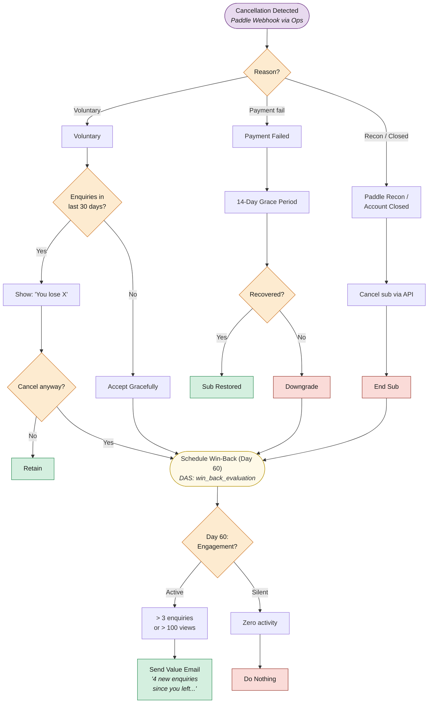

# 15. Cancellation & Churn Intervention

The entity executes a restrained, data-driven churn intervention. Win-back eligibility evaluated at Day 60.

```mermaid
flowchart TD
    classDef start fill:#e8daef,stroke:#6c3483,color:#1a1a1a
    classDef decision fill:#fdebd0,stroke:#ca6f1e,color:#1a1a1a
    classDef retain fill:#d4efdf,stroke:#1e8449,color:#1a1a1a
    classDef lose fill:#fadbd8,stroke:#922b21,color:#1a1a1a
    classDef winback fill:#fef9e7,stroke:#b7950b,color:#333

    CANCEL(["Cancellation Detected<br/><i>Paddle Webhook via Ops</i>"]):::start
    REASON{"Reason?"}:::decision

    VOL["Voluntary"]
    PAY["Payment Failed"]
    RECON["Paddle Recon /<br/>Account Closed"]

    ENQ{"Enquiries in<br/>last 30 days?"}:::decision
    SHOW["Show: 'You lose X'"]
    ACCEPT1["Accept Gracefully"]

    ANYWAY{"Cancel anyway?"}:::decision
    RETAIN["Retain"]:::retain

    GRACE["14-Day Grace Period"]
    RECOVERED{"Recovered?"}:::decision
    RESTORED["Sub Restored"]:::retain
    DOWNGRADE["Downgrade"]:::lose

    ACCEPT2["Cancel sub via API"]
    END_SUB["End Sub"]:::lose

    WINBACK(["Schedule Win-Back (Day 60)<br/><i>DAS: win_back_evaluation</i>"]):::winback

    D60{"Day 60:<br/>Engagement?"}:::decision
    ENGAGED["> 3 enquiries<br/>or > 100 views"]
    ZERO["Zero activity"]

    SEND["Send Value Email<br/><i>'4 new enquiries<br/>since you left...'</i>"]:::retain
    NOTHING["Do Nothing"]:::lose

    CANCEL --> REASON
    REASON -- "Voluntary" --> VOL --> ENQ
    REASON -- "Payment fail" --> PAY --> GRACE
    REASON -- "Recon / Closed" --> RECON --> ACCEPT2

    ENQ -- "Yes" --> SHOW --> ANYWAY
    ENQ -- "No" --> ACCEPT1

    ANYWAY -- "No" --> RETAIN
    ANYWAY -- "Yes" --> WINBACK
    ACCEPT1 --> WINBACK

    GRACE --> RECOVERED
    RECOVERED -- "Yes" --> RESTORED
    RECOVERED -- "No" --> DOWNGRADE --> WINBACK

    ACCEPT2 --> END_SUB --> WINBACK

    WINBACK --> D60
    D60 -- "Active" --> ENGAGED --> SEND
    D60 -- "Silent" --> ZERO --> NOTHING
```
