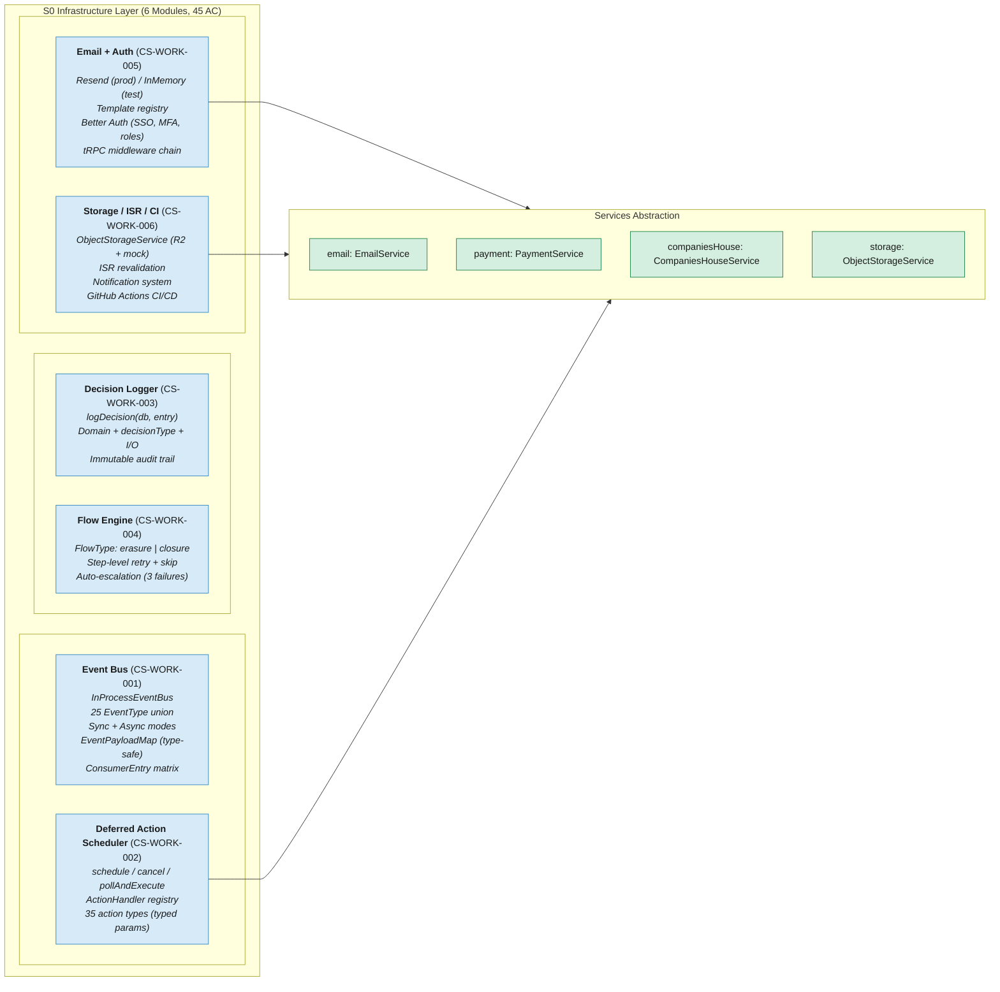

# 16. Shared Infrastructure: S0 Layer

6 shared services consumed by all 4 domains. All built, all tested, zero type errors.

```mermaid
graph LR
    classDef mod fill:#d6eaf8,stroke:#2e86c1,color:#1a1a1a
    classDef svc fill:#d4efdf,stroke:#1e8449,color:#1a1a1a

    subgraph S0 ["S0 Infrastructure Layer (6 Modules, 45 AC)"]
        direction TB

        subgraph ROW1 [" "]
            direction LR
            EB["<b>Event Bus</b> (CS-WORK-001)<br/><i>InProcessEventBus<br/>25 EventType union<br/>Sync + Async modes<br/>EventPayloadMap (type-safe)<br/>ConsumerEntry matrix</i>"]:::mod

            DAS["<b>Deferred Action Scheduler</b> (CS-WORK-002)<br/><i>schedule / cancel / pollAndExecute<br/>ActionHandler registry<br/>35 action types (typed params)</i>"]:::mod
        end

        subgraph ROW2 [" "]
            direction LR
            DEC["<b>Decision Logger</b> (CS-WORK-003)<br/><i>logDecision(db, entry)<br/>Domain + decisionType + I/O<br/>Immutable audit trail</i>"]:::mod

            FE["<b>Flow Engine</b> (CS-WORK-004)<br/><i>FlowType: erasure | closure<br/>Step-level retry + skip<br/>Auto-escalation (3 failures)</i>"]:::mod
        end

        subgraph ROW3 [" "]
            direction LR
            EA["<b>Email + Auth</b> (CS-WORK-005)<br/><i>Resend (prod) / InMemory (test)<br/>Template registry<br/>Better Auth (SSO, MFA, roles)<br/>tRPC middleware chain</i>"]:::mod

            ST["<b>Storage / ISR / CI</b> (CS-WORK-006)<br/><i>ObjectStorageService (R2 + mock)<br/>ISR revalidation<br/>Notification system<br/>GitHub Actions CI/CD</i>"]:::mod
        end
    end

    subgraph SVC ["Services Abstraction"]
        direction TB
        S1["email: EmailService"]:::svc
        S2["payment: PaymentService"]:::svc
        S3["companiesHouse: CompaniesHouseService"]:::svc
        S4["storage: ObjectStorageService"]:::svc
    end

    EA --> SVC
    ST --> SVC
    DAS --> SVC
```
