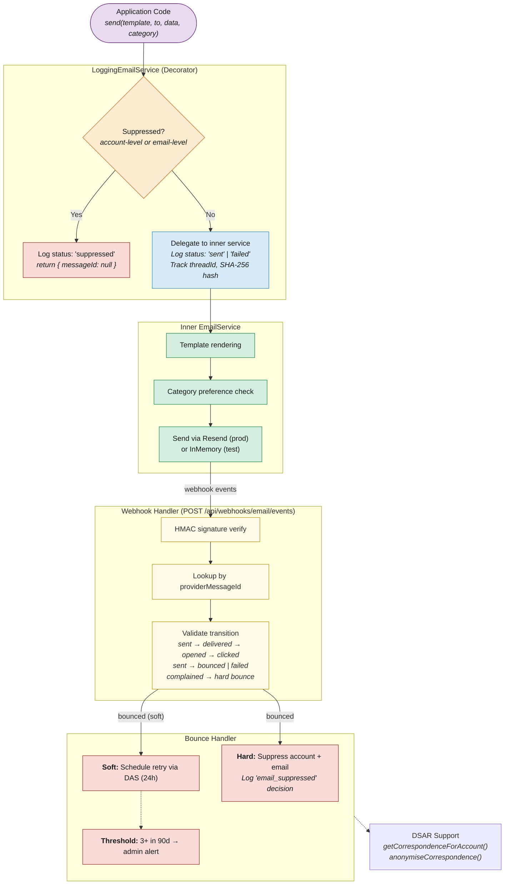

# 17. Communications Pipeline (Phase 1)

End-to-end email lifecycle: send, log, deliver, track, bounce, suppress. Implemented as a decorator chain around the core EmailService.

```mermaid
flowchart TD
    classDef app fill:#e8daef,stroke:#6c3483,color:#1a1a1a
    classDef decorator fill:#d6eaf8,stroke:#2e86c1,color:#1a1a1a
    classDef inner fill:#d4efdf,stroke:#1e8449,color:#1a1a1a
    classDef webhook fill:#fef9e7,stroke:#b7950b,color:#333
    classDef bounce fill:#fadbd8,stroke:#922b21,color:#1a1a1a
    classDef decision fill:#fdebd0,stroke:#ca6f1e,color:#1a1a1a

    APP(["Application Code<br/><i>send(template, to, data, category)</i>"]):::app

    subgraph LOGGING ["LoggingEmailService (Decorator)"]
        direction TB
        SUP_CHECK{"Suppressed?<br/><i>account-level or email-level</i>"}:::decision
        SUP_YES["Log status: 'suppressed'<br/><i>return { messageId: null }</i>"]:::bounce
        DELEGATE["Delegate to inner service<br/><i>Log status: 'sent' | 'failed'<br/>Track threadId, SHA-256 hash</i>"]:::decorator
    end

    subgraph INNER ["Inner EmailService"]
        direction TB
        RENDER["Template rendering"]:::inner
        PREF["Category preference check"]:::inner
        SEND["Send via Resend (prod)<br/>or InMemory (test)"]:::inner
        RENDER --> PREF --> SEND
    end

    subgraph WEBHOOK ["Webhook Handler (POST /api/webhooks/email/events)"]
        direction TB
        HMAC["HMAC signature verify"]:::webhook
        LOOKUP["Lookup by providerMessageId"]:::webhook
        VALIDATE["Validate transition<br/><i>sent &rarr; delivered &rarr; opened &rarr; clicked<br/>sent &rarr; bounced | failed<br/>complained &rarr; hard bounce</i>"]:::webhook
        HMAC --> LOOKUP --> VALIDATE
    end

    subgraph BOUNCE_H ["Bounce Handler"]
        direction TB
        HARD["<b>Hard:</b> Suppress account + email<br/><i>Log 'email_suppressed' decision</i>"]:::bounce
        SOFT["<b>Soft:</b> Schedule retry via DAS (24h)"]:::bounce
        THRESH["<b>Threshold:</b> 3+ in 90d &rarr; admin alert"]:::bounce
    end

    DSAR["DSAR Support<br/><i>getCorrespondenceForAccount()<br/>anonymiseCorrespondence()</i>"]

    APP --> SUP_CHECK
    SUP_CHECK -- "Yes" --> SUP_YES
    SUP_CHECK -- "No" --> DELEGATE
    DELEGATE --> RENDER
    SEND -- "webhook events" --> HMAC
    VALIDATE -- "bounced" --> HARD
    VALIDATE -- "bounced (soft)" --> SOFT
    SOFT -.-> THRESH
    BOUNCE_H -.-> DSAR
```
