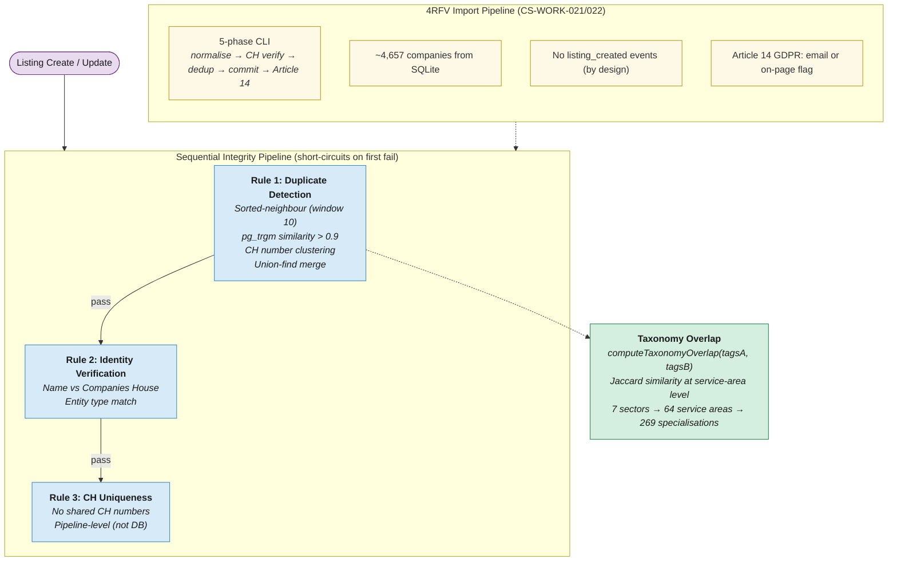

# 18. Data & Listings: Integrity Pipeline & Taxonomy

Listing integrity enforced by a sequential rule pipeline with short-circuit evaluation. Taxonomy overlap uses Jaccard similarity at service-area level.

