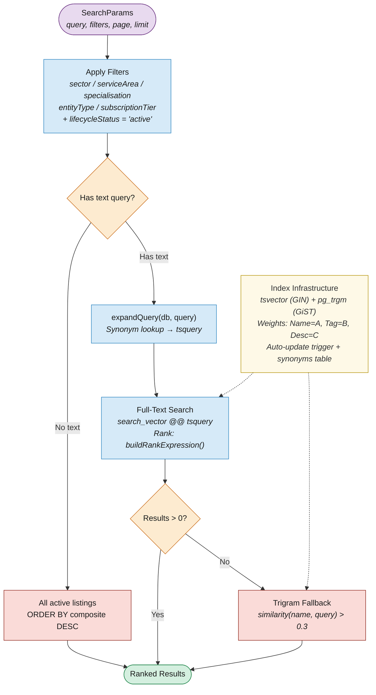

# 19. Search Infrastructure

Full-text search with synonym expansion, trigram fallback, and taxonomy filtering.

```mermaid
flowchart TD
    classDef input fill:#e8daef,stroke:#6c3483,color:#1a1a1a
    classDef process fill:#d6eaf8,stroke:#2e86c1,color:#1a1a1a
    classDef decision fill:#fdebd0,stroke:#ca6f1e,color:#1a1a1a
    classDef fallback fill:#fadbd8,stroke:#922b21,color:#1a1a1a
    classDef result fill:#d4efdf,stroke:#1e8449,color:#1a1a1a
    classDef infra fill:#fef9e7,stroke:#b7950b,color:#333

    SP(["SearchParams<br/><i>query, filters, page, limit</i>"]):::input

    IDX["Index Infrastructure<br/><i>tsvector (GIN) + pg_trgm (GiST)<br/>Weights: Name=A, Tag=B, Desc=C<br/>Auto-update trigger + synonyms table</i>"]:::infra

    FILTERS["Apply Filters<br/><i>sector / serviceArea / specialisation<br/>entityType / subscriptionTier<br/>+ lifecycleStatus = 'active'</i>"]:::process

    E1{"Has text query?"}:::decision

    EMPTY["All active listings<br/>ORDER BY composite DESC"]:::fallback

    EXPAND["expandQuery(db, query)<br/><i>Synonym lookup &rarr; tsquery</i>"]:::process

    FTS["Full-Text Search<br/><i>search_vector @@ tsquery<br/>Rank: buildRankExpression()</i>"]:::process

    HAS{"Results > 0?"}:::decision

    TRI["Trigram Fallback<br/><i>similarity(name, query) > 0.3</i>"]:::fallback

    RESULT(["Ranked Results"]):::result

    SP --> FILTERS --> E1
    E1 -- "No text" --> EMPTY --> RESULT
    E1 -- "Has text" --> EXPAND --> FTS --> HAS
    HAS -- "Yes" --> RESULT
    HAS -- "No" --> TRI --> RESULT

    IDX -.-> FTS
    IDX -.-> TRI
```
