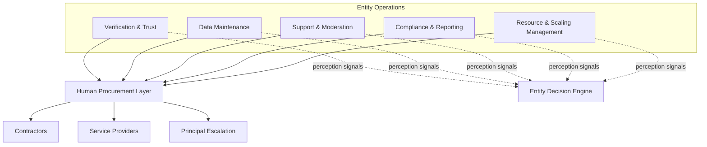
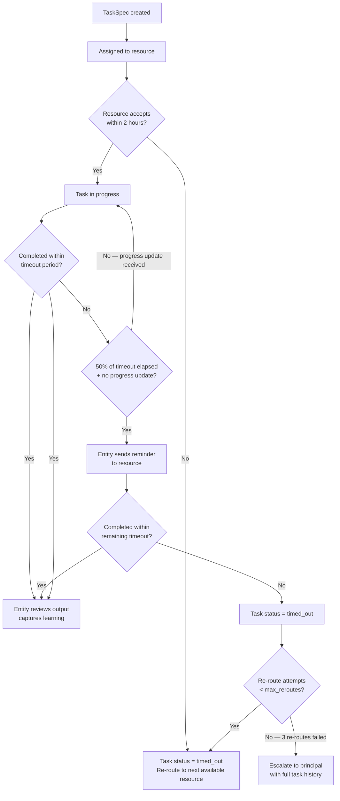
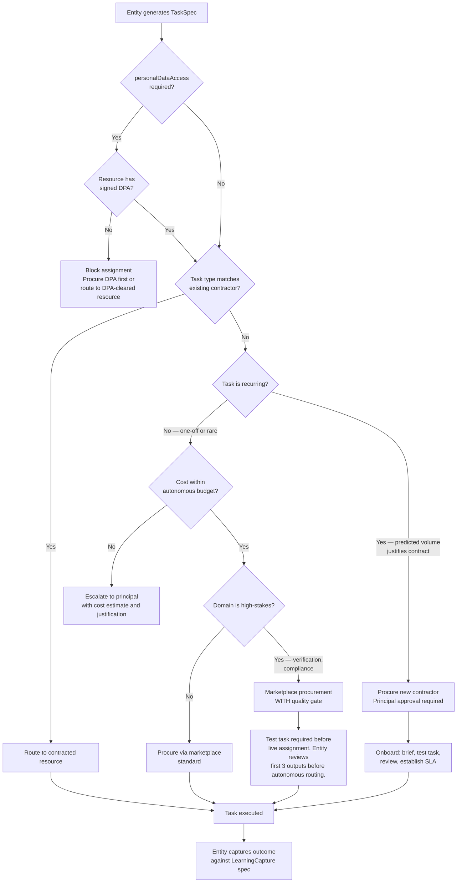
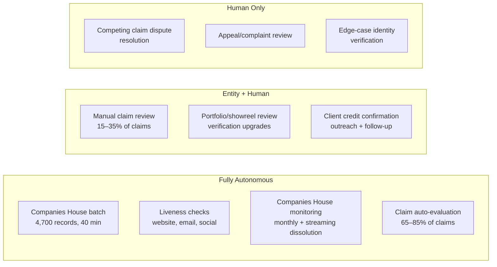
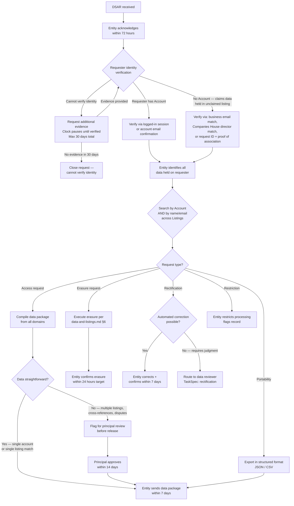

# Operations — Concept Design

**Status:** Draft v6 — cross stress tested with all four domains. 5 rounds: 35 intra-domain + 20 D&L×Ops cross + 20 PP×D&L×Ops cross + CR×D&L×Ops×PP cross scenarios, 51 total fixes
**Domain:** Operations
**Last updated:** 2026-02-11
**Inputs:** `ops-model.md`, `ops-investigation.md`, `entity-architecture-frame.md`, `data-and-listings.md` (v4), `trust-verification-findings.md`, `data-quality-framework.md`, `freemium-conversion-findings.md`
**Downstream:** `platform-and-product.md` (admin surfaces, monitoring UX), `commercial-and-revenue.md` (billing ops, churn intervention), `cross-domain-dependencies.md`

---

## Summary

This document reframes CALLSHEET's operational model from a human operator runbook into a set of entity decision architectures. The investigation-phase ops model (`ops-model.md`) correctly identified *what* operational work exists — verification throughput, support triage, data maintenance, compliance, scaling decisions. That content is valid. The assumed actor (a human founder doing everything) is replaced by the entity as operator, with human resources procured on-demand through standardised task specifications.

**Key structural decisions:**

- Every operational process is expressed as a decision tree the entity executes, not a task list a human follows.
- Human procurement uses a standardised `TaskSpec` format with trigger conditions, acceptance criteria, and learning capture — resolving ST-17 from Data & Listings stress testing.
- Scaling is entity self-assessment against defined thresholds, not a founder's gut feeling about being overwhelmed.
- Compliance cadence is entity-scheduled with principal escalation for novel regulatory events.
- Search history retention is 12 months rolling with anonymisation, resolving open question #3 from `data-and-listings.md`.

**v2 additions:** Task lifecycle management (timeout, dead-letter, re-routing). DSAR handling for non-Account holders with identity verification. Support volume model expanded to all users (free, unclaimed, public). Principal unavailability fallback chain. Marketplace quality gate for high-stakes domains. Aggregate budget tracking in procurement logic. KB maintenance process. Functional health monitoring (search index, data pipeline). TaskSpec data access scoping. Webhook resilience and billing reconciliation. Cadence ownership boundary with Data & Listings. Contractor DPA elevated to principle. Compliance batch audit. Full stress test resolution log for 20 scenarios.

**v3 additions:** Quality gate fallback (supervised bypass when all candidates fail). Billing reconciliation sanity check with grace period and anomaly detection. Article 14 notices for pre-launch 4rfv seeded data. Principal Operations Briefing template. Legal threat triage path. Pre-launch 4rfv data import specification. Business hours definition. Scale-down thresholds. Sensitive circumstances triage. Billing reconciliation emits domain events. DSAR identity verification timing. Contractor access expansion workflow. Contractor appeal logging. Professional redundancy note. Freshdesk agent seat scaling. Full stress test resolution log for 35 scenarios across 2 rounds.

**v4 additions (cross stress test with Data & Listings):** TaskSpec field mapping templates per D&L schema version. Auto-approval rate monitoring with dynamic capacity adjustment. Decay/support ticket deduplication via D&L domain event consumption. Unified scheduler merge function with D&L enrichment cadence. API cost ledger for enrichment alongside procurement budget. GDPR erasure orchestration protocol (extract-before-erasure sequencing). Cross-domain DSAR data inventory. "Unreachable unclaimed listing" support triage path. Article 14 email template ownership (compliance content + D&L claim CTA). `subscription_tier_changed` event emission for D&L enrichment cadence. Taxonomy reference format for contractor TaskSpecs. Active ticket registry for D&L decay/support coordination.

---

## 1. Operational Architecture

### The Entity Is the Operator

The ops-model investigation was written for a solo human founder. Under the entity architecture frame, the entity operates CALLSHEET. Where the entity cannot act autonomously (manual verification review, client credit confirmation, compliance judgements requiring legal interpretation), it procures human resources via scoped task specifications.

The entity's operational surface decomposes into five domains:



### Operational Capacity Model

The entity's operational capacity is defined by what it can do autonomously versus what requires human procurement. This boundary shifts over time (entity-architecture-frame §Design Principle 5: Autonomy Is Graduated).

| Operation | V1 Actor | Autonomous Threshold | Human Procurement Trigger |
|---|---|---|---|
| Liveness checks (website, email, social) | Entity | Always autonomous | Never — fully automated |
| Companies House monitoring | Entity | Always autonomous | Never — API-driven |
| Quality score computation | Entity | Always autonomous | Never — algorithmic |
| Claim evaluation (auto-approve/reject) | Entity | 65–85% of claims | Remaining 15–35% → manual review task |
| Portfolio/showreel review | Procured human | Never autonomous at V1 | Always — requires subjective judgment |
| Client credit confirmation | Entity (sends) + human (responds) | Outreach is autonomous | Non-response follow-up may require human judgement |
| Support triage & response | Entity (L0: autoresponder + KB deflection) | 30–40% deflected | Remaining 60–70% → human support agent |
| Content moderation | Entity (automated filters) + human (edge cases) | Spam/profanity filtering | Subjective moderation decisions |
| Compliance assessment | Entity (scheduled checks) + principal | Routine filings, DPA management | Novel regulatory events, DSARs requiring interpretation |
| Scaling decisions | Entity (threshold monitoring) | Detects threshold breach | Principal approves budget allocation |

---

## 2. Human Procurement Framework

`[Resolves ST-17 — human procurement mechanism]`

### TaskSpec Standard

Every human task the entity generates follows a standardised specification. This is the interface between the entity's decision engine and the human resource layer.

```typescript
type TaskSpec = {
  id: UUID
  domain: "verification" | "support" | "moderation" | "compliance" | "data_maintenance" | "outreach"
  priority: "critical" | "high" | "normal" | "low"
  task: string                          // imperative description
  context: Record<string, any>          // all relevant data the human needs
  checklist: string[]                   // ordered steps
  acceptanceCriteria: string            // what "done" looks like
  estimatedTime: string                 // entity's estimate
  deadline?: ISO8601                    // SLA-driven
  timeout: number                       // hours — task auto-expires if not completed [ST-1]
  escalation: string                    // what happens if task is blocked or overdue
  requiredSkills: string[]              // for matching to available resources
  dataAccessScope: DataAccessScope      // least-privilege data access [ST-13]
  learningCapture: LearningCapture      // what the entity learns from the outcome
}

type TaskStatus = "pending" | "assigned" | "in_progress" | "completed" | "timed_out" | "re_routed"

type DataAccessScope = {
  entities: string[]                    // e.g. ["listing:uuid", "account:uuid"]
  fields: string[]                      // e.g. ["identity.name", "identity.companiesHouseNumber", "profile.websiteUrl"]
  excludeFields: string[]               // e.g. ["authentication", "buyerFacet.searchHistory"]
  personalDataAccess: boolean           // if true, contractor must have signed DPA
  justification: string                 // why this scope is needed for this task
}

type LearningCapture = {
  outcomeCategories: string[]           // e.g. ["approved", "rejected", "escalated"]
  hypothesisToTest?: string             // e.g. "email domain match predicts legitimate claim"
  feedbackFields: Record<string, string> // e.g. { "timeActual": "minutes", "difficultyRating": "1-5" }
}
```

### Task Lifecycle and Dead-Letter Handling

`[Stress test #1 — contractor goes AWOL mid-task]`

Every TaskSpec has a `timeout` (hours). The entity monitors task progress and handles expiry:



**Default timeouts by domain:**

| Domain | Default Timeout | Max Re-routes | Rationale |
|---|---|---|---|
| Verification (manual review) | 24 hours | 2 | Claim SLA is 24 hours; re-route preserves SLA with buffer |
| Verification (dispute) | 7 days | 1 | 14-day SLA; single re-route + principal escalation |
| Support | 8 business hours | 2 | Same-day or next-day resolution target |
| Moderation | 24 hours | 2 | Content should not stay in limbo |
| Compliance | 72 hours | 1 | Legal deadlines — escalate fast |
| Data maintenance | 48 hours | 3 | Lower urgency, more re-route tolerance |
| Outreach | 5 days | 2 | Campaign-based, less time-sensitive |

**Contractor reliability tracking:** Every timeout and re-route is logged against the contractor. Feeds into the Contractor Performance Review ceremony. Contractors with >20% timeout rate over a rolling 30-day window are flagged for replacement.

**Contractor disagreement logging:** `[Stress test #26]` If a contractor disagrees with the entity's rejection of their output, they can flag the disagreement. The entity's decision stands in the moment (task is re-routed or re-done), but the disagreement is logged with the contractor's reasoning and reviewed in the quarterly Contractor Performance Review ceremony. Patterns of justified disagreement indicate the entity's acceptance criteria or automated review logic needs calibration.

**TaskSpec field mapping to D&L model:** `[Cross stress test X-1]` Every TaskSpec that references D&L entities includes a `DataAccessScope` with explicit field paths from D&L's entity model. Operations maintains a **TaskSpec template library** (§9 Layer 5) with pre-defined field mappings per task type, versioned against D&L's schema. When D&L adds or renames fields (tracked by schema version in `data-and-listings.md`), Operations updates affected templates. The entity validates field paths at task creation — a TaskSpec referencing a non-existent field path fails with an alert, not silently.

**Taxonomy reference for contractors:** `[Cross stress test X-17]` D&L produces a **taxonomy reference export** (§5 Layer 5 asset) in two formats: machine-readable JSON (for search configuration) and a human-readable spreadsheet (Sector → Service Area → Specialisation, with descriptions). Contractor TaskSpecs in the `data_maintenance` domain include a link to the current spreadsheet version. The entity regenerates the export on every taxonomy change (quarterly review ceremony output).

**Access expansion workflow:** `[Stress test #23]` If a contractor cannot complete a task because `DataAccessScope` is too narrow, they submit an access expansion request. The entity evaluates: (a) is the requested field relevant to the task? (b) does it increase personal data exposure? If yes to (a) and no to (b), auto-approve and log. If yes to both, flag for entity review with justification. Repeated expansion requests for the same task type trigger a template update in the TaskSpec template library. Pre-defined scope templates per task type are maintained as part of the **TaskSpec template library** asset (§9 Layer 5).

### Procurement Channels

The entity acquires human resources through three channels, evaluated in order of cost and latency.

**Mandatory pre-condition:** Any contractor accessing personal data must have a signed Data Processing Agreement before task assignment. No exceptions. The entity blocks task routing to resources without a current DPA when `taskSpec.dataAccessScope.personalDataAccess == true`. `[Stress test #4]`



### Marketplace Quality Gate for High-Stakes Domains

`[Stress test #7 — marketplace verification quality risk]`

Verification and compliance tasks have high downstream cost if done incorrectly (fraudulent claims approved, legal obligations missed). Marketplace-procured resources in these domains must pass a quality gate before receiving live tasks:

```
marketplaceQualityGate(resource: MarketplaceResource, domain: string): QualityGateResult

  if domain not in ["verification", "compliance"]:
    return { gateRequired: false }  // standard domains — no gate

  // Step 1: Test task
  testTask = generateTestTask(domain)  // synthetic task with known-correct answer
  testResult = assignAndWait(resource, testTask)

  if testResult.correct == false:
    return { gateRequired: true, passed: false,
             action: "reject_resource", reason: "Failed test task" }

  // Step 2: Supervised live tasks (first 3)
  return { gateRequired: true, passed: true,
           supervisionRequired: 3,  // entity reviews first 3 live task outputs
           autoRouteAfter: "3 consecutive correct outputs" }
```

**Quality gate fallback:** `[Stress test #21]` If 3 consecutive marketplace candidates fail the test task and the manual review queue is approaching SLA breach (>50% of timeout elapsed):

```
qualityGateFallback(domain: string, queueDepth: number, oldestTaskAge: number):

  if queueDepth > 0 AND oldestTaskAge > (defaultTimeout[domain] * 0.5):
    // SLA at risk — activate supervised bypass
    return { action: "supervised_bypass",
             rule: "Route to next marketplace candidate WITHOUT test task. Entity reviews every output before acceptance. Flag all results as low-confidence.",
             escalation: "Escalate to principal: quality gate failing — need contracted resource for " + domain,
             maxBypassTasks: 10 }  // cap before forcing principal action

  // Not yet at SLA risk — keep trying candidates
  return { action: "continue_gate", expandSearch: true,
           platforms: ["PeoplePerHour", "Upwork", "Fiverr"],
           increaseRate: true }
```

The supervised bypass ensures no task goes unresolved due to quality gate failure, while the 100% entity review mitigates the risk of unvetted resources. The cap of 10 bypassed tasks forces a structural solution (contracted resource) rather than indefinite workaround.

### Resource Roster (V1 Projection)

| Role | Procurement Trigger | Engagement Model | Estimated Volume | Estimated Cost |
|---|---|---|---|---|
| Verification reviewer | >5 manual reviews/week sustained | Part-time contractor, per-task | 10–30 tasks/week at scale | £12–18/hour |
| Support agent | >50 tickets/month sustained | Part-time contractor, batched | 50–150 tickets/month | £12–15/hour |
| Content moderator | First user-generated content published | Part-time, combined with support | 20–50 items/week | Combined with support role |
| Outreach specialist | Provider Outreach Cycle ceremony | Campaign-based contractor | Monthly campaigns | £15–20/hour or per-contact |
| Compliance advisor | Annual review OR novel regulatory event | Retained professional, on-call | 2–4 hours/quarter routine | £150–250/hour |
| Accountant | VAT registration triggered OR first financial year end | Retained professional | Monthly reconciliation | £50–100/hour |

**Professional redundancy note:** `[Stress test #30]` Compliance advisor and accountant are single-provider dependencies. At V1 scale, retaining two of each is disproportionate. Mitigation: the entity maintains a backup procurement path — if the primary compliance advisor is unavailable for >14 days, procure a second advisor via marketplace using the compliance-domain quality gate. The accountant role is less time-sensitive (monthly cadence) and can tolerate short gaps. The risk is noted; formal redundancy is a V2 consideration when revenue justifies the cost.

### Procurement Decision Logic

```
evaluateProcurement(need: ProcurementNeed): ProcurementDecision

  // Check existing capacity
  existingResource = findContractor(need.domain, need.requiredSkills)
  if existingResource AND existingResource.availability >= need.estimatedHours:
    return { action: "assign_existing", resource: existingResource }

  // Check if need is recurring
  historicalVolume = getTaskVolume(need.domain, lookback = 90 days)
  projectedVolume = projectTaskVolume(need.domain, lookahead = 90 days)

  if projectedVolume.weeklyAverage > need.contractThreshold:
    return { action: "procure_contractor",
             justification: "Projected " + projectedVolume.weeklyAverage + " tasks/week exceeds threshold",
             budgetEstimate: estimateContractCost(need, projectedVolume),
             requiresPrincipalApproval: true }

  // Aggregate budget check before marketplace procurement [ST-10]
  monthlySpend = getMarketplaceSpend(period = "current_month")
  if monthlySpend + need.estimatedCost > AUTONOMOUS_MONTHLY_LIMIT:
    return { action: "escalate_to_principal",
             reason: "Monthly marketplace budget would exceed limit",
             monthlySpendToDate: monthlySpend,
             thisEngagement: need.estimatedCost,
             monthlyLimit: AUTONOMOUS_MONTHLY_LIMIT }

  // Per-engagement check
  if need.estimatedCost <= AUTONOMOUS_ENGAGEMENT_LIMIT:
    return { action: "procure_marketplace",
             platforms: ["PeoplePerHour", "Upwork"],
             budgetEstimate: need.estimatedCost,
             requiresPrincipalApproval: false }

  // Above per-engagement budget — escalate
  return { action: "escalate_to_principal",
           reason: "Cost exceeds per-engagement autonomous limit",
           budgetEstimate: need.estimatedCost }
```

**Budget limits** (placeholders — set by Layer 1 governance when defined):

| Limit | Planning Assumption | Enforcement |
|---|---|---|
| `AUTONOMOUS_ENGAGEMENT_LIMIT` | £500 per engagement | Per-task check in procurement logic |
| `AUTONOMOUS_MONTHLY_LIMIT` | £2,000 per calendar month | Aggregate check against monthly spend ledger `[ST-10]` |
| `API_MONTHLY_BUDGET` | £200 per calendar month | Aggregate check against API cost ledger `[Cross stress test X-8]` |

**API cost ledger:** `[Cross stress test X-8]` Enrichment API calls (Companies House, email verification, website checks, social media lookups) are infrastructure costs, not human procurement. Operations tracks these separately from the procurement spend ledger. D&L's enrichment cadence decisions (§3 of `data-and-listings.md`) drive API volume; Operations monitors the cost. If monthly API spend exceeds `API_MONTHLY_BUDGET`, the entity reduces enrichment frequency for unclaimed listings first (lowest priority), then for free claimed listings. Paid listings are not throttled. Budget breach triggers principal alert in the monthly briefing.

Entity logs all procurement decisions for principal review regardless of amount. Monthly aggregate (procurement + API) is reported in the Principal Operations Briefing ceremony.

---

## 3. Verification Operations as Entity Decision Architecture

### Verification Throughput Model

The investigation established verification as the primary operational bottleneck. Under entity operation, this decomposes into three streams:



### Claim Volume Projection and Capacity Planning

```
projectClaimCapacity():

  // Inputs from investigation
  totalListings = 4700
  organicClaimRate = { low: 0.05, mid: 0.10, high: 0.20 }  // per year
  withOutreach = { low: 0.10, mid: 0.20, high: 0.30 }

  // Auto-approval rate — dynamic, not static [Cross stress test X-5]
  // Planning assumption: 0.75. Actual rate monitored monthly via claim_approved events from D&L.
  // If actual rate < 0.60 for 2 consecutive months, entity recalculates capacity projections
  // and alerts principal if manual review load exceeds contractor capacity.
  autoApprovalRate = getActualAutoApprovalRate(period = "90d") ?? 0.75  // fallback to planning assumption if no data

  // Capacity per human reviewer
  lightReviewCapacity = 5  // per hour
  thoroughReviewCapacity = 1.5  // per hour

  scenarios = {
    organic_low:   totalListings * organicClaimRate.low,   // 235 claims/year = ~5/week
    organic_mid:   totalListings * organicClaimRate.mid,    // 470 claims/year = ~9/week
    outreach_mid:  totalListings * withOutreach.mid,        // 940 claims/year = ~18/week
    outreach_high: totalListings * withOutreach.high         // 1,410 claims/year = ~27/week
  }

  for scenario in scenarios:
    manualReviews = scenario * (1 - autoApprovalRate)
    weeklyManualLoad = manualReviews / 52
    hoursPerWeek = weeklyManualLoad / thoroughReviewCapacity

    if weeklyManualLoad > 20:
      return { alert: "HIRE_VERIFICATION_CONTRACTOR", weeklyLoad: weeklyManualLoad }

  // At organic_low/mid: ~1–2 manual reviews/week — entity handles via marketplace
  // At outreach_mid: ~4–5 manual reviews/week — entity handles via marketplace or part-time contractor
  // At outreach_high: ~7 manual reviews/week — part-time contractor recommended
```

### Principal Unavailability Fallback

`[Stress test #6 — principal unreachable during escalation]`

The entity cannot assume the principal is always available. Every escalation has a maximum wait time and a default action if the principal does not respond.

```
escalateToPrincipal(escalation: Escalation): EscalationResult

  notifyPrincipal(escalation)

  // Wait with increasing urgency
  reminders = [
    { after: "24 hours", channel: "email" },
    { after: "48 hours", channel: "email + sms" },
    { after: "72 hours", channel: "email + sms + phone" }
  ]

  for reminder in reminders:
    if principalResponded(): return handleResponse()
    sendReminder(escalation, reminder)

  // 72 hours with no response — apply default action
  return applyDefaultAction(escalation)
```

**Default actions by escalation type:**

| Escalation Type | Max Wait | Default Action (if principal unresponsive) | Rationale |
|---|---|---|---|
| Competing claim dispute | 72 hours | Extend freeze + notify both parties of delay + retain compliance advisor for resolution | Freezing is safe; advisor can substitute for principal judgment |
| Budget approval (new contractor) | 72 hours | Defer procurement; continue with marketplace for individual tasks within autonomous limit | Entity can operate without new contractor |
| Compliance (novel regulatory event) | 48 hours | Retain compliance advisor autonomously; cap spend at £500 | Legal deadlines cannot wait; advisor substitutes for principal |
| P1 incident (data breach, legal threat) | 4 hours | Entity applies pre-defined incident response plan; logs all actions for principal review | Time-critical; entity must act |
| FTE hiring decision | 72 hours | Defer — not time-critical | No downstream SLA pressure |

The entity logs every instance of principal unavailability and its duration. Pattern of unavailability (>3 missed escalations in 30 days) triggers an alert to the principal requesting updated contact preferences or delegation authority.

### Verification SLA as Entity Commitment

| Claim Type | SLA | Actor | Escalation |
|---|---|---|---|
| Auto-approvable (email domain match, CH active + domain match) | <10 seconds | Entity | None — fully autonomous |
| Auto-rejectable (CH dissolved) | <10 seconds | Entity | None |
| Manual review (sole trader, partial match) | 24 hours | Entity routes → human reviews | If no human available within 12 hours, entity escalates to principal |
| Competing claim dispute | 14 days | Entity routes → human reviews → entity decides | If unresolvable in 14 days, principal escalation |
| Verification upgrade (portfolio review) | 48 hours | Entity routes → human reviews | If no human available within 24 hours, entity procures marketplace resource |

### Cadence Ownership: Operations vs Data & Listings

`[Stress test #18 — enrichment and re-verification cadence overlap]`

`data-and-listings.md` §3 defines **what** to check and the data quality enrichment schedule. This document defines **who schedules it** and the verification-specific cadence. Boundary:

| Activity | Owner | Cadence Source | Executor |
|---|---|---|---|
| Liveness checks (website, email, social) | Data & Listings (defines checks) | `data-and-listings.md` §3 `scheduleEnrichment` | Entity (automated) — Operations monitors completion |
| Full enrichment cycle | Data & Listings (defines checks + schedule) | `data-and-listings.md` §3 `scheduleEnrichment` | Entity (automated) — Operations procures human for edge cases |
| Credential re-verification (trade body, insurance) | **Operations** (verification-specific) | This document | Entity (automated check) + human (if lapsed) |
| Client credit refresh | **Operations** (verification-specific) | This document | Entity (sends) + client (responds) |
| Portfolio/showreel review | **Operations** (verification-specific) | This document | Procured human |
| Companies House monitoring | Shared — D&L defines data use, Ops schedules | Both — no conflict (same schedule) | Entity (automated) |

**Single scheduler:** The entity runs one unified scheduling engine. It merges the D&L enrichment cadence and the Operations verification cadence into a single per-listing schedule. No duplicate checks. When a liveness check and a credential recheck are both due in the same period, they execute in the same batch.

**Merge function:** `[Cross stress test X-7]` Operations owns the unified scheduler. D&L's `scheduleEnrichment` and Operations' `scheduleReVerification` both produce schedule objects. The merge function is Operations-owned infrastructure:

```
mergeSchedules(dlSchedule: EnrichmentSchedule, opsSchedule: VerificationSchedule): UnifiedSchedule

  // For each listing, take the more frequent cadence per check type
  // D&L owns: liveness checks, full enrichment cycle, provider prompts
  // Operations owns: credential recheck, client credit refresh, portfolio review

  return {
    livenessCheck: dlSchedule.livenessCheck,           // D&L authority
    fullEnrichmentCycle: dlSchedule.fullCycle,          // D&L authority
    providerPrompt: dlSchedule.providerPrompt,         // D&L authority
    credentialRecheck: opsSchedule.credentialRecheck,   // Ops authority
    clientCreditRefresh: opsSchedule.clientCreditRefresh, // Ops authority
    portfolioReview: opsSchedule.portfolioReview,       // Ops authority
    chMonitoring: "real_time"                           // shared — single execution
  }

  // When D&L updates enrichment cadence (e.g. subscription tier change via
  // subscription_tier_changed event), D&L recalculates and publishes new schedule.
  // Operations' unified scheduler picks up the change on next scheduling cycle (hourly).
```

### Re-Verification Cadence (Operations-Owned Activities Only)

```
scheduleReVerification(listing: Listing): VerificationSchedule
  // Liveness checks and full enrichment are scheduled by D&L (see data-and-listings.md §3).
  // This function schedules verification-specific activities only.

  // Companies House monitoring — always on (shared with D&L, single execution)
  chSchedule = { method: "streaming_api", frequency: "real_time", fallback: "monthly_poll" }

  if listing.commercial.subscriptionTier in ["premium", "partner"]:
    return {
      chSchedule,
      credentialRecheck: "annual",           // trade body, insurance
      clientCreditRefresh: "annual",         // re-confirm existing credits
      portfolioReview: "biennial",           // every 2 years
    }

  if listing.verification.tier == "verified":
    return {
      chSchedule,
      credentialRecheck: "biennial",
      clientCreditRefresh: null,             // only on upgrade request
      portfolioReview: null,
    }

  if listing.verification.tier == "claimed":
    return { chSchedule }
    // No verification-specific rechecks — D&L liveness checks still run

  // Unclaimed — no verification activities (not claimed, nothing to re-verify)
  return { chSchedule }
```

---

## 4. Support & Moderation as Entity Decision Architecture

### Support Triage Decision Tree

```mermaid
flowchart TD
    A[Inbound support request] --> B[Entity classifies request]
    B --> C{Category?}

    C -->|Password reset / login| D[Automated: send reset link<br/>Zero human involvement]
    C -->|Billing / payment| E{Paddle self-service<br/>resolves?}
    E -->|Yes| F[Redirect to Paddle<br/>Customer Portal]
    E -->|No — refund, dispute, edge case| G[Route to support agent<br/>TaskSpec: billing_support]

    C -->|Profile editing help| H{KB article matches?}
    H -->|Yes| I[Auto-suggest article<br/>+ "Did this help?"]
    I -->|Resolved| J[Closed — entity logs deflection]
    I -->|Not resolved| K[Route to support agent<br/>TaskSpec: profile_support]
    H -->|No| K

    C -->|Search visibility concern| L[Entity checks: listing quality score,<br/>verification tier, ranking factors]
    L --> M[Auto-generate explanation:<br/>"Your listing scores X/100.<br/>Here's what affects your ranking."]
    M --> N{Provider satisfied?}
    N -->|Yes| J
    N -->|No — alleges unfairness| O[Route to support agent<br/>TaskSpec: ranking_review]

    C -->|Claim dispute| P[Route to verification reviewer<br/>TaskSpec: dispute_resolution]

    C -->|Bug report| Q[Entity creates issue<br/>in Linear + acknowledges receipt]

    C -->|Data correction| R{Automated correction<br/>possible?}
    R -->|Yes — e.g. postcode format| S[Auto-correct + confirm with provider]
    R -->|No — requires judgment| T[Route to data reviewer<br/>TaskSpec: data_correction]

    C -->|Feature request| U[Log in feature request tracker<br/>Auto-acknowledge + close]

    C -->|Feature gating confusion| W[Auto-respond with tier<br/>comparison + upgrade link]
    W --> X{High volume on<br/>same gate?}
    X -->|Yes — >10 tickets/month<br/>on same feature| Y[Signal to Commercial:<br/>gate causing friction]
    X -->|No| J

    C -->|Remove my listing| Z[Route to data review<br/>or GDPR erasure path]

    C -->|Legal threat / solicitor<br/>correspondence| LT[IMMEDIATE principal notification<br/>Do not respond substantively<br/>Acknowledge receipt only]

    C -->|Sensitive circumstances<br/>deceased / criminal / safeguarding| SC[Fast-track removal<br/>Suppress all outreach<br/>Route to principal if complex]

    C -->|GDPR / data request| V[Route to compliance<br/>See §5 Compliance]

    C -->|Unreachable unclaimed listing<br/>buyer cannot contact| UL[Entity checks: listing contact<br/>data, website status, phone]
    UL --> UL2{Any working contact<br/>method exists?}
    UL2 -->|Yes| UL3[Provide alternative contact<br/>method to buyer]
    UL2 -->|No| UL4[Auto-respond: This provider<br/>has not claimed their listing.<br/>Suggest similar active providers.]
```

**Unreachable unclaimed listing:** `[Cross stress test X-14]` Buyers who attempt to contact an unclaimed listing but find dead website, no email, and no phone receive a structured response: "This provider has not yet claimed their listing on CALLSHEET." The entity runs a search for similar *active* (claimed) providers in the same taxonomy tags and location, and includes up to 5 alternatives in the response. This serves dual purpose: buyer gets help, and the alternative listings get exposure. The enquiry still queues for 90 days per D&L §4 enquiry handling.

**Decay/support deduplication:** `[Cross stress test X-6]` When a support ticket arrives about a data issue (categories: "data_correction", "search_visibility"), the entity checks whether D&L has an active decay signal for the same listing. If D&L has already sent a decay notification to the provider, the support agent sees this in the ticket context and responds: "We've already identified this issue and notified the provider." Conversely, D&L's `decay_signal_detected` event includes `activeSupportTicket` if one exists — Operations suppresses duplicate outreach for that listing.

**Feature gating triage:** `[Stress test #16]` Free-tier providers contacting support about gated features (e.g. "I can see 3 companies viewed me but can't see who") receive a pre-written response explaining the tier structure, not a bug report acknowledgment. High-frequency complaints about a specific gate are surfaced as a perception signal to the Commercial domain — the gate may be causing more churn than conversion.

**Legal threat handling:** `[Stress test #27]` Any inbound communication referencing solicitors, legal action, court proceedings, or pre-action protocol bypasses standard triage entirely. The entity: (a) sends a neutral acknowledgment ("We have received your correspondence and are reviewing it"), (b) immediately notifies the principal with the full text, (c) does not respond substantively — all further communication handled by principal or procured legal advisor. Classification keywords: "solicitor", "legal action", "court", "pre-action", "instruct", "without prejudice".

**Churn risk priority elevation:** `[CR-X-20]` During ticket classification, the entity checks the `churn_risk_registry` for the submitting account. If an active `churn_risk_detected` signal exists, the ticket is elevated to "high" priority regardless of category. This connects Commercial's churn perception to Operations' responsiveness — at-risk subscribers receive faster, more attentive support to reduce voluntary churn. The registry is populated by Commercial events and auto-expires stale entries after 90 days.

**Sensitive circumstances:** `[Stress test #32]` Contacts regarding deceased individuals, businesses under criminal investigation, safeguarding concerns, or other sensitive situations receive fast-tracked handling: immediate suppression of all outreach to the listing, removal from search within 24 hours, and routing to principal if the situation requires judgment (e.g. deceased sole trader's family requesting full removal vs. company listing where a director has died but the company continues).

### Support Volume Model

`[Stress test #3 — model must account for all user types, not just paid subscribers]`

```
projectSupportVolume(platform: PlatformState): SupportProjection

  // Paid subscribers generate the most tickets (billing + features + profile management)
  paidTicketRate = 0.35       // per paid subscriber per month

  // Free claimed accounts generate fewer (no billing queries, limited features)
  freeClaimedTicketRate = 0.15  // per free claimed account per month

  // Unclaimed listing owners contact about data accuracy, removal, claiming
  // Volume driven by outreach campaigns and organic discovery
  unclaimedContactRate = 0.02   // per unclaimed listing per month (low, inbound-only)

  // General public: spam, wrong-number, partnership pitches
  publicVolume = 10             // flat estimate per month, independent of scale

  rawVolume = (platform.paidSubscribers * paidTicketRate)
            + (platform.freeClaimedAccounts * freeClaimedTicketRate)
            + (platform.unclaimedListings * unclaimedContactRate)
            + publicVolume

  // Example at launch: 50 paid + 200 free claimed + 4,450 unclaimed + public
  // = 17.5 + 30 + 89 + 10 = ~147 raw tickets/month
  // Example at 500 paid: 500 paid + 800 free + 3,400 unclaimed + public
  // = 175 + 120 + 68 + 10 = ~373 raw tickets/month

  kbDeflectionRate = 0.35
  deflectedVolume = rawVolume * (1 - kbDeflectionRate)
  autoResolvedVolume = deflectedVolume * 0.15       // password resets, billing redirects
  humanVolume = deflectedVolume - autoResolvedVolume

  dailyHumanLoad = humanVolume / 22

  return {
    rawMonthly: rawVolume,
    afterDeflection: deflectedVolume,
    requiresHuman: humanVolume,
    dailyHumanLoad: dailyHumanLoad,
    breakdown: {
      fromPaid: platform.paidSubscribers * paidTicketRate,
      fromFreeClaimed: platform.freeClaimedAccounts * freeClaimedTicketRate,
      fromUnclaimed: platform.unclaimedListings * unclaimedContactRate,
      fromPublic: publicVolume
    },
    recommendation: humanVolume > 150 ? "HIRE_SUPPORT_CONTRACTOR" :
                    humanVolume > 50 ? "MOVE_TO_TICKETING" : "EMAIL_INBOX_SUFFICIENT"
  }
```

**Key implication:** At launch, unclaimed listing contacts may constitute 50%+ of support volume. The support triage tree must handle "remove my listing" and "this data is wrong" requests as first-class categories, not edge cases. See triage tree above — "Data correction" and "GDPR / data request" paths cover these.

### Support SLA Tiers

**Business hours definition:** `[Stress test #29]` Monday–Friday, 09:00–17:30 UK time (GMT/BST as applicable). SLA clocks run during business hours only for human-involved responses. Entity-automated responses (password resets, KB deflection, billing redirects) operate 24/7. Requests received outside business hours receive an immediate auto-acknowledgment: "We've received your message and will respond during business hours (Mon–Fri, 9am–5:30pm UK time). For urgent account access issues, [self-service link]."

| Request Type | Response SLA | Resolution Target | Channel |
|---|---|---|---|
| Account access / login | Automated — immediate (24/7) | Immediate | In-app + email |
| Billing (Paddle-resolvable) | Redirect — immediate (24/7) | Self-service | Paddle portal |
| Billing (requires human) | 4 business hours | 1 business day | Email |
| Profile/listing help | 1 business day | 2 business days | Email / in-app |
| Search visibility concern | 1 business day | 3 business days | Email — includes score explanation |
| Claim dispute | 1 business day acknowledgment | 14 days resolution | Email |
| Bug report | 1 business day acknowledgment | Triaged within 3 business days | Email → Linear |
| GDPR request (DSAR, erasure) | 72 hours (calendar, not business) | 30 calendar days (legal max) | Email |
| Legal threat | Acknowledgment immediate (24/7, auto) | Principal notified within 1 business hour | Email → principal |
| Sensitive circumstances | Acknowledgment immediate (24/7, auto) | Outreach suppressed within 1 hour. Removal within 24 hours. | Email |

### Knowledge Base Maintenance

`[Stress test #11 — KB articles become outdated, reducing deflection rate]`

The KB is an operational asset that degrades if not maintained. The entity monitors KB health autonomously:

```
monitorKBHealth(): KBHealthSignal[]

  signals = []

  for article in knowledgeBase.articles:
    // Track "Did this help?" negative rate
    helpfulnessRate = article.helpfulYes / (article.helpfulYes + article.helpfulNo)
    if helpfulnessRate < 0.6:
      signals.push({ type: "low_helpfulness", article: article.id,
                     rate: helpfulnessRate, action: "FLAG_FOR_REVIEW" })

    // Track tickets that follow a KB deflection (user read article, then still submitted ticket)
    postDeflectionTickets = countTickets(precededByKBArticle = article.id, period = "30d")
    if postDeflectionTickets > 5:
      signals.push({ type: "ineffective_deflection", article: article.id,
                     followUpTickets: postDeflectionTickets, action: "FLAG_FOR_REVIEW" })

  // Track overall deflection rate trend
  currentDeflectionRate = calculateDeflectionRate(period = "30d")
  previousDeflectionRate = calculateDeflectionRate(period = "30-60d")
  if currentDeflectionRate < previousDeflectionRate - 0.05:  // >5pp drop
    signals.push({ type: "deflection_rate_declining",
                   current: currentDeflectionRate, previous: previousDeflectionRate,
                   action: "INVESTIGATE_ROOT_CAUSE" })

  return signals
```

### Active Ticket Registry

`[Cross stress test X-20]`

Operations maintains a queryable index of active support tickets, keyed by `listingId` and `accountId`. D&L's domain event pipeline queries this index before emitting decay signals or executing suspensions.

```
type ActiveTicketIndex = Map<UUID, { ticketId: UUID, category: string, openedAt: ISO8601 }>
// Keyed by listingId. Updated on ticket open/close.

// D&L calls this before listing suspension:
function hasActiveTicket(listingId: UUID): ActiveTicketRecord | null
// If non-null, D&L defers suspension until ticket resolves.
// D&L annotates decay_signal_detected events with the ticketId.
```

This is a lightweight read-only interface — D&L does not modify tickets, only checks for their existence. Operations updates the index as tickets are opened and closed. The index is eventually consistent (seconds, not real-time) — acceptable because suspension decisions are not time-critical at sub-minute precision.

**KB review cadence:** Entity flags articles for review per the monitoring above. Review happens as part of the monthly Operational Health Review ceremony. If a platform update changes any UI flow referenced in a KB article, the entity flags the article immediately (triggered by deploy, not waiting for monthly review).

### Content Moderation Decision Tree

```
moderateContent(content: UserContent, listing: Listing): ModerationDecision

  // Automated layer — entity acts without human
  if containsProfanity(content): return { action: "reject", reason: "profanity", automated: true }
  if containsContactInfoInBio(content) AND content.field != "contactEmail":
    return { action: "flag_warning", reason: "contact info outside designated field", automated: true }
  if containsCompetitorMention(content): return { action: "flag_for_review", reason: "competitor mention" }
  if spamScore(content) > 0.8: return { action: "reject", reason: "spam_detected", automated: true }
  if spamScore(content) > 0.5: return { action: "flag_for_review", reason: "possible_spam" }

  // Image moderation (profile photos, portfolio)
  if content.type == "image":
    nsfw = nsfwCheck(content)  // automated classifier
    if nsfw.score > 0.9: return { action: "reject", reason: "nsfw_content", automated: true }
    if nsfw.score > 0.5: return { action: "flag_for_review", reason: "possible_nsfw" }

  return { action: "approve", automated: true }
```

---

## 5. Compliance Cadence as Entity-Scheduled Operations

### Compliance Calendar

The entity maintains a compliance calendar. Each obligation has a defined trigger, deadline, and escalation path. The entity executes routine compliance autonomously and escalates novel or interpretive requirements to the principal or a procured compliance advisor.

```
type ComplianceObligation = {
  id: string
  name: string
  frequency: "one_time" | "annual" | "quarterly" | "monthly" | "on_demand" | "triggered"
  deadline?: string                     // e.g. "30 calendar days from request"
  actor: "entity" | "principal" | "compliance_advisor"
  autonomousAtV1: boolean
  escalationTrigger?: string
}
```

| Obligation | Frequency | Actor | V1 Autonomous? | Deadline | Escalation |
|---|---|---|---|---|---|
| **ICO registration renewal** | Annual | Entity (payment) | Yes | Before expiry | 30 days pre-expiry warning to principal |
| **DSAR handling** | On-demand | Entity (data gathering) + principal (review if complex) | Partially — entity compiles data, principal approves release for complex cases | 30 calendar days | If >20 days elapsed without resolution → principal alert |
| **Erasure request** | On-demand | Entity (automated per data map in `data-and-listings.md` §6) | Yes — fully automated for standard requests | 30 calendar days, target <24 hours | Novel cases (e.g. disputed listing + erasure) → principal |
| **Right to object** | On-demand | Entity | Yes — suppress from outreach, retain listing under legitimate interest or remove | 30 calendar days | If objection challenges legitimate interest basis → compliance advisor |
| **Article 14 notices** | Triggered (new listing creation) | Entity | Yes — automated email within 1 month of listing creation | 1 month from data collection | Failure to send → entity flags itself. Weekly batch audit: compare listings created vs notices sent. `[ST-9]` |
| **Privacy policy review** | Annual | Compliance advisor + principal | No — requires legal judgment | Before anniversary | 60 days pre-anniversary → procure advisor |
| **Cookie policy compliance** | Triggered (regulatory change) | Compliance advisor | No | Per regulation timeline | Monitor via regulatory news feed |
| **Records of Processing Activities** | Continuous | Entity | Yes — auto-generated from processing logs | Always current | Quarterly completeness check |
| **DPA management** | Triggered (new processor added) | Entity (template) + principal (review) | Partially — entity sends standard DPA, principal reviews non-standard terms | Before processing begins | New processor without DPA → block data flow |
| **VAT registration** | Triggered (£90K threshold approached) | Entity (monitoring) + principal (filing) | Monitoring only — entity alerts at 80% of threshold | 30 days from exceeding threshold | At £72K rolling revenue → principal alert |
| **Annual accounts** | Annual | Accountant (procured) + principal | No | 9 months from year end (Companies House) | 90 days pre-deadline → entity procures accountant |
| **Confirmation statement** | Annual | Entity (filing) | Yes — simple form, auto-fillable | 14 days from due date | 30 days pre-deadline → entity files or alerts principal |

### Pre-Launch Article 14 Obligation for Seeded Data

`[Stress test #24 — 4,700 seeded listings have no Article 14 handling]`

The compliance calendar specifies Article 14 notices triggered on "new listing creation." The 4,700 listings seeded from the 4rfv import are created *before* launch. These are data subjects who must receive transparency notices within 1 month of their data being collected (UK GDPR Art 14(3)(a)). This is the single largest compliance obligation at launch.

```
executePreLaunchArticle14():

  // Scope: all listings created from 4rfv import (batch identifier)
  seededListings = findListings(source = "4rfv_import")

  // Group by contact availability
  withEmail = seededListings.filter(l => l.profile.contactEmail != null)
  withoutEmail = seededListings.filter(l => l.profile.contactEmail == null)

  // Listings WITH email: send Article 14 notice via email
  // Must include: controller identity, purposes, lawful basis (legitimate interest),
  // categories of data held, retention periods, rights (access, erasure, object, complain to ICO),
  // source of data (publicly available industry records)
  for listing in withEmail:
    sendArticle14Email(listing.profile.contactEmail, {
      listingId: listing.id,
      businessName: listing.identity.name,
      dataHeld: summariseDataCategories(listing),
      lawfulBasis: "legitimate_interest",
      source: "publicly_available_industry_records",
      rights: ["access", "rectification", "erasure", "restriction", "object"],
      claimOrRemoveUrl: CALLSHEET_CLAIM_URL + "?listing=" + listing.id,
      icoComplaintUrl: ICO_COMPLAINT_URL
    })

  // Listings WITHOUT email: Art 14(5)(b) exemption applies IF
  // "providing such information proves impossible or would involve a disproportionate effort"
  // For ~1,500–2,000 listings without email: document the exemption and make the information
  // available via the listing page itself (prominent "About this listing" link with full Art 14 text)
  for listing in withoutEmail:
    addArticle14NoticeToListingPage(listing)
    log({ type: "article_14_exemption", listing: listing.id,
          reason: "no_contact_email", exemption: "Art 14(5)(b)", remediation: "on-page notice" })

  // Schedule: must complete within 1 month of data import
  // If 4rfv import happens on day X, all notices must be sent by day X + 30
  // Entity monitors send rate and alerts if behind schedule
```

**Timeline:** This batch must execute within the first month of data import. If the 4rfv import happens during development (pre-launch), the 1-month clock starts at import, not at launch. The entity tracks send progress daily and alerts the principal if <80% of notices are sent by day 20.

**Interaction with outreach:** The Article 14 notice email *is* the first outreach touchpoint. Include a "Claim your listing" CTA alongside the transparency information. This serves dual purpose: compliance obligation + provider acquisition. Do not send a separate outreach email within 14 days of the Article 14 notice — combine into a single communication.

**Template ownership:** `[Cross stress test X-15]` Operations owns the Article 14 email template because the content is a compliance obligation with specific legal requirements (Art 14(1) and 14(2) disclosures). D&L provides the claim CTA content and the `claimOrRemoveUrl` per listing. The template structure: legal notice (Operations-owned, compliance-reviewed) → claim CTA section (D&L-owned, conversion-oriented) → unsubscribe/opt-out (Operations-owned, compliance). The compliance advisor reviews the template during the initial Compliance Review ceremony before the first batch send. Changes to the legal section require compliance advisor sign-off. Changes to the CTA section are D&L's authority.

### Compliance Self-Audit

`[Stress test #9 — entity cannot rely on the same system that failed to detect its own failure]`

The entity runs independent reconciliation checks to catch its own compliance failures:

```
complianceSelfAudit():

  // Article 14 notices — weekly batch audit
  listingsCreatedLastMonth = findListings(createdAfter = now() - 30 days)
  noticesSent = findArticle14Notices(sentAfter = now() - 30 days)
  unnotified = listingsCreatedLastMonth.filter(l => !noticesSent.includes(l.id))
  if unnotified.length > 0:
    alert("COMPLIANCE_GAP", "Article 14 notices missing for " + unnotified.length + " listings")
    // Immediately send overdue notices
    for listing in unnotified:
      sendArticle14Notice(listing)

  // DSAR response deadlines — daily check
  openDSARs = findDSARs(status = "open")
  for dsar in openDSARs:
    daysElapsed = daysSince(dsar.receivedAt)
    if daysElapsed > 25:
      alert("COMPLIANCE_URGENT", "DSAR approaching 30-day deadline: " + dsar.id)
    if daysElapsed > 20:
      alert("COMPLIANCE_WARNING", "DSAR at 20 days: " + dsar.id)

  // DPA coverage — triggered on every new data processor integration
  processors = findActiveProcessors()
  dpas = findSignedDPAs()
  uncoveredProcessors = processors.filter(p => !dpas.includes(p.id))
  if uncoveredProcessors.length > 0:
    alert("COMPLIANCE_GAP", "Processors without DPA: " + uncoveredProcessors.map(p => p.name))
    // Block data flow to uncovered processors
    for processor in uncoveredProcessors:
      blockDataFlow(processor)

  // ICO registration — 60 days pre-expiry check
  icoExpiry = getICORegistrationExpiry()
  if daysBetween(now(), icoExpiry) < 60:
    alert("COMPLIANCE_RENEWAL", "ICO registration expires in " + daysBetween(now(), icoExpiry) + " days")
```

### DSAR Processing Decision Architecture

`[Stress test #2 — DSAR from non-Account holder + identity verification]`



**GDPR erasure orchestration:** `[Cross stress test X-9]` Operations owns the erasure request lifecycle. D&L owns the data-level execution. The sequence is strict: (1) Operations verifies identity, (2) Operations extracts account data for the compliance audit record, (3) Operations closes active support tickets for the account, (4) D&L executes `processErasure` (see `data-and-listings.md` §6), (5) D&L emits `erasure_completed` event, (6) Operations consumes event and creates audit record. **Operations must complete steps 1–3 before D&L begins step 4.** If Operations' extraction fails, erasure does not proceed — but the 30-day clock continues, so failure triggers immediate principal escalation.

**Cross-domain DSAR data inventory:** `[Cross stress test X-10]` An access request requires compiling data from all domains. Operations owns the compilation function. Data locations by domain:

| Domain | Data Categories | Extraction Method |
|---|---|---|
| D&L | Listing data (profile, capabilities, location, credits, verification, quality score, engagement, enquiry queue) | Query by `accountId` for claimed listings; query by name/email/CH for unclaimed |
| Operations | Support ticket history, compliance interactions (DSARs, erasure records), TaskSpec history (if the person was a contractor) | Query by `accountId` or `email` |
| Commercial (future) | Subscription history, payment records, invoices | Query by `accountId` via Paddle API |
| Platform (future) | Session data, cookie consent records | Query by `accountId` |

The entity compiles all categories into a structured JSON/PDF export package. The compilation function is versioned — when new domains are added, the data inventory is updated. This inventory is an **Operations asset** (§9 Layer 5).

**Non-Account DSAR handling:** A business owner whose listing was seeded from enrichment data (no Account) can submit a DSAR. The entity searches Listings by name, email, phone, and Companies House number — not just the Account table. Identity verification is mandatory before data release: the entity must confirm the requester is the data subject or their authorised representative. The ICO permits requesting "reasonable" evidence of identity (Art 12(6)).

**Identity verification timing:** `[Stress test #35]` The entity must request identity verification promptly — within the 72-hour acknowledgment window. If identity is not immediately confirmable, the acknowledgment email includes the verification request. The 30-day clock pauses from the date the entity *sends* the verification request (not from the date the requester receives it). If the entity delays requesting verification beyond 72 hours, the delay counts against the 30-day deadline. This ensures the entity cannot consume its own deadline through slow internal processing.

### Compliance Query Interface for Admin Dashboard

`[XP-12, XP-20]`

Platform & Product's admin dashboard needs read-only access to compliance state. Operations exposes two query interfaces:

```typescript
// [XP-12] DSAR status for admin dashboard
function getDSARStatus(): DSARDashboardView
  return {
    openDSARs: findDSARs(status = "open").map(dsar => ({
      id: dsar.id,
      receivedAt: dsar.receivedAt,
      daysRemaining: 30 - daysSince(dsar.receivedAt),
      status: dsar.status,  // "identity_verification" | "data_compilation" | "principal_review"
      accountId: dsar.accountId
    })),
    recentErasures: findErasures(completedAfter = now() - 90 days),
    complianceCalendarStatus: evaluateCalendarStatus(),
    upcomingDeadlines: getUpcomingDeadlines(lookahead = 30 days)
  }

// [XP-20] Compliance hold check for account closure
function checkComplianceHold(accountId: UUID): ComplianceHoldResult
  openDSAR = findDSARs(accountId = accountId, status = "open")
  pendingComplaint = findComplaints(accountId = accountId, status = "open")
  activeInvestigation = findInvestigations(accountId = accountId, status = "open")

  if openDSAR.length > 0:
    return { holdExists: true, reason: "Open DSAR — buyer data needed for compilation", holdType: "open_dsar" }
  if pendingComplaint.length > 0:
    return { holdExists: true, reason: "Pending complaint — data may be needed for resolution", holdType: "pending_complaint" }
  if activeInvestigation.length > 0:
    return { holdExists: true, reason: "Active investigation", holdType: "active_investigation" }

  return { holdExists: false }
```

These are read-only interfaces — Platform does not modify compliance data. Operations owns all compliance state.

### Events Consumed by Operations from Platform

`[XP-2]`

| Event | Source | Operations Action |
|---|---|---|
| `account_closed` | Platform | Close active support tickets for the account. Update compliance register. If compliance hold was active, monitor deferred buyer data deletion. |

```
onAccountClosed(event: AccountClosedEvent):
  // Close active support tickets for this account
  activeTickets = findTickets(accountId = event.accountId, status = "open")
  for ticket in activeTickets:
    closeTicket(ticket, reason: "account_closed")
    removeFromActiveTicketRegistry(ticket.listingId)

  // Update compliance register
  log({ type: "account_closure_registered", accountId: event.accountId,
        listingsArchived: event.listingsArchived.length,
        buyerDataDeleted: event.buyerDataDeleted,
        timestamp: event.timestamp })

  // If compliance hold is active, buyer data deletion is deferred
  // Operations monitors and releases hold when compliance obligation completes
  if event.complianceHoldActive:
    createComplianceHoldMonitor(event.accountId)
```

### Events Consumed by Operations from Commercial

`[CR-X-20]`

| Event | Source | Operations Action |
|---|---|---|
| `churn_risk_detected` | Commercial | Update `churn_risk_registry` with listing and risk level. Support triage elevates ticket priority for at-risk subscribers. |

```
onChurnRiskDetected(event: ChurnRiskDetectedEvent):
  // Maintain churn risk registry for support prioritisation
  upsertChurnRiskRegistry({
    listingId: event.listingId,
    accountId: event.accountId,
    riskLevel: event.riskLevel,      // "at_risk" | "high_risk"
    detectedAt: event.timestamp,
    expiresAt: event.timestamp + 90 days  // auto-expire stale signals
  })

  // No immediate action — registry is queried during support triage
  // When a ticket arrives, classifyTicket checks:
  //   if churnRiskRegistry.has(ticket.accountId): ticket.priority = "high"
```

**Win-back delivery confirmation `[CR-X-7]`:** When Operations processes a `winback_eligible` event from Commercial (delivering the win-back email via Resend), it emits a delivery result:

```
onWinbackEligible(event: WinbackEligibleEvent):
  result = sendEmail(event.template, event.recipientEmail, event.message)
  emitEvent("winback_delivery_result", {
    listingId: event.listingId,
    result: result.status,  // "delivered" | "bounced" | "unsubscribed" | "suppressed"
    reason: result.reason ?? null,
    timestamp: now()
  })
  // Commercial consumes this to update churn analysis log with actual delivery status
```

**Feature gate friction query interface `[CR-X-6]`:** Operations exposes a read-only monthly aggregate for Commercial's Conversion Funnel Analysis ceremony:

```
function getFeatureGateFrictionSummary(period: string): FeatureGateFrictionSummary
  // Aggregates support tickets tagged "feature_gating_confusion" by gate name
  return {
    period: period,
    gates: [
      { gateName: string, complaints: number, conversions: number }
    ]
  }
```

### Search History Retention Policy

`[Resolves open question #3 from data-and-listings.md]`

Account.BuyerFacet.searchHistory is personal data under GDPR Art 5(1)(e) (storage limitation). Retention policy:

```
type SearchHistoryRetention = {
  rawSearchRecords: "12 months rolling"     // individual queries with timestamps
  anonymisedAggregates: "indefinite"         // e.g. "search volume for 'camera operator london' = 47 this month"
  savedSearches: "until account deletion"    // explicit user action to save = consent signal
}
```

**Rationale:** 12 months balances three needs: (1) buyer utility — providers see recent engagement trends, (2) entity perception — search patterns inform taxonomy and matching, (3) GDPR proportionality — indefinite retention of behavioural data is disproportionate for a directory platform. Anonymised aggregates serve entity intelligence without personal data retention.

**Implementation:** Nightly batch job purges raw search records older than 12 months. Aggregates are computed before purge. SavedSearches persist because the user's explicit save action constitutes a clear retention basis.

### Northern Ireland Jurisdictional Note

`[Stress test #19]`

V1 scope is UK-only. Northern Ireland is in scope but introduces dual regulatory exposure for cross-border providers: UK GDPR applies, but providers operating across the NI/ROI border may have data flows subject to EU GDPR under the Windsor Framework. Practical impact at V1 scale is minimal — CALLSHEET holds business data about NI companies under UK GDPR and does not process data in the EU. Flag for compliance advisor review at the quarterly Compliance Review ceremony. If CALLSHEET lists ROI-headquartered companies with NI offices (or vice versa), the compliance advisor must assess whether a data transfer mechanism is needed.

---

## 6. Scaling as Entity Self-Assessment

### Scaling Threshold Model

The ops-model investigation defined revenue-linked hiring triggers for a human founder. Under entity operation, these become threshold-monitoring decisions the entity executes continuously.

```typescript
type ScalingThreshold = {
  metric: string
  currentValue: number
  threshold: number
  action: string
  actor: "entity" | "principal"
  budgetImplication: string
}

type ScalingDomain = "verification" | "support" | "data_maintenance" | "outreach" | "infrastructure"
```

```
evaluateScaling(): ScalingDecision[]

  decisions = []

  // --- Verification capacity ---
  weeklyManualReviews = countTasks("verification", period = "7d")
  if weeklyManualReviews > 20:
    decisions.push({
      domain: "verification",
      metric: "weekly_manual_reviews",
      currentValue: weeklyManualReviews,
      threshold: 20,
      action: "PROCURE_VERIFICATION_CONTRACTOR",
      actor: "principal",  // budget approval required
      budgetImplication: "£12–18/hour, estimated " + (weeklyManualReviews * 0.75) + " hours/week"
    })

  // --- Support capacity ---
  monthlyTickets = countTickets(period = "30d")
  humanTickets = monthlyTickets * (1 - KB_DEFLECTION_RATE)

  if humanTickets > 150:
    decisions.push({
      domain: "support",
      metric: "monthly_human_tickets",
      currentValue: humanTickets,
      threshold: 150,
      action: "PROCURE_SUPPORT_CONTRACTOR",
      actor: "principal",
      budgetImplication: "£12–15/hour, estimated 20–30 hours/month"
    })
  else if humanTickets > 50 AND !hasTicketingSystem():
    decisions.push({
      domain: "support",
      metric: "monthly_human_tickets",
      currentValue: humanTickets,
      threshold: 50,
      action: "DEPLOY_TICKETING_SYSTEM",
      actor: "entity",  // autonomous — zero cost (Freshdesk Free)
      budgetImplication: "£0 — Freshdesk Free tier"
    })

  // --- CSAT monitoring ---
  csat = calculateCSAT(period = "30d")
  if csat < 0.75:
    decisions.push({
      domain: "support",
      metric: "csat_score",
      currentValue: csat,
      threshold: 0.75,
      action: "INVESTIGATE_SUPPORT_QUALITY",
      actor: "entity",
      budgetImplication: "Diagnosis first — may trigger contractor procurement"
    })

  // --- Data maintenance capacity ---
  monthlyFlaggedRecords = countFlaggedRecords(period = "30d")
  if monthlyFlaggedRecords > 140:
    decisions.push({
      domain: "data_maintenance",
      metric: "monthly_flagged_records",
      currentValue: monthlyFlaggedRecords,
      threshold: 140,
      action: "INCREASE_ENRICHMENT_RESOURCES",
      actor: "entity",
      budgetImplication: "Increase automated check frequency first; human review for edge cases"
    })

  // --- Infrastructure scaling ---
  activeListings = countListings(status = "active")
  if activeListings > 15000:
    decisions.push({
      domain: "infrastructure",
      metric: "active_listings",
      currentValue: activeListings,
      threshold: 15000,
      action: "EVALUATE_SEARCH_MIGRATION",
      actor: "entity",
      budgetImplication: "Meilisearch migration — development cost, hosting ~£20–40/month"
    })

  // --- Revenue-linked team scaling ---
  mrr = calculateMRR()

  if mrr > 2000 AND !hasContractor("content_marketing"):
    decisions.push({
      domain: "outreach",
      metric: "mrr",
      currentValue: mrr,
      threshold: 2000,
      action: "PROCURE_CONTENT_CONTRACTOR",
      actor: "principal",
      budgetImplication: "£500–1,000/month"
    })

  if mrr > 10000 AND !hasFTE("support"):
    decisions.push({
      domain: "support",
      metric: "mrr",
      currentValue: mrr,
      threshold: 10000,
      action: "EVALUATE_FIRST_FTE",
      actor: "principal",
      budgetImplication: "£25–35K salary — build admin dashboard first"
    })

  // --- Scale-down detection [ST-33] ---
  // Check if contracted resources are underutilised (seasonal drop, churn)
  for contractor in getActiveContractors():
    utilisation = contractor.tasksCompleted(period = "60d") / contractor.capacity(period = "60d")
    if utilisation < 0.3:  // <30% utilised over 60 days
      decisions.push({
        domain: contractor.domain,
        metric: "contractor_utilisation_60d",
        currentValue: utilisation,
        threshold: 0.3,
        action: "EVALUATE_CONTRACT_REDUCTION",
        actor: "principal",
        budgetImplication: "Contractor " + contractor.name + " at " + (utilisation * 100) +
                           "% utilisation. Options: reduce hours, pause contract, or terminate."
      })

  // --- Correlation detection [ST-5] ---
  // Group decisions by domain. If multiple thresholds fire in the same domain,
  // bundle into a single recommendation with root-cause investigation first.
  domainGroups = groupBy(decisions, d => d.domain)
  for domain, group in domainGroups:
    if group.length > 1:
      // Multiple signals in same domain — likely related
      bundled = {
        domain: domain,
        metric: "multiple_correlated_signals",
        signals: group,
        action: "INVESTIGATE_ROOT_CAUSE_BEFORE_ACTION",
        actor: "entity",
        budgetImplication: "Diagnosis first — individual actions deferred until root cause identified"
      }
      decisions = decisions.filter(d => d.domain != domain)
      decisions.push(bundled)

  return decisions
```

### Pre-Launch 4rfv Data Import

`[Stress test #31 — largest launch task unaddressed]`

The 4rfv import (4,700 seeded listings) is the single largest operational task at launch and the prerequisite for everything else — verification, enrichment, outreach, and search quality. It does not fit the ongoing operational model (it's one-time) but must be specified as a pre-launch operation.

```
type DataImportSpec = {
  source: "4rfv"
  totalRecords: 4700
  estimatedHumanEffort: "50–90 hours"  // from ops-model.md
  phases: ImportPhase[]
}

// Phase 1: Automated cleaning (entity-driven)
// 60–70% of records — format standardisation, deduplication, basic validation
phase1 = {
  name: "automated_cleaning",
  actor: "entity",
  scope: "format standardisation, deduplication, postcode validation, email format check, URL normalisation",
  estimatedRecords: 3000,
  estimatedDuration: "2–4 hours (compute time)",
  acceptanceCriteria: "All records pass format validation. Duplicates flagged. Invalid postcodes corrected or flagged."
}

// Phase 2: Companies House batch verification (entity-driven)
// All 4,700 records where CH number exists
phase2 = {
  name: "ch_batch_verification",
  actor: "entity",
  scope: "Run all records with CH numbers through Companies House API",
  estimatedDuration: "40 minutes",
  acceptanceCriteria: "Every CH number validated. Dissolved entities flagged for removal. Active entities tagged with CH confirmation.",
  dependency: "phase1 complete"
}

// Phase 3: Manual cleaning (procured human)
// 20–30% of records — ambiguous matches, incomplete data, category misclassification
phase3 = {
  name: "manual_cleaning",
  actor: "procured — data cleaning contractor(s)",
  scope: "Resolve ambiguous matches, correct category misclassification, complete missing fields where possible, flag records for removal",
  estimatedRecords: "940–1,400",
  estimatedDuration: "40–70 hours of human effort",
  taskSpec: {
    domain: "data_maintenance",
    checklist: [
      "Verify business name matches website/CH record",
      "Correct service category if misclassified (provide taxonomy reference)",
      "Flag dissolved/non-existent businesses for removal",
      "Flag duplicates not caught by automated dedup",
      "Normalise contact information where sources available"
    ],
    acceptanceCriteria: "Every record in batch reviewed. Each record marked: clean, corrected, or flagged-for-removal.",
    estimatedTime: "3–5 minutes per record",
    dataAccessScope: { personalDataAccess: true, justification: "Data cleaning requires viewing business and contact data" }
  },
  dependency: "phase1 + phase2 complete"
}

// Phase 4: Removal of unsalvageable records (entity-driven)
// 5–10% of records — dissolved companies, duplicates, irrelevant businesses
phase4 = {
  name: "removal",
  actor: "entity",
  scope: "Remove records flagged in phases 2–3",
  estimatedRecords: "235–470",
  acceptanceCriteria: "All flagged records archived (not deleted — may be needed for audit). Remaining records pass minimum quality threshold.",
  dependency: "phase3 complete"
}

// Phase 5: Article 14 notices (entity-driven) — see §5
// Must begin within 30 days of phase 1 (data import = data collection date)
phase5 = {
  name: "article_14_notices",
  actor: "entity",
  scope: "Send transparency notices to all listings with email. Add on-page notice to listings without email.",
  dependency: "phase1 complete (clock starts at import)",
  deadline: "30 days from data import date"
}
```

**Timeline:** Phases 1–4 should complete before launch. Phase 5 (Article 14) starts at import and must complete within 30 days regardless of launch date. Total pre-launch data preparation: 2–3 weeks with one contractor doing 20 hours/week of manual cleaning.

**Budget:** Contractor for phase 3: ~£15–20/hour × 40–70 hours = £600–1,400. Within the autonomous procurement limit if treated as a single engagement. If above, escalate to principal.

### Revenue-Phase Operating Model

The investigation's revenue-linked phases are valid but reframed as entity self-assessment rather than founder intuition.

| Phase | Revenue | Entity Capabilities | Human Resources | Principal Involvement |
|---|---|---|---|---|
| **Pre-revenue** | £0 MRR | Full platform automation, automated verification, KB-deflected support | None | Strategic direction, governance |
| **Early traction** | £0–2K MRR | As above + conversion nudge automation | Marketplace procurement for edge cases | Monthly review |
| **Growth** | £2–5K MRR | As above + automated outreach campaigns | First contracted resource (content or VA), £500–1K/month | Budget approval for first contractor |
| **Scaling** | £5–10K MRR | Full operational automation, ticketing | Multiple part-time contractors (support, moderation, content) | Quarterly review, hiring approval |
| **Established** | £10–20K MRR | Entity manages contractor roster autonomously | First FTE candidate (support/moderation). Admin dashboard required first. | FTE hiring approval, annual strategy |
| **Mature** | £20K+ MRR | Entity manages P&L within governance constraints | 2–4 person team, entity coordinates | Strategic direction only |

---

## 7. Operational Tooling as Entity Infrastructure

### Tooling Stack Decision Architecture

The ops-model tooling recommendations are valid. The entity treats each tool as infrastructure it operates, not a tool a human uses.

| Category | Tool | Cost | Entity Integration | Scaling Trigger |
|---|---|---|---|---|
| **Monitoring** | UptimeRobot Free | £0 | Entity receives webhook alerts, routes to decision engine | >50 monitors → UptimeRobot Pro (£7/month) |
| **Analytics** | PostHog Free | £0 | Entity perception signals: funnel data, feature usage, session data | >1M events/month → PostHog paid or self-hosted |
| **Error tracking** | Sentry Free | £0 | Entity monitors error rates, auto-creates Linear issues above threshold | >5K errors/month → Sentry Team (£26/month) |
| **Session recording** | Microsoft Clarity | £0 | Entity flags sessions with rage clicks or error patterns | No scaling trigger — unlimited |
| **Support** | Email inbox (Resend) → Freshdesk Free | £0 | Entity triages, auto-responds L0, routes to humans | >50 tickets/month → Freshdesk Free (2 agents). >2 agents OR >300 tickets/month → Freshdesk Growth. `[ST-28]` |
| **Billing** | Paddle + Customer Portal | £0 (fees only) | Entity monitors subscription events, churn signals, revenue metrics | No scaling trigger — scales with revenue |
| **Issue tracking** | Linear Free | £0 | Entity creates issues from bug reports and error tracking | No scaling trigger — free for unlimited |
| **Compliance** | Custom (Supabase tables) | £0 | Entity maintains compliance calendar, ROPA, DSAR tracker | No scaling trigger |
| **Accounting** | Manual → Xero/FreeAgent | £0 → £15–40/month | Entity reconciles Paddle payouts, prepares VAT returns | VAT registration → accounting software required |
| **Web analytics** | Plausible | £8/month | Buyer traffic perception (acquisition, pages, referrers) | No scaling trigger at V1 scale |
| **Hosting** | Vercel Pro | £16/month | Entity monitors build/deploy, performance budgets | >100K monthly visits or team features needed → Vercel Team |

**Total V1 operational cost: £24–55/month** (Vercel Pro mandatory, Plausible recommended, rest free).

### Platform Health Monitoring as Entity Perception

```
monitorPlatformHealth(): HealthSignal[]

  signals = []

  // Performance budget enforcement
  p95ResponseTime = getMetric("api_p95_response_time", period = "1h")
  if p95ResponseTime > 500:  // milliseconds
    signals.push({ type: "performance_degradation", severity: "high",
                   detail: "P95 API response time " + p95ResponseTime + "ms exceeds 500ms budget" })

  // Error rate monitoring
  errorRate = getMetric("http_5xx_rate", period = "1h")
  if errorRate > 0.01:  // >1% of requests
    signals.push({ type: "elevated_error_rate", severity: "critical",
                   detail: "5xx error rate " + (errorRate * 100) + "% exceeds 1% threshold" })

  // Uptime
  uptimePercent = getMetric("uptime_30d")
  if uptimePercent < 0.999:  // <99.9%
    signals.push({ type: "uptime_below_target", severity: "high",
                   detail: "30-day uptime " + (uptimePercent * 100) + "% below 99.9% target" })

  // Database health
  dbConnectionPoolUsage = getMetric("supabase_connection_pool_pct")
  if dbConnectionPoolUsage > 0.8:
    signals.push({ type: "db_pool_pressure", severity: "medium",
                   detail: "Connection pool at " + (dbConnectionPoolUsage * 100) + "%" })

  // Storage
  storageUsage = getMetric("r2_storage_gb")
  storageBudget = getGovernanceLimit("storage_budget_gb")
  if storageUsage / storageBudget > 0.8:
    signals.push({ type: "storage_approaching_limit", severity: "medium",
                   detail: "Storage at " + (storageUsage / storageBudget * 100) + "% of budget" })

  // Functional health — not just infrastructure [ST-12]
  // Search index freshness
  searchIndexLag = getMetric("search_index_lag_seconds")
  if searchIndexLag > 3600:  // >1 hour behind database
    signals.push({ type: "search_index_stale", severity: "high",
                   detail: "Search index " + (searchIndexLag / 3600) + " hours behind database" })

  // Background job health (enrichment, decay detection, notifications)
  failedJobs = getMetric("background_job_failures", period = "1h")
  pendingJobs = getMetric("background_job_queue_depth")
  if failedJobs > 10:
    signals.push({ type: "job_failure_spike", severity: "high",
                   detail: failedJobs + " background job failures in last hour" })
  if pendingJobs > 1000:
    signals.push({ type: "job_queue_backlog", severity: "medium",
                   detail: "Background job queue depth: " + pendingJobs })

  // Webhook health — Paddle subscription sync [ST-14]
  lastPaddleWebhook = getMetric("last_paddle_webhook_received")
  if hoursSince(lastPaddleWebhook) > 24 AND hasActiveSubscriptions():
    signals.push({ type: "paddle_webhook_silence", severity: "high",
                   detail: "No Paddle webhooks received in 24 hours — possible delivery failure" })

  for signal in signals:
    if signal.severity == "critical":
      notifyPrincipal(signal)  // immediate
      createIncident(signal)
    else:
      logSignal(signal)
      // Entity decides response: auto-scale, throttle, or alert

  return signals
```

### Billing Reconciliation

`[Stress test #14 — Paddle webhook failure leaves subscription state inconsistent]`

Webhooks are inherently unreliable (transient errors, cold starts, network issues). The entity runs a daily reconciliation job to catch any divergence between Paddle's subscription state and the local database:

```
reconcileBillingState():

  // Step 0: Paddle API health check [ST-22]
  paddleStatus = paddle.healthCheck()
  if paddleStatus != "healthy":
    log({ type: "billing_reconciliation_skipped", reason: "Paddle API unhealthy" })
    alert("BILLING_WARNING", "Reconciliation skipped — Paddle API returned " + paddleStatus)
    return

  paddleSubscriptions = paddle.listSubscriptions(status = "active")
  localSubscriptions = findListings(subscriptionTier != "free")

  // Step 1: Anomaly detection — sanity check before acting [ST-22]
  wouldDowngrade = localSubscriptions.filter(ls =>
    !paddleSubscriptions.find(ps => ps.id == ls.paddleSubscriptionId)
  )
  downgradeRate = wouldDowngrade.length / localSubscriptions.length

  if downgradeRate > 0.10:  // >10% of subscriptions would be downgraded
    alert("BILLING_ANOMALY", "Reconciliation would downgrade " + wouldDowngrade.length +
          " of " + localSubscriptions.length + " subscriptions (" + (downgradeRate * 100) +
          "%). Halting — likely Paddle API issue or data error.")
    notifyPrincipal({
      type: "billing_reconciliation_anomaly",
      wouldDowngrade: wouldDowngrade.length,
      total: localSubscriptions.length,
      action: "Reconciliation paused. Manual review required."
    })
    return  // Do not act — wait for principal

  // Step 2: Process discrepancies with grace period
  // Check for subscriptions active in Paddle but cancelled locally
  for ps in paddleSubscriptions:
    local = localSubscriptions.find(l => l.paddleSubscriptionId == ps.id)
    if local == null:
      alert("BILLING_DISCREPANCY", "Paddle subscription " + ps.id + " has no local match")
      // Create local record to match Paddle state
      newTier = mapPaddlePlan(ps.planId)
      createLocalSubscriptionRecord(ps)
      // [XP-14] Emit event so Platform updates feature access for the new subscription
      emitEvent("subscription_tier_changed", {
        listingId: ps.metadata.listingId,
        previousTier: "free",
        newTier: newTier,
        reason: "paddle_reconciliation_new",
        timestamp: now()
      })

    if local AND local.subscriptionTier != mapPaddlePlan(ps.planId):
      alert("BILLING_DISCREPANCY", "Tier mismatch for listing " + local.id)
      // Paddle is source of truth — update local

  // Check for subscriptions active locally but cancelled in Paddle
  for ls in wouldDowngrade:
    existingHold = findBillingHold(ls.id)

    if existingHold == null:
      // First detection — create 48-hour hold, do NOT downgrade yet [ST-22]
      createBillingHold(ls.id, expiresAt = now() + 48 hours)
      log({ type: "billing_hold_created", listing: ls.id, reason: "subscription not found in Paddle" })
      // Re-check will happen in next reconciliation run

    else if existingHold.expiresAt < now():
      // Hold expired — 48 hours passed, still missing from Paddle → confirmed cancellation
      // Emit domain event instead of directly modifying [ST-34]
      emitEvent("subscription_ended", {
        listingId: ls.id,
        previousTier: ls.subscriptionTier,
        reason: "paddle_reconciliation",
        paddleSubscriptionId: ls.paddleSubscriptionId
      })
      // Consuming domains (Commercial, Platform) handle tier change and notifications
      deleteBillingHold(ls.id)

    // else: hold still active — wait for next run

  // Log reconciliation outcome
  log({ type: "billing_reconciliation", discrepancies: discrepancyCount,
        holdsCreated: holdsCreatedCount, holdsExpired: holdsExpiredCount, resolved: resolvedCount })

  // [XP-18] Update queryable reconciliation status for admin dashboard
  updateBillingReconciliationStatus({
    lastRunAt: now(),
    status: holdsCreatedCount > 0 ? "hold_active" : "healthy",
    holdsActive: countActiveBillingHolds(),
    lastAnomalyAt: null  // set by anomaly detection branch above if triggered
  })
```

**Reconciliation safeguards (`[ST-22]`):**
1. **Paddle API health check** before every run — skip reconciliation if API is unhealthy.
2. **Anomaly detection** — if >10% of subscriptions would be downgraded, halt and notify principal. This catches Paddle outages, API pagination errors, and data corruption.
3. **48-hour grace period** — first detection creates a hold; downgrade only executes after a second reconciliation run confirms the subscription is still missing. Eliminates transient API errors.

**Domain event emission (`[ST-34]`):** Billing reconciliation emits a `subscription_ended` event rather than directly modifying `listing.subscriptionTier`. Commercial domain consumes this for churn analysis and win-back eligibility. Platform & Product domain consumes it for feature access recalculation. Operations does not own subscription tier state — it owns the reconciliation process.

**Enrichment cadence notification (`[Cross stress test X-18]`):** When billing reconciliation confirms a subscription change (either via webhook or reconciliation), Operations also emits a `subscription_tier_changed` event:

```
emitEvent("subscription_tier_changed", {
  listingId: ls.id,
  previousTier: ls.subscriptionTier,
  newTier: mapPaddlePlan(ps.planId) ?? "free",
  reason: "paddle_reconciliation" | "paddle_webhook" | "voluntary_archival",
  timestamp: now()
})
// D&L consumes this event to recalculate enrichment cadence (data-and-listings.md §3 scheduleEnrichment).
// Without this event, D&L would continue enriching at the old tier's cadence until the next
// enrichment cycle reads the (eventually updated) listing.commercial.subscriptionTier field.
```

This applies to upgrades and downgrades. The event is emitted *after* the consuming domain (Commercial or Platform) updates `listing.commercial.subscriptionTier`. D&L consumes the event to immediately recalculate enrichment cadence via `scheduleEnrichment`.

**Paddle webhook routing `[CR-X-14]`:** Operations is the single entry point for all Paddle webhooks. Commercial's `mapPaddleWebhook` function (commercial-and-revenue.md §2.2) executes within Operations' webhook handler — Operations receives the raw Paddle event, calls the mapping function, then emits the appropriate domain events (`subscription_tier_changed`, `subscription_ended`). Commercial and Platform consume these events. This eliminates the double-processing risk where both Commercial and Operations independently process the same Paddle webhook. Operations is the sole emitter of `subscription_tier_changed` and `subscription_ended` `[CR-X-2]`.

**Paddle webhook retry policy:** Paddle retries failed webhooks for up to 3 days with exponential backoff. The daily reconciliation job catches anything that falls through. Entity monitors webhook receipt rate (see platform health monitoring above) and alerts if no webhooks arrive for 24 hours.

---

## 8. Entity Learning from Operations

Every operational process generates learning data. This feeds Layer 2 (Cognitive Substrate) for cross-entity benefit and improves CALLSHEET's own decision-making.

### Learning Capture Schema

```typescript
type OperationalLearning = {
  id: UUID
  domain: ScalingDomain
  event: string                         // what happened
  decision: string                      // what the entity decided
  inputs: Record<string, any>           // data that informed the decision
  outcome: string                       // what resulted
  outcomeTimestamp: ISO8601
  hypothesisId?: string                 // which hypothesis this tests
  costActual?: number                   // if procurement was involved
  timeActual?: string                   // how long it actually took
  humanFeedback?: Record<string, any>   // from procured resource
}
```

### Key Learning Hypotheses (V1)

| # | Hypothesis | Measurement | Decision It Informs |
|---|---|---|---|
| L1 | KB deflection rate stabilises at 30–40% with 10 articles | Monthly: tickets auto-deflected / total tickets | When to invest in more KB content |
| L2 | Auto-approved claims have equal retention to manually reviewed claims | 90-day retention: auto-approved vs manual-approved | Whether manual review threshold can be relaxed |
| L3 | Outreach-driven claims convert to paid at lower rates than organic claims | 12-month: paid conversion by claim source | Whether outreach is commercially efficient |
| L4 | Verification upgrade correlates with subscription renewal | Annual: renewal rate by verification tier | Whether to actively promote verification upgrades |
| L5 | Support ticket category distribution matches investigation projections (30–35% profile, 20–25% billing, etc.) | Monthly: actual ticket distribution vs projected | Whether support resource allocation is correct |
| L6 | Marketplace-procured reviewers achieve comparable quality to contracted reviewers | Per-task: acceptance rate, rework rate, time-to-complete | Whether to contract or use marketplace |
| L7 | Entity's auto-triage correctly classifies 85%+ of support requests | Monthly: auto-classification accuracy (human override rate) | Whether to increase or decrease human override threshold |

**Confound warning:** `[Stress test #15]` Correlational data from learning hypotheses must not be treated as causal without confound analysis. Example: if auto-approved claims show lower retention (L2), the cause may be company size (large companies auto-approve via domain match but churn for commercial reasons), not verification quality. The Operational Health Review ceremony must include a confound check step before adjusting thresholds based on learning data. At V1 volume, the entity flags hypotheses with counterintuitive results for principal review rather than acting autonomously.

---

## 9. Concept Design: 5-Layer Framework

### Layer 1: Principles

| # | Principle | Derived From | Enforcement |
|---|---|---|---|
| P1 | **The entity is the operator; humans are procured resources** | `entity-architecture-frame.md` §Design Principle 1 | Every operational process has an entity actor. Human involvement is via TaskSpec, not assumption. |
| P2 | **Every process is a decision tree, not a runbook** | `entity-architecture-frame.md` §Design Principle 2 | No narrative instructions. All processes expressed as pseudocode with explicit branching conditions. |
| P3 | **Paid listings never lose visibility without human confirmation** | `data-quality-framework.md` §Paid Listing Escalation | Code-enforced: automated decay response cannot reduce visibility for paying providers. |
| P4 | **Support responses are SLA-bound, not best-effort** | `ops-model.md` §Support Benchmarks | Entity monitors SLA compliance and escalates breaches. |
| P5 | **Compliance is entity-scheduled, not calendar-dependent** | `entity-architecture-frame.md` §Design Principle 5 | Entity maintains compliance calendar with proactive alerts. No reliance on human memory. |
| P6 | **Scaling decisions are threshold-driven, not intuition-driven** | `ops-model.md` §Scaling Triggers | Entity monitors metrics against thresholds. Recommends actions. Principal approves budget. |
| P7 | **Every human task generates entity learning** | `entity-architecture-frame.md` §Design Principle 7 | LearningCapture is mandatory on every TaskSpec. No "fire and forget" procurement. |
| P8 | **Autonomous procurement has budget limits; all procurement is logged** | Layer 1 placeholder (£500/engagement, £2K/month — pending principal definition) | Entity cannot exceed autonomous budget. All procurement logged for principal review. |
| P9 | **No personal data access without signed DPA** | GDPR Art 28 + `[ST-4]` | Entity blocks task routing to any resource without a current DPA when `dataAccessScope.personalDataAccess == true`. Enforced in procurement flow. |

### Layer 2: Ways of Working

| Process | Actor | Cadence | Escalation |
|---|---|---|---|
| **Support triage** | Entity (automated classification + KB deflection) | Continuous — triggered by inbound request | Unclassifiable requests → human agent. SLA breach → principal alert. |
| **Support response** | Entity (L0: auto-response, KB link) + human (L1: investigation, resolution) | Within SLA per request type | SLA breach at 80% of deadline → escalation notification |
| **Claim verification** | Entity (auto-evaluate 65–85%) + human (manual review 15–35%) | On-demand — triggered by claim submission | No human available within 12 hours → principal escalation |
| **Content moderation** | Entity (automated filters) + human (flagged content) | Continuous — triggered by content submission | Borderline content queued. Pattern of false positives → threshold adjustment. |
| **Compliance monitoring** | Entity (calendar-driven) + compliance advisor (annual review) + principal (novel events) | Per obligation schedule (see §5) | Pre-deadline alerts at 30/60/90 day intervals |
| **Platform health monitoring** | Entity (continuous) | Continuous | Critical signals → immediate principal notification. Others → logged. |
| **Scaling assessment** | Entity (threshold monitoring) | Continuous — evaluated hourly | Threshold breach → recommendation to principal with budget estimate |
| **Human resource management** | Entity (task routing, SLA monitoring) + principal (budget approval, contractor onboarding) | Continuous | Task overdue → re-route or escalate. Contractor quality below threshold → review. |

### Layer 3: Ceremonies

| Ceremony | Cadence | Input | Participants | Output |
|---|---|---|---|---|
| **Operational Health Review** | Monthly | Support volume, SLA compliance, verification throughput, error rates, CSAT, KB health signals, **learning hypothesis analysis** `[ST-20]` | Entity (autonomous) | Scaling recommendations, process adjustments, resource reallocation, learning-driven threshold updates |
| **Compliance Review** | Quarterly | Compliance calendar status, DSAR log, DPA register, regulatory news | Entity + compliance advisor (procured) | Policy updates, new obligation identification, risk assessment |
| **Contractor Performance Review** | Quarterly | Task completion rates, quality scores, time-to-complete, rework rates, cost per task | Entity (autonomous) | Contractor retention/replacement decisions, rate adjustments |
| **Principal Operations Briefing** | Monthly | Entity-generated report: revenue, costs, scaling decisions pending, compliance status, incidents | Entity (generates) + principal (reviews) | Budget approvals, governance updates, strategic direction |
| **Incident Post-Mortem** | Triggered (any P1/P2 incident) | Incident timeline, root cause, impact, response effectiveness | Entity + relevant resources | Process improvements, monitoring adjustments, prevention measures |

### Principal Operations Briefing Template

`[Stress test #25 — ceremony needs defined content, not ad hoc reporting]`

The monthly briefing follows a fixed structure. The entity populates every section — the principal reviews, not compiles.

```
type PrincipalBriefing = {
  period: string                    // "February 2026"
  generatedAt: ISO8601

  // 1. Revenue & Commercial
  mrr: number
  mrrChangePercent: number          // vs previous month
  paidSubscribers: number
  churnRate: number                 // monthly
  conversionRate: number            // free → paid

  // 2. Platform Health
  uptime: number                    // 30-day %
  p95ResponseTime: number           // ms
  incidents: IncidentSummary[]      // P1/P2 only
  errorRateTrend: "improving" | "stable" | "degrading"

  // 3. Support
  totalTickets: number
  humanTickets: number
  kbDeflectionRate: number
  avgResponseTime: string           // vs SLA
  csat: number
  topCategories: { category: string, count: number }[]

  // 4. Verification & Data
  claimsReceived: number
  claimsAutoApproved: number
  claimsManualReviewed: number
  claimsRejected: number
  activeListings: number
  avgQualityScore: number
  decaySignalsDetected: number

  // 5. Scaling & Resources
  activeContractors: number
  totalProcurementSpend: number     // this month
  scalingRecommendations: ScalingDecision[]   // pending principal action

  // 6. Compliance
  openDSARs: number
  erasuresProcessed: number
  complianceCalendarStatus: "on_track" | "at_risk" | "overdue"
  upcomingDeadlines: ComplianceDeadline[]

  // 7. Learning
  hypothesisUpdates: { id: string, finding: string, action: string }[]

  // 8. Decisions Required
  pendingApprovals: PendingApproval[]  // budget, hiring, policy — items needing principal action
}
```

The entity highlights any metric that has crossed a threshold or changed by >20% month-over-month. Section 8 (Decisions Required) is always at the end — this is the action list the principal must respond to.

**Concurrent incidents:** `[Stress test #17]` If multiple P1/P2 incidents overlap, the entity declares a "major incident" — a single coordination umbrella. Principal is notified once (not per-incident). The entity prioritises by user impact: data integrity > availability > performance > cosmetic. Post-mortem covers all concurrent incidents as a single event, analysing whether they share a root cause.

### Layer 4: Activities

| Activity | Trigger | Actor | Duration | Output |
|---|---|---|---|---|
| Triage support request | Inbound message | Entity | <5 seconds | Classification + routing decision |
| Deflect to KB | Classification matches KB article | Entity | Immediate | Auto-response with article link |
| Route to human agent | Classification requires human judgment | Entity | Immediate | TaskSpec created and assigned |
| Generate SLA breach alert | 80% of SLA deadline elapsed without resolution | Entity | Immediate | Alert to responsible resource + escalation |
| Process DSAR | Data subject request received | Entity + principal (complex cases) | 1–30 days | Data package or erasure confirmation |
| Execute compliance check | Calendar trigger | Entity | <1 hour | Status update in compliance register |
| Evaluate scaling threshold | Hourly metric check | Entity | <1 second | Recommendation (or no action) |
| Generate Principal Briefing | Monthly schedule | Entity | Autonomous compilation | Structured report |
| Procure marketplace resource | TaskSpec generated + no available contractor | Entity | 1–24 hours (finding + briefing) | Resource engaged, task assigned |
| Review contractor output | Task completed by procured resource | Entity | <5 minutes (automated quality check) + human spot-check if threshold | Accepted/rejected/rework |

### Layer 5: Assets

| Asset | Type | Owner | Consumers |
|---|---|---|---|
| **TaskSpec template library** | Structured templates per domain | Operations | All domains (any process that procures humans) |
| **Support knowledge base** | 10+ articles, structured FAQ | Operations | Support process (KB deflection), entity (auto-response) |
| **Compliance calendar** | Scheduled obligations with deadlines and actors | Operations | Entity (scheduling), principal (oversight) |
| **Compliance register** | ROPA, DPA register, DSAR log, LIA documentation | Operations | Entity (compliance monitoring), principal (reporting), ICO (if audited) |
| **Contractor roster** | Active contractors with skills, rates, SLAs, performance history | Operations | Entity (task routing), principal (budget review) |
| **Scaling threshold configuration** | Metric → threshold → action mappings | Operations | Entity (continuous monitoring) |
| **Operational learning log** | Structured event log (decision + inputs + outcome) | Operations | Entity Layer 2 (learning), principal (reporting) |
| **Incident register** | Incident timeline, root cause, remediation | Operations | Entity (pattern detection), principal (risk assessment) |
| **Support canned responses** | Pre-approved response templates per category | Operations | Support agents (human), entity (auto-response) |
| **SLA configuration** | Response/resolution targets per request type and tier | Operations | Entity (monitoring), support agents (targets) |
| **Cross-domain DSAR data inventory** | Data locations by domain for access request compilation `[X-10]` | Operations | Entity (DSAR compilation), compliance advisor (review) |
| **Active ticket registry** | Queryable index of open tickets by listingId/accountId `[X-20]` | Operations | D&L (decay/support coordination), entity (perception) |
| **API cost ledger** | Monthly enrichment API spend tracking `[X-8]` | Operations | Entity (budget monitoring), principal (briefing) |
| **Billing reconciliation status** | Queryable state: last run, status, active holds, last anomaly `[XP-18]` | Operations | Platform (admin dashboard) |
| **Compliance query interface** | Read-only DSAR status + compliance hold check `[XP-12, XP-20]` | Operations | Platform (admin dashboard, account closure) |
| **Feature gate friction query interface** | Monthly aggregate: complaints and conversions per gate `[CR-X-6]` | Operations | Commercial (Conversion Funnel Analysis ceremony) |
| **Churn risk registry** | Queryable index of listings with active `churn_risk_detected` signal `[CR-X-20]` | Operations | Support triage (ticket priority elevation) |

---

## 10. Open Questions (Scoped)

| # | Question | Resolution Owner | Resolution Phase | Dependency |
|---|---|---|---|---|
| 1 | What is the autonomous procurement budget limit? (Planning assumption: £500/engagement, £2K/month) | Principal (Layer 1 definition) | Pre-launch governance | None — placeholder in use |
| 2 | Which marketplace platform(s) for human procurement? PeoplePerHour, Upwork, Fiverr — or sector-specific? | Operations (implementation) | Requirements phase | Contractor quality testing needed |
| 3 | Admin dashboard specification — what does a non-technical support agent need to see and do? Minimum: listing status/audit trail, quality score breakdown, decay log, ability to reverse automated archival. `[ST-8]` | Platform & Product concept design | Concept design | Depends on support routing patterns |
| 4 | How does the entity monitor regulatory changes? RSS feeds, legal advisory retainer, or manual principal input? | Operations (implementation) | Requirements phase | Cost depends on approach |
| 5 | Contractor onboarding process — test task, NDA, briefing materials, access provisioning | Operations (implementation) | Requirements phase | DPA with contractors for data access |

---

## 11. Stress Test Resolution Log

35 intra-domain scenarios across 2 rounds + 20 cross-domain scenarios with Data & Listings. 13 Fail → fixed. 17 Partial → addressed/fixed. 5 Pass. 20 cross-domain scenarios: 3 High, 11 Medium, 6 Low — all resolved.

### Round 1 (20 scenarios — v1 → v2)

| # | Scenario | Severity | Verdict | Resolution |
|---|---|---|---|---|
| 1 | Contractor goes AWOL mid-task | **Medium** | Fixed | Task lifecycle: timeout, dead-letter, re-routing. Default timeouts per domain. Contractor reliability tracking. §2 Task Lifecycle. |
| 2 | DSAR from non-Account holder | **Medium** | Fixed | DSAR flow expanded: identity verification step, Listing search by name/email/CH number (not just Account). §5 DSAR Processing. |
| 3 | Support volume from non-subscribers | **Medium** | Fixed | Volume model expanded: paid + free claimed + unclaimed contacts + public. At launch, unclaimed contacts may be 50%+ of volume. §4 Support Volume Model. |
| 4 | Contractor needs personal data access (DPA) | **Low** | Fixed | Elevated to Principle P9. `DataAccessScope` on TaskSpec. DPA check in procurement flow. §2 TaskSpec + §9 Principles. |
| 5 | Two scaling thresholds fire simultaneously | **Low** | Fixed | Correlation detection: multiple signals in same domain → bundle, investigate root cause first. §6 `evaluateScaling`. |
| 6 | Principal unavailable for escalation | **Medium** | Fixed | Fallback chain: 24h/48h/72h reminders → default action per escalation type. Unavailability pattern detection. §3 Principal Unavailability Fallback. |
| 7 | Marketplace verification quality risk | **Medium** | Fixed | Quality gate: test task + supervised first 3 live tasks for high-stakes domains (verification, compliance). §2 Marketplace Quality Gate. |
| 8 | Support triage misclassification | **Low** | Addressed | Admin dashboard requirements expanded (open question #3) to include listing audit trail, decay log, archival reversal. §10. |
| 9 | Compliance self-monitoring failure | **Medium** | Fixed | Compliance self-audit: weekly Article 14 reconciliation, daily DSAR deadline check, DPA coverage check, ICO renewal. §5 Compliance Self-Audit. |
| 10 | Procurement aggregate budget creep | **Medium** | Fixed | Monthly aggregate check added to procurement decision logic. Two separate limits: per-engagement and monthly. §2 Procurement Decision Logic. |
| 11 | KB article becomes outdated | **Low** | Fixed | KB health monitoring: helpfulness rate, post-deflection ticket tracking, deflection rate trend. Review in monthly Operational Health Review. §4 KB Maintenance. |
| 12 | Search index staleness not monitored | **Medium** | Fixed | Functional health checks added: search index lag, background job failures, job queue depth. §7 Platform Health Monitoring. |
| 13 | Contractor data access scoping | **Medium** | Fixed | `DataAccessScope` type on TaskSpec: entities, fields, excludeFields, personalDataAccess flag, justification. §2 TaskSpec Standard. |
| 14 | Paddle webhook failure | **Medium** | Fixed | Daily billing reconciliation job (Paddle = source of truth). Webhook silence detection in health monitoring. §7 Billing Reconciliation. |
| 15 | Entity learns wrong lesson | **Low** | Addressed | Confound warning added to learning hypotheses. Counterintuitive results flagged for principal review, not acted on autonomously. §8. |
| 16 | Free-tier feature gating support | **Low** | Fixed | Triage path added: "Feature gating confusion" → pre-written tier explanation. High-frequency gate complaints surfaced to Commercial. §4 Support Triage. |
| 17 | Multiple concurrent incidents | **Low** | Addressed | Major incident umbrella for concurrent P1/P2. Single principal notification. Prioritisation by user impact. §9 Ceremonies. |
| 18 | Re-verification vs enrichment cadence overlap | **Medium** | Fixed | Cadence ownership boundary defined: D&L owns enrichment schedule, Operations owns verification-specific rechecks. Single unified scheduler. §3 Cadence Ownership. |
| 19 | Northern Ireland dual jurisdiction | **Low** | Addressed | Jurisdictional note: flag cross-border providers for compliance advisor review. Practical V1 impact minimal. §5. |
| 20 | Learning data analysis cadence | **Low** | Fixed | Learning hypothesis analysis added to monthly Operational Health Review ceremony inputs. §9 Ceremonies. |

### Round 2 (15 scenarios — v2 → v3)

| # | Scenario | Severity | Verdict | Resolution |
|---|---|---|---|---|
| 21 | Quality gate blocks all marketplace resources | **Medium** | Fixed | Supervised bypass: route without test task, entity reviews 100% of outputs, cap at 10 tasks before forcing principal action. §2 Marketplace Quality Gate. |
| 22 | Billing reconciliation mass false downgrade | **High** | Fixed | Three safeguards: Paddle API health check, anomaly detection (>10% downgrade = halt), 48-hour grace period before acting. §7 Billing Reconciliation. |
| 23 | DataAccessScope too narrow for task | **Low** | Fixed | Access expansion workflow: contractor requests, entity evaluates relevance + personal data impact, auto-approve or review. Repeated requests update task templates. §2 Task Lifecycle. |
| 24 | Article 14 for pre-launch seeded data | **High** | Fixed | Pre-launch Article 14 batch specification: email notices for listings with email, on-page Art 14(5)(b) exemption for listings without. Must complete within 30 days of import. Combine with first outreach. §5. |
| 25 | Principal briefing has no defined format | **Medium** | Fixed | Structured briefing template: 8 sections (revenue, health, support, verification, scaling, compliance, learning, decisions required). Entity highlights threshold breaches and >20% changes. §9 Ceremonies. |
| 26 | Contractor disputes task rejection | **Low** | Fixed | Disagreement logging: contractor flags disagreement, entity's decision stands, reviewed in quarterly Contractor Performance Review. §2 Task Lifecycle. |
| 27 | Legal threat misclassified as support ticket | **Medium** | Fixed | Legal threat triage category: keyword detection, immediate principal notification, neutral auto-acknowledgment only. §4 Support Triage. |
| 28 | Freshdesk agent seat limit | **Low** | Fixed | Agent seat count added as scaling trigger alongside ticket volume. §7 Tooling Stack. |
| 29 | Business hours undefined for SLAs | **Low** | Fixed | Mon–Fri 09:00–17:30 UK time. Auto-acknowledgment outside hours. SLA clock runs business hours only for human responses. GDPR and legal responses use calendar time. §4 SLA Tiers. |
| 30 | Compliance advisor single point of failure | **Low** | Addressed | Redundancy note: backup procurement path via marketplace quality gate if primary unavailable >14 days. Formal redundancy deferred to V2. §2 Resource Roster. |
| 31 | 4rfv data import not specified | **Medium** | Fixed | Five-phase pre-launch specification: automated cleaning → CH batch → manual cleaning → removal → Article 14 notices. Budget: £600–1,400 contractor. Timeline: 2–3 weeks. §6. |
| 32 | Outreach to deceased sole trader | **Low** | Fixed | Sensitive circumstances triage category: fast-track removal, outreach suppression within 1 hour, principal routing if complex. §4 Support Triage. |
| 33 | Scaling thresholds don't scale down | **Low** | Fixed | Scale-down detection: contractor utilisation <30% over 60 days → recommend contract reduction. §6 `evaluateScaling`. |
| 34 | Billing reconciliation crosses domain boundary | **Low** | Fixed | Reconciliation emits `subscription_ended` domain event instead of directly modifying listing tier. Commercial and Platform consume the event. §7 Billing Reconciliation. |
| 35 | DSAR clock pause timing ambiguity | **Low** | Fixed | Identity verification must be requested within 72-hour acknowledgment window. Entity delay counts against 30-day deadline. §5 DSAR Processing. |

### Round 3: Cross Stress Test with Data & Listings (20 scenarios — v3 → v4)

| # | Scenario | Severity | Owner | Resolution |
|---|---|---|---|---|
| X-1 | TaskSpec field mapping to D&L model | Medium | Operations | TaskSpec field mapping templates, versioned against D&L schema. §2 Procurement Framework. |
| X-2 | Claim lock held during 24-hour manual review | **High** | D&L | D&L releases lock, sets `pending_review`. Operations' manual review callback invokes D&L's `onManualReviewComplete`. |
| X-3 | Dispute timeline: D&L 14-day vs Ops 7+7 | Low | Both | Timelines align. Re-route gap documented as accepted risk. |
| X-4 | Automated deferred actions use TaskSpec model | Medium | D&L | `DeferredAction` type in D&L — distinct from `TaskSpec`. No Ops change needed. |
| X-5 | Auto-approval rate assumption vs population | Medium | Operations | Dynamic rate monitoring via `claim_approved` events. §3 Claim Volume. |
| X-6 | Parallel decay notification + support ticket | Medium | Both | D&L `decay_signal_detected` event annotated with `activeSupportTicket`. Ops suppresses duplicate outreach. §4 Support Triage. |
| X-7 | Unified scheduler merge unspecified | Medium | Operations | `mergeSchedules` function specified. Operations owns. §3 Cadence Ownership. |
| X-8 | Enrichment API costs not tracked | Medium | Operations | `API_MONTHLY_BUDGET` limit + API cost ledger. §2 Budget Limits. |
| X-9 | GDPR erasure execution order | **High** | Both | Orchestration protocol: Ops extracts → D&L erases → D&L emits event → Ops audits. §5 DSAR Processing. |
| X-10 | DSAR data compilation across domains | Medium | Operations | Cross-domain data inventory table. §5 DSAR Processing. |
| X-11 | searchTerms as indirect identifier | Low | D&L | D&L stores aggregated frequencies. No Ops change needed. |
| X-12 | Voluntary listing removal — no D&L process | **High** | D&L | D&L adds `archiveListing`. Ops triage path unchanged ("Remove my listing" → routes correctly). |
| X-13 | Score explanation for support agents | Low | D&L | D&L `QualityScoreExplanation` object. Ops support agents consume it. |
| X-14 | Dead-end enquiry → support path | Low | Operations | "Unreachable unclaimed listing" triage path with similar-provider suggestions. §4 Support Triage. |
| X-15 | Article 14 email template ownership | Medium | Operations | Operations owns template (compliance), D&L provides claim CTA. §5 Article 14. |
| X-16 | Batch import vs incremental integrity rules | Medium | D&L | D&L batch import integrity mode. Operations' import spec references it. |
| X-17 | Taxonomy reference for contractors | Low | D&L | D&L exports taxonomy reference. Ops TaskSpecs link to it. §2 Procurement Framework. |
| X-18 | `subscription_ended` → D&L enrichment cadence | Medium | Operations | `subscription_tier_changed` event emitted. D&L consumes for enrichment recalculation. §7 Billing. |
| X-19 | Claim approval emits no domain event | Medium | D&L | D&L emits `claim_approved`. Ops consumes for volume tracking and learning hypotheses. |
| X-20 | Decay automation vs active support case | Medium | Both | Active ticket registry. D&L queries before suspension. §4 Active Ticket Registry. |

### Round 5: Cross Stress Test with Commercial & Revenue (CR-X — v5 → v6)

Operations fixes from CR × D&L × Ops × PP cross-domain stress test (20 scenarios total; 5 required Operations changes):

| # | Scenario | Severity | Resolution |
|---|---|---|---|
| CR-X-2 | `subscription_tier_changed` emitted by both Operations and Commercial | High | Confirmed: Operations is sole emitter. Explicit cross-ref added to Paddle webhook routing. §7 Billing Reconciliation. |
| CR-X-6 | Feature gate friction query interface unspecified | Medium | Operations exposes `getFeatureGateFrictionSummary(period)` read-only interface. Commercial consumes in monthly ceremony. §4 Support + Layer 5 assets. |
| CR-X-7 | Win-back email delivery — no confirmation loop | Medium | Operations emits `winback_delivery_result` after processing `winback_eligible`. Commercial updates churn analysis log. §4.5 Events Consumed from Commercial. |
| CR-X-14 | Paddle webhooks processed by both Operations and Commercial — double processing | High | Operations is single entry point for all Paddle webhooks. Commercial's `mapPaddleWebhook` executes within Ops handler. §7 Billing Reconciliation. |
| CR-X-20 | `churn_risk_detected` from Commercial — no Operations handler | Medium | Operations consumes event, maintains `churn_risk_registry`. Support triage elevates priority for at-risk accounts. §4 Support Triage + §4.5 Events Consumed from Commercial. |

---

## Cross-References

| Document | Relationship |
|---|---|
| `ops-model.md` | **Reframed.** Content valid as description of operational requirements. Actor changed from human founder to entity. Revenue-linked scaling triggers preserved as entity self-assessment thresholds. |
| `ops-investigation.md` | **Superseded.** Investigation questions answered by ops-model.md and this concept design. |
| `entity-architecture-frame.md` | **Applied.** All operations expressed as entity decision architectures. Human resources procured via TaskSpec. Learning captured at every decision point. |
| `data-and-listings.md` (v4) | **Cross stress tested.** 20 cross-domain scenarios resolved. Domain event contract established (D&L emits, Ops consumes). Erasure orchestration protocol defined. Cadence ownership confirmed with merge function. Shared interfaces: claim lifecycle (lock/pending_review/callback), decay/support coordination (active ticket registry), GDPR processing (extract-before-erasure), scheduling (unified scheduler). Open question #3 (search history retention) resolved in §5. |
| `trust-verification-findings.md` | **Consumed.** Verification throughput numbers, cost estimates, and 4-tier model are inputs. This document adds operational capacity planning and SLAs. |
| `data-quality-framework.md` | **Consumed.** Enrichment cadence, decay detection rules, and escalation paths are inputs. This document adds tooling integration and monitoring infrastructure. |
| `freemium-conversion-findings.md` | **Consumed.** Conversion triggers and activation windows are commercial logic. This document specifies support infrastructure that prevents churn (SLAs, KB deflection, CSAT monitoring). |
| `platform-and-product.md` | **Downstream.** Admin dashboard specification, monitoring UX, support interface — all depend on operational requirements defined here. |
| `commercial-and-revenue.md` (v4) | **Cross stress tested.** Operations is sole Paddle webhook processor [CR-X-14] and sole emitter of `subscription_tier_changed` / `subscription_ended` [CR-X-2]. Consumes `churn_risk_detected` from Commercial for support priority elevation [CR-X-20]. Emits `winback_delivery_result` after processing win-back emails [CR-X-7]. Exposes feature gate friction query interface [CR-X-6]. |
