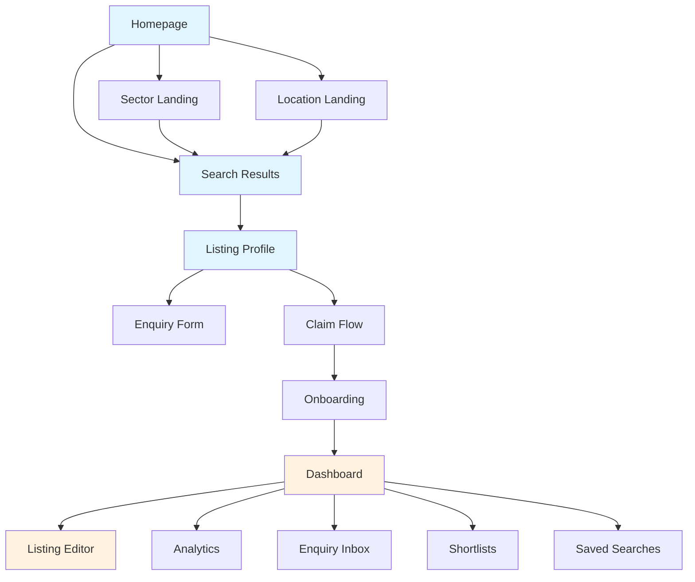
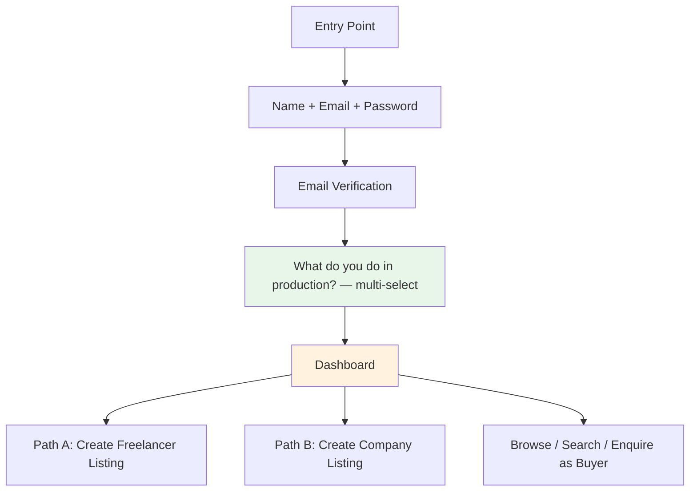
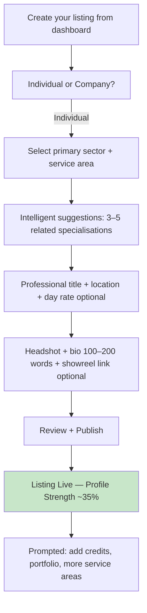
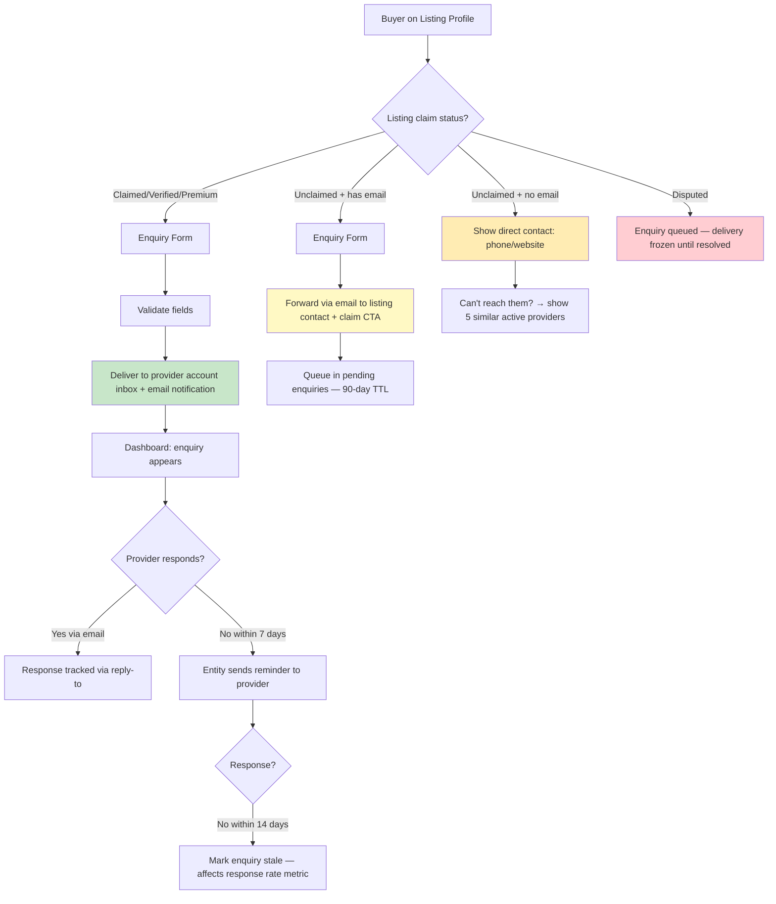
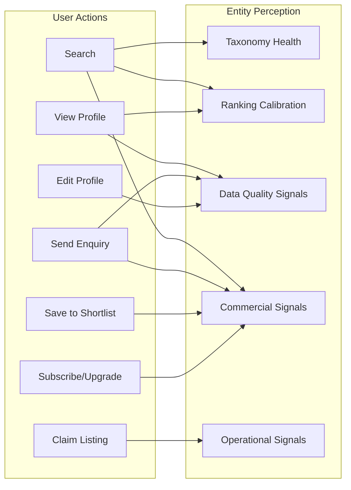

# Platform & Product — Concept Design

**Status:** Draft v5 — cross stress tested with all four domains (4 rounds: 35 intra-domain + 20 D&L×Ops cross + CR×D&L×Ops×PP cross scenarios, 56 total fixes)
**Domain:** Platform & Product
**Last updated:** 2026-02-11
**Inputs:** `platform-architecture-decisions-findings.md`, `onboarding-flow-findings.md`, `data-and-listings.md` (v4), `operations.md` (v4), `entity-architecture-frame.md`
**Downstream:** `cross-domain-dependencies.md`, requirements specification, implementation

---

## 1. Information Architecture

### 1.1 Page Inventory

CALLSHEET's page structure serves three audiences simultaneously: anonymous browsers (buyers), authenticated account holders (buyer + provider facets), and the entity itself (via perception signals generated by every interaction).

```
Public Pages (no auth required)
├── Homepage
│   ├── Search bar (primary CTA)
│   ├── Sector grid (7 sectors → browse entry)
│   ├── Featured listings (paid boost, labelled)
│   └── Recently claimed/added listings [PP-35]
├── Search Results
│   ├── Filtered by: sector, service area, specialisation, location, availability
│   ├── Sort: relevance (default), quality score, recently updated
│   └── Sponsored section (above organic, labelled)
├── Listing Profile (public view)
│   ├── Identity: name, headline, logo/headshot, verification badge
│   ├── Capabilities: taxonomy tags, equipment, software
│   ├── Credits: project history
│   ├── Location & availability
│   ├── Enquiry form (or claim CTA if unclaimed)
│   └── "Is this your business? Claim this listing" (unclaimed only)
├── Browse by Sector (7 sector landing pages)
│   ├── Service area list with listing counts
│   └── Top-ranked listings per service area
├── Browse by Location (region landing pages)
├── About / How It Works
├── Pricing (subscription tiers — co-owned with Commercial & Revenue)
├── Privacy Policy
├── Terms of Service
└── Cookie Policy

Authenticated Pages (account required)
├── Dashboard (unified — provider + buyer)
│   ├── Provider section (if listing(s) exist)
│   │   ├── Listing switcher (multi-listing, [ST-34])
│   │   ├── Active listing summary (views, appearances, enquiries)
│   │   ├── Quality score breakdown + improvements
│   │   ├── Enquiry inbox
│   │   └── "Create another listing" CTA
│   ├── Buyer section (always visible)
│   │   ├── Recent searches
│   │   ├── Shortlists
│   │   └── Enquiries sent + response status
│   └── Account section
│       ├── Profile settings
│       ├── Subscription management (→ Paddle portal)
│       └── Notification preferences
├── Listing Editor
│   ├── Identity fields
│   ├── Capabilities (taxonomy multi-select with suggestions)
│   ├── Credits manager
│   ├── Media upload
│   ├── Availability settings
│   └── Profile strength meter + completion prompts
├── Analytics (provider, gated by tier)
│   ├── Free: profile views (count), search appearances (count), enquiries (count)
│   ├── Standard: + trend data (30-day), top search terms (aggregated)
│   ├── Premium: + viewer breakdown, competitor comparison, 90-day trends
│   └── All tiers: quality score explanation with improvement actions
├── Enquiry Detail View
├── Shortlist Management
├── Saved Searches
└── Account Settings

Admin Pages (admin role required)
├── Admin Dashboard ([OPS-ST-8])
│   ├── Verification queue (pending claims)
│   ├── Listing search + status/audit trail
│   ├── Quality score breakdown per listing
│   ├── Decay log
│   ├── Archival reversal tool
│   ├── Support ticket reference (link to Freshdesk)
│   └── DSAR tracker summary
├── Taxonomy Manager (read-only at V1; entity proposes, admin confirms)
└── System Health (entity perception dashboard)
```

### 1.2 Navigation Model



**Blue** = public. **Orange** = authenticated. Every public page includes persistent search bar in header. Authentication state determines whether "Dashboard" or "Sign In / Create Account" appears in navigation.

### 1.3 URL Structure

```
/                               → Homepage
/search?q=...&sector=...        → Search results
/sectors/:slug                  → Sector landing (e.g. /sectors/camera)
/sectors/:slug/:service-area    → Service area listing (e.g. /sectors/camera/aerial-filming)
/locations/:region              → Location landing
/providers/:slug                → Listing profile (SEO-friendly slug from name + location + hash suffix on collision) [PP-4]
/dashboard                      → Unified dashboard
/dashboard/listings/:id/edit    → Listing editor
/dashboard/analytics/:id        → Analytics for specific listing
/dashboard/enquiries            → Enquiry inbox (all listings, filterable by listing) [PP-13]
/dashboard/shortlists           → Buyer shortlists
/dashboard/account              → Account settings
/pricing                        → Subscription tiers
/claim/:listing-id              → Claim flow entry
/admin                          → Admin dashboard
/admin/verification             → Verification queue
/admin/listings/:id             → Admin listing detail
```

### 1.4 SEO & Rendering Strategy [PP-21]

CALLSHEET is a directory — search engine traffic is the primary buyer acquisition channel. SEO is not a feature; it is a structural requirement.

**Rendering strategy:**

| Page Type | Strategy | Rationale |
|---|---|---|
| Homepage | SSG with ISR (revalidate 1 hour) | Featured/recent listings update periodically |
| Sector/location landing | SSG with ISR (revalidate 1 hour) | Listing counts change slowly |
| Search results | SSR | Dynamic queries, filter combinations, personalisation |
| Listing profile | SSG with ISR (revalidate 15 min) | SEO-critical; profile data changes infrequently |
| Dashboard / editor / admin | CSR (client-side) | Authenticated, no SEO value, interactive |
| Pricing | SSG | Static content |
| Legal pages | SSG | Static content |

**Meta tags (per listing profile):**
```html
<title>{listing.name} — {listing.headline} | CALLSHEET</title>
<meta name="description" content="{listing.bio, truncated 160 chars}" />
<meta property="og:title" content="{listing.name}" />
<meta property="og:description" content="{listing.headline}" />
<meta property="og:image" content="{listing.logo ?? listing.headshot ?? default}" />
<link rel="canonical" href="https://callsheet.co.uk/providers/{listing.slug}" />
```

**Structured data (JSON-LD on listing profiles):**
```json
{
  "@context": "https://schema.org",
  "@type": "LocalBusiness",
  "name": "{listing.name}",
  "description": "{listing.headline}",
  "address": { "@type": "PostalAddress", "addressRegion": "{listing.baseLocation}" },
  "url": "{listing.websiteUrl}",
  "image": "{listing.logo ?? listing.headshot}",
  "aggregateRating": null
}
```

`@type` varies: `LocalBusiness` for companies, `Person` for freelancers (with `jobTitle`). No `aggregateRating` at V1 (no reviews). Structured data generates rich snippets in Google search — essential for directory SEO.

**Homepage "Recently added" logic [PP-35]:** At launch, all 4,700 listings share the same creation date (4rfv import). "Recently added" would be meaningless. Instead, show "Recently claimed" — listings where `claim_approved` event was most recent. This: (a) surfaces active providers who've invested effort, (b) creates a visible feed that updates as claims arrive, (c) incentivises claiming ("See your business on the homepage"). Transition: once organic listing creation volume exceeds claim volume (~6 months post-launch), switch to "Recently added or claimed."

**Sitemap:** Auto-generated XML sitemap at `/sitemap.xml` including all active listing profile URLs, sector landing pages, and location landing pages. Regenerated on ISR cycle. Submitted to Google Search Console.

### 1.5 Pricing Page [PP-22]

The pricing page (`/pricing`) is the primary conversion surface. Co-owned: Platform owns page structure and UX; Commercial & Revenue owns tier definitions, pricing, and feature differentiation.

**Page structure:**
- Tier comparison table (3 tiers: Standard £199, Premium £399, Partner £699 — annual)
- Feature matrix (rows from `computeFeatureAccess()`, checkmarks per tier)
- "Currently on [tier]" indicator for authenticated providers
- CTA per tier → Paddle checkout (or Paddle portal for existing subscribers)
- **Checkout CTA guard [CR-X-1]:** CTA disabled on unclaimed and `pending_review` listings. Provider sees "Complete your listing claim to unlock subscription options." Prevents Paddle checkout before claim resolution — Commercial's webhook handler requires `listing.accountId != null`.
- FAQ section: "Can I change tier?", "Is it per listing?", "What happens if I cancel?"

**Optimistic subscription update [CR-X-13]:** After Paddle checkout overlay closes with `status: "completed"` (Paddle JS SDK `checkout.closed` event), Platform immediately shows "Processing your subscription..." in the pricing page and dashboard, before the webhook confirms. Subscription state may lag webhook processing by seconds — acceptable. The optimistic state reverts after 30 seconds if no `subscription_tier_changed` event arrives (edge case: webhook failure).

**Entity perception:** Page visits without conversion (high view, low click-through on checkout CTA) signal pricing friction. Entity surfaces this in Onboarding Funnel Analysis ceremony.

---

## 2. Search

### 2.1 Search Architecture

Search is the entity's primary value delivery mechanism. At V1, search is powered by PostgreSQL full-text search with `tsvector` weighted columns and `pg_trgm` GIN indexes. The implementation is abstracted behind a service layer to enable migration to Meilisearch at 10–20K listings.

```typescript
// Service layer interface — implementation-agnostic
type SearchQuery = {
  freeText?: string
  filters: {
    sectors?: string[]
    serviceAreas?: string[]
    specialisations?: string[]
    location?: GeoFilter
    availability?: AvailabilityStatus
    verificationTier?: VerificationTier[]
    budgetTier?: BudgetTier[]
    equipmentOwned?: string[]
    transactionTypes?: TransactionType[]
  }
  sort: "relevance" | "quality_score" | "recently_updated"
  pagination: { page: number; pageSize: number }  // default 20, max 50
}

type GeoFilter =
  | { type: "region"; region: string }
  | { type: "radius"; lat: number; lng: number; radiusKm: number }

type SearchResult = {
  listings: RankedListing[]
  totalCount: number
  facetCounts: FacetCounts
  sponsoredListings: RankedListing[]  // separate from organic
  suggestedFilters?: string[]          // "Did you mean..." or related service areas
  zeroResultSuggestions?: string[]     // alternative queries if no results
}

type RankedListing = {
  listing: ListingSummary         // subset of full Listing for result cards
  relevanceScore: number          // 0–1, from search engine
  qualityScore: number            // 0–100, from D&L
  paidBoost: number               // 0/15/25
  finalRank: number               // computed position
}

type FacetCounts = {
  sectors: { slug: string; label: string; count: number }[]
  serviceAreas: { slug: string; label: string; count: number }[]
  locations: { slug: string; label: string; count: number }[]
  verificationTiers: { tier: VerificationTier; count: number }[]
}

type ListingSummary = {
  id: UUID
  slug: string
  name: string
  headline: string
  logo?: URL
  headshot?: URL
  baseLocation: string            // display string
  verificationTier: VerificationTier
  // [PP-33] subscriptionTier removed from client payload — used server-side only for
  // sponsored section and paid boost calculation. Never exposed to browser.
  isSponsored: boolean              // derived from subscriptionTier server-side
  qualityScore: number
  taxonomyTags: string[]          // top 3–5 for display
  availabilityStatus: AvailabilityStatus
  claimStatus: ClaimStatus        // determines enquiry vs claim CTA
  lifecycleStatus: LifecycleStatus  // [PP-1] for search exclusion + display
  isNew: boolean                  // created within 30 days
}
```

### 2.2 Search Service Layer

```typescript
function searchProviders(query: SearchQuery): SearchResult

// V1 implementation: PostgreSQL
function searchProvidersPostgres(query: SearchQuery): SearchResult
  // 0. [PP-1] Base filter: WHERE lifecycle_status = 'active' — excludes archived, suspended, dissolved, merged
  // 1. Build tsvector query from freeText with synonym expansion
  // 2. Apply user filters as additional WHERE clauses
  // 3. Compute ts_rank with weights: name(A), taxonomy(B), description(C)
  // 4. Join quality_score and subscription_tier for ranking
  // 5. Apply rankSearchResults() for final ordering
  // 6. Compute facet counts via COUNT(*) GROUP BY (active listings only)
  // 7. Fetch sponsored listings separately (subscription_tier in ['premium', 'partner'], lifecycle_status = 'active')

// Future: Meilisearch implementation swaps in here
function searchProvidersMeilisearch(query: SearchQuery): SearchResult
  // Same interface, different backend
```

**Synonym expansion:** D&L provides `synonym_lookup` table. Query "cameraman" expands to `"cameraman" | "camera operator" | "DoP"`. Expansion applied at query time, not index time, so synonyms can be updated without reindexing.

**Zero-result handling:** When search returns zero results, the entity:
1. Logs the query in zero-result tracker (feeds Taxonomy Review ceremony)
2. Suggests broadened filters: "No results for 'underwater camera operator in Aberdeen'. Try: 'camera operator in Scotland' (14 results)"
3. Shows top 5 listings in the nearest matching service area + location

**Entity perception:** Every search generates a `SearchEvent` logged for entity analysis:

```typescript
type SearchEvent = {
  query: SearchQuery
  resultCount: number
  clickedListings: UUID[]         // which results the user viewed
  enquirySent: boolean            // whether search led to enquiry
  timestamp: ISO8601
  accountId?: UUID                // null for anonymous
}
```

This feeds: taxonomy review (zero-result analysis), ranking calibration (click-through rates by position), and commercial signals (high-demand categories with low supply).

### 2.3 Ranking Algorithm

Ranking is an entity decision that balances provider quality, buyer relevance, and commercial sustainability. Quality is earned; payment buys visibility, not credibility.

**Relationship to D&L quality score:** D&L's `qualityScore.composite` (0–100) already incorporates completeness, freshness, accuracy, richness, and verification as weighted dimensions. The ranking formula below operates on the *composite* score as a single input — it does not re-weight D&L's internal dimensions. The investigation document's quality score weight breakdown (completeness 25%, freshness 25%, etc.) describes D&L's internal scoring, not the ranking formula. [PP-2]

```typescript
function rankSearchResults(query: SearchQuery, results: Listing[]): RankedListing[]

  ranked = results.map(listing => {
    relevance = computeRelevance(query, listing)           // 0–1, from search engine
    quality = listing.qualityScore.composite               // 0–100, from D&L
    paidBoost = computePaidBoost(listing.subscriptionTier) // 0/15/25
    freshness = computeFreshnessBias(listing)              // 0–5, recency bonus
    coldStartBoost = computeColdStart(listing)             // 0–5, new listing bonus

    // Composite: relevance as gatekeeper, quality as primary sort, paid as additive
    finalScore = (relevance * 30)           // 0–30: relevance to query
                + (quality * 0.45)          // 0–45: quality score
                + paidBoost                 // 0/15/25: paid visibility
                + freshness                 // 0–5: recency
                + coldStartBoost            // 0–5: new listings (30-day window)
                + jitter()                  // ±3: fair rotation within similar bands

    return { listing: summarise(listing), relevanceScore: relevance,
             qualityScore: quality, paidBoost, finalRank: finalScore }
  })

  return ranked.sortBy(r => r.finalRank, "desc")

function computePaidBoost(tier: SubscriptionTier): number
  match tier:
    "free"     → 0
    "standard" → 15
    "premium"  → 25
    "partner"  → 25    // same as premium — partner benefits are elsewhere

function computeColdStart(listing: Listing): number
  daysSinceCreation = daysSince(listing.lifecycle.createdAt)
  if daysSinceCreation <= 30: return 5
  if daysSinceCreation <= 60: return 2
  return 0

function computeFreshnessBias(listing: Listing): number
  daysSinceUpdate = daysSince(listing.lifecycle.lastUpdated)
  if daysSinceUpdate <= 7: return 5
  if daysSinceUpdate <= 30: return 3
  if daysSinceUpdate <= 90: return 1
  return 0
```

**Critical constraint:** A premium subscriber (boost +25) with quality score 30 ranks at `(relevance * 30) + 13.5 + 25 = ~68.5 max`. A free listing with quality score 85 ranks at `(relevance * 30) + 38.25 + 0 = ~68.25 min`. At high relevance, quality dominates. Payment cannot overcome poor quality.

**Sponsored section:** Premium and Partner tier listings matching the query appear in a clearly labelled "Sponsored" section above organic results. Maximum 3 sponsored listings per page. If fewer than 3 qualify, show fewer. Sponsored listings also appear in their natural organic position — dual placement, not replacement.

### 2.4 Search Results Page

```
┌─────────────────────────────────────────────┐
│  [Search bar: pre-filled with current query] │
├─────────────────────────────────────────────┤
│  Filters: Sector │ Service Area │ Location  │
│           Availability │ Verification       │
│  Active filters shown as removable chips    │
├─────────────────────────────────────────────┤
│  {totalCount} providers found               │
│  Sort: Relevance ▼ │ Quality │ Recently     │
├─────────────────────────────────────────────┤
│  ┌─ Sponsored ─────────────────────────┐    │
│  │ [Listing Card] [Listing Card]       │    │
│  │ Labelled "Sponsored"                │    │
│  └─────────────────────────────────────┘    │
│                                             │
│  [Listing Card] ← organic result 1         │
│  [Listing Card] ← organic result 2         │
│  [Listing Card] ...                         │
│                                             │
│  [Pagination: 1 2 3 ... 12]                │
└─────────────────────────────────────────────┘
```

**Listing card contents:**

```
┌──────────────────────────────────────┐
│  [Logo/Headshot]  Company Name       │
│                   ✓ Verified         │
│                   Headline text      │
│                   ─────────────      │
│                   📍 London          │
│                   🏷️ Tag, Tag, Tag   │
│                   ● Available        │
│                   ─────────────      │
│                   [View Profile]     │
│                   [Save] [Enquire]   │
└──────────────────────────────────────┘
```

- Verification badge: ✓ Claimed (grey), ✓✓ Verified (blue), ✓✓✓ Premium Verified (gold). Unclaimed listings show no badge.
- "New" badge for listings created within 30 days.
- "Save" requires authentication (prompt login if anonymous). "Enquire" available to all.
- Unclaimed listings show "Contact" instead of "Enquire" (routes to direct contact info or email forward — see §5).
- [PP-15] If the authenticated user owns a listing in the results, show "Your listing" badge on the card. Do not filter out — provider should see their competitive position.

### 2.5 Entity Perception from Search

Search data serves dual purpose: buyer-facing functionality AND entity perception signals.

| Signal | Source | Entity Decision It Feeds |
|---|---|---|
| Zero-result queries | `SearchEvent.resultCount == 0` | Taxonomy Review: missing categories or synonyms |
| High-search / low-supply categories | Query frequency vs listing count by service area | Provider Outreach Cycle: prioritise unclaimed listings in underserved categories |
| Click-through rate by rank position | `SearchEvent.clickedListings` vs result order | Ranking calibration: is quality score weighting correct? |
| Search-to-enquiry conversion | `SearchEvent.enquirySent` | Commercial signal: which categories convert? |
| Filter usage frequency | Which filters applied most often | UI optimisation: promote high-usage filters |
| Geographic demand distribution | Location filter frequency by region | Market intelligence: geographic expansion signals |

---

## 3. Listing Profile Page

### 3.1 Public Profile Structure

The listing profile is CALLSHEET's core content page. Structure varies by `claimStatus` and `entityType`.

```typescript
type ProfilePage = {
  // Always visible
  identity: {
    name: string
    headline: string
    logo?: URL                    // company
    headshot?: URL                // freelancer
    verificationBadge: VerificationBadge
    claimStatus: ClaimStatus      // determines CTA
    entityType: EntityType
    foundedYear?: number
    formerlyKnownAs?: string[]
  }

  // Core content
  bio: string
  taxonomyTags: TaxonomyTag[]    // grouped by sector → service area → specialisation
  location: {
    base: string
    serviceRegions: string[]
    travelWillingness: TravelWillingness
  }
  availability: {
    status: AvailabilityStatus
    availableFrom?: string
    leadTime: LeadTime
  }

  // Credentials
  credits: CreditDisplay[]       // sorted by year desc, grouped by format
  accreditations: string[]
  equipmentOwned: string[]
  softwareTools: string[]

  // Media
  media: MediaItem[]             // portfolio images, showreel links
  websiteUrl?: URL
  socialProfiles: SocialProfile[]

  // Contact / Action
  primaryCTA: ProfileCTA         // determined by claimStatus

  // Engagement signals (selective display)
  engagementDisplay?: {
    enquiryResponseRate?: string  // "Typically responds within 24 hours" (claimed only)
    profileViews?: string         // "Viewed 47 times this month" (optional, provider-controlled)
  }
}

type VerificationBadge =
  | { tier: "unclaimed"; display: null }
  | { tier: "claimed"; display: "Claimed"; colour: "grey" }
  | { tier: "verified"; display: "Verified"; colour: "blue" }
  | { tier: "premium_verified"; display: "Premium Verified"; colour: "gold" }

type ProfileCTA =
  | { type: "enquire"; label: "Send Enquiry"; target: "enquiry_form" }
  | { type: "contact"; label: "Contact Provider"; target: "contact_details" }
  | { type: "claim"; label: "Is this your business? Claim this listing"; target: "claim_flow" }
  | { type: "claim_targeted"; label: "This looks like your business — claim it in 2 minutes"; target: "claim_flow" }
  // [PP-18] Shown when authenticated user's email domain matches unclaimed listing's website domain
```

### 3.2 Profile Display Rules by Claim Status

| Field | Unclaimed | Claimed | Verified | Premium Verified |
|---|---|---|---|---|
| Name, headline | ✓ (seeded) | ✓ (provider-edited) | ✓ | ✓ |
| Logo/headshot | If seeded | ✓ | ✓ | ✓ |
| Bio | If seeded (often sparse) | ✓ | ✓ | ✓ |
| Taxonomy tags | If seeded | ✓ | ✓ | ✓ |
| Credits | If seeded | ✓ | ✓ (client-confirmed highlighted) | ✓ |
| Verification badge | None | ✓ Claimed | ✓✓ Verified | ✓✓✓ Premium Verified |
| Primary CTA | "Claim this listing" | "Send Enquiry" | "Send Enquiry" | "Send Enquiry" |
| Contact details | Shown directly (phone/website) | Shown (phone/website/email) | Shown | Shown |
| Enquiry response rate | N/A | Shown if data exists | ✓ | ✓ |
| Media/portfolio | N/A (seeded data rarely has) | ✓ | ✓ | ✓ |

### 3.3 Profile as Entity Perception

Every profile view generates a `ProfileViewEvent`:

```typescript
type ProfileViewEvent = {
  listingId: UUID
  viewerAccountId?: UUID          // null if anonymous
  referrer: "search" | "browse" | "direct" | "external"
  searchQueryId?: UUID            // links back to SearchEvent if from search
  timestamp: ISO8601
  dwellTime?: number              // seconds (tracked client-side, best-effort)
}
```

Entity uses profile view data for:
- **Quality score freshness signal** — listings with declining views may have stale content
- **Ranking calibration** — profile view-to-enquiry conversion rates by quality score band
- **Commercial signals** — high-view low-enquiry listings may need better CTAs or content guidance

---

## 4. Onboarding

Three paths, all converging on the same Account + Listing data model. Account creation is shared; listing activation diverges by path.

### 4.1 Account Creation (Shared Foundation)



**Step 1 — Identity:** Full name, email, password. SSO options: Google, LinkedIn. 3 fields (or 1 click for SSO).

**Step 2 — Email verification:** Verification email sent immediately. Account functional for browsing before verification. Listing creation requires verified email.

**Step 3 — Personalisation:** "What do you do in production?" — multi-select grid of departments (Camera, Sound, Post-Production, Art Department, Production Management, etc.). Not a role declaration — personalises dashboard recommendations and search defaults. Skippable.

**Post-creation state:** Account exists with buyer facet active. No listing. Dashboard shows buyer tools (search, shortlists) and prominent "Create your listing" CTA.

### 4.2 Path A — Freelancer Listing Activation (Target: 3–5 minutes)



| Step | Fields | New Data (beyond Account) | Suggestions |
|---|---|---|---|
| 1 — Your role | Primary sector, service area | 2 selections | 3–5 related specialisations based on selection |
| 2 — Your details | Professional title, location, day rate (optional) | 2–3 fields (name pre-filled from Account) | — |
| 3 — Your profile | Headshot, bio, showreel link (optional) | 1–3 fields | — |
| 4 — Go live | Review all fields, publish | 0 | Profile strength meter at ~35% with "Add credits to reach 60%" |

**Listing created:** `entityType = "freelancer"`, `claimStatus = "claimed"`, `verificationTier = "claimed"`, `subscriptionTier = "free"`. Quality score computed immediately.

### 4.3 Path B — Company Listing Activation (Target: 8–15 minutes)

| Step | Fields | New Data | Suggestions |
|---|---|---|---|
| 1 — Your company | Company name, type (post house, hire co, studio, etc.), Companies House number (optional) | 2–3 fields | If CH number provided: auto-populate registered address, director names |
| 2 — Your services | Multi-select service areas within sectors, drill to specialisations | Variable (3–10 tags) | "Post-production houses typically offer: Offline Editing, Online Editing, Colour Grading, Sound Mixing, VFX" |
| 3 — Your details | Description (200–300 words), logo, address, website, social links | 3–6 fields | Pre-populate website domain from email |
| 4 — Go live | Review, publish, profile strength meter at ~40% | 0 | "Add team credits and equipment list to reach 70%" |

**Listing created:** `entityType = "company"`, `claimStatus = "claimed"`, `verificationTier = "claimed"`. If Companies House number provided and matches active entity, `verificationTier` may upgrade to `"verified"` per D&L `evaluateClaim()` logic (auto-approve path).

**Integrity checks at creation:** D&L's `checkDuplicate()` and `verifyNewListingIdentity()` and `checkCHUniqueness()` execute before the listing goes live. If flagged, listing enters review queue — provider notified "Your listing is being reviewed" with expected timeframe.

**Field validation rules [PP-11]:**

| Field | Constraint | Error Message |
|---|---|---|
| Name / Company name | 2–100 chars, no HTML | "Name must be between 2 and 100 characters" |
| Headline / Professional title | 5–200 chars | "Add a short headline (5–200 characters)" |
| Bio / Description | 0–2000 chars | "Description cannot exceed 2000 characters" |
| Website URL | Valid URL format (https preferred, http accepted) | "Enter a valid website address" |
| Contact email | Valid email format | "Enter a valid email address" |
| Images (logo, headshot, portfolio) | Max 5MB per file; jpg, png, webp only. Server generates 3 variants (see below). | "Images must be under 5MB in JPG, PNG, or WebP format" |
| Location | Required for search inclusion; postcode or city | "Add a location so buyers can find you" |
| Day rate | Numeric, positive, max 99999 | "Enter a valid day rate" |
| Taxonomy tags | Min 1 service area required | "Select at least one service area" |
| Credits: project name | 2–200 chars | — |
| Credits: year | 1950–current year | — |

**Concurrent edit handling [PP-34]:** Last-write-wins with optimistic concurrency. Listing editor loads with a version number. On save, server checks version matches current. If version has changed (edited elsewhere), show: "This listing was updated elsewhere — review changes before saving." Provider sees diff and chooses to overwrite or reload. Single-owner listings make true conflicts rare.

**Image processing pipeline [PP-23]:** On upload, server generates 3 variants and converts to WebP:

| Variant | Max Width | Use Case |
|---|---|---|
| Thumbnail | 150px | Search result cards, listing switcher |
| Card | 400px | Profile page inline, dashboard |
| Full | 1200px | Profile page hero, lightbox |

Original preserved in R2 for admin access. All variants served via Cloudflare R2 with `Cache-Control: public, max-age=31536000, immutable` (content-addressed filenames). At 4,700 listings with ~3 images each = ~70,000 variant files, well within R2 free tier.

### 4.4 Path C — Claiming a Pre-Existing Listing (Target: 2–3 minutes)

The primary supply-side growth engine. 4,700 pre-seeded listings from 4rfv data.

```mermaid
flowchart TD
    LP[Unclaimed Listing Profile] --> CTA["Is this your business? Claim this listing"]
    CTA --> AUTH{Authenticated?}
    AUTH -->|No| REG[Create Account — pre-fill company name]
    AUTH -->|Yes| EVAL[Entity evaluates claim]
    REG --> EVAL

    EVAL --> AUTO{Auto-approve?}
    AUTO -->|"Yes (email domain match)"| CLAIMED[Listing claimed — Review & Edit]
    AUTO -->|"No (low confidence)"| REVIEW[Queued for manual review — notified]
    AUTO -->|"Rejected (dissolved)"| REJECT[Claim rejected with reason]

    CLAIMED --> EDIT[Pre-populated fields in editable form]
    EDIT --> ENHANCE[Profile strength ~30–40% — "Add logo to reach 60%"]
    ENHANCE --> LIVE[Listing live as Claimed]

    EVAL --> INT{Integrity check?}
    INT -->|"Flagged (duplicate CH, name match)"| EXPLAIN["Explain flag + options: merge / proceed / cancel"]
    INT -->|Clear| AUTO

    REVIEW --> WAIT[Provider can browse/buy while waiting]
    WAIT --> OUTCOME{Review outcome}
    OUTCOME -->|Approved| CLAIMED
    OUTCOME -->|Rejected| REJECT

    style CLAIMED fill:#c8e6c9
    style LIVE fill:#c8e6c9
    style REJECT fill:#ffcdd2
```

**Key UX decisions:**

1. **Never require re-entering existing data.** All seeded fields pre-populated in editable form. Provider corrects, doesn't rebuild.
2. **Endowment effect.** "Your listing has been viewed 23 times this month" shown on claim CTA when `listing.engagement.profileViews >= 5`. Below 5 views, show category-level data instead: "Buyers search for [service area] X times per month on CALLSHEET." A count of 0–4 undermines the endowment effect — at launch, 4rfv listings start at 0 views and accumulate slowly. `[XP-17]`
3. **Immediate value on claim.** Access to enquiry inbox (with any queued enquiries delivered per D&L `deliverPendingEnquiries()`), analytics dashboard, and editing tools.
4. **Pre-claim snapshot.** Frozen by D&L `onClaimApproved()`. Provider edits post-claim do not affect snapshot. Snapshot deleted after 90-day dispute window.

### 4.5 Intelligent Suggestions

Rule-based system at V1. No collaborative filtering (cold-start problem at launch scale).

```typescript
type SuggestionRule = {
  trigger: { sector: string; serviceArea: string }
  suggestions: { specialisation: string; confidence: number }[]
  reasoning: string   // shown to user: "80% of DPs also list Drone Operation"
}

function getSuggestions(selected: TaxonomyTag[]): SuggestionRule[]
  // Lookup rules from curated suggestion map
  // Filter to top 3–5 by confidence
  // Exclude already-selected tags
  // Return with reasoning strings
```

**V1 suggestion map covers 3 high-volume sectors:**

| Selected | Suggested | Confidence |
|---|---|---|
| Camera → Director of Photography | Drone Operation, Steadicam, Lighting Camera | 0.8 |
| Camera → Camera Operator | Drone Operation, Jimmy Jib, Underwater Camera | 0.7 |
| Post-Production → Offline Editor | Online Editing, Colour Grading | 0.6 |
| Post-Production → Colourist | Online Editing, HDR Mastering | 0.7 |
| Sound → Sound Recordist | Boom Operator, Sound Mixer | 0.8 |

Remaining sectors use generic "Providers in [sector] commonly also list: [top 5 service areas by listing count]" — data-driven once listings exist.

**Guard against over-claiming:** Suggestions labelled "Providers like you commonly offer these" — not "You should add these." Provider makes the decision.

### 4.6 Profile Strength Meter

Visible on listing editor and dashboard. Maps to D&L `qualityScore.completeness` dimension (0–25) but displayed as a percentage with guidance.

```typescript
type ProfileStrength = {
  percentage: number              // 0–100 (mapped from completeness score)
  level: "Getting Started" | "Basic" | "Good" | "Strong" | "Excellent"
  nextActions: ProfileAction[]    // ordered by impact
  searchVisibilityNote: string    // "Profiles at 60%+ appear X% more in search"
}

type ProfileAction = {
  field: string                   // "bio", "credits", "headshot"
  label: string                   // "Add a profile photo"
  impactEstimate: string          // "+8% profile strength"
  timeEstimate: string            // "~2 minutes"
}

function computeProfileStrength(listing: Listing): ProfileStrength
  completeness = listing.qualityScore.completeness  // 0–25
  percentage = round(completeness / 25 * 100)

  level = match percentage:
    0–20   → "Getting Started"
    21–40  → "Basic"
    41–60  → "Good"
    61–80  → "Strong"
    81–100 → "Excellent"

  // [XP-4] PP owns identifyMissingFields() — maps D&L quality score factors to UI guidance.
  // Distinct from D&L's QualityScoreExplanation.topImprovements, which covers all 5 dimensions.
  // Profile Strength nextActions = completeness dimension only (what the provider can directly change).
  // Quality Score topImprovements = all dimensions (what affects overall ranking).
  nextActions = identifyMissingFields(listing)
    .sortBy(field => field.completenessWeight, "desc")
    .take(3)
    .map(field => {
      label: "Add " + field.displayName,
      impactEstimate: "+" + field.completenessWeight + "% profile strength",
      timeEstimate: field.estimatedTime
    })

  return { percentage, level, nextActions,
    searchVisibilityNote: percentage < 60
      ? "Profiles above 60% appear in 3x more search results"
      : "Your profile is performing well in search" }

// [XP-4] PP-owned function. Sources field definitions from D&L quality score explanation factors.
// Maps D&L's { factor: "missing_headline", impact: "negative" } to user-facing "Add a headline".
function identifyMissingFields(listing: Listing): MissingField[]
  explanation = listing.qualityScoreExplanation  // from D&L
  return explanation.dimensions
    .find(d => d.name == "completeness").factors
    .filter(f => f.impact == "negative")
    .map(f => ({
      fieldId: f.factor,                         // D&L factor ID
      displayName: FIELD_DISPLAY_MAP[f.factor],  // PP-owned mapping
      completenessWeight: FIELD_WEIGHT_MAP[f.factor],
      estimatedTime: FIELD_TIME_MAP[f.factor]
    }))
```

**Progressive disclosure schedule (post-onboarding):**

| Timing | Channel | Message | Target |
|---|---|---|---|
| Day 0 | In-app | "Your listing is live! Here's what to do next." | ~35% |
| Day 1 | Email | "Your listing is live — complete your profile for better visibility" | 45% |
| Day 3 | Email | "Add portfolio work — listings with media get 3x more views" | 55% |
| Day 7 | Email | "Add your credits — connect your work history" | 65% |
| Day 14 | In-app prompt | "You're 70% complete — 2 more steps to Strong profile" | 75% |
| Day 30 | Email | "Your listing has been viewed X times — here's how to get more" | 80%+ |

**Claim path variant (Path C) [PP-25]:** Claimants start with pre-populated data at ~30–40% strength. Their progressive disclosure sequence differs — messages reference existing data, not empty fields:

| Timing | Channel | Message (Claim Path) | Target |
|---|---|---|---|
| Day 0 | In-app | "You've claimed your listing — review your imported data." | ~40% |
| Day 1 | Email | "Your listing is live. The bio was imported — update it in your own words." | 50% |
| Day 3 | Email | "Add your logo and a portfolio image — make this listing yours." | 60% |
| Day 7 | Email | "Add credits and equipment — show what you've worked on." | 70% |
| Day 14 | In-app | "You're 75% complete — 1 more step to Strong profile." | 80% |

Entity perception: completion rate at each stage feeds L2 learning. If day-3 email converts at <5%, entity adjusts message or timing.

---

## 5. Enquiry System

### 5.1 Enquiry Flow

Enquiries are the platform's core transaction at V1. No in-platform messaging — enquiries generate email notifications and appear in the provider's dashboard inbox.



### 5.2 Enquiry Form

```typescript
type Enquiry = {
  id: UUID
  listingId: UUID
  senderAccountId?: UUID          // null if anonymous (unclaimed forward only)
  senderName: string
  senderEmail: string
  senderCompany?: string
  projectType?: CreditFormat      // "commercial", "tv_series", etc.
  message: string                 // max 2000 chars
  budget?: BudgetTier
  timeline?: string               // free text: "March 2026", "ASAP", etc.
  submittedAt: ISO8601
  status: EnquiryStatus
}

type EnquiryStatus = "delivered" | "read" | "responded" | "stale" | "queued" | "expired"
// [PP-31] Status transitions:
// delivered → read: when provider views enquiry detail in dashboard
// read → responded: via reply-to email parsing (preferred) or manual "Mark as responded" button
// delivered/read → stale: 14 days with no response (entity-automated)
// queued → delivered: on claim approval (pending_review/unclaimed listings)
// queued → expired: 90-day TTL (entity-automated)
```

**Form fields:**

| Field | Required | Rationale |
|---|---|---|
| Your name | Yes | Identity |
| Your email | Yes | Response channel |
| Company / Production | No | Context (helps provider prioritise) |
| Project type | No | Dropdown from `CreditFormat` — helps provider assess fit |
| Message | Yes (min 20 chars) | Prevents spam, ensures meaningful contact |
| Budget indication | No | Dropdown: £ / ££ / £££ / "Prefer not to say" |
| Timeline | No | Free text |

**Authentication:** Enquiry form available to anonymous users (no login wall for buyer-side). If authenticated, name/email pre-filled. Anonymous enquiries still require email — this is the contact channel.

**Spam prevention:** Rate limiting (max 10 enquiries per email per hour), honeypot field, and message minimum length. No CAPTCHA at V1 — implement if spam rate exceeds 5%.

**Anonymous enquiry data handling [PP-7]:** Enquiries submitted without an account (anonymous) collect personal data (name, email). Lawful basis: legitimate interest (facilitating a business enquiry the sender initiated). Data stored on the Listing's enquiry record. Retention: 12 months or until enquiry resolved (responded/expired), whichever is shorter. Enquiry form includes a link to the privacy policy. If sender later creates an account with the same email, historical anonymous enquiries are linked to their account.

### 5.3 Enquiry for Unclaimed Listings ([ST-22] Resolution)

Three-tier handling per D&L `handleEnquiryToListing()`:

1. **Unclaimed + has contact email:** Forward enquiry via email with claim CTA embedded. Queue in `listing.enquiryQueue` (90-day TTL). Buyer sees: "Your enquiry has been forwarded to this provider. They haven't claimed their CALLSHEET listing yet, so we've sent your message directly."

2. **Unclaimed + no email:** Show available contact methods (phone, website). Buyer sees: "This provider hasn't claimed their listing yet. Contact them directly:" with phone/website. Below: "Can't reach this provider? Here are similar providers in your area:" with 5 alternatives from same taxonomy + location. [PP-28] Additionally, show feedback buttons: "I reached them" / "I couldn't reach them." Generates lightweight `contact_attempt` perception event without full enquiry form. "Couldn't reach" signals feed entity's unclaimed listing data quality assessment and outreach prioritisation.

3. **Pending review** (`claimStatus = "pending_review"`): Listing is being claimed but not yet approved. Handle as unclaimed — forward via email if contact exists, show direct contact otherwise. Buyer sees same messaging as unclaimed. Enquiry queued for delivery on claim approval. [PP-3]

4. **Disputed:** Queue enquiry silently. Do not forward. Buyer sees standard "Enquiry sent" confirmation — no exposure of dispute status.

### 5.4 Enquiry as Entity Perception

| Signal | Entity Decision |
|---|---|
| Enquiry volume per listing | Quality score engagement signal (10% weight) |
| Response rate per listing | Quality score dimension; surfaced to buyers as "Typically responds within X" |
| Response time per listing | Quality score dimension |
| Enquiry-to-hire conversion | V2: commercial signal for matching quality |
| Unclaimed listing enquiry volume | Outreach prioritisation: high-enquiry unclaimed listings are high-value claim targets |

---

## 6. Provider Dashboard

### 6.1 Dashboard Architecture

Unified dashboard serves both provider and buyer facets. No mode switching — both sections always visible (provider section hidden if no listings exist).

```typescript
type DashboardState = {
  account: Account
  listings: ListingDashboard[]    // 0..N listings owned by this account
  activeListing: UUID             // currently selected listing (multi-listing switcher)
  buyerActivity: BuyerDashboard
}

type ListingDashboard = {
  listing: Listing
  analytics: ListingAnalytics     // gated by subscription tier
  enquiries: Enquiry[]            // recent, with status
  profileStrength: ProfileStrength
  qualityScoreExplanation: QualityScoreExplanation  // from D&L
  notifications: DashboardNotification[]  // [PP-24] see notification spec below
}

// [PP-24] Dashboard notification system
type DashboardNotification = {
  id: UUID
  accountId: UUID
  listingId?: UUID                // null for account-level notifications
  type: NotificationType
  message: string
  actions?: { label: string; target: string }[]
  createdAt: ISO8601
  readAt?: ISO8601
  dismissedAt?: ISO8601
}

type NotificationType =
  | "claim_approved" | "claim_rejected" | "claim_pending"
  | "enquiry_received" | "enquiry_stale"
  | "subscription_upgraded" | "subscription_downgraded"
  | "quality_score_changed" | "decay_warning"
  | "profile_milestone"           // "Your listing reached 50 views!"
  | "system"                      // maintenance, policy updates

// Notifications stored as database rows, queried on dashboard load.
// Unread count shown as badge on dashboard nav item.
// Dismiss = soft delete (hidden from UI, retained for entity perception).
// Max 50 notifications retained per account; oldest auto-archived.

type ListingAnalytics = {
  // Free tier
  profileViews: number            // all-time
  searchAppearances: number       // all-time
  enquiriesReceived: number       // all-time

  // Standard tier (+)
  profileViewsTrend: TrendData[]  // 30-day
  searchAppearancesTrend: TrendData[]
  topSearchTerms: { term: string; count: number }[]  // aggregated from D&L

  // Premium tier (+)
  viewerBreakdown: ViewerAnalytics  // anonymous summary, not individual IDs
  competitorComparison: CompetitorMetrics
  trendData90Day: TrendData[]
}

type BuyerDashboard = {
  recentSearches: SavedSearch[]   // last 5
  shortlists: Shortlist[]
  enquiriesSent: { enquiry: Enquiry; listing: ListingSummary; status: EnquiryStatus }[]
}
```

### 6.2 Multi-Listing Support ([ST-34] Resolution)

Accounts owning multiple listings see a listing switcher at the top of the provider section.

```
┌─────────────────────────────────────────────┐
│  Dashboard                                   │
├─────────────────────────────────────────────┤
│  YOUR LISTINGS                               │
│  ┌──────────────┐ ┌──────────────┐          │
│  │ 🏢 Company A  │ │ 👤 Freelancer │  [+ Add] │
│  │ ● Active      │ │ ● Active      │          │
│  │ Score: 72     │ │ Score: 58     │          │
│  │ 3 enquiries   │ │ 1 enquiry     │          │
│  └──────────────┘ └──────────────┘          │
│  ─────────────────────────────────────       │
│  COMPANY A — OVERVIEW                        │
│  ┌─────────┬─────────┬─────────┐            │
│  │ Views   │ Searches│ Enquiry │            │
│  │   147   │   892   │    12   │            │
│  └─────────┴─────────┴─────────┘            │
│                                              │
│  Profile Strength: ████████░░ 72% Strong     │
│  Next: Add 2 more credits → 78%             │
│                                              │
│  Quality Score: 65/100                       │
│  [See breakdown →]                           │
│                                              │
│  RECENT ENQUIRIES                            │
│  • Jane Smith — Commercial shoot — 2h ago   │
│  • BBC Studios — Doc series — Yesterday      │
│  [View all enquiries →]                      │
├─────────────────────────────────────────────┤
│  YOUR SEARCHES & SHORTLISTS                  │
│  Recent: "drone operator london" (14 results)│
│  Shortlists: "Paris shoot crew" (4 saved)   │
│  Enquiries sent: 2 pending, 1 responded     │
└─────────────────────────────────────────────┘
```

**Overview mode** (default when >1 listing): Shows all listings as cards with key metrics. Click a card to switch to that listing's detail view (analytics, enquiries, editor).

**Loading strategy [PP-9]:** Dashboard initial load fetches listing cards only (name, status, quality score, enquiry count — lightweight). Analytics, enquiry list, and quality score explanation load on listing selection. This keeps initial dashboard load within the <500ms p95 target regardless of listing count.

**Empty states [PP-14]:** Every dashboard section has a meaningful zero-state:

| Section | Empty State Message | Action |
|---|---|---|
| Analytics (zero views) | "Your listing was just published — check back tomorrow for your first views." | Share profile link |
| Enquiry inbox (empty) | "No enquiries yet. Complete your profile to improve visibility." | Link to listing editor |
| Shortlists (empty) | "Save providers you're interested in for quick access later." | Link to search |
| Enquiries sent (empty) | "You haven't contacted any providers yet." | Link to search |
| Search results (zero) | "No providers found. Try broadening your search." + suggested alternatives | Broaden filters |

**Archived listing display [PP-26]:** Archived listings appear on the dashboard as greyed-out cards with a "Reactivate" button. Provider clicks → confirmation ("Your listing will be restored to search. Quality score will be recalculated.") → listing restored to `lifecycleStatus = "active"`, quality score recalculated (freshness decayed), search index updated, `listing_reactivated` event emitted. No re-verification needed — verification tier preserved.

**Aggregate view** (future consideration): Cross-listing analytics (total views, total enquiries) deferred to V2. V1 shows per-listing only.

### 6.3 Quality Score Transparency ([X-13] Resolution)

Quality score explanation displayed on dashboard per D&L `QualityScoreExplanation` type.

```
┌─────────────────────────────────────────────┐
│  Quality Score: 65/100                       │
│  ─────────────────────────────────────       │
│  Completeness    ████████░░░  18/25          │
│  Freshness       █████████░░  20/25          │
│  Accuracy        ██████░░░░░  12/20          │
│  Richness        ██████░░░░░   9/15          │
│  Verification    ████░░░░░░░   6/15          │
│  ─────────────────────────────────────       │
│  TOP 3 IMPROVEMENTS                          │
│  1. Add a professional bio → +3 completeness │
│  2. Upload portfolio images → +4 richness    │
│  3. Get verified → +5 verification           │
│  ─────────────────────────────────────       │
│  [How is this calculated? →]                 │
└─────────────────────────────────────────────┘
```

"How is this calculated?" links to a published methodology page explaining all dimensions, weights, and factors. Per Principle P3 from D&L: quality score is transparent, never opaque.

**Distinction from Profile Strength [PP-17]:** Both metrics appear on the dashboard. To prevent confusion, display a one-line explanation near each: Profile Strength = "How complete is your profile" (maps to completeness dimension only). Quality Score = "How your listing performs overall" (includes completeness + freshness + accuracy + richness + verification). Profile Strength is the provider's actionable lever; Quality Score is the entity's composite assessment.

### 6.4 Subscription Management

Subscription actions route to Paddle's customer portal. CALLSHEET does not build custom billing UI.

**Paddle mapping [PP-16]:** Account = Paddle Customer (one-to-one). Listing = Paddle Subscription (one-to-one). A multi-listing account has multiple Paddle subscriptions under one customer, each at potentially different tiers. Paddle supports this natively. Dashboard subscription management routes to the specific listing's subscription via `paddlePortalUrl(listing)`.

```typescript
function getSubscriptionActions(listing: Listing): SubscriptionAction[]
  if listing.subscriptionTier == "free":
    return [{ action: "upgrade", label: "Upgrade your listing", target: "/pricing" }]

  return [
    { action: "manage", label: "Manage subscription", target: paddlePortalUrl(listing) },
    { action: "view_invoices", label: "View invoices", target: paddleInvoicesUrl(listing) }
  ]
```

**Subscription state changes** flow through domain events:
- `subscription_tier_changed` (from Operations billing reconciliation or Paddle webhook) → Platform recalculates feature access per listing
- `subscription_ended` (from Operations) → Platform downgrades feature access, shows re-subscribe CTA

```typescript
function handleSubscriptionChange(event: SubscriptionTierChanged): void
  listing = findListing(event.listingId)

  // Update feature gates
  listing.featureAccess = computeFeatureAccess(event.newTier)

  // If downgrade: show what they're losing
  if tierRank(event.newTier) < tierRank(event.previousTier):
    createNotification(listing.accountId, {
      type: "subscription_downgraded",
      message: "Your listing has been moved to the " + event.newTier + " plan.",
      actions: [{ label: "Re-subscribe", target: "/pricing" }]
    })

  // If upgrade: show what they've gained
  if tierRank(event.newTier) > tierRank(event.previousTier):
    createNotification(listing.accountId, {
      type: "subscription_upgraded",
      message: "Welcome to " + event.newTier + "! Here's what's new.",
      actions: [{ label: "Explore new features", target: "/dashboard" }]
    })
```

### 6.5 Feature Access by Tier

**Ownership [CR-X-8]:** Commercial is the canonical owner of `TIER_LIMITS`, `computeFeatureAccess`, and the `FeatureAccess` type definition (commercial-and-revenue.md §4.2). Platform imports these — it does not redefine them. Platform's role is mapping Commercial's feature access output to UI concerns:

```typescript
// Imported from Commercial domain — see commercial-and-revenue.md §4.2 for canonical definition
import { computeFeatureAccess, FeatureAccess, TIER_LIMITS } from "commercial"

// [PP-5] Contact details visible on ALL claimed listings regardless of tier.
// Claiming must never reduce reachability vs unclaimed state.
// Paid tiers add enquiry form (structured contact) + analytics — not gate basic contact.

// Platform-specific: maps Commercial's feature access to UI rendering concerns
function mapFeatureAccessToUI(access: FeatureAccess): DashboardFeatureConfig
  return {
    analyticsPanel: {
      showTrends: access.trendData,
      showSearchTerms: access.topSearchTerms,
      showViewerBreakdown: access.viewerBreakdown,
      showCompetitorBenchmark: access.competitorComparison,
      showExtendedTrends: access.extendedTrends
    },
    profileEditor: {
      mediaSlots: access.maxMedia,
      creditSlots: access.maxCredits,
      customTagsEnabled: access.customTags
    },
    upgradePrompts: deriveUpgradePrompts(access)
  }
```

---

## 7. Buyer Experience

### 7.1 Buyer-Side Features

Buyers (every authenticated account) access:

| Feature | Auth Required | Description |
|---|---|---|
| Search & browse | No | Full directory access, anonymous |
| Filter & sort | No | All search filters available |
| View listing profiles | No | Full public profile visible |
| Send enquiry | No (email required in form) | Enquiry form on listing profile |
| Save to shortlist | Yes | Persist shortlists across sessions |
| Save search | Yes | Re-run saved searches with one click |
| View enquiry history | Yes | Track sent enquiries and response status |
| Get recommendations | Yes (V2) | "Based on your searches, you might need..." |

**No login wall for core buyer actions.** Anonymous browsing and enquiry sending are essential for buyer-side conversion. Authentication adds value (persistent shortlists, enquiry tracking) but never gates access to directory content.

### 7.2 Shortlists

```typescript
type Shortlist = {
  id: UUID
  accountId: UUID
  name: string                    // "Paris Shoot Crew", "Sound Department Options"
  listings: UUID[]
  createdAt: ISO8601
  lastUpdatedAt: ISO8601
}
```

**Maximum 10 shortlists per account, 50 listings per shortlist.** Sufficient for V1 buyer workflows.

**Shortlist as entity perception:** High-shortlist listings with low enquiry rates signal a conversion gap — listing is attractive enough to save but not compelling enough to contact. Entity surfaces this to provider via analytics (Standard+ tier).

### 7.3 Cross-Role Nudges

The entity monitors buyer behaviour and suggests provider activation when appropriate.

```typescript
function evaluateCrossRoleNudge(account: Account): CrossRoleNudge | null
  // Only for accounts WITHOUT listings
  if account.listings.length > 0: return null

  // Nudge 1: Repeated searches in same category
  topCategory = account.buyerFacet.searchHistory
    .filter(s => s.timestamp > now() - 30 days)
    .groupBy(s => s.query.filters.serviceAreas)
    .sortBy(group => group.length, "desc")
    .first()

  if topCategory AND topCategory.length >= 5:
    return {
      type: "search_pattern",
      message: "You've searched for " + topCategory.key + " " + topCategory.length + " times. Do you also work in this area?",
      cta: "Create your listing",
      dismissible: true
    }

  // Nudge 2: Industry professional who only browses
  if account.createdAt < now() - 14 days
     AND account.buyerFacet.searchHistory.length > 20
     AND account.listings.length == 0:
    return {
      type: "engagement_threshold",
      message: "Join " + listingCount + "+ providers on CALLSHEET",
      cta: "Create your listing in 3 minutes",
      dismissible: true
    }

  return null
```

**Frequency cap:** Maximum 1 nudge per 14 days. Dismiss persists for 90 days.

---

## 8. Admin Dashboard ([OPS-ST-8] Resolution)

### 8.1 Minimum Specification

The admin dashboard serves the entity (primary operator) and human support agents (procured resources). It is functional, not polished. Accessed via `/admin` with `adminProcedure` auth middleware.

```typescript
type AdminDashboard = {
  // Verification [XP-6]
  verificationQueue: {
    pendingClaims: AdminClaimView[]      // hydrated with listing context, sorted by oldest first
    pendingReviews: ManualReviewTask[]
    disputes: DisputeTask[]
    autoApprovalRate: number             // rolling 90-day
  }

  // Listing Management
  listingSearch: {
    query: string                        // search by name, email, CH number, ID
    results: AdminListingView[]
  }

  // System Health (entity perception)
  systemHealth: {
    activeListings: number
    claimedPercentage: number
    avgQualityScore: number
    supportTicketsOpen: number
    billingReconciliationStatus: BillingReconciliationStatus  // [XP-18] queryable from Operations
  }

  // Compliance (read-only query to Operations) [XP-12]
  dsarTracker: {
    openDSARs: { id: UUID, receivedAt: ISO8601, daysRemaining: number, status: string }[]
    recentErasures: { accountHash: string, completedAt: ISO8601 }[]
    complianceCalendarStatus: "on_track" | "at_risk" | "overdue"
    upcomingDeadlines: { obligation: string, deadline: ISO8601 }[]
  }
}

// [XP-18] Queryable state from Operations — not parsed from logs
type BillingReconciliationStatus = {
  lastRunAt: ISO8601
  status: "healthy" | "hold_active" | "anomaly" | "skipped"
  holdsActive: number
  lastAnomalyAt?: ISO8601
}

// [XP-6] Hydrated claim view for admin verification queue
type AdminClaimView = {
  claim: ClaimRequest
  listingSummary: ListingSummary        // name, location, CH number — not raw UUIDs
  taskSpec: TaskSpec                     // from D&L manualReviewTaskSpec()
  autoApproveConfidence: number         // confidence score from evaluateClaim()
  evidenceSummary: {                    // pre-gathered by entity for reviewer
    companiesHouseMatch?: { status: string, directors: string[] }
    emailDomainMatch: boolean
    socialSignals?: string[]
  }
}

type AdminListingView = {
  listing: Listing                       // full data access
  auditTrail: AuditEvent[]              // all state changes with timestamps
  qualityScoreBreakdown: QualityScoreExplanation
  decayLog: DecaySignal[]               // all detected signals
  supportTickets: TicketReference[]     // links to Freshdesk
  archivalHistory: ArchivalEvent[]      // if ever archived/reactivated
  // [XP-8] Ranking debug for support agents investigating visibility complaints
  rankingDebug: {
    sampleQueries: {
      query: string                      // e.g. "camera operator london"
      position: number                   // rank in results
      finalScore: number
      components: {
        relevance: number                // 0–30
        quality: number                  // 0–45
        paidBoost: number                // 0/15/25
        freshness: number                // 0–5
        coldStart: number                // 0–5
      }
    }[]  // 3 sample queries matching listing's taxonomy
  }
}

type AuditEvent = {
  timestamp: ISO8601
  actor: "entity" | "admin" | "provider" | "system"
  action: string                         // "claim_approved", "quality_score_recalculated", "field_updated", etc.
  details: Record<string, any>
  previousState?: Record<string, any>    // for reversible changes
}
```

### 8.2 Admin Capabilities

| Capability | Use Case | Access Level |
|---|---|---|
| View full listing data | Support investigation, claim review | Read |
| View audit trail | Understand listing history, investigate complaints | Read |
| View quality score breakdown | Explain score to complaining provider | Read |
| View decay log | Assess listing health, support decay-related tickets | Read |
| Edit listing fields | Correct data errors, apply DSAR rectification | Write |
| Override verification tier | Manual verification decisions | Write (logged) |
| Archive listing | Remove from search (reversible) | Write (logged) |
| Reactivate archived listing | Reverse archival | Write (logged) |
| Approve/reject claims | Process verification queue | Write (logged) |
| Resolve disputes | Competing claim resolution | Write (logged, principal-approvable) |

**All write operations logged in audit trail** with actor, timestamp, and previous state. No silent changes.

**Bulk operations [PP-20]:** Admin can select multiple listings for batch actions:

| Bulk Operation | Use Case | Audit |
|---|---|---|
| Bulk archive | Remove dissolved companies post-4rfv import | Individual audit event per listing |
| Bulk approve claims | Process verification queue batch | Individual audit event per claim |
| Bulk reject claims | Batch rejection with shared reason | Individual audit event per claim |

Bulk operations produce individual audit trail entries — one per listing affected, not one per batch. Bulk actions require confirmation dialog showing count and action summary.

### 8.3 Admin as Entity Extension

The admin dashboard is an interface for the entity's decision-making, not a separate system. When a human admin approves a claim, they are executing a task the entity routed to them. The entity:

1. Prepares the review context (pre-populated from D&L `manualReviewTaskSpec()`)
2. Presents evidence (Companies House data, domain match results, social signals)
3. Records the decision and outcome
4. Learns from the pattern (feeds verification calibration via `OperationalLearning`)

---

## 9. Domain Event Consumption

Platform & Product consumes events from D&L and Operations to maintain consistent state.

### 9.1 Events Consumed

```typescript
// From Data & Listings
type PlatformConsumedDLEvents =
  | "claim_approved"              // → update listing profile, grant dashboard access
  | "claim_rejected"              // → show rejection reason to claimant
  | "listing_archived"            // → remove from search index, show archived state
  | "listing_suspended"           // → show warning indicator in search, restrict profile
  | "listing_reactivated"         // → restore to search index
  | "verification_tier_changed"   // → update badge display, adjust feature access
  | "quality_score_changed"       // → recalculate ranking, update dashboard display
  | "decay_signal_detected"       // [PP-32] → add "details may be outdated" indicator on profile
  | "erasure_completed"           // → purge cached profile data, remove from search

// From Operations
type PlatformConsumedOpsEvents =
  | "subscription_ended"          // → downgrade feature access, show re-subscribe CTA
  | "subscription_tier_changed"   // → update feature access, notify provider

function handleDomainEvent(event: DLDomainEvent | OpsDomainEvent): void
  match event.type:
    "claim_approved" →
      updateSearchIndex(event.listingId)
      grantDashboardAccess(event.accountId, event.listingId)
      deliverQueuedEnquiries(event.listingId)
      revalidateListingProfile(event.listingId)  // [XP-5] immediate ISR revalidation

    "listing_archived" →
      removeFromSearchIndex(event.listingId)
      revalidateListingProfile(event.listingId)  // [XP-11] immediate ISR revalidation
      updateShortlistEntries(event.listingId, "archived")  // [XP-15] mark in buyer shortlists
      if event.reactivatable:
        showArchivedState(event.listingId, event.accountId)

    "listing_suspended" →
      addWarningIndicator(event.listingId)
      restrictProfileActions(event.listingId)
      revalidateListingProfile(event.listingId)  // [XP-11] immediate ISR revalidation
      updateShortlistEntries(event.listingId, "suspended")  // [XP-15] warning in buyer shortlists

    "listing_reactivated" →
      restoreToSearchIndex(event.listingId)
      revalidateListingProfile(event.listingId)  // [XP-5] immediate ISR revalidation
      updateShortlistEntries(event.listingId, "active")  // [XP-15] restore in buyer shortlists

    "verification_tier_changed" →
      updateBadgeDisplay(event.listingId, event.newTier)
      updateSearchIndex(event.listingId)  // [XP-13] facet counts must reflect new tier
      recalculateRanking(event.listingId)

    "quality_score_changed" →
      updateDashboardScore(event.listingId, event.newComposite)
      recalculateRanking(event.listingId)
      // [XP-7] Clear decay indicator if score improved
      if event.newComposite > event.previousComposite:
        clearOutdatedIndicator(event.listingId)
        // Score improvement implies the flagged issue was addressed.
        // If score drops further, indicator remains (re-added by next decay_signal_detected).

    "subscription_ended" →
      downgradeFeatureAccess(event.listingId, "free")
      showResubscribeCTA(event.listingId)

    "subscription_tier_changed" →
      updateFeatureAccess(event.listingId, event.newTier)
      notifyProvider(event.listingId, event.previousTier, event.newTier)

    "decay_signal_detected" →  // [PP-32]
      if event.signal.severity in ["high", "critical"]:
        addOutdatedIndicator(event.listingId, event.signal.type)
        // Profile shows: "Some contact details for this provider may be outdated"
      // Low/medium severity: no buyer-facing indicator (handled via quality score)

    "erasure_completed" →
      purgeFromSearchIndex(event.listingsAffected)
      invalidateProfileCache(event.accountHash)
      removeFromAllShortlists(event.listingsAffected)  // [XP-15] permanent removal
      notifyAffectedShortlistOwners(event.listingsAffected)  // [XP-15] "A provider on your shortlist is no longer available"
```

**Event-driven ISR revalidation `[XP-5, XP-11]`:** Listing profiles use ISR with 15-minute revalidation for routine updates. Five events require immediate revalidation because stale public pages create legal, reputational, or UX risk:

```typescript
function revalidateListingProfile(listingId: UUID): void
  listing = findListing(listingId)
  if listing:
    revalidatePath('/providers/' + listing.slug)  // Next.js on-demand ISR
  // Triggered by: claim_approved (CTA change), listing_suspended (legal risk),
  // listing_archived (removal), listing_reactivated (restoration), erasure_completed (legal).
  // NOT triggered by: quality_score_changed, verification_tier_changed, decay_signal_detected
  // — these can wait for the 15-minute ISR cycle.
```

**Shortlist entry lifecycle `[XP-15]`:** Shortlisted listings that are archived, suspended, or erased must be handled — not left as broken references.

```typescript
function updateShortlistEntries(listingId: UUID, newStatus: "archived" | "suspended" | "active"): void
  affectedShortlists = findShortlistsContaining(listingId)
  for shortlist in affectedShortlists:
    match newStatus:
      "archived" →
        // Mark entry with visual indicator: "This provider has deactivated their listing"
        // Keep in shortlist — provider may reactivate
        shortlist.entries[listingId].displayStatus = "archived"
      "suspended" →
        // Show warning: "Some details for this provider may be outdated"
        shortlist.entries[listingId].displayStatus = "suspended"
      "active" →
        // Restore normal display
        shortlist.entries[listingId].displayStatus = "active"

function removeFromAllShortlists(listingIds: UUID[]): void
  // Permanent removal — used only for GDPR erasure
  for listingId in listingIds:
    affectedShortlists = findShortlistsContaining(listingId)
    for shortlist in affectedShortlists:
      shortlist.listings = shortlist.listings.filter(id => id != listingId)

function notifyAffectedShortlistOwners(listingIds: UUID[]): void
  // Notify buyers whose shortlists lost entries
  for listingId in listingIds:
    owners = findShortlistOwners(listingId)
    listing = getCachedListingSummary(listingId)  // from pre-erasure cache
    for owner in owners:
      createNotification(owner.accountId, {
        type: "system",
        message: "A provider on your shortlist is no longer available.",
        actions: [{ label: "Find similar providers", target: "/search?sector=" + listing.primarySector }]
      })
```

### 9.2 Events Emitted

Platform & Product emits events that feed entity perception and other domains.

```typescript
type PlatformEmittedEvents =
  | { type: "search_performed", query: SearchQuery, resultCount: number, accountId?: UUID, timestamp: ISO8601 }
  | { type: "profile_viewed", listingId: UUID, viewerAccountId?: UUID, referrer: string, timestamp: ISO8601 }
  | { type: "enquiry_submitted", enquiryId: UUID, listingId: UUID, senderAccountId?: UUID, timestamp: ISO8601 }
  | { type: "enquiry_responded", enquiryId: UUID, listingId: UUID, responseTime: number, timestamp: ISO8601 }
  | { type: "shortlist_added", listingId: UUID, accountId: UUID, timestamp: ISO8601 }
  | { type: "listing_created", listingId: UUID, accountId: UUID, entityType: EntityType, path: "freelancer" | "company" | "claim", timestamp: ISO8601 }
  | { type: "profile_edited", listingId: UUID, fieldsChanged: string[], timestamp: ISO8601 }
  | { type: "contact_attempt", listingId: UUID, outcome: "reached" | "unreachable", timestamp: ISO8601 }  // [PP-28] unclaimed no-email feedback
  | { type: "account_closed", accountId: UUID, listingsArchived: UUID[], buyerDataDeleted: boolean, complianceHoldActive: boolean, timestamp: ISO8601 }  // [XP-2]
```

**Consumer mapping:**

| Event | D&L | Operations | Commercial |
|---|---|---|---|
| `search_performed` | Zero-result tracking, taxonomy review input | — | High-demand category identification |
| `profile_viewed` | Engagement metric update | — | Conversion funnel |
| `enquiry_submitted` | Engagement metric update, unclaimed listing enquiry queue | — | Value delivery metric |
| `enquiry_responded` | Response rate/time calculation | — | Provider engagement health |
| `shortlist_added` | — | — | Conversion signal |
| `listing_created` | Quality score initial computation | Track onboarding volume | Funnel: signup → listing → paid |
| `profile_edited` | Quality score recalculation, freshness reset | — | — |
| `contact_attempt` | Unreachable = data quality signal | Unreachable = outreach prioritisation | — |
| `account_closed` | Suspend enrichment for archived listings `[XP-2]` | Close active support tickets, update compliance register `[XP-2]` | Churn analysis |

---

## 10. Transactional Email

### 10.1 Email Templates (via Resend)

```typescript
type EmailTemplate =
  // Account lifecycle
  | "email_verification"          // Sent on signup
  | "password_reset"              // Self-service
  | "welcome"                     // Post-verification

  // Listing lifecycle
  | "listing_live"                // Listing published
  | "claim_approved"              // Claim accepted
  | "claim_rejected"              // Claim rejected with reason
  | "claim_pending_review"        // Claim queued for manual review

  // Engagement
  | "new_enquiry"                 // Provider receives enquiry
  | "enquiry_forwarded"           // Unclaimed listing: enquiry forwarded + claim CTA
  | "enquiry_reminder"            // Provider hasn't responded in 7 days

  // Progressive disclosure
  | "profile_day1"                // "Your listing is live"
  | "profile_day3"                // "Add portfolio for more views"
  | "profile_day7"                // "Complete your credits"

  // Decay / maintenance
  | "listing_decay_warning"       // "We detected an issue with your listing"
  | "listing_update_reminder"     // "Your listing hasn't been updated in 90 days"

  // Subscription
  | "subscription_confirmation"   // Via Paddle (not custom)
  | "subscription_downgraded"     // Feature access reduced

  // Compliance
  | "article_14_notice"           // GDPR transparency for seeded data
  | "dsar_acknowledgment"         // "We received your data request"

  // Conversion marketing [CR-X-19] — triggers owned by Commercial, templates delivered by Platform
  | "conversion_analytics_teaser" // "3 companies viewed your listing this week"
  | "conversion_social_proof"     // "Providers in your area upgraded to Standard"
  | "conversion_view_milestone"   // "Your listing reached 50 views"
  | "conversion_engagement_summary" // Quarterly free-tier engagement report
```

**Total: 22 templates at V1.** Well within Resend free tier (3,000/month).

**Unsubscribe handling [PP-6]:** All non-transactional emails (progressive disclosure, decay warnings, update reminders) include one-click unsubscribe link per PECR/GDPR. Unsubscribe applies per email category, not globally — provider can opt out of profile nudges but still receive enquiry notifications. Transactional emails (verification, password reset, DSAR acknowledgment, claim status) are exempt from unsubscribe. Notification preferences page at `/dashboard/account` controls all email categories.

**Email categories for preference management:**

| Category | Examples | Unsubscribable | Default |
|---|---|---|---|
| Transactional | Email verification, password reset, DSAR acknowledgment | No | Always on |
| Enquiry notifications | New enquiry, enquiry reminder | Yes | On |
| Listing status | Claim approved/rejected, decay warnings | Yes | On |
| Profile nudges | Progressive disclosure day 1/3/7, update reminders | Yes | On |
| Subscription | Subscription confirmation, downgrade notice | No | Always on |
| Conversion marketing | Analytics teaser, social proof, view milestone, engagement summary `[CR-X-19]` | Yes | On |

**Entity perception:** Email open rates and click-through rates feed progressive disclosure optimisation. Low engagement with day-3 email → entity adjusts timing or content. Unsubscribe rates per category signal: >10% unsubscribe rate on profile nudges → reduce frequency or change messaging.

---

## 11. Platform as Entity Perception System

Every user interaction generates data that serves the entity's decision-making. This is not a future feature — it is a structural property of the platform design.

### 11.1 Perception Signal Map



### 11.2 Decision Feedback Loops

| User Action | Entity Signal | Entity Decision |
|---|---|---|
| Search with zero results | Missing taxonomy or synonyms | Add to Taxonomy Review agenda |
| High search volume, low listing count in category | Supply gap | Prioritise unclaimed listing outreach in category |
| High profile views, low enquiries for a listing | Content quality issue | Surface improvement suggestions to provider |
| High enquiry volume for unclaimed listing | High-value claim target | Prioritise in Provider Outreach Cycle |
| Provider edits listing after decay warning | Warning effective | Confirm decay response calibration |
| Provider ignores decay warning | Warning ineffective | Adjust messaging or escalation timing |
| High shortlist-to-enquiry conversion | Platform value signal | Monitor and preserve this path |
| Low shortlist-to-enquiry conversion | Friction in enquiry flow | Investigate UX barrier |

---

### 11.3 Analytics Query Interface [CR-X-16]

Platform exposes a read-only analytics query interface for time-bucketed engagement data. D&L's `listing.engagement` counters are all-time totals; this interface provides period-scoped aggregates.

```typescript
function getListingAnalytics(listingId: UUID, period: string): ListingAnalyticsSummary

type ListingAnalyticsSummary = {
  listingId: UUID
  period: string           // "7d" | "30d" | "90d"
  views: number            // profile views in period
  searchAppearances: number
  enquiriesReceived: number
  viewsTrend: TrendDirection  // "up" | "down" | "stable"
}
```

**Consumers:** Commercial reads `getListingAnalytics(listing, "30d")` for `evaluateUpgradeSuggestion` (conversion triggers) and `getViewsTrend` (upgrade timing). D&L may consume for engagement trend perception. This follows the same read-only query interface pattern as Operations' compliance query interface.

---

## 12. Performance Budgets

### 12.1 Page Load Targets

| Page | Target (LCP) | Notes |
|---|---|---|
| Homepage | < 1.5s | Static content + dynamic featured listings |
| Search results | < 2.0s | PostgreSQL query + rendering |
| Listing profile | < 1.5s | Single record + media |
| Dashboard | < 2.5s | Multiple queries, authenticated |
| Listing editor | < 2.0s | Form + taxonomy data |

### 12.2 API Response Targets

| Endpoint | Target (p95) | Notes |
|---|---|---|
| Search query | < 200ms | PostgreSQL FTS at 5K listings |
| Listing detail | < 100ms | Single row + joins |
| Submit enquiry | < 300ms | Write + email trigger |
| Dashboard data | < 500ms | Multiple aggregations |
| Facet counts | < 200ms | GROUP BY queries |

**Entity monitors performance budgets** via Operations `monitorPlatformHealth()`. Budget breach → high-severity signal.

---

## 13. Authentication & Authorisation

### 13.1 tRPC Middleware Chain

```typescript
// Procedure types mapping to Better Auth roles
const publicProcedure = t.procedure
  // No auth required. Search, browse, view profiles.

const authedProcedure = t.procedure.use(requireAuth)
  // Any authenticated user. Shortlists, saved searches, enquiry history.

const providerProcedure = t.procedure.use(requireAuth).use(requireListing)
  // Account must own at least one listing. Listing editor, analytics, enquiry inbox.

const subscribedProcedure = (minTier: SubscriptionTier) =>
  t.procedure.use(requireAuth).use(requireListing).use(requireTier(minTier))
  // Subscription-gated features. Trend data, search terms, competitor comparison.

// [PP-29] Explicit tier ranking for comparison and gating
function tierRank(tier: SubscriptionTier): number
  match tier: "free" → 0, "standard" → 1, "premium" → 2, "partner" → 3

const adminProcedure = t.procedure.use(requireAuth).use(requireAdmin)
  // Admin dashboard, verification queue, listing management.
```

### 13.2 Route Protection

| Route Pattern | Procedure | Fallback |
|---|---|---|
| `/`, `/search`, `/providers/*`, `/sectors/*` | `publicProcedure` | — |
| `/dashboard` | `authedProcedure` | Redirect to login |
| `/dashboard/listings/*/edit` | `providerProcedure` | Redirect to "Create your listing" |
| `/dashboard/analytics/*` | `providerProcedure` | Redirect to dashboard |
| `/admin/*` | `adminProcedure` | 403 |
| Enquiry submission | `publicProcedure` (email required in form) | — |
| Shortlist operations | `authedProcedure` | Prompt login |
| Subscription management | `providerProcedure` | Redirect to dashboard |
| Account closure | `authedProcedure` | — |

### 13.3 Account Closure [PP-30]

Account closure is distinct from GDPR erasure. Closure archives; erasure deletes.

**Cross-domain coordination `[XP-1, XP-2, XP-20]`:** Account closure touches three domains. PP orchestrates. Operations must be notified *before* buyer data deletion — an open DSAR or compliance hold blocks deletion. D&L archival emits events PP consumes back. Enquiry records in provider inboxes are anonymised, not deleted — the provider retains the business communication, but the departed buyer's identity is replaced with "Deleted user."

```typescript
function closeAccount(account: Account): AccountClosureResult

  // Step 0: Compliance hold check [XP-20]
  // Notify Operations and check for compliance holds BEFORE deleting any data
  complianceHold = operations.checkComplianceHold(account.id)
  // Returns: { holdExists: boolean, reason?: string, holdType?: "open_dsar" | "pending_complaint" | "active_investigation" }
  if complianceHold.holdExists:
    // Closure proceeds (listings archived, account deactivated) but buyer data deletion deferred
    buyerDataDeletionDeferred = true
    log({ type: "closure_compliance_hold", accountId: account.id, reason: complianceHold.reason })

  // Step 1: Archive all owned listings
  for listing in account.listings:
    if listing.commercial.subscriptionTier != "free":
      emitEvent("subscription_ended", { listingId: listing.id, reason: "account_closure" })
    archiveListing(listing, account, "account_closure")  // D&L function — emits listing_archived

  // Step 2: Cancel Paddle subscriptions
  cancelAllPaddleSubscriptions(account)

  // Step 3: Anonymise enquiry records in provider inboxes [XP-1]
  // Enquiries sent by this account exist in other providers' inboxes.
  // deleteBuyerFacet removes the buyer's OWN records (enquiriesSent).
  // Provider-side enquiry records (enquiriesReceived, inbox entries) are NOT modified by
  // buyer deletion — they are independent entities on the Listing.
  // However, those records contain the buyer's name and email — personal data.
  // Anonymise sender identity in all provider-side enquiry records.
  anonymiseSentEnquiriesInProviderInboxes(account)
  // Replaces senderName → "Deleted user", senderEmail → null, senderCompany → null
  // in Enquiry records where senderAccountId = account.id
  // Provider-side engagement counters (enquiriesReceived, responseRate) unchanged.

  // Step 4: Delete or defer buyer data
  if buyerDataDeletionDeferred:
    // Create anonymised data extract for compliance and 30-day reopen window
    createBuyerDataExtract(account)  // stored 30 days, then purged
    // Buyer data remains until compliance hold clears, then auto-deleted
    scheduleDeferredAction({
      action: "check_compliance_hold_and_delete_buyer_data",
      params: { accountId: account.id },
      executeAt: now() + 7 days,  // re-check weekly until hold clears
      retryPolicy: "retry_3"
    })
  else:
    deleteBuyerFacet(account)  // search history, shortlists, sent enquiries

  // Step 5: Deactivate account
  account.status = "closed"
  account.authentication.disabled = true

  // Step 6: Emit account_closed event [XP-2]
  emitEvent("account_closed", {
    accountId: account.id,
    listingsArchived: account.listings.map(l => l.id),
    buyerDataDeleted: !buyerDataDeletionDeferred,
    complianceHoldActive: buyerDataDeletionDeferred,
    timestamp: now()
  })
  // Operations consumes: close active support tickets, update compliance register
  // D&L consumes: immediately suspend enrichment for archived listings

  return {
    message: "Your account has been closed. Your listings have been removed from search.",
    dataNote: "Your account data is retained for 30 days in case you change your mind. After 30 days, contact us to reopen. To have all data permanently deleted, submit a data erasure request.",
    erasureLink: "/dashboard/account/erasure-request"
  }
```

**UX flow:** Account Settings → "Close my account" → confirmation dialog listing consequences (listings archived, subscriptions cancelled, buyer data deleted) → confirm → account closed. 30-day reopen window. After 30 days, account and listing data remain archived until GDPR erasure request. If a compliance hold exists, provider sees same messaging — the hold is internal and does not affect the user experience.

---

## 14. Concept Design: 5-Layer Framework

### Layer 1: Principles

| # | Principle | Derived From | Enforcement |
|---|---|---|---|
| P1 | **No login wall for buyer actions** | `onboarding-flow-findings.md` — anonymous browsing mandatory | Directory content always public. Auth adds value, never gates access. |
| P2 | **Provider listing is feature activation, not registration** | `onboarding-flow-findings.md` — "Become a Seller" pattern | Account creation → buyer active. "Create your listing" is a separate action. |
| P3 | **Search is the primary value delivery mechanism** | `platform-architecture-decisions-findings.md` | Every search must return useful results or actionable alternatives. Zero-result pages are failures. |
| P4 | **Quality is earned, visibility is purchased** | `platform-architecture-decisions-findings.md` §5 | Quality score and verification badges never purchasable. Paid boost is additive, labelled, and capped. |
| P5 | **Every interaction generates entity perception** | `entity-architecture-frame.md` §Design Principle 3 | No dead-end pages. Every user action produces a signal the entity can learn from. |
| P6 | **Platform implementation is abstracted behind service layers** | `platform-architecture-decisions-findings.md` §2 | Search, auth, payments, email — all swappable without UI changes. |
| P7 | **Progressive disclosure over front-loaded forms** | `onboarding-flow-findings.md` — 278% conversion lift evidence | Minimum viable fields at each step. Completion incentivised, not mandated. |

### Layer 2: Ways of Working

| Process | Actor | Cadence | Escalation |
|---|---|---|---|
| **Search index maintenance** | Entity (automated) | Real-time on listing change, batch reindex nightly | Search index lag >1 hour → high-severity alert |
| **Ranking recalculation** | Entity (automated) | On quality score change, subscription change, or daily batch | — |
| **Profile strength computation** | Entity (automated) | On any listing field change | — |
| **Enquiry routing** | Entity (automated) | On submission | Unclaimed + no contact → show alternatives |
| **Feature access enforcement** | Entity (automated) | On subscription event | Downgrade notification to provider |
| **Performance monitoring** | Entity (automated) | Continuous | Budget breach → Operations alert |
| **Progressive disclosure emails** | Entity (scheduled) | Per-listing lifecycle (day 0/1/3/7/14/30) | Low engagement → adjust sequence |
| **Cross-role nudge evaluation** | Entity (automated) | On buyer search activity | Max 1 nudge per 14 days |

### Layer 3: Ceremonies

| Ceremony | Cadence | Input | Participants | Output |
|---|---|---|---|---|
| **Search Quality Review** | Monthly | Zero-result log, click-through rates, synonym hit rates, search-to-enquiry conversion | Entity (autonomous) | Synonym updates, filter adjustments, taxonomy gap signals for D&L |
| **Onboarding Funnel Analysis** | Monthly | Signup → listing → completion rates by path, drop-off points, progressive disclosure engagement | Entity (autonomous) | Sequence timing adjustments, CTA copy changes, friction removal |
| **Platform Performance Review** | Monthly | p95 response times, LCP metrics, error rates, search index lag | Entity (autonomous) | Performance optimisation priorities, scaling trigger evaluation |

### Layer 4: Activities

| Activity | Trigger | Actor | Duration | Output |
|---|---|---|---|---|
| Execute search query | User submits search | Entity | <200ms | Ranked results + facets + sponsored |
| Render listing profile | User navigates to profile | Entity | <100ms data, <1.5s page | Profile page + appropriate CTA |
| Process enquiry submission | Buyer submits form | Entity | <300ms | Enquiry delivered/forwarded/queued |
| Compute profile strength | Listing field changes | Entity | <50ms | Updated meter + next actions |
| Recalculate ranking | Quality score or subscription changes | Entity | <100ms per listing | Updated search position |
| Send progressive disclosure email | Lifecycle timer fires | Entity | <1s | Email sent via Resend |
| Evaluate cross-role nudge | Buyer search activity | Entity | <50ms | Nudge shown or suppressed |
| Update search index | Listing state change event | Entity | <5s | Index current |
| Purge profile from search | Erasure event | Entity | <1s | Listing removed, cache invalidated |

### Layer 5: Assets

| Asset | Type | Owner | Consumers |
|---|---|---|---|
| **Search service layer** | Code module (interface + PostgreSQL impl) | Platform | All search consumers, future Meilisearch migration |
| **Ranking algorithm configuration** | Weights + thresholds | Platform (calibrated by entity) | Search service |
| **Intelligent suggestion map** | Curated rules (sector → suggestions) | Platform + D&L (taxonomy) | Onboarding wizard |
| **Progressive disclosure sequence** | Email templates + timing config | Platform | Resend integration, entity scheduling |
| **Feature access matrix** | Imported from Commercial `computeFeatureAccess` [CR-X-8]. Platform maps to UI via `mapFeatureAccessToUI`. | Commercial (canonical) + Platform (UI mapping) | Auth middleware, dashboard rendering |
| **Page component library** | React components (listing card, profile, dashboard) | Platform | All pages |
| **URL routing schema** | Route definitions + auth requirements | Platform | Next.js router, middleware |
| **Admin dashboard views** | Admin-specific components and queries | Platform | Entity (primary), human admins (procured) |
| **Enquiry form + routing logic** | Form schema + delivery decision tree | Platform | Enquiry submission flow |
| **Email template library** | 22 Resend templates (18 original + 4 conversion marketing [CR-X-19]) | Platform + Operations (compliance) + Commercial (conversion triggers) | Transactional email pipeline |
| **Search event schema** | Typed event definitions for all search/browse interactions | Platform | D&L (taxonomy), Operations (volume), Commercial (demand) |
| **Performance budget configuration** | Target metrics per page/endpoint | Platform | Operations (monitoring) |
| **Claim CTA generator** | `generateClaimCTA(listingId)` — produces URL + copy block `[XP-9]` | Platform | D&L (enquiry forward emails), Operations (Article 14 notices) |
| **CreditFormat display label map** | Internal type → user-friendly label mapping `[XP-16]` | Platform | Enquiry form dropdown, profile display, admin views |
| **Field display mapping** | D&L quality score factor IDs → user-facing field names and guidance strings `[XP-4]` | Platform | Profile strength meter, progressive disclosure |
| **Analytics query interface** | `getListingAnalytics(listingId, period)` — time-bucketed views, searches, enquiries `[CR-X-16]` | Platform | Commercial (upgrade suggestions, conversion triggers), D&L (engagement trends) |

---

## 15. Cross-References

| Document | Relationship |
|---|---|
| `data-and-listings.md` (v4) | **Primary data contract.** Listing/Account model, quality score computation, domain events (8 types), claim evaluation, enquiry handling, taxonomy, controlled vocabularies. Platform consumes all. |
| `operations.md` (v4) | **Operational contract.** Support triage routes to admin dashboard. Billing reconciliation emits subscription events. Admin dashboard spec driven by OPS-ST-8. Article 14 template co-owned. |
| `platform-architecture-decisions-findings.md` | **Technical foundation.** Stack decisions (Next.js, tRPC, Better Auth, PostgreSQL, Paddle, R2, Resend, Vercel). Ranking formula. Search architecture. All confirmed. |
| `onboarding-flow-findings.md` | **UX foundation.** Three onboarding paths, progressive disclosure evidence, profile strength meter, intelligent suggestions, competitive time-to-live benchmarks. |
| `entity-architecture-frame.md` | **Governing frame.** Platform is what the entity does. Every page generates perception. Every interaction is a signal. Platform design serves entity cognition, not just user experience. |
| `commercial-and-revenue.md` (v4) | **Cross stress tested.** Platform imports `computeFeatureAccess` and `TIER_LIMITS` from Commercial [CR-X-8]. Checkout CTA blocked on unclaimed/pending_review listings [CR-X-1]. Analytics query interface consumed by Commercial [CR-X-16]. 4 conversion email templates delivered via Resend with Commercial-owned triggers [CR-X-19]. Optimistic subscription update after Paddle checkout [CR-X-13]. |

---

## 16. Open Questions

| # | Question | Resolution Owner | Phase | Dependency |
|---|---|---|---|---|
| 1 | Exact profile strength meter visual design (progress bar vs percentage vs tier labels) | Platform (implementation) | Requirements | User testing |
| 2 | Intelligent suggestion rules for remaining 4 sectors (Lighting, Art Department, Production Management, Business Services) | Platform + D&L (taxonomy) | Requirements | Industry advisor input |
| 3 | Enquiry response tracking mechanism — reply-to parsing vs manual "mark as responded" | Platform (implementation) | Requirements | Email infrastructure constraints |
| 4 | Search-as-you-type implementation at V1 — server-side debounced or client-side filtering of cached taxonomy? | Platform (implementation) | Requirements | Performance testing |
| 5 | Mobile-responsive breakpoints and touch interaction patterns | Platform (implementation) | Requirements | No wireframes at concept design |

---

## 17. Stress Test Log

### Round 1 (v1 → v2): 20 scenarios

| # | Scenario | Severity | Result |
|---|---|---|---|
| PP-1 | Suspended/archived listings appear in search — no lifecycle filter | High | **Fixed.** Base WHERE filter excludes non-active. `lifecycleStatus` added to `ListingSummary`. |
| PP-2 | Ranking formula appears to conflict with investigation quality score weights | Medium | **Fixed.** Added clarification: D&L composite is a single input to ranking, not re-weighted. |
| PP-3 | Enquiry to `pending_review` listing — unhandled claim status | High | **Fixed.** Treat as unclaimed for enquiry purposes. Added fourth branch to §5.3. |
| PP-4 | Profile slug collision (same name + location) | Medium | **Fixed.** Hash suffix on collision in slug generation. |
| PP-5 | Claiming reduces contact visibility for free-tier providers vs unclaimed state | High | **Fixed.** Contact details always visible on claimed listings regardless of tier. `directContactVisible` removed from `FeatureAccess`. |
| PP-6 | No email unsubscribe/preference handling — PECR/GDPR requirement | Medium | **Fixed.** Added unsubscribe handling, email categories, notification preferences page. |
| PP-7 | Anonymous enquiry collects personal data without specified lawful basis | Medium | **Fixed.** Legitimate interest basis specified. 12-month retention. Privacy notice link on form. |
| PP-8 | "quality_score" sort option exposes internal terminology | Low | **Pass with note.** Rename to "Highest quality" in UI. Internal key unchanged. |
| PP-9 | Dashboard load performance with many listings — no lazy loading | Medium | **Fixed.** Overview mode loads cards only; detail data fetches on selection. |
| PP-10 | Claim flow doesn't show integrity check feedback to user | Medium | **Fixed.** Added integrity check branch in Mermaid flow with explanation + options. |
| PP-11 | No field validation rules for listing editor | Medium | **Fixed.** Added validation table: lengths, formats, file sizes for all fields. |
| PP-12 | Sponsored listings get dual visibility (sponsored + organic) | Low | **Pass.** Intentional — same as Google Ads. Organic position unaffected by sponsored. |
| PP-13 | Enquiry inbox ambiguous — per-listing or cross-listing? | Medium | **Fixed.** Cross-listing by default with listing filter. URL updated. |
| PP-14 | No empty/zero states for dashboard sections | Low | **Fixed.** Added empty state messages with action prompts for all sections. |
| PP-15 | Provider sees own listing in search results — no handling | Low | **Fixed.** Show "Your listing" badge. Do not filter out. |
| PP-16 | Multi-listing Paddle subscription mapping unclear | Medium | **Fixed.** Clarified: Account = Customer, Listing = Subscription. Paddle supports natively. |
| PP-17 | Profile Strength and Quality Score both shown — potential confusion | Medium | **Fixed.** Added one-line distinction near each metric on dashboard. |
| PP-18 | Authenticated user visits unclaimed listing matching their email domain — no targeted CTA | Low | **Fixed.** Added `claim_targeted` CTA type with domain-match detection. |
| PP-19 | Anonymous search data limits entity perception correlation | Low | **Pass.** Acceptable at V1. Session-based correlation noted as V2 enhancement. |
| PP-20 | Admin dashboard lacks bulk operations for 4,700-listing launch | Medium | **Fixed.** Added bulk archive, approve, reject with individual audit entries. |

### Round 2 (v2 → v3): 15 scenarios

| # | Scenario | Severity | Result |
|---|---|---|---|
| PP-21 | No SEO specification — directory needs meta tags, structured data, SSR strategy | High | **Fixed.** Added §1.4: SSG/ISR per page type, JSON-LD structured data, dynamic meta tags, sitemap. |
| PP-22 | Pricing page in IA but no content specification | Medium | **Fixed.** Added §1.5: pricing page stub, co-owned with Commercial, feature matrix, entity perception. |
| PP-23 | No image processing pipeline — 5MB photos served as-is | Medium | **Fixed.** Added 3-variant resize (150/400/1200px), WebP conversion, R2 cache headers. |
| PP-24 | `DashboardNotification` type referenced but never specified | Medium | **Fixed.** Added typed notification system with read/dismiss state, 50-notification cap. |
| PP-25 | Progressive disclosure emails don't account for claim path (pre-populated data) | Medium | **Fixed.** Added claim-specific variant referencing imported data, not empty fields. |
| PP-26 | `listing_reactivated` consumed but no provider-side reactivation UX | Medium | **Fixed.** Archived listings show "Reactivate" on dashboard. Quality score recalculated, verification preserved. |
| PP-27 | Equipment filter has no autocomplete UX for free-text data | Low | **Pass with note.** Uses D&L controlled vocabulary for autocomplete + `pg_trgm` fuzzy match. Flag for Meilisearch migration. |
| PP-28 | Unclaimed listing with no email = dead end for entity perception | Medium | **Fixed.** Added "I reached them / I couldn't reach them" feedback buttons, `contact_attempt` event. |
| PP-29 | `tierRank()` function used but never defined | Low | **Fixed.** Added explicit tier ranking: free=0, standard=1, premium=2, partner=3. |
| PP-30 | No account closure flow (distinct from GDPR erasure) | Medium | **Fixed.** Added §13.3: account closure archives listings, cancels subs, deletes buyer data. 30-day reopen. Links to erasure for permanent deletion. |
| PP-31 | Enquiry "read" status — mechanism unspecified | Low | **Fixed.** Status transitions documented: "read" on dashboard view, "responded" via reply-to or manual button. |
| PP-32 | D&L `decay_signal_detected` not consumed — no buyer-facing indicator for dead contact data | Medium | **Fixed.** Added to consumed events. High/critical severity shows "details may be outdated" on profile. |
| PP-33 | `subscriptionTier` in `ListingSummary` leaks commercial data to browser | Medium | **Fixed.** Replaced with `isSponsored: boolean`. Tier used server-side only. |
| PP-34 | No concurrent edit handling for listing editor | Low | **Fixed.** Optimistic concurrency with version check. Diff shown on conflict. |
| PP-35 | "Recently added" meaningless at launch — all 4,700 listings created simultaneously | Medium | **Fixed.** Show "Recently claimed" at launch. Transition to "added or claimed" when organic creation volume exceeds claim volume. |

### Round 3: Cross Stress Test with D&L + Operations (20 scenarios — v3 → v4)

| # | Scenario | Severity | Owner | Resolution |
|---|---|---|---|---|
| XP-1 | Account closure anonymisation of enquiry records in provider inboxes | **High** | PP + D&L | PP `closeAccount()` rewritten: `anonymiseSentEnquiriesInProviderInboxes()` replaces sender identity with "Deleted user" in provider-side enquiry records. `deleteBuyerFacet` does not modify Listing-side engagement data. §13.3. |
| XP-2 | Account closure emits no domain event — Operations/D&L blind | Medium | PP | `account_closed` event added to `PlatformEmittedEvents`. Operations consumes (close tickets, update compliance). D&L consumes (suspend enrichment). §9.2, §13.3. |
| XP-3 | `listing_reactivated` has no Operations consumer in D&L mapping | Medium | D&L | D&L consumer mapping updated: Operations resumes suppressed outreach, re-enables enrichment cadence. |
| XP-4 | `identifyMissingFields()` ownership ambiguous between PP and D&L | Low | PP | PP owns `identifyMissingFields()` as UI-layer mapping from D&L factors. D&L owns `topImprovements`. Boundary documented. §4.6, Layer 5 assets. |
| XP-5 | Stale claim CTA on ISR-cached listing profile after claim approval | Low | PP | Event-driven ISR revalidation via `revalidateListingProfile()` for `claim_approved`, `listing_reactivated`. §9.1. |
| XP-6 | Admin verification queue shows raw UUIDs, no listing context | Medium | PP | `AdminClaimView` type: hydrates ClaimRequest with listing summary, TaskSpec, confidence score, evidence. §8.1. |
| XP-7 | "May be outdated" indicator has no removal mechanism | Medium | PP | `quality_score_changed` handler clears indicator if score improved. §9.1. |
| XP-8 | Admin dashboard lacks ranking position debug for visibility complaints | Medium | PP | `rankingDebug` added to `AdminListingView`: 3 sample queries with full score component breakdown. §8.1. |
| XP-9 | Three domains generate claim CTAs with no single source of truth | Low | PP + D&L + Ops | PP exports `generateClaimCTA(listingId)`. D&L and Ops consume for email templates. Added to PP Layer 5 assets. |
| XP-10 | Anonymous enquiry retroactive linking unspecified in D&L | Low | D&L | D&L scans `PendingEnquiry[]` for matching `senderEmail` on account creation. Updates `senderAccountId`. |
| XP-11 | Suspended listing visible for 15 minutes on ISR-cached profile | **High** | PP | `revalidateListingProfile()` triggered on `listing_suspended`, `listing_archived`, `erasure_completed`. Immediate page invalidation. §9.1. |
| XP-12 | Admin DSAR tracker shows only completed erasures, no pending DSARs | Medium | PP + Ops | PP admin queries Operations compliance register directly (read-only `getDSARStatus()`). Full DSAR lifecycle visible. §8.1. Ops exposes query interface. |
| XP-13 | `verification_tier_changed` handler doesn't update search index facets | Low | PP | `updateSearchIndex()` added to `verification_tier_changed` handler. §9.1. |
| XP-14 | New subscription creation by billing reconciliation emits no event to PP | Medium | Ops | Operations emits `subscription_tier_changed` for new subscriptions (`previousTier: "free"`). PP already handles. |
| XP-15 | Shortlisted listings become broken references on archive/suspend/erasure | Medium | PP | `updateShortlistEntries()` for archive/suspend (visual indicators). `removeFromAllShortlists()` for erasure. Buyer notification with alternatives. §9.1. |
| XP-16 | CreditFormat internal values shown in enquiry form dropdown | Low | PP | Display label mapping added to PP Layer 5 assets. |
| XP-17 | Endowment CTA shows 0 views at launch — undermines effect | Low | PP | Threshold: show view count only when `profileViews >= 5`. Below: show category-level search volume. §4.4. |
| XP-18 | `billingReconciliationStatus` not queryable — admin parses logs | Low | PP + Ops | `BillingReconciliationStatus` type with queryable state. Ops maintains, PP queries. §8.1. |
| XP-19 | D&L has no explicit handler for `listing_created` event from PP | Low | D&L | D&L adds `listing_created` to consumed events: compute initial quality score, generate explanation, emit `quality_score_changed`. |
| XP-20 | Account closure deletes buyer data before Ops compliance extraction | **High** | PP + Ops | PP checks `complianceHold` before deletion. If hold exists, buyer data deferred. Anonymised extract created for 30-day reopen window. §13.3. |

### Round 4: Cross Stress Test with Commercial & Revenue (CR-X — v4 → v5)

Platform fixes from CR × D&L × Ops × PP cross-domain stress test (20 scenarios total; 5 required Platform changes):

| # | Scenario | Severity | Resolution |
|---|---|---|---|
| CR-X-1 | Paddle checkout initiated before claim resolved — subscription on unclaimed listing | High | Checkout CTA disabled on unclaimed/pending_review listings. Guard message: "Complete your listing claim to unlock subscription options." §1.5. |
| CR-X-8 | `computeFeatureAccess` defined in both Commercial and Platform with different types | High | Platform removes its own definition. Imports from Commercial. Platform-side function renamed to `mapFeatureAccessToUI`. §6.5. |
| CR-X-13 | Pricing page shows stale tier during Paddle checkout processing | Low | Optimistic UI update after Paddle JS `checkout.closed` with `status: "completed"`. 30-second revert timeout. §1.5. |
| CR-X-16 | Time-series analytics queries undefined — Commercial's `evaluateUpgradeSuggestion` has no data source | Medium | Platform exposes `getListingAnalytics(listingId, period)` analytics query interface. Returns time-bucketed views, searches, enquiries. §11.3 + Layer 5 assets. |
| CR-X-19 | Conversion marketing emails not in Platform template inventory | Medium | 4 conversion templates added: `conversion_analytics_teaser`, `conversion_social_proof`, `conversion_view_milestone`, `conversion_engagement_summary`. Commercial owns triggers. §10.1. |
